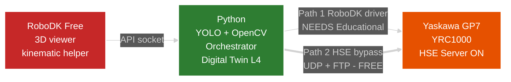
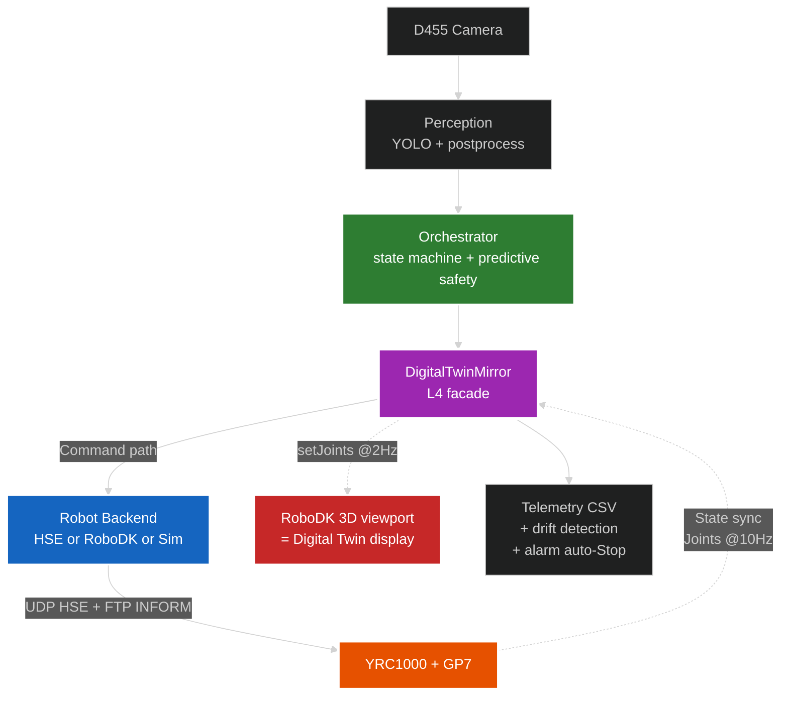

# pickplace_gp7 — Vision-guided Pick-and-Place cho Yaskawa GP7

> Tích hợp YOLOv8-seg vào hệ thống **Level-4 Bidirectional Digital Twin** cho
> bài toán gắp–thả sản phẩm ở vị trí ngẫu nhiên. Stack tối giản, **0đ license**
> nhờ HSE bypass driver.
>
> **Use case thực tế**: gắp khay (tray) đựng điện thoại Galaxy S23 trên dây
> chuyền assembly, dùng pneumatic parallel-jaw gripper custom.
> Demo vision multi-class với 3 vật khác (bottle/cup/bolt) tùy chọn.
>
> Repo GitHub: https://github.com/manhhv87/DTwinGP7

## 📊 Xem sơ đồ trong các file `.md`

Các file `.md` chứa **Mermaid diagrams** (Stack, Architecture, Workflow...). Để render:

| Viewer | Cần làm gì |
|---|---|
| **GitHub.com** (xem trên web) | ✅ Không cần làm gì — GitHub render native |
| **VS Code / Cursor** (local) | Install extension: `Ctrl+Shift+X` → search **"Markdown Preview Mermaid Support"** (Matt Bierner) → Install. Sau đó `Ctrl+Shift+V` để preview |
| Obsidian / Typora | ✅ Native support |
| Windows notepad / viewer cơ bản | ❌ Show raw code — dùng 1 trong 3 viewer trên |

## Stack tổng quan



**Path 2 (HSE bypass) là đóng góp kỹ thuật chính** — luận văn implement protocol
public Yaskawa HW1485553 → 0đ thay vì 340 USD RoboDK Educational license.

## ⭐ Đọc tài liệu nào trước?

| Bạn cần | Đọc file |
|---|---|
| **Chạy thử trên máy** (không có robot) | [`docs/HUONG_DAN_SU_DUNG.md`](docs/HUONG_DAN_SU_DUNG.md) — workflow + commands theo kịch bản |
| **Cài đặt từ đầu** | [`docs/HUONG_DAN_CAI_DAT.md`](docs/HUONG_DAN_CAI_DAT.md) — Python + RoboDK + D455 + YRC1000 HSE |
| **Hiểu kiến trúc + nghiên cứu thesis** | [`docs/phat_bieu_bai_toan_v3_2_HD.md`](docs/phat_bieu_bai_toan_v3_2_HD.md) — sơ đồ + research contribution |
| **Mở rộng cell module** | [`docs/Phu_luc_A_README_HD.md`](docs/Phu_luc_A_README_HD.md) — Pydantic schema + CellLoader |
| **Setup STL mesh + YOLO weights + gripper IO** | [`models/README.md`](models/README.md) — assets + CIO ladder |

## Quickstart 30 giây

```bash
pip install -r requirements.txt
pytest tests/ -q                                              # → 274 passed
python scripts/03_run_experiment.py --mode sim --headless --trials 500
```

3 lệnh trên chạy được trên **mọi laptop**, không cần phần cứng. Đầu ra: CSV
trong `results/`. Cho workflow chi tiết hơn (RoboDK GUI, real robot, ultra-fast,
phân tích figure), xem [`HUONG_DAN_SU_DUNG.md`](docs/HUONG_DAN_SU_DUNG.md).

## Kiến trúc Level-4 Bidirectional Digital Twin



**Bidirectional**: PC → robot (motion command) + robot → PC (joint state @10Hz).
Twin viewport phản ánh **vị trí THẬT** của robot, không phải vị trí command.

Chi tiết kiến trúc + so sánh backend đầy đủ: [phat_bieu mục 2](docs/phat_bieu_bai_toan_v3_2_HD.md#2-sơ-đồ-kết-nối-hệ-thống--level-4-bidirectional-digital-twin).

## 5 chế độ chạy

| Chế độ | Phần cứng | Use case |
|---|---|---|
| **Sim headless** | 0 | Thống kê 500+ trial cho thesis |
| **Sim RoboDK GUI** | RoboDK Free | Demo trực quan |
| Real qua RoboDK driver | RoboDK Educational $340 | Legacy |
| **Real qua HSE bypass** | YRC1000 + GP7 + D455 | **Recommended** (0đ license) |
| **Real ultra-fast** | Như trên | ~50ms/trial overhead, scale 500+ trial trên robot thật |

Workflow + commands chi tiết: [`HUONG_DAN_SU_DUNG.md`](docs/HUONG_DAN_SU_DUNG.md).

## Tóm tắt cấu trúc repo

```
pickplace_gp7/                  ← root repo (DTwinGP7 trên GitHub)
├── README.md                    ← file này (entry point)
├── docs/                        ← 4 file hướng dẫn (xem bảng trên)
├── config/                      ← YAML configs (KHÔNG sửa code)
├── models/                      ← STL meshes + YOLOv8 weights (xem models/README.md)
├── src/                         ← Python source (logic, không chạy trực tiếp)
│   ├── cell/                     dựng cell RoboDK
│   ├── perception/               YOLO + D455 + postprocess
│   ├── orchestrator/             ★ trial pick-place + digital twin L4 + kinematics + backends
│   ├── calibration/              hand-eye ChArUco
│   ├── logging/ · utils/
├── scripts/                     ← 11 CLI entry points (BẠN CHẠY)
├── tests/                       ← 274 unit/integration tests
└── results/ · figures/ · logs/  ← output (gitignored)
```

Chi tiết module tree: xem [phat_bieu mục 3](docs/phat_bieu_bai_toan_v3_2_HD.md#3-cấu-trúc-thư-mục-code).

## Đóng góp kỹ thuật chính

1. **Level-4 Bidirectional Digital Twin** — RoboDK viewport mirror robot thật @2Hz
   + telemetry CSV @10Hz + drift detection + alarm auto-Stop
2. **HSE bypass** RoboDK driver license — implement từ public spec Yaskawa
   HW1485553, 0đ thay vì $340 Educational
3. **3-tier motion optimization** — single-shot → batch M3 → ultra-fast M3++
   (~30× speedup so với RoboDK Free fail)
4. **Predictive safety C2+** — pure-Python forward kinematics verify joint limit
   + self-collision toàn trajectory trước MoveJ

Tài liệu chi tiết: [phat_bieu_bai_toan_v3_2_HD.md](docs/phat_bieu_bai_toan_v3_2_HD.md).

## Train YOLO model

Việc huấn luyện YOLOv8 làm trên máy Linux GPU bằng công cụ riêng,
**không nằm trong repo này**. Repo chỉ nhận file trọng số `.pt`/`.onnx`
(đặt vào `models/`) để inference. Xem [`models/README.md`](models/README.md)
+ [phat_bieu Phần C](docs/phat_bieu_bai_toan_v3_2_HD.md#phần-c--xây-dựng--huấn-luyện-model).

---

*pickplace_gp7 — Version 2.0 (Level-4 Bidirectional Digital Twin + HSE Bypass)*
