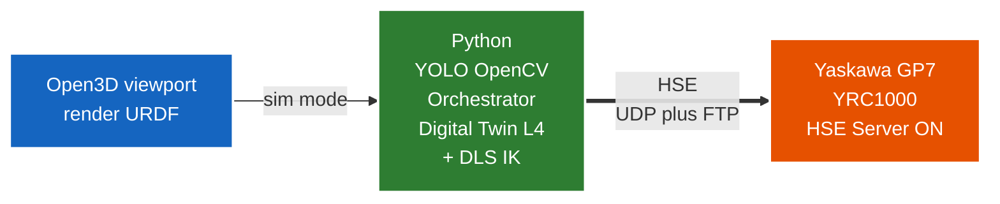
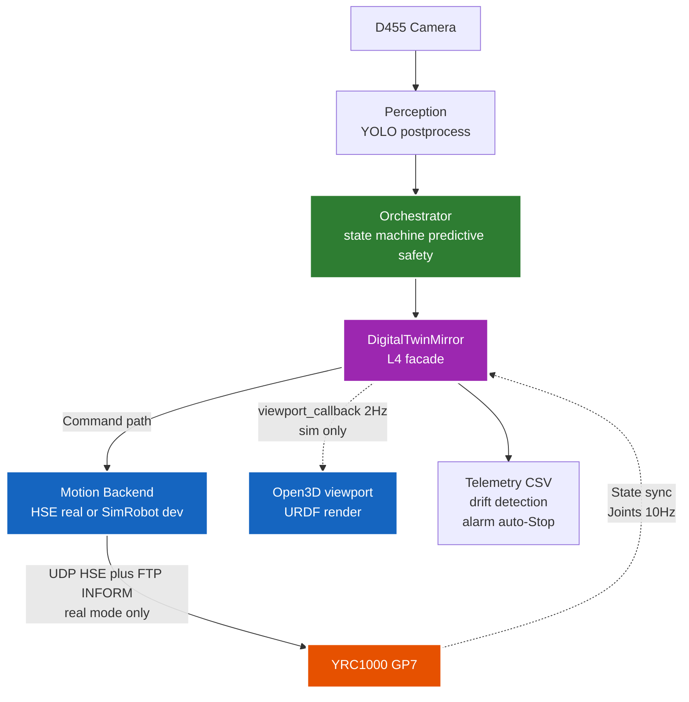

# PickPlaceGP7 — Vision-Guided Pick-and-Place for Yaskawa GP7

> Tích hợp YOLOv8-seg vào hệ thống **Level-4 Bidirectional Digital Twin** cho
> bài toán gắp–thả sản phẩm ở vị trí ngẫu nhiên. Stack tối giản — HSE là motion
> path cho robot thật, Open3D làm viewport sim/mirror, app Qt (PyQt6+VTK) làm
> Program Editor. RoboDK KHÔNG còn trong runtime — chỉ dùng để verify FK/IK
> trong `scripts/13_verify_vs_robodk.py` + `scripts/17_compare_fk_ik.py`.
>
> **Use case thực tế**: gắp khay (tray) đựng điện thoại Galaxy S23 trên dây
> chuyền assembly, dùng pneumatic parallel-jaw gripper custom.
> Demo vision multi-class với 3 vật khác (bottle/cup/bolt) tùy chọn.
>
> Repo GitHub: https://github.com/manhhv87/DTwinGP7


## ⭐ Stack tổng quan



**HSE là motion path cho robot thật** — project implement protocol public
Yaskawa HW1485553 để nói chuyện thẳng với YRC1000, không phụ thuộc RoboDK
driver license. Sim mode render qua **Open3D** từ URDF chain (verified match 
RoboDK FK 0.00mm), real mode dùng HSE backend + telemetry CSV @10Hz (replay offline qua
`07_replay_telemetry.py`). RoboDK chỉ cần khi chạy `scripts/13_verify_vs_robodk.py`
(verify FK/IK) hoặc `scripts/17_compare_fk_ik.py` (benchmark 6 IK) — không thuộc
4 chế độ chạy chính.

## ⭐ Đọc tài liệu nào trước?

| Bạn cần | Đọc file |
|---|---|
| **Giới thiệu phần mềm + chức năng các phần** (đọc trước) | [`docs/GIOI_THIEU_PHAN_MEM.md`](docs/GIOI_THIEU_PHAN_MEM.md) — tổng quan thành phần + cách dùng |
| **Dùng app bằng chuột** (thao tác GUI, không cần code) | [`docs/HUONG_DAN_GUI.md`](docs/HUONG_DAN_GUI.md) — menu/phím tắt/panel + teach + camera + run robot |
| **Học lập trình** (API/code: INFORM + Python script + SDK) | [`docs/HUONG_DAN_LAP_TRINH.md`](docs/HUONG_DAN_LAP_TRINH.md) — tutorial + tham chiếu API + ví dụ chạy được |
| **Chạy thử trên PC** (không có robot) | [`docs/HUONG_DAN_SU_DUNG.md`](docs/HUONG_DAN_SU_DUNG.md) — workflow + commands theo kịch bản |
| **Cài đặt từ đầu** | [`docs/HUONG_DAN_CAI_DAT.md`](docs/HUONG_DAN_CAI_DAT.md) — Python + Open3D + D455 + YRC1000 HSE |
| **Hiểu kiến trúc tổng thể** | [`docs/phat_bieu_bai_toan_v3_2_HD.md`](docs/phat_bieu_bai_toan_v3_2_HD.md) — sơ đồ + thiết kế hệ thống |
| **Setup STL mesh + YOLO weights + gripper IO** | [`models/README.md`](models/README.md) — assets + CIO ladder |

## ⭐ Quickstart 30 giây

```bash
pip install -r requirements.txt
pytest tests/ -q                                              # → 300 passed
python scripts/03_run_experiment.py --mode sim --headless --trials 500
python scripts/03_run_experiment.py --mode sim --trials 500 --minimal-build
python scripts/16_app_qt.py                                   # GP7 Program editor GUI
```

5 lệnh trên chạy được trên **mọi PC**, không cần phần cứng. Đầu ra: CSV
trong `results/`. Cho workflow chi tiết hơn (Open3D GUI, real robot, ultra-fast,
phân tích figure), xem [`HUONG_DAN_SU_DUNG.md`](docs/HUONG_DAN_SU_DUNG.md).

## ⭐ Kiến trúc Level-4 Bidirectional Digital Twin



**Bidirectional**: PC → robot (motion command) + robot → PC (joint state @10Hz).
Trong sim non-headless, **O3DGuiSimRobot** vừa làm motion backend vừa render
viewport (Filament GUI, navigate mượt). Real mode: HSE backend ghi telemetry
CSV @10Hz + **live Open3D mirror** render trạng thái THẬT của robot @2Hz
(O3DGuiSimRobot làm viewport-only, joints từ HSE poll; GUI main thread,
experiment worker thread). Tắt mirror bằng `--no-viewport-mirror` cho batch
500+ trial; replay offline bằng `07_replay_telemetry.py`.


Chi tiết kiến trúc + so sánh backend đầy đủ: [phat_bieu mục 2](docs/phat_bieu_bai_toan_v3_2_HD.md#2-sơ-đồ-kết-nối-hệ-thống--level-4-bidirectional-digital-twin).

## ⭐ Chế độ chạy

| Chế độ | Phần cứng | Use case |
|---|---|---|
| **Sim headless** | 0 | Thống kê 500+ trial offline, CI/CD |
| **Sim Open3D GUI** | Open3D (pip) | Demo trực quan (SimRobot + viewport render từ URDF) |
| **Real (HSE)** | YRC1000 + GP7 + D455 | Production |
| **Real ultra-fast** | Như trên | ~50ms/trial overhead, scale 500+ trial trên robot thật |

Workflow + commands chi tiết: [`HUONG_DAN_SU_DUNG.md`](docs/HUONG_DAN_SU_DUNG.md).

## ⭐ Tóm tắt cấu trúc repo

```
DTwinGP7/                        ← root repo (DTwinGP7 trên GitHub)
├── README.md                    ← file này (entry point)
├── docs/                        ← 6 tài liệu: 5 hướng dẫn (GUI/giới thiệu/lập trình/sử dụng/cài đặt) + phat_bieu
├── config/                      ← YAML configs (KHÔNG sửa code)
├── models/                      ← STL meshes + YOLOv8 weights (xem models/README.md)
├── src/                         ← Python source (logic, không chạy trực tiếp)
│   ├── cell/                      CellConfig Pydantic schema (YAML → base pose + camera + mesh paths)
│   ├── perception/                YOLO + D455 + postprocess
│   ├── orchestrator/              trial pick-place + digital twin L4 + kinematics + backends
│   ├── calibration/               hand-eye ChArUco
│   ├── logging/ · utils/
├── scripts/                     ← CLI entry points (01–07, 11, 13–17 + helpers, BẠN CHẠY)
├── tests/                       ← 300 unit/integration tests
└── results/ · figures/ · logs/  ← output (gitignored)
```

Chi tiết module tree: xem [phat_bieu mục 3](docs/phat_bieu_bai_toan_v3_2_HD.md#3-cấu-trúc-thư-mục-code).

## ⭐ Đóng góp kỹ thuật chính

1. **Level-4 Bidirectional Digital Twin** — Open3D Filament viewport render URDF
   live cho cả sim VÀ real mode (real mirror @2Hz từ HSE poll); telemetry CSV
   @10Hz + drift detection + alarm auto-Stop
2. **HSE motion architecture** — Python nói chuyện thẳng YRC1000 qua public spec
   Yaskawa HW1485553. `_send_request` thread-safe (atomic lock wrap sendto/recvfrom).
3. **3-tier motion optimization** — single-shot → batch M3 → ultra-fast M3++
   (~30× speedup so với approach single-shot)
4. **Multi-method IK architecture** — 6 thuật toán có sẵn cho thesis comparison
   + production:
   - **Tier S — Pieper analytical IK** (default app path, GP7-specific closed-form):
     ~170µs/call, **0 error** (float precision ~1e-13mm), returns **3-8 native
     multiple solutions** cho Change Configuration UX. Verified **AS accurate as
     RoboDK SolveIK** + **2× faster** trên 208 poses. Chi tiết:
     [pieper_gp7.py](src/orchestrator/kinematics/pieper_gp7.py)
   - **Numerical iterative** (generic 6R, ~30µm accuracy @ 0.5mm tol, ~0.7-0.9ms):
     **DLS** (Damped Least Squares), **LM** (Levenberg-Marquardt adaptive damping),
     **SDLS** (Selectively Damped via SVD)
   - **Quasi-Newton**: **BFGS** (scipy L-BFGS-B với weighted cost + early-exit at
     industrial tol)
   - **Batched IK** (`inverse_kinematics_batch`): N IK problems trong 1 numpy
     pipeline → 5.18× faster cho enumeration
   - **YRC controller IK** (cho `--ik-source yrc`): gửi pose Cartesian thẳng tới
     YRC1000, controller tự IK (0 PC overhead)
   - **Fair benchmark**: `python scripts/17_compare_fk_ik.py --fair` cho thesis
     side-by-side với same convergence criterion
5. **GP7 Program Editor — PyQt6+VTK industrial-standard GUI** ([scripts/16_app_qt.py](scripts/16_app_qt.py)):
   - **Tier 1**: Full INFORM keyword coverage — MoveJ/L/C, SetSpeed, SetRounding,
     SetTool, SetRefFrame, WaitIO, ShowMessage, SetGripper, Wait (TIMER)
   - **Tier 2**: Teach Target (named pose library, RoboDK-style), CallJob (sub-programs),
     Modify Instruction (F2 / double-click), Pause/Resume, Fast Sim multiplier,
     multi-job project (Save/Load JSON v3 with backward compat)
   - **Tier 3**: Teach on Surface (Ctrl+Shift+T, raycast pick + normal align),
     Change Target Configuration (F4, multi-IK picker), SimEvent checkpoint,
     Post-Processor settings (max_speed_pct, default VJ/V), embedded Python script
     generator with sandboxed `_ScriptProgramAPI`
   - **Run-on-Robot**: HSE backend integration với safety-confirm dialog, alarm
     pre/post-check, worker thread non-blocking, emergency Stop (servo OFF)
   - **Camera (D455) dock tích hợp** (View → Window → Camera): live view RGB/depth
     (worker thread + backpressure, không đơ UI), chụp dataset (RGB+depth), điều
     khiển vòng kín (Detect → grasp pose qua hand-eye → IK → teach → Pick→Program
     → Run on Robot), node `camera` thống nhất + vẽ **frustum** trong scene
     (kiểu RoboDK), và `object_classes` định nghĩa theo bài toán
6. **C2 safety pipeline** — 2 tầng kiểm an toàn pure-Python TRƯỚC khi gửi MoveJ:
   - **Reach envelope** (~µs/pose): sphere 150–927 mm tính từ J1, reject pose
     ngoài envelope tại PLAN state
   - **Predictive trajectory check** (~2ms/trial sau optimization, real mode
     auto-bật): solve client DLS IK cho 6 waypoint, interpolate, verify joint
     limit + self-collision sphere TOÀN BỘ trajectory bằng pure-Python FK. Trial
     unsafe bị reject với failure_reason `predicted_joint_limit` hoặc
     `predicted_self_collision` — KHÔNG gửi command lên controller thật
7. **Kinematics performance** — 12-32× speedup vs naive impl bằng pure-Python/
   numpy: LRU-cache per-link/per-model constants, batched FK qua numpy matmul
   (N,4,4), `einsum` squared-distance pre-filter cho self-collision check,
   analytical Jacobian (URDF) thay finite-difference, redundant-FK elimination
   trong DLS IK. Bit-identical với reference (max_err = 0.0 trên 3000+ random
   configs). Chi tiết: [phat_bieu §7.5.2-3](docs/phat_bieu_bai_toan_v3_2_HD.md#752-kinematics-performance-optimization)

Tài liệu chi tiết: [phat_bieu_bai_toan_v3_2_HD.md](docs/phat_bieu_bai_toan_v3_2_HD.md).

## ⭐ Benchmark 6 IK methods (208 poses, GP7, fair mode)

| Method | Type | Success | Median pos err | p95 pos err | Median time | Solutions |
|---|---|---|---|---|---|---|
| **Pieper (ours, analytical)** | Closed-form | 208/208 | **1.3e-13 mm** | 5.3e-13 mm | **0.17 ms** | 3-8 native |
| RoboDK SolveIK | Analytical reference | 208/208 | 6.8e-13 mm | 3.0e-11 mm | 0.37 ms | 1 |
| DLS (single-shot) | Numerical iterative | 207/208 | 3.3e-2 mm | 3.3e-1 mm | 0.80 ms | 1 |
| LM (adaptive damping) | Numerical iterative | 207/208 | 3.8e-2 mm | 3.4e-1 mm | 0.71 ms | 1 |
| SDLS (SVD selective) | Numerical iterative | 208/208 | 3.9e-2 mm | 3.2e-1 mm | 0.90 ms | 1 |
| BFGS (early-exit at tol) | Quasi-Newton | 207/208 | 3.5e-1 mm | 4.9e-1 mm | 11.3 ms | 1 |

Reproducible thesis comparison:
```bash
python scripts/17_compare_fk_ik.py --samples 500 --fair
```

**Fair mode** ensures all iterative methods stop at industrial tolerance (0.5mm) — apples-to-apples comparison. **Production mode** (default) uses each method as the app actually calls it (DLS with seeded retry, BFGS still early-exit). CSV per-row + 6-panel PNG histogram → `figures/compare_fk_ik_<ts>.csv|png`.

## ⭐ Train YOLO model

Việc huấn luyện YOLOv8 làm trên máy Linux GPU bằng công cụ riêng,
**không nằm trong repo này**. Repo chỉ nhận file trọng số `.pt`/`.onnx`
(đặt vào `models/`) để inference. Xem [`models/README.md`](models/README.md)
+ [phat_bieu Phần C](docs/phat_bieu_bai_toan_v3_2_HD.md#phần-c--xây-dựng--huấn-luyện-model).

---

*PickPlaceGP7 — Level-4 Bidirectional Digital Twin + Yaskawa HSE motion*
