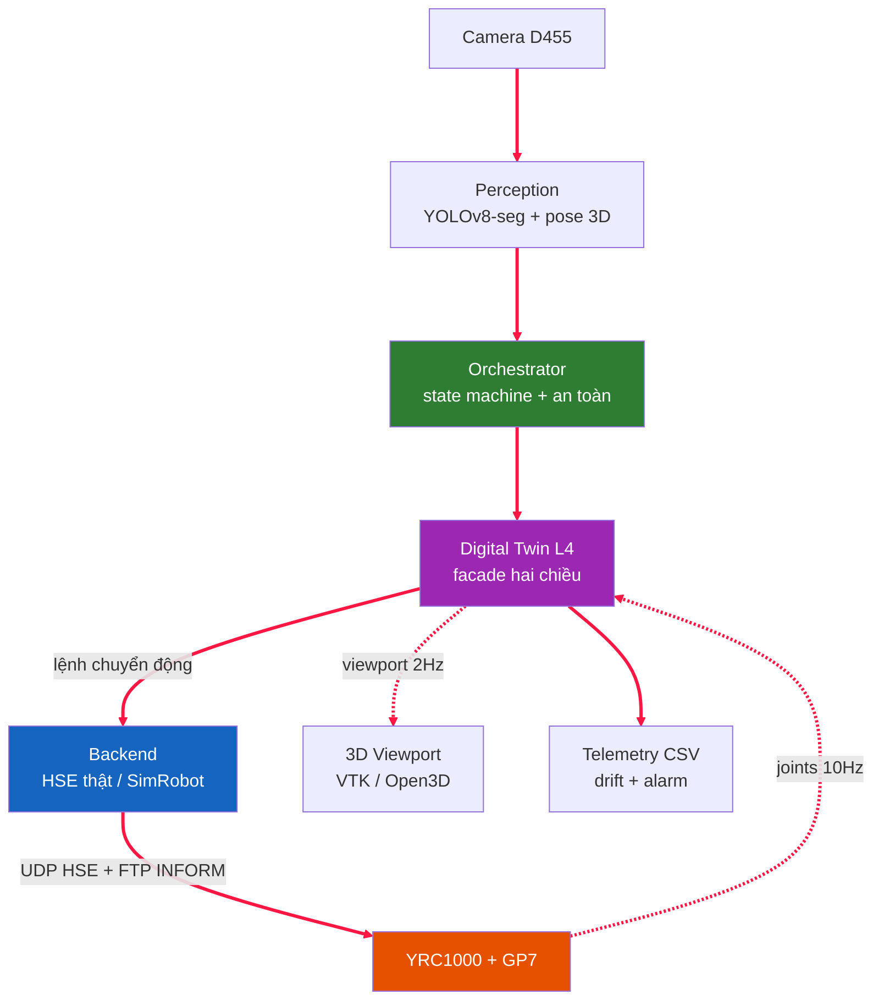

# GIỚI THIỆU PHẦN MỀM — DTwinGP7 (PickPlaceGP7)

> Tài liệu giới thiệu tổng quan: **phần mềm là gì, gồm những thành phần nào,
> mỗi phần làm gì, và cách sử dụng**. Đây là điểm vào để hiểu hệ thống trước khi
> đọc các tài liệu chuyên sâu.
>
> | Cần | Đọc |
> |---|---|
> | **Thao tác GUI** (không cần code) | [`HUONG_DAN_GUI.md`](HUONG_DAN_GUI.md) |
> | **Học lập trình** (INFORM + Python + SDK + API) | [`HUONG_DAN_LAP_TRINH.md`](HUONG_DAN_LAP_TRINH.md) |
> | Cài đặt từ đầu | [`HUONG_DAN_CAI_DAT.md`](HUONG_DAN_CAI_DAT.md) |
> | Workflow + lệnh chi tiết | [`HUONG_DAN_SU_DUNG.md`](HUONG_DAN_SU_DUNG.md) |
> | Thiết kế hệ thống + sơ đồ (luận văn) | [`phat_bieu_bai_toan_v3_2_HD.md`](phat_bieu_bai_toan_v3_2_HD.md) |
> | STL mesh + YOLO weights | [`../models/README.md`](../models/README.md) |

---

## 1. Phần mềm này là gì?

**DTwinGP7** là phần mềm **gắp–thả (pick-and-place) dẫn hướng bằng thị giác** cho
robot công nghiệp **Yaskawa GP7** (6 bậc tự do), xây dựng theo mô hình
**Digital Twin cấp 4 (Level-4 Bidirectional)** — bản sao số hai chiều: máy tính
điều khiển robot, đồng thời robot phản hồi trạng thái thật về máy tính theo
thời gian thực.

Bài toán thực tế: **camera Intel RealSense D455** nhìn xuống vùng làm việc, mô
hình **YOLOv8-seg** phát hiện vật (mặc định: khay/tray, chai, cốc, bu-lông), hệ
thống tính pose 3D của vật, chuyển sang hệ tọa độ robot (hand-eye calibration),
lập kế hoạch gắp an toàn rồi điều khiển GP7 gắp và đặt vật.

**Đặc điểm chính:**
- **Không phụ thuộc RoboDK lúc chạy** — động học FK/IK tự cài bằng Python/numpy,
  đã kiểm chứng khớp RoboDK 0.00 mm. RoboDK chỉ dùng để đối chiếu khi verify.
- **Giao tiếp robot thật trực tiếp** qua giao thức **Yaskawa HSE** (UDP) + nạp job
  **INFORM (.JBI)** qua FTP — không cần license driver, không cần flash MotoPlus.
- **Chạy được hoàn toàn trên PC không cần phần cứng** (chế độ sim) — phục vụ phát
  triển, kiểm thử, thống kê 500+ trial.
- **Giao diện lập trình robot chuẩn công nghiệp** (PyQt6 + VTK, giống RViz/MoveIt)
  tích hợp sẵn camera D455, thị giác, và lập trình quỹ đạo.

---

## 2. Kiến trúc tổng thể




**Hai chiều (bidirectional):** PC → robot (lệnh) và robot → PC (trạng thái khớp
@10Hz). Ở chế độ thật, backend HSE vừa điều khiển vừa ghi telemetry CSV và mirror
trạng thái thật lên viewport 3D.

**Quy ước thống nhất toàn dự án:** đơn vị mm + độ; ma trận biến đổi 4×4
homogeneous; khớp theo độ. Scene 3D dùng mét (mesh ×0.001 khi render).

---

## 3. Các thành phần & chức năng

### 3.1. Cấu hình Cell — `src/cell/`
Định nghĩa "ô làm việc" (robot, bàn, camera, gripper, vật...) bằng file YAML có
kiểm tra hợp lệ (Pydantic).
- `CellConfig` — model gốc; chỉ `robot` bắt buộc, còn lại tùy chọn. Nạp/lưu bằng
  `CellConfig.from_yaml()` / `.to_yaml()`.
- Các sub-model: `RobotConfig`, `WorktableConfig`, `FloorConfig`, `PedestalConfig`,
  `CameraMountConfig` (giàn lắp camera = mesh+pose), `CameraConfig` (camera-item:
  type/model/mount + pose extrinsics + `CameraIntrinsics`), `GripperConfig`,
  `FrameConfig`, `ObjectConfig`, `RobotConnectionConfig`.
- `object_classes` — **danh sách lớp vật của bài toán do người dùng tự định nghĩa**
  (dùng cho dán nhãn dataset + hiển thị); mặc định `[tray, bottle, cup, bolt]`.

### 3.2. Thị giác — `src/perception/`
Camera → phát hiện vật → pose 3D.
- `D455Camera` / `MockCamera` — đọc khung `(rgb, depth_mét)` + `intrinsics`. Mock
  cho phép chạy không cần phần cứng.
- `ObjectDetector` (YOLOv8-seg, `.pt`/`.onnx`) / `MockDetector` — trả `Detection`.
  Tên lớp lấy **trực tiếp từ model đã train** (`model.names`) → tự khớp mọi bài toán.
- `postprocess` (`PoseExtractor`, `mask_centroid`, `masked_depth`, `mask_pca_yaw`,
  `deproject_pixel`) — từ mask + depth ra `pose_camera = (x, y, z, yaw)`.
- `PerceptionNode` — vòng lặp thị giác chạy thread nền, đẩy detection vào queue.

### 3.3. Động học — `src/orchestrator/kinematics/`
FK/IK thuần Python, đã kiểm chứng khớp RoboDK 0.00 mm. **Các file toán này là
nền tảng đã verify — không sửa.**
- `urdf_chain.py` — `gp7_urdf()`, `forward_kinematics_urdf`, `link_frames_urdf`
  (mô hình URDF từ ros-industrial/motoman).
- `dh_model.py`, `forward_kinematics.py` — mô hình Modified DH (Craig).
- `pieper_gp7.py` — **IK giải tích Pieper** (closed-form, đường chính): exact
  (~1e-13 mm), ~0.24 ms, deterministic; trả **tất cả nhánh** (≤8 cấu hình tay) rồi
  chọn nhánh gần tư thế hiện tại (`inverse_kinematics_pieper_gp7_nearest`), kèm
  bản gắn nhãn cấu hình (`inverse_kinematics_pieper_gp7_tagged`) cho dialog đổi
  cấu hình. Cả app (Find branches / Change Config) lẫn Orchestrator client-IK đều
  dùng Pieper.
- `inverse_kinematics.py` — IK số (**fallback**): **DLS**, **LM**, **SDLS**,
  **BFGS**, `inverse_kinematics_seeded` (đa-seed, bền nhất), `inverse_kinematics_batch`.
- `trajectory.py` — nội suy quỹ đạo + kiểm tra joint-limit + tự va chạm (sphere).

### 3.4. Điều phối & Digital Twin — `src/orchestrator/`


- `orchestrator.py` (`Orchestrator`) — vòng pick-and-place: lấy detection → tính
  grasp → kiểm an toàn (C2) → điều khiển → ghi log từng trial.
- `state_machine.py` (`PickPlaceStateMachine`, `PickState`) — máy trạng thái thuần
  logic: IDLE→DETECT→PLAN→APPROACH→GRASP→LIFT→TRANSFER→PLACE→RETREAT→DONE.
- `digital_twin.py` (`DigitalTwinMirror`) — facade hai chiều: backend + mirror
  viewport + telemetry + phát hiện drift + auto-stop khi alarm nặng. Có **E-stop
  latch**: sau `Stop()` / alarm nghiêm trọng → từ chối mọi lệnh motion (MoveJ/MoveL)
  tiếp theo cho tới khi mirror khởi động lại.
- `sim_robot.py` (`SimRobot`) — robot mô phỏng thuần Python (không cần phần cứng).
- `coord_conv.py` — `camera_to_base`, `make_grasp_pose`, `load_calibration`...
- `frame_convert.py` — chuyển World ↔ Robot-base cho HSE Cartesian (quy ước Yaskawa).
- `telemetry.py` (`TelemetryLogger`) — ghi trạng thái khớp/IO ra CSV @10Hz.

### 3.5. Backend điều khiển robot — `src/orchestrator/backends/`
- `base.py` (`RobotBackend` Protocol) — interface chung (đặt tên giống RoboDK API).
- `motoman_hse.py` (`MotomanHSEBackend`) — driver YRC1000 qua UDP HSE.
- `hse_protocol.py` — codec thuần giao thức HSE (encode/decode byte).
- `inform_codegen.py` (`InformJobBuilder`) — sinh file job **INFORM .JBI**.
- `alarm_codes.py` — giải mã alarm YRC1000 + mức độ nghiêm trọng.
- `reach_envelope.py` (`ReachEnvelope`) — kiểm tầm với (sphere 150–927 mm).

### 3.6. Tọa độ & Hiệu chỉnh — `src/calibration/`
- `hand_eye_solver.py` (`solve_hand_eye`) — giải `T_base_camera` (camera-in-base)
  từ các cặp pose, dùng OpenCV (park/tsai/horaud/daniilidis/andreff).
- `capture_calibration.py` (`CharucoBoardEstimator`) — phát hiện bảng ChArUco để
  thu dữ liệu calibration.

### 3.7. Giao diện 3D & GUI — `src/orchestrator/viewports/`
**App chính (khuyến nghị): `GP7AppQt`** — PyQt6 + pyvistaqt (VTK), chuẩn công
nghiệp; ghép từ các **mixin**:
- `mixin_camera` — **dock Camera (D455)**: live view RGB/depth, chụp dataset,
  điều khiển vòng kín (detect→grasp→teach→pick→Run on Robot), đồng bộ camera vào
  cell + vẽ **frustum** (nón nhìn).
- `mixin_experiment` — **dock "Digital Twin"** chạy với robot THẬT (HSE):
  **Live mirror** (đọc joints thật, vẽ viewport @~2Hz + ghi telemetry CSV — chỉ
  đọc, robot không nhận lệnh) và **Run experiment** (pick-place tự động qua
  Orchestrator + perception D455+YOLO/Mock — robot di chuyển). Tái dùng
  `DigitalTwinMirror` + `MotomanHSEBackend` + `Orchestrator`.
- `mixin_connection` — kết nối HSE + Run on Robot (có dialog an toàn).
- `mixin_job_target` — thư viện target (pose đặt tên, kiểu RoboDK).
- `mixin_program_io` — Save/Load project JSON (v3) + Export .JBI.
- `mixin_program_playback` — Play/Pause/Stop chương trình (sim hoặc robot thật).
- `mixin_about` — giới thiệu/cell info.
- Phụ trợ: `program_model.py` (`Instruction`), `script_api.py` (`ScriptProgramAPI`),
  `control_panel.py`, `qt_theme.py`, `qt_widgets.py`, `qt_helpers.py`.

**App Open3D (legacy)**: `gp7_app.py` (`scripts/15_app.py`),
`open3d_gui_sim_robot.py` (`O3DGuiSimRobot` — vừa viewport vừa motion backend,
còn dùng cho mirror real-time + `14_jog_panel.py`), `urdf_gen.py` (sinh URDF XML).

### 3.8. Tiện ích — `src/utils/`, `src/logging/`
- `helpers.py` — `ensure_dir`, `timestamp`, `setup_logging`, `load_yaml`.
- `logging/logger.py` (`TrialLogger`) — ghi kết quả từng trial ra CSV để phân tích.

### 3.9. Lệnh chạy (entry points) — `scripts/`
| Script | Chức năng |
|---|---|
| `16_app_qt.py` | **App chính** PyQt6+VTK: lập trình robot + camera + chạy sim/thật |
| `15_app.py` / `14_jog_panel.py` | App / panel jog Open3D (legacy) |
| `03_run_experiment.py` | Chạy N trial pick-and-place (sim/real) + telemetry |
| `01_collect_dataset.py` | Chụp dataset RGB+depth từ D455 (CLI, kèm metadata) |
| `02_run_calibration.py` | Hand-eye calibration bằng ChArUco (robot thật) |
| `calibration_from_layout.py` | Sinh `T_base_camera.npy` cho sim từ YAML |
| `04_analyze_results.py` | Thống kê success rate + failure mode từ CSV |
| `05_analyze_telemetry.py` | Vẽ joint trajectory/velocity/drift/cycle-time |
| `06_simulate_trial.py` | Xem trước quỹ đạo dự đoán (offline) |
| `07_replay_telemetry.py` | Replay telemetry thành MP4/PNG |
| `11_test_yrc_cartesian.py` | Test HSE Cartesian 3 phase (robot thật) |
| `13_verify_vs_robodk.py` | Verify FK/IK khớp RoboDK |
| `17_compare_fk_ik.py` | So sánh 6 phương pháp IK (Pieper/DLS/LM/SDLS/BFGS/RoboDK) |
| `gen_primitive_meshes.py` · `convert_glb_to_stl.py` | Tạo/đổi STL mesh |

---

## 4. Cách sử dụng (tóm tắt)

> Lệnh + flag chi tiết theo từng kịch bản: [`HUONG_DAN_SU_DUNG.md`](HUONG_DAN_SU_DUNG.md).

### 4.1. Kiểm tra cài đặt
```powershell
.venv\Scripts\Activate.ps1
pytest tests/ -q            # → 452 passed
```

### 4.2. Chạy thử không cần phần cứng (sim)
```powershell
python scripts/03_run_experiment.py --mode sim --trials 500 --headless   # thống kê
python scripts/03_run_experiment.py --mode sim --trials 20                # demo Open3D
python scripts/04_analyze_results.py --csv "results/*.csv"                # phân tích
```

### 4.3. App lập trình robot + camera (GUI chính)
> Thao tác chi tiết click-by-click: [`HUONG_DAN_GUI.md`](HUONG_DAN_GUI.md).

```powershell
python scripts/16_app_qt.py                                  # app trống
python scripts/16_app_qt.py --config config/cell_layout.yaml # nạp sẵn 1 cell
```
Trong app:
- **File → Load Robot GP7 / mở cell**, hoặc Edit → Add components.
- **Jog dock**: di chuyển khớp/Cartesian; **Program dock**: build MoveJ/L/C, teach
  target, Export .JBI, Run on Robot (qua HSE, có dialog an toàn).
- **View → Window → Camera (D455)**: mở dock camera (xem 4.4).
- **Digital Twin → Show Digital Twin panel**: mở dock "Digital Twin" cho robot
  thật (xem 4.5).
- **Teach on Surface** (Ctrl+Shift+T): click vào mesh 3D để tạo target theo pháp
  tuyến bề mặt.

### 4.4. Camera & thị giác trong app (dock "Camera (D455)")
> Tổng quan 4 bước; chi tiết từng nút + quy ước tên file dataset:
> [`HUONG_DAN_SU_DUNG.md` §4 Kịch bản F](HUONG_DAN_SU_DUNG.md).


1. **Start** — tự dùng D455 nếu có, không thì fallback Mock; chọn **độ phân giải**.
2. Bật **Depth colormap** / **Detector** / **Overlay**; chụp **Dataset** (RGB + tùy
   chọn depth), quản lý **danh sách class** của bài toán (lưu vào cell).
3. **Detect → Teach grasp**: lấy vật phát hiện → grasp pose (qua calibration) → IK
   → lưu target. **Pick → Program**: chèn chuỗi approach→grasp→close→retreat.
   **Run on Robot**: chạy thật qua HSE.
4. **Đồng bộ Camera → Cell**: ghi pose (từ calibration) + intrinsics thật vào node
   `camera`, vẽ **frustum** trong viewport (một camera-item duy nhất, kiểu RoboDK).

### 4.5. Digital Twin robot thật trong app (dock "Digital Twin")
Mở qua **Digital Twin → Show Digital Twin panel** (cần Load Robot GP7 + IP YRC1000
ở Robot → Connection settings). Hai chế độ:
- **▶ Start live mirror** — đọc joints THẬT từ YRC1000 (HSE) và vẽ vào viewport
  @~2Hz, ghi telemetry CSV. **Chỉ đọc** — robot không nhận lệnh nào → an toàn.
- **▶ Start experiment** — pick-place tự động trên robot THẬT qua Orchestrator +
  perception (D455+YOLO hoặc Mock dry-run); chọn IK source (YRC onboard / Pieper
  client), số trial, ultra-fast. **Robot sẽ di chuyển** (có dialog cảnh báo).
- **⏹ Stop Digital Twin** — dừng; với experiment thì servo-off ngay. Sau Stop /
  alarm nặng, `DigitalTwinMirror` **latch** từ chối mọi lệnh motion tiếp theo.

### 4.6. Chạy trên robot GP7 thật (HSE)
```powershell
python scripts/02_run_calibration.py --hse-ip 192.168.1.100   # hiệu chỉnh hand-eye
python scripts/03_run_experiment.py --mode real --backend hse `
    --hse-ip 192.168.1.100 --trials 500 --ultra-fast --no-viewport-mirror
```
Yêu cầu: YRC1000 ở REMOTE mode + HSE Server ON, TOOL01 đã setup, có YOLO weights.
Chi tiết: [`HUONG_DAN_CAI_DAT.md`](HUONG_DAN_CAI_DAT.md) (§2.9 HSE + §2.10 TOOL01).

---

## 5. Cấu trúc thư mục

```
DTwinGP7/
├── README.md                 ← điểm vào nhanh
├── docs/                     ← tài liệu (file này + cài đặt + sử dụng + phát biểu)
├── config/                   ← YAML (cell_layout, experiment) — SỬA Ở ĐÂY, không sửa code
├── models/                   ← STL mesh + YOLO weights (.pt/.onnx)
├── src/
│   ├── cell/                   CellConfig (schema YAML)
│   ├── perception/             camera D455 + YOLO + pose 3D
│   ├── orchestrator/           pick-place + digital twin + kinematics + backends + viewports
│   ├── calibration/            hand-eye ChArUco
│   ├── logging/  ·  utils/
├── scripts/                  ← lệnh CLI (BẠN CHẠY)
├── tests/                    ← 452 unit/integration tests
└── results/ · figures/ · logs/  ← output (gitignored)
```

> Cây module đầy đủ (từng file + chú thích): [`phat_bieu_bai_toan_v3_2_HD.md` §3](phat_bieu_bai_toan_v3_2_HD.md#3-cấu-trúc-thư-mục-code).

---

## 6. Chế độ chạy

| Chế độ | Phần cứng | Mục đích |
|---|---|---|
| Sim headless (`03_run_experiment --headless`) | Không | Thống kê 500+ trial, CI |
| Sim GUI Open3D (`03_run_experiment` non-headless) | Không (pip) | Demo trực quan experiment runner |
| App GUI Qt+VTK (`16_app_qt`) + Camera | Không để thiết kế; D455 để xem thật | Lập trình robot + thị giác |
| Real (HSE) | YRC1000 + GP7 + D455 | Sản xuất |

---

## 7. Tài liệu liên quan

Tài liệu này là điểm khởi đầu; tùy nhu cầu đọc tiếp:

| Nhu cầu | Tài liệu |
|---|---|
| Cài đặt phần mềm + phần cứng + calibration | [`HUONG_DAN_CAI_DAT.md`](HUONG_DAN_CAI_DAT.md) |
| Workflow + lệnh CLI theo kịch bản | [`HUONG_DAN_SU_DUNG.md`](HUONG_DAN_SU_DUNG.md) |
| Thao tác giao diện (click-by-click) | [`HUONG_DAN_GUI.md`](HUONG_DAN_GUI.md) |
| Lập trình (INFORM + Python script + SDK + API) | [`HUONG_DAN_LAP_TRINH.md`](HUONG_DAN_LAP_TRINH.md) |
| Digital Twin + vận hành robot thật (HSE) | [`HUONG_DAN_DIGITAL_TWIN.md`](HUONG_DAN_DIGITAL_TWIN.md) |
| Thiết kế hệ thống + kiến trúc + phương pháp | [`phat_bieu_bai_toan_v3_2_HD.md`](phat_bieu_bai_toan_v3_2_HD.md) |
| Trọng số YOLO + mesh STL | [`../models/README.md`](../models/README.md) |
| Tổng quan + quickstart | [`../README.md`](../README.md) |

---

*DTwinGP7 — Level-4 Bidirectional Digital Twin + Yaskawa HSE motion + vision-guided pick-place.*
