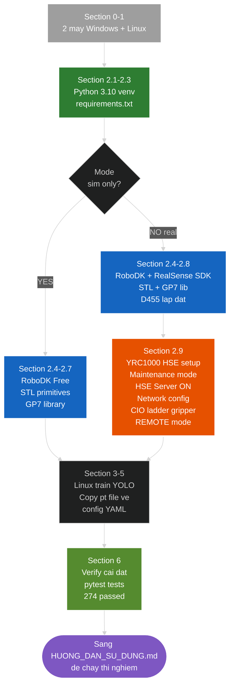

# HƯỚNG DẪN CÀI ĐẶT & CẤU HÌNH — pickplace_gp7

Tài liệu này tập trung vào **setup phần cứng + phần mềm 1 lần**. Sau khi cài
xong, dùng [`HUONG_DAN_SU_DUNG.md`](HUONG_DAN_SU_DUNG.md) cho workflow + commands
hàng ngày.

> **Phạm vi file này**: Python venv, RoboDK install, RealSense SDK, YRC1000 HSE
> Server setup, ChArUco board, mesh setup. **KHÔNG bao gồm** workflow chạy thí
> nghiệm — xem [`HUONG_DAN_SU_DUNG.md`](HUONG_DAN_SU_DUNG.md).
>
> **Vị trí code & tài liệu:** Mọi lệnh chạy trong thư mục root repo
> (`pickplace_gp7/` / `DTwinGP7/`).

## Setup flow tổng quan



---

## 0. Mô hình triển khai 2 máy

| Máy | Hệ điều hành | Vai trò |
|---|---|---|
| **Máy CHẠY** | Windows (gần robot) | Dựng cell, thu dataset, calibration, chạy thí nghiệm. **Repo này chạy ở đây.** |
| **Máy TRAIN** | Linux + GPU NVIDIA | Huấn luyện YOLOv8-seg bằng công cụ riêng (ngoài repo này) |

Việc train **không nằm trong repo**. Repo chỉ nhận file trọng số `.pt`/`.onnx`
đã train sẵn để inference.

```
Máy CHẠY (Windows)                      Máy TRAIN (Linux GPU)
──────────────────                      ─────────────────────
thu ảnh D455 → data/raw/  ── copy ──►    train YOLOv8 (công cụ riêng)
                                                  │
models/yolov8s-seg_best.pt  ◄── copy best.pt ─────┘
        │
calibration → dựng cell → chạy thí nghiệm pick-and-place
```

---

## 1. Yêu cầu

### Phần cứng
- **Máy CHẠY**: Windows 10/11, RAM ≥ 16GB. GPU NVIDIA khuyến nghị (inference
  nhanh hơn) nhưng không bắt buộc.
- **Máy TRAIN**: Linux, GPU NVIDIA ≥ 8GB VRAM (vd RTX 4060/4070).
- Camera Intel RealSense D455.
- Robot Yaskawa GP7 + controller YRC1000 (cho pha test thật).

### Phần mềm chung
- **Python 3.10+** (bắt buộc — code dùng type hints hiện đại).
- Git.

---

## 2. Cài đặt MÁY CHẠY (Windows)

### 2.1. Python + môi trường ảo

```powershell
python --version    # cần 3.10+

# Vào thư mục code rồi tạo virtualenv (đổi đường dẫn cho đúng máy bạn)
cd "D:\MySelf\Học tập\Đề cương ThS\Phạm Quang Minh\files\pickplace_gp7"
python -m venv .venv
.venv\Scripts\Activate.ps1
```

### 2.2. Cài dependencies

```powershell
pip install -r requirements.txt
```

> Nếu `pip` báo lỗi ở gói `pyrealsense2`: mở `requirements.txt`, thêm `#` vào
> đầu dòng `pyrealsense2`, rồi chạy lại lệnh trên. Gói này chỉ cần khi chụp
> dataset / calibration bằng D455; phần sim + test vẫn chạy đầy đủ khi thiếu.

### 2.3. (Tùy chọn) PyTorch bản GPU cho inference nhanh

`requirements.txt` kéo theo `torch` bản CPU. Muốn inference YOLO bằng GPU:

```powershell
# Xem phiên bản CUDA: nvidia-smi  → chọn cu121 / cu118 cho phù hợp
pip install torch torchvision --index-url https://download.pytorch.org/whl/cu121
```

### 2.4. Cài RoboDK Free

1. Tải tại https://robodk.com/download
2. Cài đặt (mặc định vào `C:\RoboDK\`).
3. Mở thử RoboDK GUI để xác nhận chạy được.

### 2.5. Cài RealSense SDK 2.0

1. Tải Intel RealSense SDK 2.0 từ https://github.com/realsenseai/librealsense/releases/tag/v2.56.5
2. Cài đặt, cắm D455, mở `realsense-viewer` để kiểm tra stream RGB + depth.

### 2.6. Tải robot GP7 vào RoboDK Library

1. Mở RoboDK GUI → **File → Open Robot Library**
2. Tìm **"Yaskawa GP7"** → Download → kéo (drag) vào station.
3. File tự tải về `C:/RoboDK/Library/Yaskawa-GP7.robot`.
4. Đóng RoboDK (không cần lưu).

> **Lưu ý license**: RoboDK Free **KHÔNG hỗ trợ robot drivers** (cấm `robot.Connect()`).
> Sim mode (`--backend robodk`) chạy được với Free. Real mode có 2 đường:
> - `--backend robodk` cần **RoboDK Educational ($340)** hoặc Professional
> - `--backend hse` (khuyến nghị) bypass RoboDK driver hoàn toàn — xem mục 2.9

### 2.7. Chuẩn bị mesh STL

Đặt các file mesh vào đúng vị trí (vẽ trong Fusion 360 hoặc tạo primitive
trong RoboDK rồi export):

```
models/worktable.stl
models/camera_mount.stl      (tùy chọn)
models/gripper.stl           (tùy chọn)
models/objects/bottle.stl
models/objects/cup.stl
models/objects/bolt.stl
```

> Object mesh thiếu sẽ bị bỏ qua kèm cảnh báo (không lỗi). Worktable mesh
> thiếu sẽ gây lỗi `MissingMeshError`.

### 2.9. (Real mode) Cấu hình YRC1000 cho HSE Backend

HSE (High-Speed Ethernet Server) là function **built-in miễn phí** của YRC1000,
không cần license riêng. Bật 1 lần qua maintenance mode trên teach pendant.

**Bước 1 — Bật HSE Server function trên YRC1000:**

1. Power off controller
2. Power on trong **Maintenance mode** (giữ phím MAIN MENU khi power on)
3. Vào `System → Function Setting → Optional Function`
4. Tìm `HIGH-SPEED ETHERNET SERVER FUNCTION` → set **USED**
5. Save + reboot bình thường

**Bước 2 — Cấu hình network:**

| Thiết bị | IP | Subnet |
|---|---|---|
| YRC1000 | 192.168.1.100 (vd) | 255.255.255.0 |
| PC | 192.168.1.50 (vd) | 255.255.255.0 |

Cáp Ethernet → port LAN1 của YRC1000. Verify từ PC:
```powershell
ping 192.168.1.100      # phải reply trước khi tiếp tục
```

**Bước 3 — Sửa `config/cell_layout_real.yaml`:**

```yaml
robot_connection:
  enabled: true
  ip: "192.168.1.100"          # ĐỔI theo IP YRC1000 thực tế
  port: 80
  driver: "Motoman"
  max_speed_percent: 30        # safety cap cho testing đầu
  acceleration_percent: 50
```

**Bước 4 — (Tùy chọn) CIO ladder cho gripper IO:**

Nếu dùng gripper khí nén qua HSE setDO, cần bind 1 network I/O bit (default 27010)
với Y-output vật lý điều khiển gripper. Setup 1 lần qua MOTOMAN INFORM Ladder Editor
trên teach pendant. Document chi tiết trong `models/README.md` (CIO ladder setup).

**Bước 5 — REMOTE mode khi chạy:**

Trên teach pendant: switch sang **REMOTE mode** trước khi script gửi command qua HSE.
Nếu controller ở TEACH mode → HSE báo alarm 1010 (REMOTE_MODE_REQUIRED).

### 2.8. Lắp đặt camera D455 (eye-to-hand)

Camera lắp **cố định** trên giàn, **KHÔNG** gắn lên cánh tay robot.

| Yếu tố | Khuyến nghị | Lý do |
|---|---|---|
| Kiểu lắp | Cố định trên giàn (eye-to-hand) | Đơn giản hoá calibration + tính pose |
| Độ cao | ~800–900 mm trên mặt bàn (config dùng 850 mm) | Trên ngưỡng đo tối thiểu D455 (~0.4 m); phủ đủ bàn 600×400 |
| Hướng | Nhìn thẳng xuống (top-down, trục Z camera ⟂ mặt bàn) | Depth ≈ chiều cao → trích pose đơn giản, ít méo |
| Vị trí ngang | Tâm camera nằm trên giữa vùng đặt vật | Toàn vùng vật nằm trong khung hình |
| Giàn đỡ | Nhôm định hình 20×20 / 30×30, cao ~1.2 m, **chắc, không rung** | Camera xê dịch → calibration sai ngay |
| Tránh va chạm | Giàn không chắn vùng hoạt động của GP7 | An toàn cho robot |
| Kết nối | Cáp **USB 3.0** về PC | D455 cần USB 3.0 để stream RGB-D |

Đảm bảo vùng đặt vật vừa nằm **trong khung hình camera**, vừa nằm **trong tầm
với của robot** — giao của hai vùng này là vùng gắp thực tế.

> ⚠ **Lắp camera xong → cố định cứng → MỚI hand-eye calibration.** Sau khi
> calibrate, không được xê dịch camera; nếu di chuyển (dù 1 mm) phải calibrate
> lại — ma trận `T_base_camera` gắn chặt với đúng vị trí đã calibrate.
>
> Lưu ý: khi *chụp dataset* (mục 4.3 tài liệu đề tài) có nghiêng giàn ±10° để
> tạo đa dạng ảnh; nhưng khi *vận hành thật*, camera phải ở **một vị trí cố
> định duy nhất** đã calibrate.

---

## 3. Huấn luyện model (máy Linux — ngoài repo)

Repo này **không chứa script train**. Trên máy Linux, bạn tự huấn luyện
YOLOv8-seg bằng công cụ quen thuộc (vd `ultralytics` CLI `yolo segment train`).

Đầu vào: dataset từ `data/raw/` (ảnh chụp ở bước 1 mục 5), label trên Roboflow,
export định dạng YOLOv8. Đầu ra: file trọng số `best.pt`.

**Không cần dataset ngoài.** Dataset hoàn toàn tự thu (~2100 ảnh của 3 vật
trong cell của bạn) — vì model phải nhận đúng vật và đúng điều kiện ánh
sáng/nền của cell. Trọng số nền COCO-pretrained (`yolov8s-seg.pt`) do
ultralytics tự tải khi train — đây là thứ "bên ngoài" duy nhất, không phải
chuẩn bị thủ công.

→ Copy `best.pt` về máy Windows, đặt vào `models/` (xem mục 5).

---

## 4. Cấu hình dự án

Mọi cấu hình nằm trong `config/` — sửa file YAML, không sửa code.

| File | Sửa khi nào |
|---|---|
| `cell_layout.yaml` | Đổi vị trí robot/bàn/camera/gripper, đường dẫn mesh |
| `cell_layout_real.yaml` | Như trên, cho chế độ robot thật (`robot_connection.enabled=true`) |
| `experiment.yaml` | Tham số Orchestrator: tốc độ, approach height, IP robot, `model_path`... |

Sau khi sửa, **luôn validate**:

```powershell
python -m src.cell.cell_models validate config/cell_layout.yaml
```

---

## 5. Quy trình end-to-end

```
[Windows] 1. Thu dataset:   python scripts/01_collect_dataset.py   → data/raw/
          2. Label trên Roboflow, export YOLOv8 → copy dataset sang máy Linux
[Linux]   3. Train YOLOv8 bằng công cụ riêng → best.pt
          4. Copy best.pt về Windows
[Windows] 5. Đặt trọng số:  models/yolov8s-seg_best.pt
          6. Hand-eye calib: python scripts/02_run_calibration.py
          7. Dựng cell:      python scripts/build_station.py
          8. Chạy thí nghiệm:python scripts/03_run_experiment.py --mode sim
          9. Phân tích:      python scripts/04_analyze_results.py --csv "results/*.csv"
```

### Đưa trọng số về máy chạy

Copy file `best.pt` (hoặc `.onnx`) từ máy Linux về, đặt đúng tên mà
`experiment.yaml` trỏ tới:

```powershell
copy best.pt models\yolov8s-seg_best.pt
```

`config/experiment.yaml :: model_path` mặc định trỏ `models/yolov8s-seg_best.pt`.
Nếu thiếu file này, `ObjectDetector` báo lỗi rõ ràng khi chạy mode real.

---

## 6. Kiểm tra cài đặt (verify)

Mọi lệnh chạy **trong thư mục `pickplace_gp7/`** (đã activate `.venv`).

### 6.1. Kiểm tra phần mềm — KHÔNG cần phần cứng

```powershell
# 1. Validate config
python -m src.cell.cell_models validate config/cell_layout.yaml

# 2. Chạy toàn bộ test
pytest tests/ -q
```

Kỳ vọng: bước 1 in `✓ Config hợp lệ: ...`; bước 2 báo `274 passed`.
Hai bước này đạt → code + dependencies đã cài đúng.

### 6.2. Kiểm tra dựng cell — cần RoboDK

Yêu cầu trước: RoboDK GUI đang mở (station rỗng) · đã tải GP7 vào Library
(mục 2.6) · có file `models/worktable.stl` (mục 2.7).

```powershell
python scripts/build_station.py
```

Kỳ vọng: cell (robot GP7 + bàn + camera + gripper) hiện ra trong RoboDK
sau ~3–5 giây.

---

## 7. Workflow + Lệnh chạy thí nghiệm

→ Xem [`HUONG_DAN_SU_DUNG.md`](HUONG_DAN_SU_DUNG.md) (đầy đủ scenarios, CLI flags,
phân tích output).

Tóm tắt nhanh sau khi cài xong:

```powershell
# Test cài đặt OK
pytest tests/ -q                                          # → 274 passed

# Sim không cần robot
python scripts/03_run_experiment.py --mode sim --headless --trials 500

# Real qua HSE bypass (sau khi setup YRC1000 ở mục 2.9)
python scripts/03_run_experiment.py --mode real --backend hse --trials 50
```

---

## 8. Troubleshooting **install-specific**

> **Lỗi khi CHẠY** (không phải lỗi cài đặt) — xem [`HUONG_DAN_SU_DUNG.md`](HUONG_DAN_SU_DUNG.md) §7.

| Triệu chứng (lúc setup) | Nguyên nhân | Cách xử lý |
|---|---|---|
| `pip install` lỗi ở `pyrealsense2` | Wheel không hợp Python/OS | Thêm `#` vào dòng `pyrealsense2` trong `requirements.txt`, cài lại (sim/test vẫn chạy) |
| `MissingRobotError: Yaskawa GP7` | Chưa tải GP7 vào RoboDK Library | Mục 2.6 |
| `MissingMeshError: worktable.stl` | Thiếu mesh | Mục 2.7 — đặt file STL đúng path hoặc chạy `scripts/gen_primitive_meshes.py` |
| `FileNotFoundError: ...best.pt` | Chưa copy YOLO trọng số về | Mục 5 — copy file `.pt` từ máy train Linux |
| `FileNotFoundError: ...T_base_camera.npy` | Chưa chạy hand-eye calibration | Chạy `02_run_calibration.py` (real) hoặc `calibration_from_layout.py` (sim) |
| `UnicodeEncodeError` ký tự ✓/─ | Console Windows cp1252 | Đã xử lý sẵn trong code (ép UTF-8) |
| `RoboDKConnectionError` lúc test setup | Chưa mở RoboDK GUI | Mở RoboDK trước khi chạy |
| Calibration sai số lớn (>5mm) | Dùng nhầm Tsai-Lenz, hoặc pose thiếu rotation | Dùng `--method park`; thêm pose xoay ±30° |
| `ping 192.168.x.x` fail (HSE setup) | YRC1000 không cùng subnet hoặc cáp lỗi | Check IP cấu hình maintenance mode + cáp Ethernet vào LAN1 |

---

## 9. Liên kết

- **Entry point + tổng quan**: [`../README.md`](../README.md)
- **Workflow + commands hàng ngày**: [`HUONG_DAN_SU_DUNG.md`](HUONG_DAN_SU_DUNG.md)
- **Trọng số + mesh + CIO ladder**: [`../models/README.md`](../models/README.md)
- **Tài liệu đề tài + kiến trúc**: [`phat_bieu_bai_toan_v3_2_HD.md`](phat_bieu_bai_toan_v3_2_HD.md)
- **Chi tiết cell module**: [`Phu_luc_A_README_HD.md`](Phu_luc_A_README_HD.md)
- Repo GitHub: https://github.com/manhhv87/DTwinGP7
