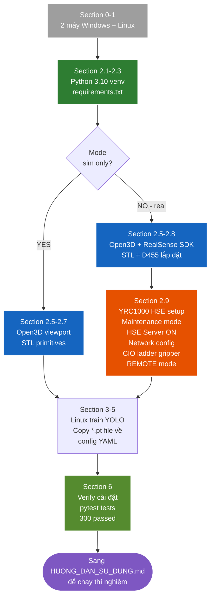

# HƯỚNG DẪN CÀI ĐẶT & CẤU HÌNH — PickPlaceGP7

Tài liệu này tập trung vào **setup phần cứng + phần mềm**. Sau khi cài xong, 
dùng [`HUONG_DAN_SU_DUNG.md`](HUONG_DAN_SU_DUNG.md) cho workflow + commands
hàng ngày.

> **Phạm vi file này**: Python venv, Open3D viewport, RealSense SDK, YRC1000 HSE
> (RoboDK chỉ tùy chọn cho `scripts/13_verify_vs_robodk.py` — xem §2.4)
> Server setup, ChArUco board, mesh setup. **KHÔNG bao gồm** workflow chạy thí
> nghiệm — xem [`HUONG_DAN_SU_DUNG.md`](HUONG_DAN_SU_DUNG.md).
>
> **Vị trí code & tài liệu:** Mọi lệnh chạy trong thư mục root repo
> (`pickplace_gp7/` / `DTwinGP7/`).

## Setup flow tổng quan



---

## 0. Mô hình triển khai 2 máy

| Máy | Hệ điều hành | Vai trò |
|---|---|---|
| **Máy CHẠY** | Windows | Dựng cell, thu dataset, calibration, chạy thí nghiệm. |
| **Máy TRAIN** | Linux + GPU NVIDIA | Huấn luyện YOLOv8-seg bằng công cụ riêng. |

Việc train **không nằm trong repo**. Repo chỉ nhận file trọng số `.pt`/`.onnx`
đã train sẵn để inference.

```
Máy CHẠY (Windows)                      Máy TRAIN (Linux GPU)
──────────────────                      ─────────────────────
thu ảnh D455 → data/raw/  ── copy ──►    train YOLOv8 (công cụ riêng)
                                                  │
models/yolov8s-seg_best.pt  ◄── copy best.pt ─────┘
        │
calibration → dựng cell → chạy thí nghiệm pick-and-place
```

---

## 1. Yêu cầu

### 1.1. Phần cứng
- **Máy CHẠY**: Windows 10/11, RAM ≥ 16GB. GPU NVIDIA khuyến nghị (inference
  nhanh hơn) nhưng không bắt buộc.
- **Máy TRAIN**: Linux, GPU NVIDIA ≥ 8GB VRAM (RTX 4060/4070/...).
- Camera Intel RealSense D455.
- Robot Yaskawa GP7 + controller YRC1000 (cho pha test thật).

### 1.2. Phần mềm chung
- **Python 3.10+** (bắt buộc — code dùng type hints hiện đại).
- Git.

---

## 2. Cài đặt MÁY CHẠY (Windows)

### 2.1. Python + môi trường ảo

```powershell
python --version    # cần 3.10+

# Vào thư mục code rồi tạo virtualenv (đổi đường dẫn cho đúng máy bạn)
cd "C:\Users\manhh\DTwinGP7"
python -m venv .venv
.venv\Scripts\Activate.ps1
```

### 2.2. Cài dependencies

```powershell
pip install -r requirements.txt
```

> Nếu `pip` báo lỗi ở gói `pyrealsense2`: mở `requirements.txt`, thêm `#` vào
> đầu dòng `pyrealsense2`, rồi chạy lại lệnh trên. Gói này chỉ cần khi dùng D455
> thật (chụp dataset / calibration / dock Camera trong app); phần sim + test +
> dock Camera ở chế độ Mock vẫn chạy đầy đủ khi thiếu.

### 2.3. PyTorch bản GPU cho inference nhanh (Tùy chọn) 

`requirements.txt` kéo theo `torch` bản CPU. Muốn inference YOLO bằng GPU:

```powershell
# Xem phiên bản CUDA: nvidia-smi  → chọn cu121 / cu118 cho phù hợp
pip install torch torchvision --index-url https://download.pytorch.org/whl/cu121
```

### 2.4. RoboDK Free — chỉ cho FK/IK verification (Tùy chọn)

Chỉ cài khi muốn chạy `scripts/13_verify_vs_robodk.py` (verify FK/IK client-side
so với RoboDK reference) hoặc `scripts/17_compare_fk_ik.py` (benchmark 6 IK có
RoboDK SolveIK làm reference) — chủ yếu cho luận văn defense.

1. Tải tại https://robodk.com/download (Free tier đủ).
2. Cài đặt (mặc định vào `C:\RoboDK\`).
3. Trong RoboDK GUI: **File → Open Robot Library** → tìm "Yaskawa GP7" →
   Download → lưu file vào `C:/RoboDK/Library/Yaskawa-GP7.robot`.
4. Bỏ comment dòng `# robodk>=5.5.0` trong `requirements.txt` rồi
   `pip install robodk`.

Không cần RoboDK cho 4 chế độ chạy chính (sim headless, sim Open3D, real HSE,
real ultra-fast).

### 2.5. Cài RealSense SDK 2.0

1. Tải Intel RealSense SDK 2.0 từ https://github.com/realsenseai/librealsense/releases/tag/v2.56.5
2. Cài đặt, cắm D455, mở `realsense-viewer` để kiểm tra stream RGB + depth.

### 2.6. Open3D viewport (đã có trong `requirements.txt`)

Sim non-headless render qua Open3D — đã được cài tự động bởi `pip install -r requirements.txt`.
Yêu cầu: Python 3.10+, không cần C++ compiler (wheel pip có sẵn cho Windows).

Test: `python scripts/03_run_experiment.py --mode sim --trials 5` → cửa sổ Open3D
hiển thị GP7 + bàn + camera, chạy 5 trial.

### 2.7. Chuẩn bị mesh STL

Đặt các file mesh vào đúng vị trí (vẽ trong Fusion 360 hoặc dùng
`scripts/gen_primitive_meshes.py` cho primitives):

```
models/worktable.stl
models/camera_mount.stl      (tùy chọn)
models/gripper.stl           (tùy chọn)
models/objects/bottle.stl
models/objects/cup.stl
models/objects/bolt.stl
```

> Object mesh thiếu sẽ bị bỏ qua kèm cảnh báo (không lỗi). Worktable mesh
> thiếu sẽ gây lỗi `MissingMeshError`.

### 2.8. Lắp đặt camera D455 (eye-to-hand)

Camera lắp **cố định** trên giàn, **KHÔNG** gắn lên cánh tay robot.

| Yếu tố | Khuyến nghị | Lý do |
|---|---|---|
| Kiểu lắp | Cố định trên giàn (eye-to-hand) | Đơn giản hoá calibration + tính pose |
| Độ cao | ~800–900 mm trên mặt bàn (config dùng 850 mm) | Trên ngưỡng đo tối thiểu D455 (~0.4 m); phủ đủ bàn 600×400 |
| Hướng | Nhìn thẳng xuống (top-down, trục Z camera ⟂ mặt bàn) | Depth ≈ chiều cao → trích pose đơn giản, ít méo |
| Vị trí ngang | Tâm camera nằm trên giữa vùng đặt vật | Toàn vùng vật nằm trong khung hình |
| Giàn đỡ | Nhôm định hình 20×20 / 30×30, cao ~1.2 m, **chắc, không rung** | Camera xê dịch → calibration sai ngay |
| Tránh va chạm | Giàn không chắn vùng hoạt động của GP7 | An toàn cho robot |
| Kết nối | Cáp **USB 3.0** về PC | D455 cần USB 3.0 để stream RGB-D |

Đảm bảo vùng đặt vật vừa nằm **trong khung hình camera**, vừa nằm **trong tầm
với của robot** — giao của hai vùng này là vùng gắp thực tế.

> ⚠ **Lắp camera xong → cố định cứng → MỚI hand-eye calibration.** Sau khi
> calibrate, không được xê dịch camera; nếu di chuyển (dù 1 mm) phải calibrate
> lại — ma trận `T_base_camera` gắn chặt với đúng vị trí đã calibrate.
>
> Lưu ý: khi *chụp dataset* (mục 4.3 tài liệu thiết kế hệ thống) có nghiêng giàn ±10° để
> tạo đa dạng ảnh; nhưng khi *vận hành thật*, camera phải ở **một vị trí cố
> định duy nhất** đã calibrate.

---

### 2.9. Cấu hình YRC1000 cho HSE Backend (Real mode)

HSE (High-Speed Ethernet Server) là function **built-in** của YRC1000,
không cần license riêng. Bật 1 lần qua maintenance mode trên teach pendant.

**Bước 1 — Bật HSE Server function trên YRC1000**

1. Power off controller
2. Power on trong **Maintenance mode** (giữ phím MAIN MENU khi power on)
3. Vào `System → Function Setting → Optional Function`
4. Tìm `HIGH-SPEED ETHERNET SERVER FUNCTION` → set **USED**
5. Save + reboot bình thường

**Bước 2 — Cấu hình network**

| Thiết bị | IP | Subnet |
|---|---|---|
| YRC1000 | 192.168.1.100 (vd) | 255.255.255.0 |
| PC | 192.168.1.50 (vd) | 255.255.255.0 |

Cáp Ethernet → port LAN1 của YRC1000. Verify từ PC:
```powershell
ping 192.168.1.100      # phải reply trước khi tiếp tục
```

**Bước 3 — Sửa `config/cell_layout_real.yaml`**

```yaml
robot_connection:
  enabled: true
  ip: "192.168.1.100"          # ĐỔI theo IP YRC1000 thực tế
  port: 80
  driver: "Motoman"
  max_speed_percent: 30        # safety cap cho testing đầu
  acceleration_percent: 50
```

**Bước 4 — Gripper subsystem qua CC-Link (PC ↔ YRC ↔ PLC Mitsubishi)**

Gripper khí nén double-acting điều khiển bằng PLC Mitsubishi. PC giao tiếp với
PLC **qua YRC1000 làm CC-Link bridge** (Path A) — PC chỉ dùng HSE protocol,
PLC chỉ dùng CC-Link, YRC1000 convert giữa 2 networks.

> Sơ đồ kiến trúc 3 thiết bị / 2 giao thức + sequence diagram + latency budget:
> [`phat_bieu_bai_toan_v3_2_HD.md` §7.9](phat_bieu_bai_toan_v3_2_HD.md).
> Phần dưới đây chỉ là **các bước setup** cho production.

💫 **Setup 3 components:**

**1. YRC1000 — CC-Link Master Module** (qua teach pendant):
- `MAIN MENU → SETUP → I/O MODULE → CC-LINK`
- Station number, baud rate, RX/RY count
- Verify cyclic data exchange ON
- Note bit address range (vd RY0 → internal 30010, RX0 → internal 30050)

**2. PLC Mitsubishi — CC-Link Slave + ladder bridge** (GX Works2):

Ladder code mẫu (bridge sensors X → CC-Link RY, CC-Link RY → solenoid Y):

```
// Input bridge — sensor → CC-Link RY area (PC sẽ đọc qua HSE)
│ X504 (Clamp cylinder reed switch)                  RY0
├──┤├────────────────────────────────────────────────( )──|
│ X503 (UnClamp cylinder reed switch)                RY1
├──┤├────────────────────────────────────────────────( )──|
│ X505 (Carrier Detect sensor)                       RY2
├──┤├────────────────────────────────────────────────( )──|

// Output bridge — CC-Link RY area (PC ghi qua HSE) → solenoid Y
│ X100 (=CC-Link RY0 từ PC)                          Y502
├──┤├────────────────────────────────────────────────( )──|
│ X101 (=CC-Link RY1 từ PC)                          Y503
├──┤├────────────────────────────────────────────────( )──|
```

**3. Wiring**: Pneumatic solenoid + sensors → PLC X/Y terminals. CC-Link cable
(shielded twisted pair) PLC ↔ YRC1000.

**Memory mapping** (default trong code, override qua `config["gripper_cc_link"]`):

| PLC pin | Direction | YRC bit | PC HSE call |
|---|---|---|---|
| Y502 Clamp | OUT to solenoid | 30010 | `set_io(30010, 1)` |
| Y503 UnClamp | OUT to solenoid | 30011 | `set_io(30011, 1)` |
| X504 Clamp sensor | IN from cylinder | 30050 | `read_io(30050)` |
| X503 UnClamp sensor | IN from cylinder | 30051 | `read_io(30051)` |
| X505 Detect | IN from carrier | 30052 | `read_io(30052)` |

**Verify chain end-to-end (5 bits isolated test):**

```powershell
python -c "
from src.orchestrator.backends.motoman_hse import MotomanHSEBackend
b = MotomanHSEBackend(ip='192.168.1.100'); b.connect()

# Test output: PC → YRC → CC-Link → PLC → solenoid
b.set_io(30010, 1)
input('Clamp solenoid kích? Cylinder đóng? Enter...')
print('Clamp sensor X504 (30050):', b.read_io(30050))
print('Detect X505 (30052):', b.read_io(30052))

b.set_io(30010, 0); b.set_io(30011, 1)
input('UnClamp solenoid kích? Cylinder mở? Enter...')
print('UnClamp sensor X503 (30051):', b.read_io(30051))

b.set_io(30011, 0); b.disconnect()
"
```

Expected output sau khi sensor trigger:
```
Clamp sensor X504 (30050): 1
Detect X505 (30052): 1       # nếu có vật trong gripper
UnClamp sensor X503 (30051): 1
```

Nếu trả `0` hoặc `-1` → debug bottom-up: hardware sensor → PLC X-input → PLC ladder
bridge → CC-Link mapping → YRC bit address. Detail tại `docs/phat_bieu_bai_toan_v3_2_HD.md`
mục ``§7.9 Gripper subsyste``.

**Tuning `gripper_delay_s` (fallback, không dùng nếu có sensor feedback)**:
total chain latency ~150-400ms (HSE + CC-Link + PLC scan + pneumatic stroke).
Default `0.5s` an toàn. Với CC-Link path, orchestrator dùng sensor confirm
thay vì blind delay — nhanh hơn + reliable hơn.

**Bước 5 — REMOTE mode khi chạy**

Trên teach pendant: switch sang **REMOTE mode** trước khi script gửi command qua HSE.
Nếu controller ở TEACH mode → HSE báo alarm 1010 (REMOTE_MODE_REQUIRED).

---

### 2.10. Setup TOOL01 trên teach pendant (Real mode)

Bắt buộc cho `--ik-source yrc` (default cho real mode). Nhập TCP offset của
gripper vào TOOL01 trên YRC1000 teach pendant — YRC1000 tự bù offset khi
compute IK từ Cartesian pose.

**Vì sao cần TOOL01:** robot có sẵn TOOL00 = flange (gốc tại mặt cuối arm);
gripper thêm offset Z ≈ 100 mm (chiều dài gripper). TOOL01 lưu offset này → khi
PC gửi pose Cartesian, YRC tự bù để **fingertip** (không phải flange) tới đúng
pose target. Không setup → robot đi lệch 100 mm → gripper đâm bàn hoặc gắp hụt.

**Cần chuẩn bị:**
- YRC1000 ở **MAINTENANCE** hoặc **MANAGEMENT** mode (key switch trên TP).
- TCP offset gripper theo `cell_layout.yaml`:
  ```yaml
  gripper:
    tcp_offset_xyz_mm: [0.0, 0.0, 100.0]   # ← lấy giá trị này
  ```
- Teach pendant trong tay, robot **servo OFF** (an toàn).

**Các bước (trên TP):**
1. **MAIN MENU → ROBOT → TOOL** → màn hình list TOOL00–TOOL63 (mặc định zero).
2. Cursor xuống **TOOL: 1** → **SELECT** → hiện 6 field (X/Y/Z mm, Rx/Ry/Rz deg).
3. Cursor lên **Z** → **EDIT/MODIFY** → gõ `100.000` (theo
   `gripper.tcp_offset_xyz_mm[2]`) → **ENTER**. X, Y giữ `0.000`; Rx/Ry/Rz giữ
   `0.0000`. (Gripper lệch X/Y hoặc kẹp xoay thì nhập offset/Rz tương ứng.)
4. **COMPLETE/REGISTER** → hiện "TOOL DATA REGISTERED" → **TOP MENU** thoát.

**Verify (vẫn ở ROBOT → TOOL):** cursor lên TOOL: 1 → **DISP** → confirm
Z = 100.000, các trục khác = 0.

**Test với robot (servo ON, REDUCED SPEED):**
> ⚠ Robot SẼ di chuyển. Key switch ở **REMOTE**, speed limit **10%** (slider TP),
> tay sẵn sàng E-stop.

```powershell
python scripts/11_test_yrc_cartesian.py --tool-no 1 --speed-pct 10
```

Script gửi 3 Cartesian pose (home → Z+50mm → home), verify: robot di chuyển
smoothly, fingertip tới đúng pose (không lệch 100 mm), không alarm.

**Optional — USER01 frame** (nếu workspace có origin custom, vd góc worktable
thay vì robot base): **MAIN MENU → ROBOT → USER COORD** → chọn USER: 1 → define
3-point teaching (Origin / X-axis / Y-axis: JOG robot tới từng vị trí, press
**REGISTER** mỗi điểm) → Save. Rồi trong config:

```yaml
robot_connection:
  user_frame_no: 1   # dùng UF01 thay vì BASE
```

Project default dùng BASE (UF=0) — đủ cho hầu hết pick-place; UF01 chỉ cần khi
muốn config tương đối với workpiece.

**Troubleshooting TOOL01:**

| Triệu chứng | Nguyên nhân | Fix |
|---|---|---|
| TOOL không edit được | Key switch ở PLAY mode | Đổi sang MAINTENANCE/MANAGEMENT |
| "TOOL CONST ERROR" sau khi save | Giá trị nhập vượt limit | Z < 600 mm, các trục < ±360° |
| Robot vẫn lệch 100mm | TP cache stale | Power-cycle YRC1000 |
| HSE READ_POSITION trả tool_no=0 | INFORM job không có TL=1 | Verify `motoman_hse.py` constructor `tool_no=1` |

> Tham chiếu: Yaskawa Operator's Manual YRC1000 §"Tool File Setting"; INFORM
> Language Manual (RE-CKI-A464) §"TL Coordinate".

**Backup (chưa setup TOOL01):** chạy `--ik-source client` — PC compute IK qua
DLS + URDF chain, gửi joints xuống YRC.

---

## 3. Huấn luyện model (Linux)

Trên máy Linux, huấn luyện YOLOv8-seg bằng công cụ quen thuộc 
(vd `ultralytics` CLI `yolo segment train`).

Đầu vào: dataset từ `data/raw/` (ảnh chụp ở ``Bước 1 mục 5``), label trên Roboflow,
export định dạng YOLOv8. Đầu ra: file trọng số `best.pt`.

**Không cần dataset ngoài.** Dataset hoàn toàn tự thu (~2100 ảnh của 3 vật
trong cell) — vì model phải nhận đúng vật và đúng điều kiện ánh
sáng/nền của cell. Trọng số nền COCO-pretrained (`yolov8s-seg.pt`) do
ultralytics tự tải khi train — đây là thứ "bên ngoài" duy nhất, không phải
chuẩn bị thủ công.

→ Copy `best.pt` về máy Windows, đặt vào `models/` (xem mục 5).

---

## 4. Cấu hình dự án

Mọi cấu hình nằm trong `config/` — sửa file YAML, không sửa code.

| File | Sửa khi nào |
|---|---|
| `cell_layout.yaml` | Đổi vị trí robot/bàn/camera/gripper, đường dẫn mesh |
| `cell_layout_real.yaml` | Như trên, cho chế độ robot thật (`robot_connection.enabled=true`) |
| `experiment.yaml` | Tham số Orchestrator: tốc độ, approach height, IP robot, `model_path`... |

Sau khi sửa, **luôn validate**:

```powershell
python -m src.cell.cell_models validate config/cell_layout.yaml
```

---

## 5. Quy trình end-to-end

```
[Windows] 1. Thu dataset:   python scripts/01_collect_dataset.py   → data/raw/
          2. Label trên Roboflow, export YOLOv8 → copy dataset sang máy Linux
[Linux]   3. Train YOLOv8 bằng công cụ riêng → best.pt
          4. Copy best.pt về Windows
[Windows] 5. Đặt trọng số:    models/yolov8s-seg_best.pt
          6. Hand-eye calib:  python scripts/02_run_calibration.py --hse-ip 192.168.1.100
          7. Chạy thí nghiệm: python scripts/03_run_experiment.py --mode sim
          8. Phân tích:       python scripts/04_analyze_results.py --csv "results/*.csv"
```

### Đưa trọng số về máy chạy

Copy file `best.pt` (hoặc `.onnx`) từ máy Linux về, đặt đúng tên mà
`experiment.yaml` trỏ tới:

`config/experiment.yaml :: model_path` mặc định trỏ `models/yolov8s-seg_best.pt`.
Nếu thiếu file này, `ObjectDetector` báo lỗi rõ ràng khi chạy mode real.

---

## 6. Kiểm tra cài đặt (verify)

Mọi lệnh chạy **trong thư mục `DTwinGP7/`** (đã activate `.venv`).

### 6.1. Kiểm tra phần mềm — KHÔNG cần phần cứng

```powershell
# 1. Validate config
python -m src.cell.cell_models validate config/cell_layout.yaml

# 2. Chạy toàn bộ test
pytest tests/ -q
```

**Kỳ vọng:** bước 1 in `✓ Config hợp lệ: ...`; bước 2 báo `300 passed`.
Hai bước này đạt → code + dependencies đã cài đúng.

### 6.2. Kiểm tra sim viewport — Open3D

```powershell
python scripts/03_run_experiment.py --mode sim --trials 5
```

**Kỳ vọng:** cửa sổ Open3D mở ra hiển thị GP7 + bàn + camera, robot chạy 5 trial
gắp-thả. Đóng cửa sổ để thoát.

---

## 7. Workflow + Lệnh chạy thí nghiệm

→ Xem [`HUONG_DAN_SU_DUNG.md`](HUONG_DAN_SU_DUNG.md) (đầy đủ scenarios, CLI flags,
phân tích output).

Tóm tắt nhanh sau khi cài xong:

```powershell
# Test cài đặt OK
pytest tests/ -q                                          # → 300 passed

# Sim không cần robot
python scripts/03_run_experiment.py --mode sim --headless --trials 500

# Real qua HSE bypass (sau khi setup YRC1000 ở mục 2.9)
python scripts/03_run_experiment.py --mode real --backend hse --trials 50
```

---

## 8. Troubleshooting **install-specific**

> **Lỗi khi CHẠY** (không phải lỗi cài đặt) — xem [`HUONG_DAN_SU_DUNG.md`](HUONG_DAN_SU_DUNG.md) §7.

| Triệu chứng (lúc setup) | Nguyên nhân | Cách xử lý |
|---|---|---|
| `pip install` lỗi ở `pyrealsense2` | Wheel không hợp Python/OS | Thêm `#` vào dòng `pyrealsense2` trong `requirements.txt`, cài lại (sim/test vẫn chạy) |
| `MissingMeshError: worktable.stl` | Thiếu mesh | Mục 2.7 — đặt file STL đúng path hoặc chạy `scripts/gen_primitive_meshes.py` |
| `FileNotFoundError: ...best.pt` | Chưa copy YOLO trọng số về | Mục 5 — copy file `.pt` từ máy train Linux |
| `FileNotFoundError: ...T_base_camera.npy` | Chưa chạy hand-eye calibration | Chạy `02_run_calibration.py` (real) hoặc `calibration_from_layout.py` (sim) |
| `UnicodeEncodeError` ký tự ✓/─ | Console Windows cp1252 | Đã xử lý sẵn trong code (ép UTF-8) |
| Open3D viewport không hiện | Thiếu `pip install open3d` | Cài lại `pip install -r requirements.txt` |
| `robodk` import lỗi khi chạy `13_verify_vs_robodk.py` | RoboDK Free + python package chưa cài | Xem mục 2.4 (tùy chọn) |
| Calibration sai số lớn (>5mm) | Dùng nhầm Tsai-Lenz, hoặc pose thiếu rotation | Dùng `--method park`; thêm pose xoay ±30° |
| `ping 192.168.x.x` fail (HSE setup) | YRC1000 không cùng subnet hoặc cáp lỗi | Check IP cấu hình maintenance mode + cáp Ethernet vào LAN1 |

---

## 9. Liên kết

- **Entry point + tổng quan**: [`../README.md`](../README.md)
- **Giới thiệu phần mềm + chức năng các phần**: [`GIOI_THIEU_PHAN_MEM.md`](GIOI_THIEU_PHAN_MEM.md)
- **Học lập trình (GUI + INFORM + Python + SDK)**: [`HUONG_DAN_LAP_TRINH.md`](HUONG_DAN_LAP_TRINH.md)
- **Workflow + commands hàng ngày**: [`HUONG_DAN_SU_DUNG.md`](HUONG_DAN_SU_DUNG.md)
- **Trọng số + mesh + CIO ladder**: [`../models/README.md`](../models/README.md)
- **Thiết kế hệ thống + kiến trúc**: [`phat_bieu_bai_toan_v3_2_HD.md`](phat_bieu_bai_toan_v3_2_HD.md)
- Repo GitHub: https://github.com/manhhv87/DTwinGP7
