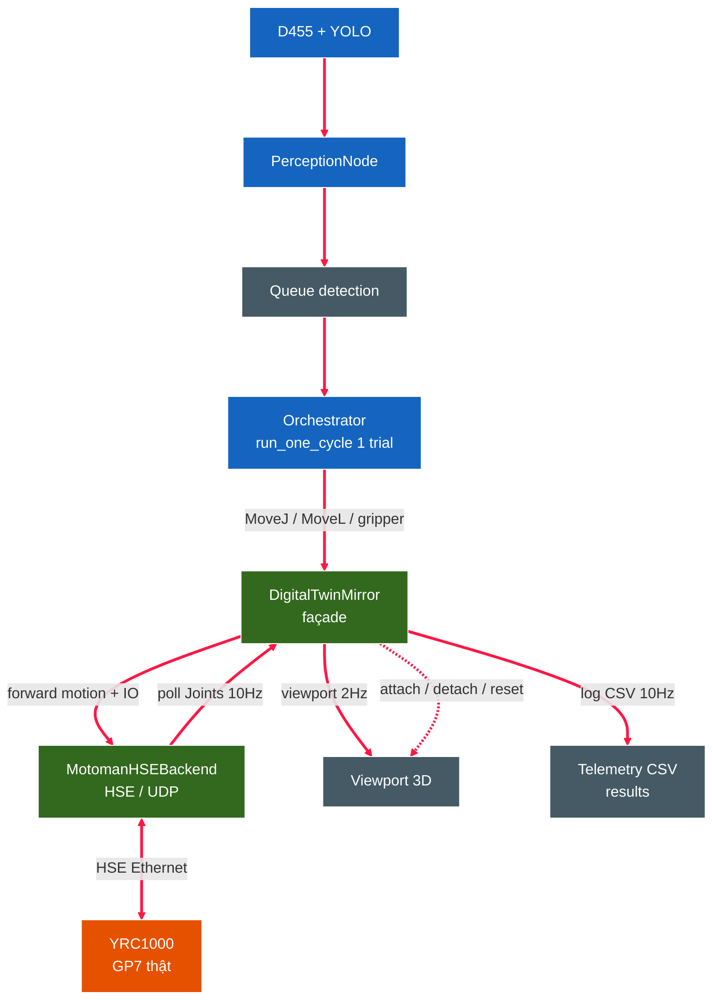
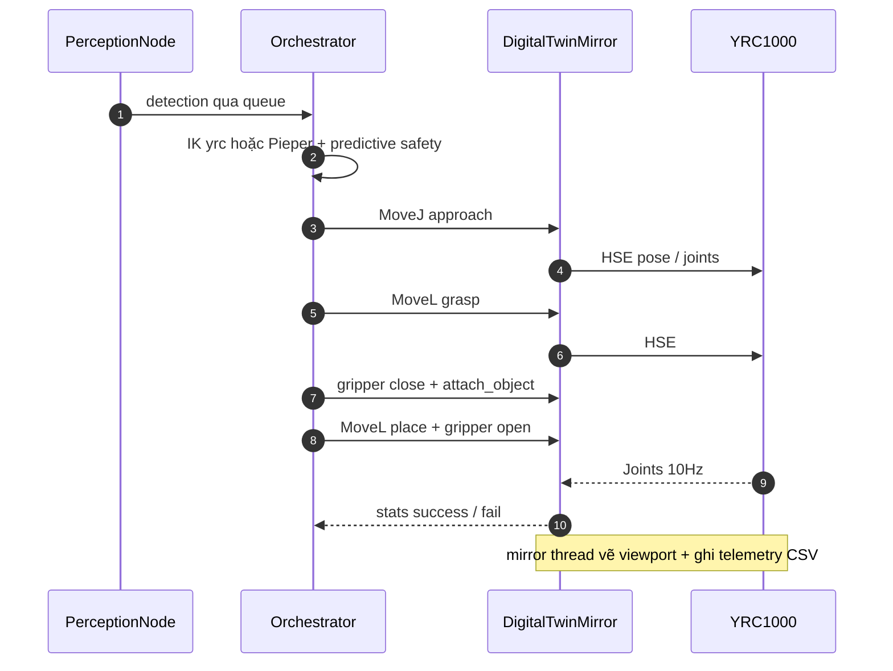
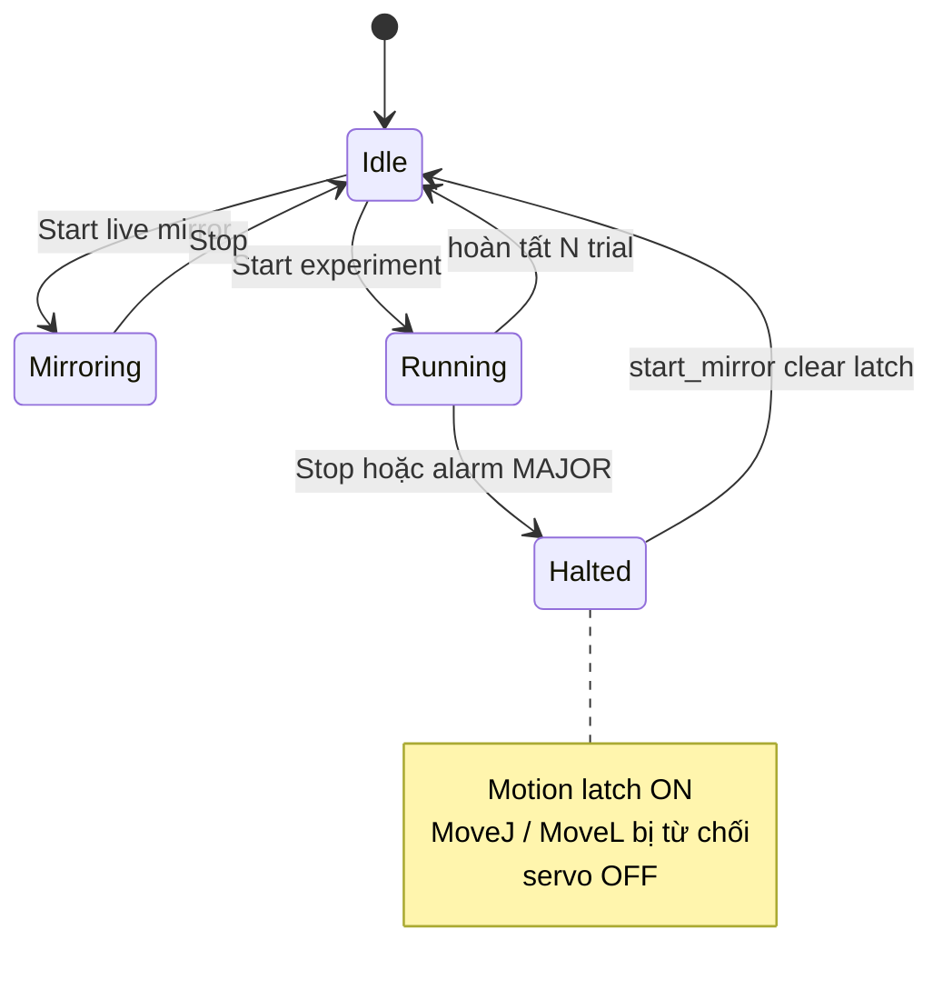
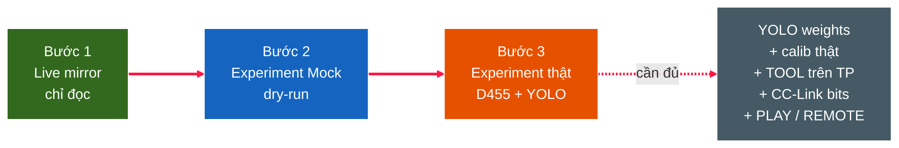

# HƯỚNG DẪN DIGITAL TWIN — DTwinGP7 (robot Yaskawa GP7 thật)

Tài liệu hợp nhất về **Digital Twin** trong app `16_app_qt.py`: mirror robot THẬT
vào viewport và chạy thí nghiệm pick-place tự động trên robot THẬT. Đây là "trang
chủ" Digital Twin — thao tác chi tiết xem [HUONG_DAN_GUI.md](HUONG_DAN_GUI.md) §11,
chạy bằng CLI xem [HUONG_DAN_SU_DUNG.md](HUONG_DAN_SU_DUNG.md) Kịch bản E.

> Quy ước: văn xuôi tiếng Việt; nhãn nút/menu/panel trích **đúng tiếng Anh** như app
> hiển thị.

## Mục lục
- [§1. Digital Twin ở dự án này là gì](#1-digital-twin-ở-dự-án-này-là-gì)
- [§2. Kiến trúc](#2-kiến-trúc)
- [§3. Hai chế độ: Live mirror vs Run experiment](#3-hai-chế-độ-live-mirror-vs-run-experiment)
- [§4. Mở panel + tham số](#4-mở-panel--tham-số)
- [§5. Nguồn IK: yrc vs client (Pieper)](#5-nguồn-ik-yrc-vs-client-pieper)
- [§6. An toàn: E-stop + alarm latch](#6-an-toàn-e-stop--alarm-latch)
- [§7. Telemetry + kết quả](#7-telemetry--kết-quả)
- [§8. Workflow lên robot thật (3 bậc) + checklist](#8-workflow-lên-robot-thật-3-bậc--checklist)
- [§9. Sự cố thường gặp](#9-sự-cố-thường-gặp)

---

## §1. Digital Twin ở dự án này là gì

Theo phát biểu bài toán, đây là **Level-4 Bidirectional Digital Twin** trên đường
truyền HSE (High-Speed Ethernet) tới YRC1000. Cụ thể trong app, "Digital Twin" gồm
2 năng lực trên **robot THẬT**:

1. **Live mirror** — đọc trạng thái khớp THẬT từ YRC1000 qua HSE rồi vẽ vào viewport
   3D theo thời gian thực (robot KHÔNG nhận lệnh — chỉ đọc → an toàn tuyệt đối).
2. **Run experiment** — `Orchestrator` điều khiển robot THẬT chạy chu trình vision-
   guided pick-place tự động (perception → IK → motion → gripper), đồng thời mirror
   live + ghi telemetry/kết quả.

Tương đương `scripts/03_run_experiment.py --mode real` nhưng vận hành ngay trong GUI,
vòng thí nghiệm **ngắt được** từ nút Stop.

## §2. Kiến trúc

- **`MotomanHSEBackend`** (`src/orchestrator/backends/motoman_hse.py`): nói chuyện
  YRC1000 qua HSE UDP — đọc `Joints()`, gửi `MoveJ/MoveL` (joint hoặc pose Cartesian
  BASE), điều khiển I/O gripper.
- **`DigitalTwinMirror`** (`src/orchestrator/digital_twin.py`): façade bọc backend.
  `start_mirror()` spawn 1 daemon thread poll `backend.Joints()` @**telemetry_hz**
  (mặc định 10 Hz) → ghi telemetry CSV + gọi `viewport_callback` @**mirror_hz** (mặc
  định 2 Hz, throttle xuống từ telemetry_hz). Render VTK ~76 ms/khung << 500 ms (2 Hz)
  nên mượt. Đồng thời poll alarm; forward `attach_object/detach_object/reset_scene`
  để gắn/thả vật trong viewport khi gripper đóng/mở.
- **`Orchestrator`** (`src/orchestrator/orchestrator.py`): `robot=twin`. `run_one_cycle`
  = 1 trial (1 detection → IK → 6 waypoint pick-place → gripper). Có reach-envelope +
  predictive safety (joint limit + self-collision toàn quỹ đạo) khi real mode.

Worker chạy ở **thread riêng**; chỉ giao tiếp main thread (vẽ/UI) qua signal Qt — an
toàn thread.

## §3. Hai chế độ: Live mirror vs Run experiment

| | **Live mirror** | **Run experiment** |
|---|---|---|
| Robot có chuyển động? | ❌ KHÔNG (chỉ đọc joints) | ✅ CÓ — tự gắp-thả |
| Cần camera/calib/weights? | ❌ Không | ✅ Có (perception thật) |
| Rủi ro | Rất thấp (read-only) | Cao — robot di chuyển |
| Dùng để | Xem robot thật live khi nó chạy job (teach-pendant / Run on Robot), kiểm HSE/mạng | Chạy thí nghiệm vision-guided tự động + thống kê |
| Output | Telemetry CSV | Telemetry CSV + kết quả trial CSV |

Cả hai đều hiện **dialog an toàn** trước khi bắt đầu (mirror = xác nhận read-only;
experiment = cảnh báo **"Run experiment — the REAL robot WILL MOVE"**).

**Chu trình 1 trial (Run experiment):**

## §4. Mở panel + tham số

Mở: menu **Digital Twin → Show Digital Twin panel** (dock **Digital Twin**, mặc định
ẩn, tab chung cụm dock bên trái).

**Nhóm "Digital Twin — real robot (HSE)"** (chung cho cả 2 chế độ):
- **Mirror Hz (viewport)** — tần số vẽ joint thật vào viewport (mặc định 2.0).
- **Telemetry Hz (CSV)** — tần số poll joints + ghi CSV (mặc định 10.0).

**Nhóm "Experiment parameters (autonomous pick-place)"** (cho Run experiment):
- **Trials** — số trial.
- **IK source** — `yrc (YRC1000 onboard IK)` hoặc `client (Pieper analytical)` (xem §5).
- **Perception** — `D455 + YOLO (real)` hoặc `Mock (dry-run test)`.
- **Ultra-fast** — chế độ P-var (upload template 1 lần) cho HSE.

**Nút:**
- **▶ Start live mirror** — bắt đầu mirror (read-only).
- **▶ Start experiment** — chạy thí nghiệm tự động (robot di chuyển).
- **⏹ Stop Digital Twin** — dừng (xem §6).

> IP YRC1000 lấy từ **Robot → Connection settings…** (phải nhập trước). Cần load
> Robot GP7 trước để có model dựng viewport.

## §5. Nguồn IK: yrc vs client (Pieper)

| | `yrc` — YRC1000 onboard | `client` — Pieper analytical |
|---|---|---|
| Ai giải IK | Bộ điều khiển YRC1000 (gửi pose Cartesian BASE) | PC giải (Pieper giải tích) |
| Overhead PC | 0 | ~0.24 ms/nghiệm |
| Độ chính xác | Theo controller | Exact ~1e-13 mm, deterministic |
| Điều kiện | **Phải setup TOOL** đúng `tool_no` trên teach-pendant | URDF/base/tool đúng |
| Mặc định | ✅ cho robot thật | khi muốn IK PC-side |

- **Pieper** (`src/orchestrator/kinematics/pieper_gp7.py`) là solver giải tích chính:
  trả tất cả nhánh (≤8) + chọn **nhánh gần** joints hiện tại (`_nearest`) để chuyển
  động liên tục không "chong chóng" cổ tay; xử lý đúng **tool offset** (hạ TCP về
  flange trước khi giải). DLS numerical (`inverse_kinematics_seeded`) chỉ còn làm
  **fallback** khi Pieper báo ngoài tầm.
- Đây cũng là solver app dùng cho **Find branches / Change Config** trong panel jog.
- **Lưu ý vận hành:** `yrc` gửi pose Cartesian → chạy **single-shot** (không gộp batch,
  vì YRC Cartesian-in-batch chưa hỗ trợ); `client` (joint-list) thì gộp batch được.

## §6. An toàn: E-stop + alarm latch

`DigitalTwinMirror` có **latch dừng-motion** chuẩn công nghiệp:

- Bấm **⏹ Stop Digital Twin** khi đang experiment → `twin.Stop()`: **set latch TRƯỚC**
  rồi servo-OFF backend. Mọi `MoveJ/MoveL` sau đó (kể cả đang giữa một `run_one_cycle`)
  bị **từ chối ngay** → KHÔNG gửi thêm lệnh chuyển động tới robot.
- **Auto-stop**: khi mirror thread phát hiện **alarm MAJOR/SYSTEM**, tự `Stop()` (latch
  + servo-off) — không cần thao tác.
- Live mirror bấm Stop chỉ dừng đọc (không gửi Stop tới robot, tránh dừng job robot
  đang tự chạy).
- Latch được clear khi `start_mirror()` lần sau (cho phép motion lại).

> ⚠ Stop chỉ "sạch" ở ranh giới trial + chặn lệnh tiếp theo; **luôn để E-stop vật lý
> trong tầm tay** khi chạy robot thật.

## §7. Telemetry + kết quả

- **Telemetry CSV**: `results/telemetry_<timestamp>.csv` — joints thật @telemetry_hz
  (10 Hz) cho cả 2 chế độ. Phân tích/replay offline: xem
  [HUONG_DAN_SU_DUNG.md](HUONG_DAN_SU_DUNG.md) Kịch bản E (joint trajectory, velocity,
  drift, cycle-time, MP4 replay).
- **Kết quả trial** (chỉ Run experiment): `results/experiment_real_<timestamp>.csv` —
  mỗi trial: success/fail, failure mode, cycle time, nhãn ngữ cảnh.
- Trạng thái live hiện ở nhãn dưới panel: `Trial i — OK n / Fail m (rate% of N attempts)`.

## §8. Workflow lên robot thật (3 bậc) + checklist

Lên robot thật **theo bậc** để an toàn:

**Bước 1 — Live mirror** (chỉ đọc, không cần camera/weights/calib):
Robot → Connection settings (IP) → panel Digital Twin → **Start live mirror** → cho
robot chạy job trên teach-pendant → xem mirror + telemetry. Kiểm HSE/mạng OK.

**Bước 2 — Experiment "Mock (dry-run)"** (kiểm chuỗi motion + gripper + E-stop, không
cần camera): Perception = **Mock** → **Start experiment**. ⚠ **Vùng làm việc PHẢI
trống**, E-stop trong tay. *(Dùng calib sim nên pose có thể lệch — chủ yếu kiểm luồng
+ an toàn, đừng kỳ vọng gắp trúng.)*

**Bước 3 — Experiment thật (D455 + YOLO)** — chỉ khi đủ checklist:

- [ ] **YOLO weights**: `models/yolov8s-seg_best.pt` (hoặc đường dẫn trong
      `config/experiment.yaml`).
- [ ] **Hand-eye calibration THẬT**: chạy `scripts/02_run_calibration.py` →
      `config/calibration/T_base_camera.npy` (xem
      [HUONG_DAN_CAI_DAT.md](HUONG_DAN_CAI_DAT.md) §2.8.1; bảng ChArUco in đúng
      7×5 / 40 mm / 30 mm / DICT_4X4_50). *(Calib commit sẵn là bản sim — KHÔNG dùng
      cho real.)*
- [ ] **TOOL** trên teach-pendant đúng `tool_no` (cho `yrc` IK).
- [ ] **gripper CC-Link bits** verify khớp PLC (mặc định 30010/11/50/51/52 là TODO-
      verify).
- [ ] YRC ở **PLAY/REMOTE**, HSE Server bật, ping OK.

## §9. Sự cố thường gặp

| Triệu chứng | Nguyên nhân / xử lý |
|---|---|
| "HSE not responding" | Sai IP / HSE Server chưa bật / khác mạng — kiểm Connection settings + ping |
| "Missing calibration" khi Start experiment | Thiếu `T_base_camera.npy` — chạy `02_run_calibration.py` (real) hoặc `calibration_from_layout.py` (sim) |
| "Missing YOLO weights" | Thiếu `models/*.pt` — dùng Perception = **Mock** để test, hoặc nạp weights |
| Robot không di chuyển khi experiment | Kiểm YRC PLAY/REMOTE; TOOL đã setup cho `yrc`; xem log trial |
| Gripper không kẹp / "gripper_timeout" | CC-Link bits sai mapping — verify với PLC/TP |
| Viewport không mượt | Mirror Hz quá cao so với khả năng render — giảm Mirror Hz (telemetry vẫn 10 Hz) |
| Gắp trượt (Mock dry-run) | Bình thường — dry-run dùng calib sim; chỉ kiểm luồng/an toàn |

---

## Liên kết
- [HUONG_DAN_GUI.md](HUONG_DAN_GUI.md) §11 — thao tác GUI chi tiết.
- [HUONG_DAN_SU_DUNG.md](HUONG_DAN_SU_DUNG.md) Kịch bản E — chạy bằng CLI + phân tích telemetry.
- [HUONG_DAN_CAI_DAT.md](HUONG_DAN_CAI_DAT.md) §2.8.1 — hand-eye calibration.
- [GIOI_THIEU_PHAN_MEM.md](GIOI_THIEU_PHAN_MEM.md) §3.4 — kiến trúc `DigitalTwinMirror`.
