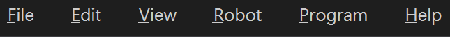
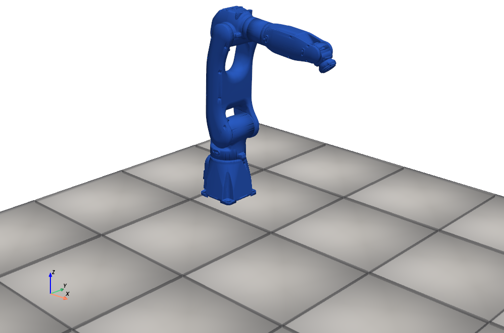
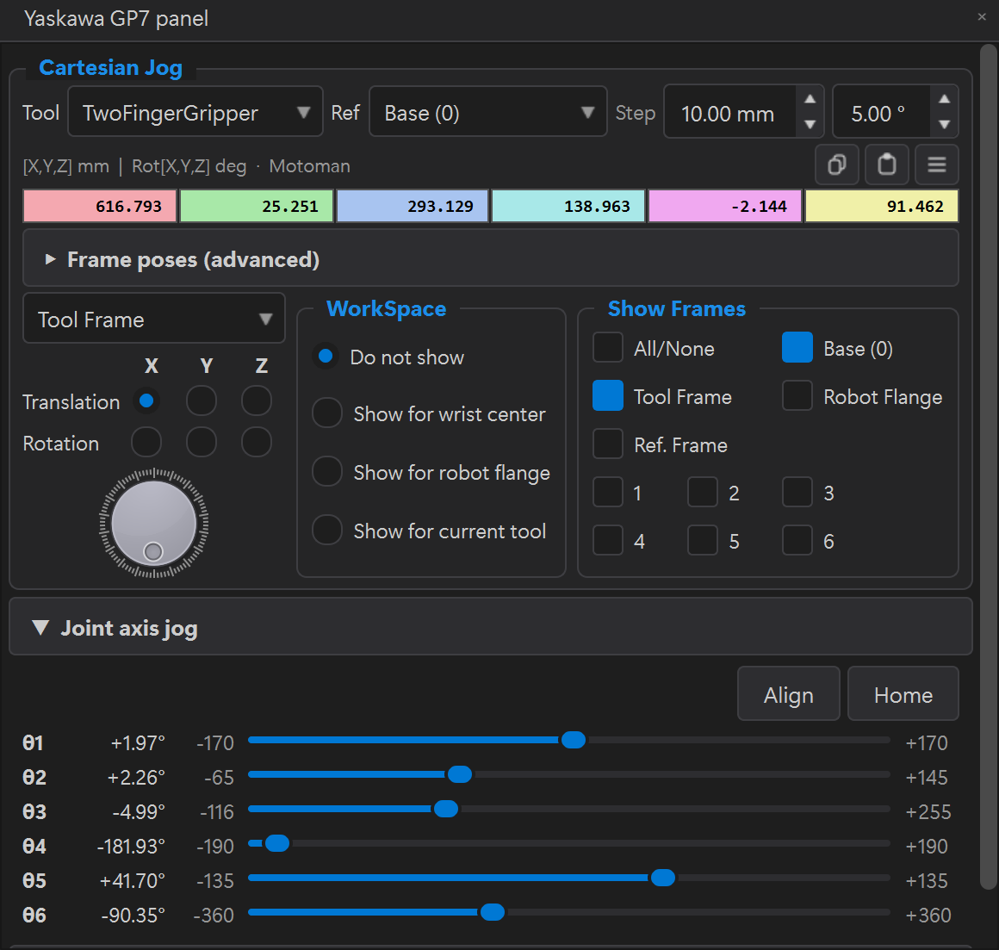
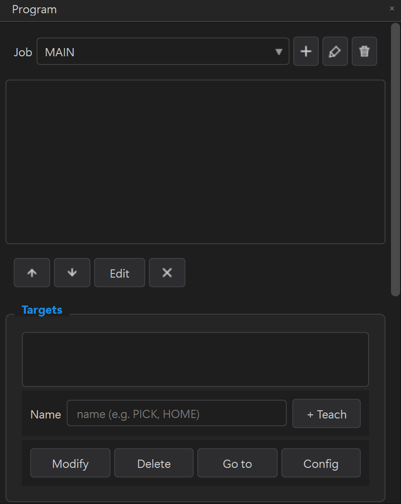

# HƯỚNG DẪN THAO TÁC GUI — DTwinGP7 (app `16_app_qt.py`)

> Sổ tay **thao tác bằng giao diện** (click chuột + phím tắt) cho app GP7 Program
> Editor (PyQt6 + VTK). **Không cần biết lập trình** — mọi việc làm qua menu, dock,
> nút bấm.
>
> | Bạn cần | Đọc |
> |---|---|
> | **Thao tác GUI** (file này) | teach pose, dựng chương trình, camera, chạy robot — bằng chuột |
> | Lập trình bằng code/API | [`HUONG_DAN_LAP_TRINH.md`](HUONG_DAN_LAP_TRINH.md) |
> | Workflow + lệnh CLI | [`HUONG_DAN_SU_DUNG.md`](HUONG_DAN_SU_DUNG.md) |
> | Cài đặt | [`HUONG_DAN_CAI_DAT.md`](HUONG_DAN_CAI_DAT.md) |

---

## Mục lục
- [§1. Mở app + tổng quan giao diện](#1-mở-app--tổng-quan-giao-diện)
- [§2. Bản đồ Menu](#2-bản-đồ-menu)
- [§3. Phím tắt](#3-phím-tắt)
- [§4. Di chuyển góc nhìn 3D](#4-di-chuyển-góc-nhìn-3d)
- [§5. Nạp robot / cell](#5-nạp-robot--cell)
- [§6. Jog robot (panel Yaskawa GP7 panel)](#6-jog-robot-panel-yaskawa-gp7-panel)
- [§7. Dựng & chạy chương trình (panel Program)](#7-dựng--chạy-chương-trình-panel-program)
- [§8. Teach nâng cao: Surface + Config](#8-teach-nâng-cao-surface--config)
- [§9. Camera & vision-guided (panel Camera (D455))](#9-camera--vision-guided-panel-camera-d455)
- [§10. Lưu / mở / xuất file](#10-lưu--mở--xuất-file)
- [§11. Chạy trên robot thật (HSE) + Digital Twin](#11-chạy-trên-robot-thật-hse--digital-twin)
- [§12. Chỉnh sửa Cell (panel Cell)](#12-chỉnh-sửa-cell-panel-cell)
- [§13. Sự cố GUI thường gặp](#13-sự-cố-gui-thường-gặp)

---

## §1. Mở app + tổng quan giao diện

```powershell
.venv\Scripts\Activate.ps1
python scripts/16_app_qt.py                                   # app trống
python scripts/16_app_qt.py --config config/cell_layout.yaml  # nạp sẵn 1 cell
python scripts/16_app_qt.py --program examples/sample_program.json  # mở chương trình mẫu
```

<table>
<tr>
<td width="400"></td>
<td>

**Bố cục cửa sổ:**
- **Giữa**: viewport 3D (VTK) — scene robot + bàn + vật.
- **Thanh menu** trên cùng: File · Edit · View · Robot · Program · Digital Twin · Help (§2).
- **Cụm dock bên trái** (xếp dạng tab): **Cell**, **Yaskawa GP7 panel**, **Program**, **Camera (D455)**, **Digital Twin**.

**Hiện / ẩn panel:** **View → Window →** tích/bỏ tích panel (panel Digital Twin mở qua menu **Digital Twin**). Mặc định chỉ **Cell** hiện; **Yaskawa GP7 panel** / Program / Camera / Digital Twin **ẩn** — bật khi cần.

> 💡 Panel mới bật gộp vào cụm tab trái. Kéo tiêu đề panel để tách ra cửa sổ nổi; thả về vùng dock để gộp lại.

</td>
</tr>
</table>

---

## §2. Bản đồ Menu



**File**
- **Load Robot GP7** — nạp robot GP7 vào scene (cold start).
- **Load Cell from YAML…** — nạp cả cell từ file `.yaml`.
- **Save Cell to YAML…** — lưu cell hiện tại ra `.yaml`.
- **Cell info...** — xem thông tin cell (frames, objects, base pose).
- **Open program (.json)...** `Ctrl+O` · **Save program (.json)...** `Ctrl+S`
- **Export .JBI (Yaskawa INFORM)...** — xuất chương trình ra file nạp cho YRC1000.
- **Exit** `Ctrl+Q`

**Edit** (thiết kế cell — trùng menu chuột phải trên cây Cell)
- **Add Robot…** · **Add Gripper…**
- **Add Object…** · **Add Frame…**
- **Add Worktable…** · **Add Pedestal…** · **Add Floor…** · **Add Camera Mount…** · **Add Camera…**

**View**
- **Camera ▶**: Iso `Alt+1` · Top `Alt+2` · Front `Alt+3` · Back `Alt+4` · Right `Alt+5` · Left `Alt+6` · **Fit all (reset camera)** `Alt+7` · **Perspective view** (bật/tắt phối cảnh).
- **Visibility ▶**: **Floor** · **World axes triad** · **Camera frustum** (nón nhìn camera).
- **Window ▶**: **Fullscreen** `F11` · **Controls panel** · **Cell components** `Ctrl+Shift+C` · **Program panel** · **Camera (D455)**.
- **Reset scene (restore objects)** — đưa vật về vị trí ban đầu sau khi đã gắp/di chuyển.

**Robot**
- **Home** — về tư thế home · **Zero** — về 0° tất cả khớp.
- **Parameters (URDF/DH)...** — xem tham số động học.
- **Teach on surface (Ctrl+Shift+T)** — bật chế độ click mesh để tạo target (§8).
- **Connection settings... (HSE IP)** — cấu hình + test kết nối YRC1000 (§11).

**Program**
- **Play** · **Pause / Resume** · **Stop** — điều khiển mô phỏng.
- **Run on Robot…** — chạy thật qua HSE (có dialog an toàn).
- **Clear all** — xóa toàn bộ lệnh.
- **Post-processor settings…** — đặt `max_speed_pct`, VJ/V mặc định cho .JBI.
- **Generate from Python script…** — mở editor sinh lệnh bằng Python (xem [`HUONG_DAN_LAP_TRINH.md` §4](HUONG_DAN_LAP_TRINH.md)).

**Digital Twin**
- **Show Digital Twin panel** — mở dock **Digital Twin** (mirror robot thật + chạy thí nghiệm pick-place tự động — §11).

**Help → About...**

---

## §3. Phím tắt

<table>
<tr>
<td valign="top">

**Chương trình & teach**

| Phím | Tác dụng |
|---|---|
| `Ctrl+O` / `Ctrl+S` | Mở / lưu chương trình (.json) |
| `Ctrl+T` | **+ Teach** — lưu pose thành target |
| `F3` | **Modify** — cập nhật target đang chọn |
| `F4` | **Config** — đổi cấu hình tay (IK) |
| `Ctrl+Shift+T` | Bật/tắt **Teach on Surface** |

</td>
<td width="48"></td>
<td valign="top">

**Khung nhìn & cửa sổ**

| Phím | Tác dụng |
|---|---|
| `Alt+1`…`Alt+6` | Iso / Top / Front / Back / Right / Left |
| `Alt+7` | **Fit all** (reset camera) |
| `F11` | Fullscreen |
| `Ctrl+Shift+C` | Hiện/ẩn panel **Cell components** |
| `Ctrl+Q` | Thoát |

</td>
</tr>
</table>

---

## §4. Di chuyển góc nhìn 3D

Trong viewport: **chuột trái kéo** = xoay · **chuột giữa/lăn** = pan/zoom (chuẩn VTK).
Hoặc dùng **View → Camera**: chọn preset `Alt+1…6`, **Fit all** `Alt+7` để khung lại
toàn scene, **Perspective view** để bật/tắt phối cảnh.

---

## §5. Nạp robot / cell

<table>
<tr>
<td width="260"></td>
<td>

- **File → Load Robot GP7**: chỉ nạp robot (scene trống còn lại).
- **File → Load Cell from YAML…**: nạp cả ô làm việc (robot + bàn + camera + vật…).
- Hoặc khởi động kèm `--config config/cell_layout.yaml`.

</td>
</tr>
</table>

> Nhiều thao tác (jog, teach, IK) **chỉ bật sau khi đã có robot** — nếu nút bị xám,
> hãy Load Robot GP7 trước.

---

## §6. Jog robot (panel Yaskawa GP7 panel)

Bật: **View → Window → Controls panel** (dock hiện ra có tiêu đề **Yaskawa GP7 panel**).

<table>
<tr>
<td width="340"></td>
<td>

- **Cartesian Jog**: combo **Tool** + **Ref** (hệ quy chiếu) + **Step** (mm/độ); 6 ô
  pose màu `[X, Y, Z, Rx, Ry, Rz]`; chọn trục **Translation/Rotation** (X/Y/Z) rồi
  xoay **núm** (QDial) để jog. Kèm **Frame poses (advanced)**, **WorkSpace**, **Show Frames**.
- **Joint axis jog**: 6 slider θ1…θ6 (kèm giới hạn) + nút **Align** / **Home**.
- **Other configurations — robot postures (8 IK branches)**: chọn **cấu hình tay**
  khác cho cùng một pose (elbow up/down, front/back…).

</td>
</tr>
</table>

---

## §7. Dựng & chạy chương trình (panel Program)

Bật: **View → Window → Program panel**.

<table>
<tr>
<td width="280"></td>
<td>

Cấu trúc panel (trên xuống):
1. **Danh sách lệnh** — kéo-thả để đổi thứ tự.
2. **Thanh sửa**: **Edit** (sửa lệnh đang chọn), ↑/↓ (di chuyển), ✕ (xóa).
3. **Targets** (thư viện pose đặt tên): ô tên + **+ Teach** `Ctrl+T` · **Modify** `F3`
   · **Delete** · **Go to** · **Config** `F4` · **+ MoveJ →** / **+ MoveL →** (chèn
   lệnh đi tới target đang chọn).
4. **Tab thêm lệnh:**
   - **Motion**: **+ MoveJ** · **+ MoveL** · **+ MoveC (set MID)** — chèn lệnh đi tới
     **pose hiện tại** của robot. (Muốn đi tới target đặt tên → dùng **+ MoveJ →** ở mục Targets.)
   - **I/O & Flow**: ô **OUT# [n] = [ON/OFF]** + **+ DOUT** (bật/tắt ngõ ra số — đóng/mở
     gripper, thường OT#1) · **+ WaitIO** · **+ Wait** · **+ MSG** · **+ Call** · **+ SimEvent**.
   - **Modal**: **+ SetSpeed** (VJ% + V mm/s) · **+ Rounding** (PL) · **+ SetTool** (TL#)
     · **+ RefFrame** (UF#).
5. **Thanh playback** (2 hàng): hàng Sim **▶ Run Sim** · **▮▮ Pause** · **■ Stop** + ô **Speed**;
   hàng robot thật **⚙ Run on Robot (real — HSE)**. Dưới cùng có hàng file: **Save** · **Load** · **Export .JBI** · **Clear all**.

</td>
</tr>
</table>

### Chương trình ĐẦU TIÊN (10 phút)
Mục tiêu: HOME → PICK → đóng kẹp → về HOME.

1. **File → Load Robot GP7**.
2. **View → Window → Controls panel** và **Program panel** (bật cả hai).
3. **Teach HOME**: jog robot về tư thế mong muốn → ô tên gõ `HOME` → **+ Teach** (`Ctrl+T`).
4. **Teach PICK**: jog tới vị trí gắp → tên `PICK` → **+ Teach**.
5. Dựng chuỗi lệnh:
   - Chọn `HOME` trong Targets → **+ MoveJ →**  ⇒ MOVJ HOME
   - Chọn `PICK` → **+ MoveJ →**  ⇒ MOVJ PICK
   - Tab **I/O & Flow**: OUT# = 1, chọn **ON** → **+ DOUT** (đóng kẹp)
   - Tab **I/O & Flow**: **+ Wait** 0.3 s
   - Chọn `HOME` → **+ MoveJ →** (về)
6. **▶ Run Sim** để xem mô phỏng.
7. **File → Save program (.json)** (`Ctrl+S`).
8. **File → Export .JBI** → file nạp cho YRC1000.
9. (robot thật) **⚙ Run on Robot (real — HSE)** → §11.

---

## §8. Teach nâng cao: Surface + Config

- **Teach on Surface** (`Ctrl+Shift+T` hoặc **Robot → Teach on surface**): bật chế độ →
  **click vào mesh** trong scene 3D → app raycast lấy điểm + pháp tuyến bề mặt → IK →
  tạo target với trục Z của TCP vuông góc bề mặt. Tắt bằng `Ctrl+Shift+T` lần nữa.
- **Config** (`F4` hoặc nút **Config** ở mục Targets): 1 pose có thể có
  nhiều cấu hình tay (tới 8) → mở dialog **Change Config** chọn cấu hình khác (elbow up/down…).

---

## §9. Camera & vision-guided (panel Camera D455)

Bật: **View → Window → Camera (D455)**.

<table>
<tr>
<td width="250"></td>
<td>

1. **Source + Start**: chọn nguồn ở combo **Source** (**Auto (D455→Mock)** → D455 nếu có,
   không thì Mock; hoặc **D455** / **Mock**) → **Start**. Chưa cắm D455 → tự fallback **Mock**.
   **Stop** để dừng. Đổi **Resolution** xong cần Stop → Start để áp.
2. **Toggle hiển thị**: **Depth colormap** · **Detector** · **Overlay**.
   (Detector đổi xong cần Stop → Start để nạp model.)
3. **Dataset — capture images** (section gập): chọn **Class** (nút **Manage…** định nghĩa
   danh sách lớp → lưu vào cell), **Save depth (.npy)** → **📷 Capture**.
4. **Control — vision-guided (closed-loop)**: **Detect → Teach grasp** (vật → grasp pose → IK →
   target) · **Pick → Program** (chèn approach→grasp→đóng kẹp→nhấc) · **▶ Run on Robot**
   · **Sync Camera → Cell** (ghi pose+intrinsics, vẽ frustum).

</td>
</tr>
</table>

Sau **Sync Camera → Cell**, frustum (nón nhìn) hiện trong viewport:

<table>
<tr>
<td width="380"></td>
<td valign="top">

**Cần trước khi Teach grasp:** đã **Load Robot GP7** (cho IK) và đã có
`config/calibration/T_base_camera.npy` (sinh bằng `calibration_from_layout.py`
cho sim, hoặc `02_run_calibration.py` cho thật).

**Dialog Manage classes:** **＋ Add** · **✎ Edit** · **－ Delete** · **↑ Up** · **↓ Down** · **OK** / **Cancel**.

</td>
</tr>
</table>

---

## §10. Lưu / mở / xuất file

| Việc | Menu | Định dạng |
|---|---|---|
| Lưu chương trình | **File → Save program (.json)** (`Ctrl+S`) | `.json` (jobs + targets, v3) |
| Mở chương trình | **File → Open program (.json)** (`Ctrl+O`) | `.json` |
| Xuất cho robot | **File → Export .JBI (Yaskawa INFORM)** | `.JBI` |
| Lưu / nạp cell | **File → Save Cell to YAML… / Load Cell from YAML…** | `.yaml` |

---

## §11. Chạy trên robot thật (HSE) + Digital Twin

### 11.1 Kết nối + chạy 1 job (Run on Robot)

1. **Robot → Connection settings... (HSE IP)**: mở dialog **Robot connection (HSE)** —
   nhập IP YRC1000, tool#, FTP; bấm nút **Test** trong dialog (heartbeat + đọc joints +
   check alarm).
2. **⚙ Run on Robot (real — HSE)** (thanh playback) hoặc **Program → Run on Robot…**:
   - Hiện **dialog an toàn** (xác nhận REMOTE mode + speed ≤ 10% + E-stop sẵn sàng).
   - App: connect → upload `.JBI` (FTP) → JOB_SELECT → START → chờ chạy xong.
3. **■ Stop** (hoặc **Program → Stop**): dừng khẩn — **servo OFF**.

> Yêu cầu: YRC1000 ở **REMOTE mode** + HSE Server ON, **TOOL01** đã setup. Xem
> [`HUONG_DAN_CAI_DAT.md` §2.9–§2.10](HUONG_DAN_CAI_DAT.md).

### 11.2 Panel Digital Twin (robot thật)

Mở panel: menu **Digital Twin → Show Digital Twin panel** (dock **Digital Twin**).
Panel gồm 2 nhóm tham số + 3 nút điều khiển. Trước khi dùng phải đã **Load Robot GP7**
và đã nhập IP ở **Robot → Connection settings...**.

**Nhóm tham số:**
- **Digital Twin — real robot (HSE)**: **Mirror Hz (viewport)** (tần số vẽ joint thật vào
  viewport, mặc định 2 Hz) · **Telemetry Hz (CSV)** (tần số ghi telemetry ra CSV, mặc định 10 Hz).
- **Experiment parameters (autonomous pick-place)**: **Trials** (số lần thử) ·
  **IK source** (`yrc (YRC1000 onboard IK)` hoặc `client (Pieper analytical)`) ·
  **Perception** (`D455 + YOLO (real)` hoặc `Mock (dry-run test)`) ·
  **Ultra-fast (P-var, upload template once)** (chế độ nhanh, upload template 1 lần).

**3 nút điều khiển:**
- **▶ Start live mirror** — CHỈ ĐỌC joint thật từ YRC1000 và vẽ vào viewport theo Mirror Hz,
  ghi telemetry CSV. **Robot KHÔNG nhận lệnh** (an toàn). Có dialog xác nhận **Live mirror — real robot**.
- **▶ Start experiment** — Orchestrator điều khiển **robot THẬT** gắp-thả tự động qua
  perception (D455+YOLO thật hoặc Mock dry-run). **Robot SẼ chuyển động** → hiện dialog an toàn
  **Run experiment — the REAL robot WILL MOVE** (yêu cầu workspace trống, E-stop trong tầm tay,
  YRC ở PLAY/REMOTE). Cần sẵn `config/calibration/T_base_camera.npy`.
- **⏹ Stop Digital Twin** — dừng. Với experiment (robot đang chuyển động) → **servo OFF NGAY**.

**E-stop (latch):** bấm **⏹ Stop Digital Twin** → robot dừng và **KHÔNG nhận thêm lệnh
motion** cho tới khi khởi động lại. App cũng **tự Stop** khi gặp alarm nghiêm trọng.

> Mock dry-run vẫn khiến robot **di chuyển** tới pose tính từ detection GIẢ — đảm bảo
> workspace trống trước khi chạy. Kết quả + telemetry ghi vào thư mục `results/`.

---

## §12. Chỉnh sửa Cell (panel Cell)

<table>
<tr>
<td width="170"></td>
<td>

Cây thành phần: robot, gripper, objects, frames, worktable, pedestal, floor, camera, camera mount.

- **Thêm**: menu **Edit →** hoặc **chuột phải** trên cây → **Add Robot/Object/Frame/Worktable/Pedestal/Floor/Camera Mount/Camera/Gripper…**
- **Chuột phải 1 thành phần**: **Edit…** · **Hide/Show** · **Move (drag in viewport)** · **Delete** · (robot) **Edit base pose…** · khi kéo: **Commit/Cancel move**.
- Lưu lại: **File → Save Cell to YAML…**

</td>
</tr>
</table>

---

## §13. Sự cố GUI thường gặp

| Triệu chứng | Cách xử lý |
|---|---|
| Không thấy panel (Controls/Program/Camera) | **View → Window →** bật panel tương ứng |
| Nút jog / teach bị xám | Chưa nạp robot → **File → Load Robot GP7** |
| Nút **Detect → Teach grasp** báo "chưa load robot" | Load Robot GP7 + có `T_base_camera.npy` |
| Camera không lên hình | Bấm **Start**; chưa cắm D455 → tự dùng Mock |
| Đổi Detector/độ phân giải không ăn | **Stop → Start** lại camera |
| Panel kéo ra ngoài không về | Thả về vùng dock; hoặc bỏ-nổi để gộp lại tab group |
| Viewport không hiện (máy ảo/không OpenGL) | Cần GPU/OpenGL — chạy trên máy thật, không qua remote thiếu GL |

---

## Liên kết
- **Digital Twin (robot thật) đầy đủ**: [`HUONG_DAN_DIGITAL_TWIN.md`](HUONG_DAN_DIGITAL_TWIN.md)
- Lập trình bằng code/API: [`HUONG_DAN_LAP_TRINH.md`](HUONG_DAN_LAP_TRINH.md)
- Workflow + CLI: [`HUONG_DAN_SU_DUNG.md`](HUONG_DAN_SU_DUNG.md)
- Cài đặt: [`HUONG_DAN_CAI_DAT.md`](HUONG_DAN_CAI_DAT.md)
- Giới thiệu phần mềm: [`GIOI_THIEU_PHAN_MEM.md`](GIOI_THIEU_PHAN_MEM.md)

---

*Hướng dẫn thao tác GUI — DTwinGP7.*
