# HƯỚNG DẪN SỬ DỤNG GIAO DIỆN — Yaskawa GP7 Programming

Tài liệu thao tác giao diện đồ hoạ (GUI) của phần mềm **Yaskawa GP7 Programming**
(PyQt6 + VTK), thuộc hệ thống Digital Twin **DTwinGP7**.

- **Phạm vi:** teach pose; dựng và mô phỏng chương trình INFORM; hiệu chỉnh camera và
  dẫn hướng thị giác; vận hành robot thật — thực hiện hoàn toàn bằng giao diện, không
  yêu cầu kỹ năng lập trình.
- **Đối tượng:** kỹ thuật viên vận hành và lập trình robot.
- **Hệ thống:** robot **Yaskawa GP7** (6 bậc tự do); controller **YRC1000** (giao thức
  HSE + FTP); động học thuận/nghịch (FK/IK) bằng Pieper analytical, đối chiếu RoboDK sai
  số ~0 mm. Đơn vị: chiều dài **mm**, góc **độ (°)**.

| Nhu cầu | Tài liệu |
|---|---|
| Thao tác giao diện (tài liệu này) | teach pose, dựng chương trình, camera, chạy robot |
| Lập trình bằng code / API | [`HUONG_DAN_LAP_TRINH.md`](HUONG_DAN_LAP_TRINH.md) |
| Quy trình và lệnh CLI | [`HUONG_DAN_SU_DUNG.md`](HUONG_DAN_SU_DUNG.md) |
| Cài đặt và yêu cầu hệ thống | [`HUONG_DAN_CAI_DAT.md`](HUONG_DAN_CAI_DAT.md) |

**Quy ước trình bày.** **Đậm** = nhãn nút / menu / panel / trường nhập; `mã` = giá trị,
tên file, biến hoặc lệnh INFORM; **A → B** = chuỗi thao tác menu (chọn A rồi B); `Ctrl+…`
= phím tắt; **§x** = tham chiếu mục trong tài liệu.

---

## Mục lục

- [§1. Tổng quan giao diện](#1-tổng-quan-giao-diện)
- [§2. Robot Panel — Jog robot](#2-robot-panel--jog-robot)
- [§3. Robot Tool (TCP)](#3-robot-tool-tcp)
- [§4. Reference Frame](#4-reference-frame)
- [§5. Robot Target](#5-robot-target)
- [§6. Robot Configurations](#6-robot-configurations)
- [§7. Program Panel — Lập trình INFORM](#7-program-panel--lập-trình-inform)
- [§8. Camera và dẫn hướng thị giác](#8-camera-và-dẫn-hướng-thị-giác)
- [§9. Teach on Surface](#9-teach-on-surface)
- [§10. Hệ thống menu](#10-hệ-thống-menu)
- [§11. Vận hành robot thật (HSE) và Digital Twin](#11-vận-hành-robot-thật-hse-và-digital-twin)
- [§12. Cell — Cây thành phần ô làm việc](#12-cell--cây-thành-phần-ô-làm-việc)
- [§13. Xử lý sự cố](#13-xử-lý-sự-cố)
- [Phụ lục A — Phím tắt](#phụ-lục-a--phím-tắt)
- [Phụ lục B — Điều hướng chuột trong khung nhìn 3D](#phụ-lục-b--điều-hướng-chuột-trong-khung-nhìn-3d)

---

## §1. Tổng quan giao diện

### 1.1. Khởi động

```powershell
.venv\Scripts\Activate.ps1
python scripts/16_app_qt.py                                    # khởi động trống
python scripts/16_app_qt.py --config config/cell_layout.yaml   # nạp sẵn một cell
python scripts/16_app_qt.py --program examples/sample_program.json  # mở chương trình
```

Sau khi khởi động trống, dùng **File → Load Robot GP7** để nạp robot vào scene. Các
chức năng jog và teach chỉ khả dụng sau khi đã nạp robot.

### 1.2. Bố cục cửa sổ

<p align="center">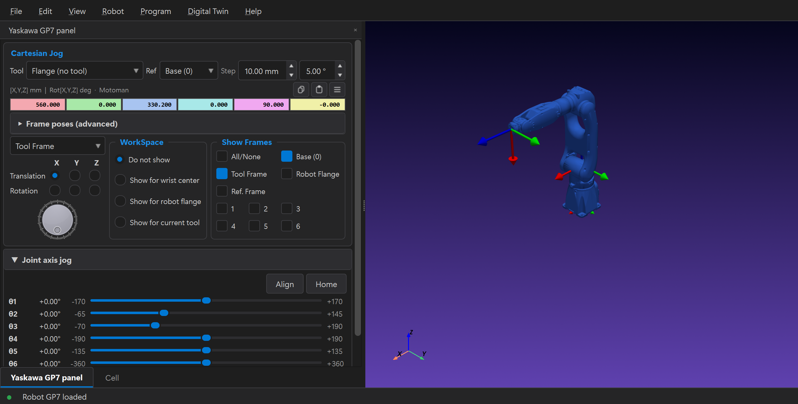</p>

Giao diện gồm bốn vùng:

1. **Menu bar** (trên cùng) — File · Edit · View · Robot · Program · Digital Twin ·
   Help. Toàn bộ chức năng truy cập từ đây (§10).
2. **Khung nhìn 3D** (giữa) — viewport VTK hiển thị cell: robot, bàn, gripper, vật,
   camera và các frame. Điều hướng bằng chuột (§1.3, Phụ lục B).
3. **Cụm dock panel** (hai bên) — Cell, Yaskawa GP7 panel, Program, Camera (D455),
   Digital Twin. Mỗi panel có thể nổi, gộp tab hoặc kéo thả. Tab đang chọn hiện ở thanh
   dưới cụm dock (Cell · Yaskawa GP7 panel · Program · Camera).
4. **Status bar** (dưới cùng) — thông báo trạng thái thao tác gần nhất, phân màu theo
   mức: xanh (thành công), vàng (cảnh báo), đỏ (lỗi).

Hiện/ẩn panel bằng **View → Window** (panel Digital Twin mở từ menu **Digital Twin**).
Mặc định chỉ hiển thị panel **Cell**; bật các panel khác khi cần: jog dùng **Controls
panel** (§2), lập trình dùng **Program panel** (§7), thị giác dùng **Camera (D455)** (§8).

### 1.3. Điều hướng khung nhìn 3D

<p align="center">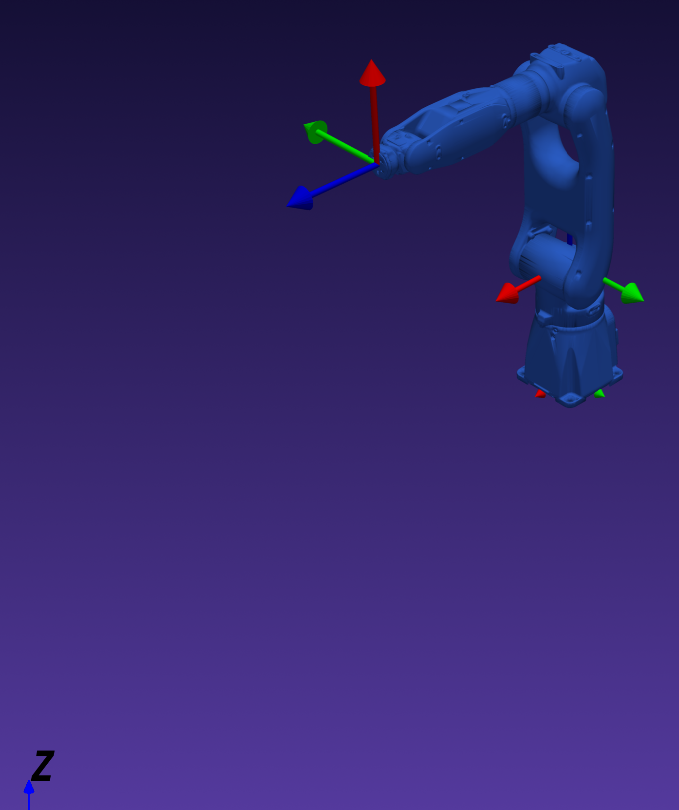</p>

Khung nhìn dùng điều khiển trackball tiêu chuẩn:

| Thao tác chuột | Kết quả |
|---|---|
| Trái + kéo | Xoay (orbit) quanh tâm scene |
| Giữa + kéo | Tịnh tiến (pan) |
| Phải + kéo, hoặc lăn chuột | Phóng to / thu nhỏ (zoom) |

Chọn góc nhìn nhanh qua **View → Camera**: **Iso** `Alt+1`, **Top** `Alt+2`, **Front**
`Alt+3`, **Back** `Alt+4`, **Right** `Alt+5`, **Left** `Alt+6`, **Fit all** `Alt+7`.
Bật/tắt phối cảnh bằng **View → Camera → Perspective view**.

---

## §2. Robot Panel — Jog robot

Mở bằng **View → Window → Controls panel**; dock hiển thị tiêu đề **Yaskawa GP7 panel**.
Panel dùng để di chuyển robot bằng tay (jog) phục vụ teach pose, gồm ba nhóm từ trên
xuống: **Cartesian Jog**, **Joint axis jog**, **Other configurations**.

Panel chỉ hoạt động sau khi đã **File → Load Robot GP7**. Nguyên tắc jog: chọn một trục
(Cartesian) hoặc kéo một khớp (Joint), rồi dùng núm hoặc slider để di chuyển; pose hiện
tại cập nhật trực tiếp ở dòng pose TCP. Ba nhóm của panel mô tả lần lượt ở §2.1–§2.3.

### 2.1. Joint axis jog — di chuyển theo từng khớp

<table>
<tr>
<td width="460">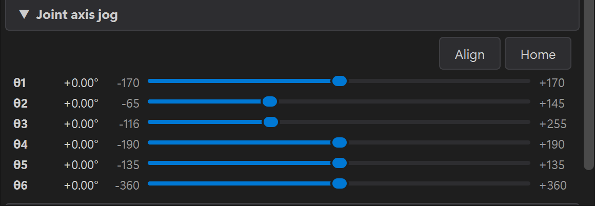</td>
<td valign="top">

Điều khiển trực tiếp 6 khớp θ1…θ6.

- **6 slider θ1…θ6** — kéo để đổi góc từng khớp; mỗi hàng hiển thị giá trị hiện tại và
  giới hạn min/max của khớp.
- **Home** — đưa robot về tư thế home (`home_joints` của cell).
- **Align** — căn hướng công cụ theo Reference Frame. Lệnh giữ nguyên vị trí điểm TCP,
  xoay cổ tay để hệ trục công cụ thẳng hàng với reference frame (snap về cấu hình trục
  gần nhất), giải IK rồi di chuyển. Status hiển thị frame đích và góc xoay, ví dụ
  `Align → tool ⟂ 'Base' (Δ=12°)`. Nếu công cụ đã thẳng hàng (góc dưới 0.5°), lệnh báo
  và không di chuyển.

</td>
</tr>
</table>

### 2.2. Cartesian Jog — di chuyển theo toạ độ Đề-các

<table>
<tr>
<td width="460">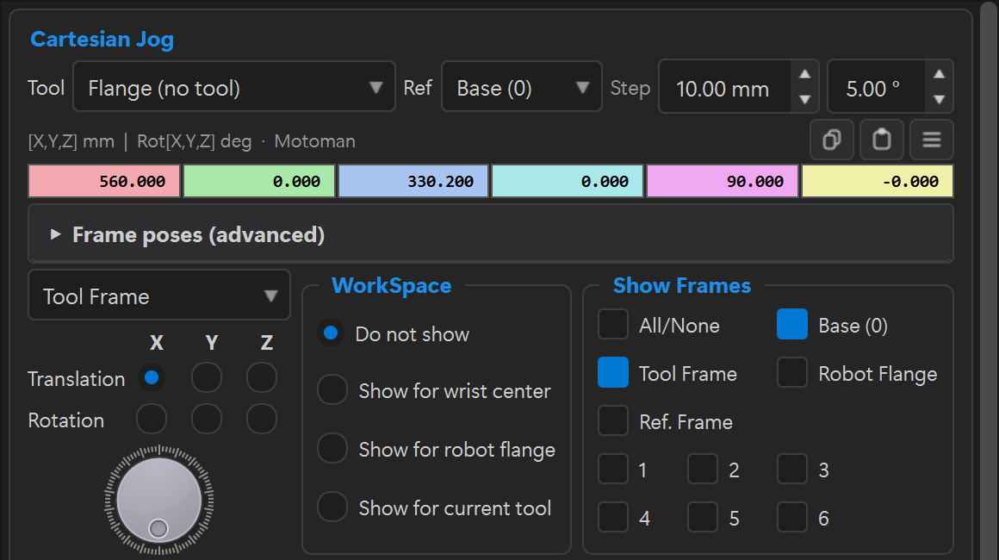</td>
<td valign="top">

Di chuyển TCP theo trục X/Y/Z (tịnh tiến) hoặc Rx/Ry/Rz (xoay).

- **Hàng cấu hình:**
  - **Tool** — chọn hệ toạ độ công cụ đang điều khiển (§3).
  - **Ref** — chọn hệ quy chiếu để jog: **Base (0)** hoặc frame tự thêm (§4).
  - **Step mm** — bước tịnh tiến mỗi lần jog (0.1–500 mm).
  - **Step °** — bước xoay mỗi lần jog (0.1–90°).
- **Dòng pose TCP** — sáu ô hiển thị pose hiện tại `[X, Y, Z, Rx, Ry, Rz]`, cập nhật
  trực tiếp.
- **Frame poses (advanced)** — mục gập, hiển thị thêm pose của Tool/Flange và
  Reference/Base.
- **Jog control:**
  - Lưới radio 2 hàng × 3 cột — **Translation** (X/Y/Z) và **Rotation** (X/Y/Z); chọn
    một trục để jog.
  - **Núm xoay (dial)** — xoay phải tăng, xoay trái giảm; mỗi nấc tương ứng một bước
    (theo Step).

</td>
</tr>
</table>

### 2.3. WorkSpace và Show Frames

<table>
<tr>
<td width="460">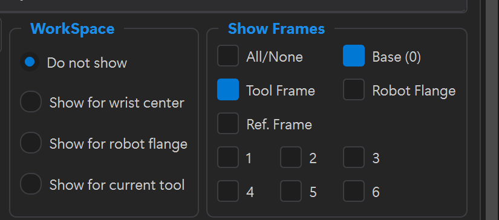</td>
<td valign="top">

**WorkSpace** hiển thị vùng với tới (reach envelope) của robot để đánh giá vị trí đặt
phôi và target. Bốn lựa chọn theo điểm ngọn: *Do not show*, *Show for wrist center*,
*Show for robot flange*, *Show for current tool*.

**Show Frames** bật/tắt hiển thị các bộ trục: **All/None**, **Base (0)**, **Tool Frame**,
**Robot Flange**, **Ref. Frame**, và **J1…J6** (frame từng khớp).

</td>
</tr>
</table>

Envelope được tính bằng forward-kinematics trên mô hình URDF: tại mỗi hướng quanh trục
J1, hệ thống lấy biên ngoài `rmax(z)` và biên trong `rmin(z)` của vùng `(r, z)` với tới
được theo đúng giới hạn khớp, rồi dựng **một khối tròn xoay 360° hình "quả thận"** — vỏ
ngoài là tầm với tối đa, ở giữa có **hốc lõm R233** (vùng gần trục J1 mà điểm P không với
tới tới). Biên trong được làm trơn thành một bướu lõm duy nhất khép về trục ở đỉnh/đáy
(thay vì biên FK thô bị "thủng" lỗ chỗ gần tâm). Khớp với bản vẽ datasheet **HW1483944
Fig 5-3(b)**.

<table>
<tr>
<td width="360">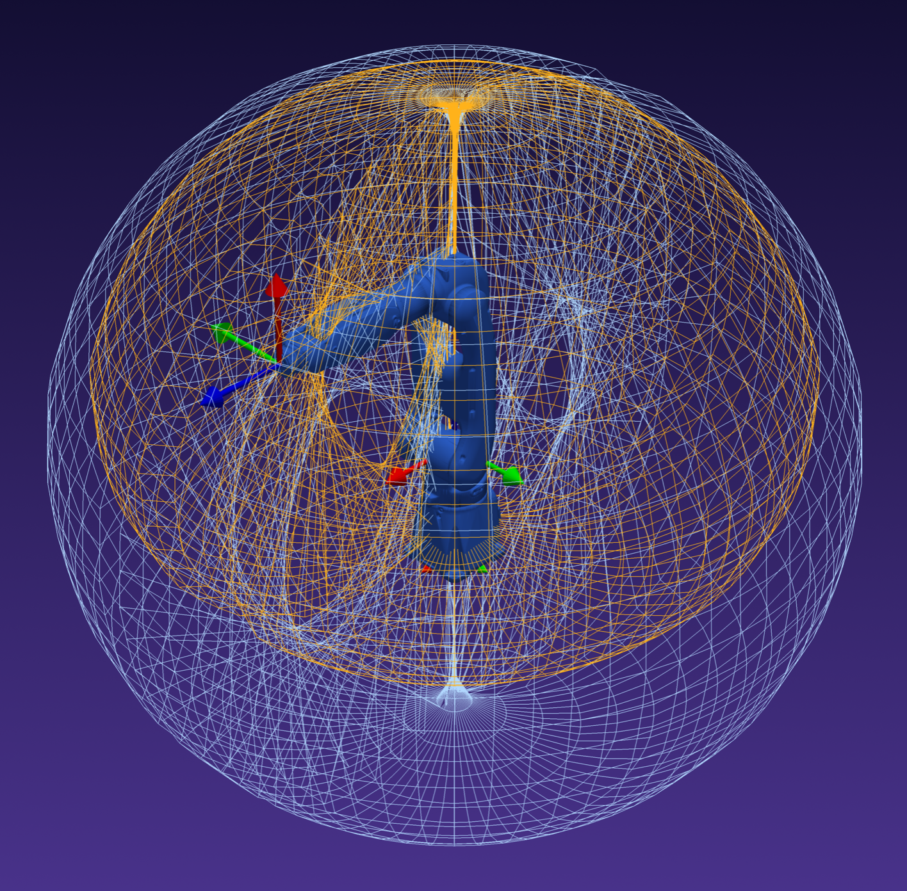</td>
<td valign="top">

- **vỏ ngoài (outer)** — tầm với ngang tối đa ≈ **927 mm** (R927), đỉnh ≈ **1217 mm**,
  đáy ≈ **−476 mm** so với mặt sàn đế (khớp datasheet GP7); móp nhẹ ở phía sau robot.
- **lõm trong (inner void)** — hốc lõm **R233** quanh trục J1: gần trục nhất ≈ 233 mm ở
  khoảng giữa, khép dần về trục ở đỉnh và đáy (nơi cánh tay duỗi thẳng / gập xuyên qua tâm).

</td>
</tr>
</table>

> ℹ️ Hình `workspace_envelope.png` minh hoạ — nếu là ảnh chụp bản 2-mặt cũ thì chụp lại
> mặt mới (vỏ quả-thận + 1 void thuôn ở giữa) để khớp mô tả.

**Kiểm tra độ chính xác envelope**

Chạy script đối chiếu mesh với forward-kinematics độc lập tại 8 hướng:

```powershell
.venv\Scripts\python.exe scripts\check_workspace.py
```

Hoặc chạy test hồi quy:

```powershell
.venv\Scripts\python.exe -m pytest tests\test_reach_envelope.py::TestWorkspaceMatchesFK -v
```

Đối chiếu trực quan trong ứng dụng (bật *Show for wrist center*):

| Thao tác | Kết quả mong đợi |
|---|---|
| Duỗi thẳng tay ra trước | cổ tay chạm vỏ ngoài ở ≈ 927 mm (R927) |
| Vươn ra sau xa nhất | outer móp vào ở phía sau |
| Duỗi thẳng đứng lên | đỉnh envelope ≈ 1217 mm trên sàn đế |
| Chúi tay xuống hết (L≈+145°) | đáy envelope ≈ −476 mm dưới sàn đế |
| Đưa cổ tay vào sát trục ở khoảng giữa | dừng ở rìa lõm trong ≈ 233 mm từ trục (R233) |
| Mọi tư thế hợp lệ | cổ tay luôn nằm trong khối envelope (không ra ngoài, không vào hốc lõm) |

Điều kiện đúng: mọi điểm robot với tới được đều nằm trong vỏ ngoài và ngoài hốc lõm R233.

---

## §3. Robot Tool (TCP)

Tool / TCP (Tool Center Point) là điểm công tác ở đầu công cụ, định nghĩa độ lệch
(offset) so với mặt bích robot. Mọi pose Cartesian và lệnh MoveL đều tính theo TCP đang
chọn.

<table>
<tr>
<td width="260">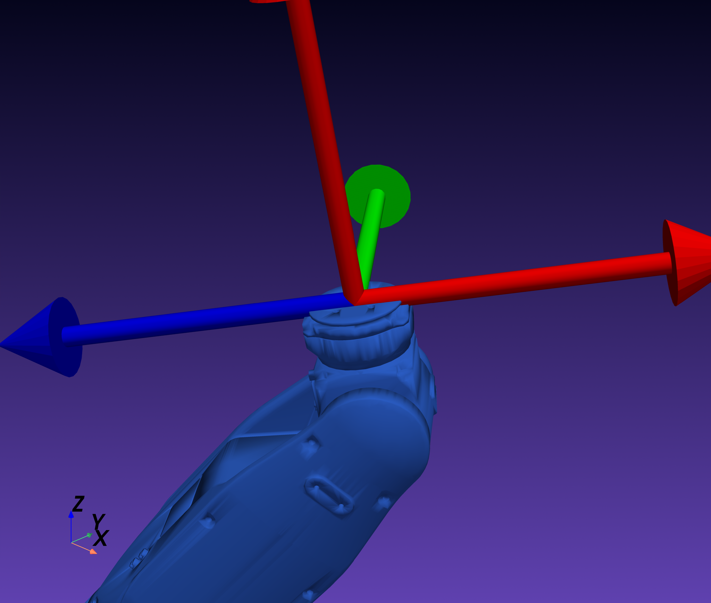</td>
<td valign="top">

- **Tool selector** (mục **Tool** trong hàng cấu hình Cartesian Jog) — chọn tool frame
  điều khiển; đổi tool làm dòng pose TCP và hướng jog đổi theo.
- **Add Gripper…** (**Edit → Add Gripper…** hoặc menu chuột phải trên cây Cell) — gắn kẹp
  vào mặt bích và đặt TCP offset; kẹp bám theo robot khi jog. TCP đặt ở đầu công cụ —
  ảnh bên hiện hệ trục TCP (đỏ X, lục Y, lam Z) ngay tại điểm công tác.
- **TL#** (Tool number, 0–15) — lệnh modal **+ Tool** trong Program panel (§7) đặt số
  tool áp cho các lệnh MOV phía sau và ghi vào `.JBI`.

</td>
</tr>
</table>

Trong mô phỏng, TL# chỉ là metadata ghi vào `.JBI`. Trên robot thật, controller dùng
tool đã cấu hình sẵn (mặc định **TOOL01**).

---

## §4. Reference Frame

Reference Frame (user frame) là hệ trục toạ độ tham chiếu trong cell, phục vụ ba việc:
(1) **jog** theo trục của frame thay vì theo Base — di chuyển song song mặt bàn/đồ gá;
(2) **đặt vật và frame con** theo pose tương đối (phân cấp); (3) ánh xạ tới **user frame
UF#** của controller khi xuất `.JBI`.

Danh sách frame của cell gồm **Base (0)** — gốc robot, cố định, không xoá được — và các
frame tự thêm (nạp từ cell YAML hoặc tạo bằng **Add Frame**).

<p align="center">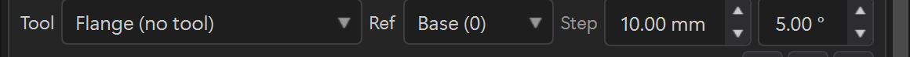</p>

<table>
<tr>
<td width="220">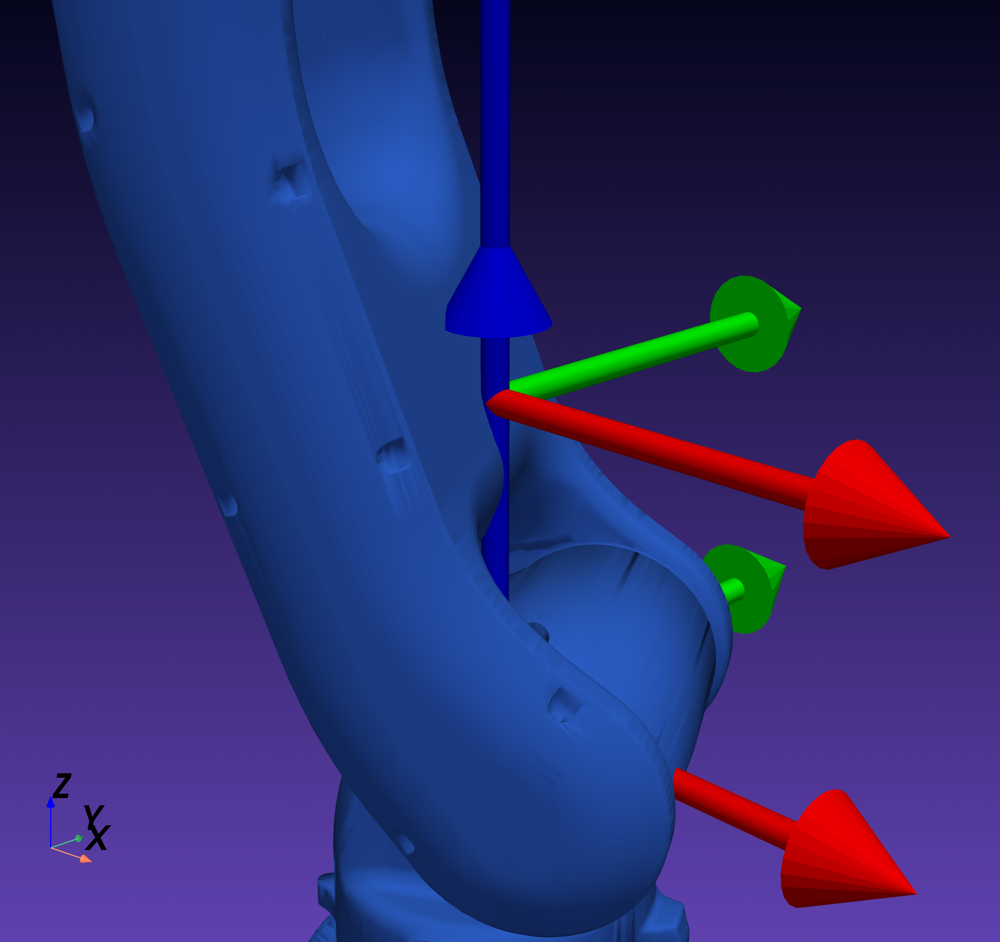</td>
<td valign="top">

- **Ref selector** (mục **Ref** trong hàng cấu hình Cartesian Jog) — chọn frame tham
  chiếu đang hoạt động: **Base (0)** hoặc một frame tự thêm. Khi jog ở chế độ tham chiếu,
  trục X/Y/Z đi theo frame này; pose theo frame xem ở mục **Frame poses (advanced)**.
- **Show Frames → Ref. Frame** — hiện hệ trục của frame đang chọn trong viewport (ảnh
  bên: triad đỏ X · lục Y · lam Z ở đế robot).
- **UF#** (User frame number, 0–15) — lệnh modal **+ Frame** (§7.4) đặt user frame áp cho
  các lệnh MOV phía sau và ghi vào `.JBI`; controller Yaskawa dùng UF# đã setup trên pendant.

</td>
</tr>
</table>

**Tạo / sửa / xoá frame** — **Edit → Add Frame…** hoặc menu chuột phải trên cây Cell:

<table>
<tr>
<td width="320">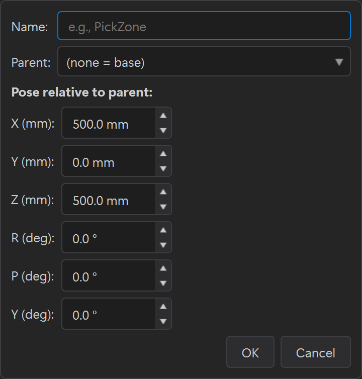</td>
<td valign="top">

- **Name** — tên frame (ví dụ `PickZone`), không được trùng.
- **Parent** — frame cha: *(none = base)* hoặc một frame khác. Khi có frame cha, pose
  tính **tương đối frame cha** (phân cấp kiểu RoboDK) — di chuyển/sửa frame cha thì các
  frame con đi theo.
- **Pose relative to parent** — `[X, Y, Z]` (mm) và `[Rx, Ry, Rz]` (độ). Mặc định đặt
  trên mặt **worktable** nếu có (vị trí teach thường gặp), nếu không thì `(500, 0, 500)`.
- **Edit…** (chuột phải frame trong cây Cell → Edit) — sửa pose; đổi tên thì xoá rồi
  thêm lại.
- **Delete** — xoá frame.

</td>
</tr>
</table>

Frame mới xuất hiện ngay trong **Ref selector** và **cây Cell**; lưu vĩnh viễn bằng
**File → Save Cell to YAML…**. Ứng dụng thường gặp: đặt một frame trùng mặt bàn/đồ gá rồi
jog theo frame đó để di chuyển song song mặt phẳng; nút **Align** (§2.1) căn trục công cụ
vuông góc theo frame đang chọn.

---

## §5. Robot Target

Target là một tư thế robot (joints + TCP pose) có tên, cho phép nhiều lệnh MoveJ/MoveL
cùng tham chiếu — chỉnh một chỗ thì mọi lệnh dùng target đó cập nhật theo. Khi Import
`.JBI`, mỗi P-var/C-var trở thành một target. Nhóm **Targets** nằm trong Program panel (§7).

<table>
<tr>
<td width="430">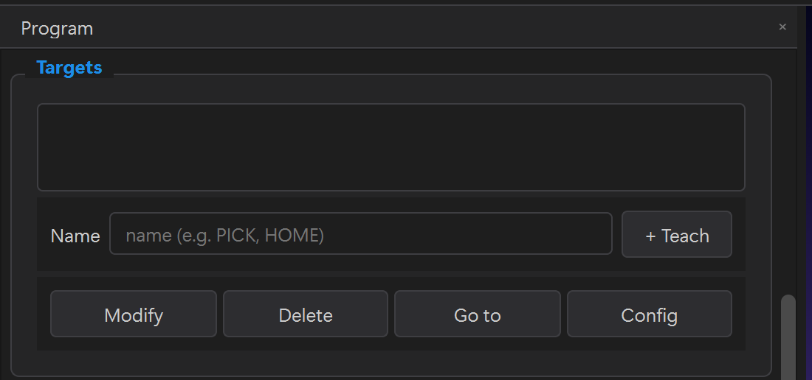</td>
<td valign="top">

- **Khung danh sách** — liệt kê target dạng `TÊN [j1…j6]` (độ).
- **Name** + **+ Teach** `Ctrl+T` — tạo target mới từ tư thế robot hiện tại.
- **Modify** `F3` — cập nhật target đang chọn bằng tư thế hiện tại.
- **Delete** — xoá target (cảnh báo nếu đang có MoveJ/MoveL tham chiếu).
- **Go to** — di chuyển robot tới target để xem trước (không thêm lệnh).
- **Config** `F4` — chọn cấu hình IK khác cho cùng vị trí TCP (§6).

Nút tạo lệnh đi tới target (**+ MoveJ →** / **+ MoveL →**) nằm ở tab **Motion** (§7).

</td>
</tr>
</table>

Target lưu cả joints và TCP pose: MoveJ dùng joints (nhanh), MoveL dùng TCP pose (đường
thẳng); nhờ lưu cả hai nên giữ đúng cấu hình tay khi phát lại.

---

## §6. Robot Configurations

Cùng một vị trí TCP có thể đạt bằng nhiều nghiệm IK. App liệt kê đầy đủ các nghiệm, phân
biệt theo hai yếu tố.

1. **Cấu hình (configuration / assembly mode)** — tối đa 8 vùng tư thế theo ba cờ:
   Front/Rear, Elbow Up/Down, Flip/Non-Flip. Các cấu hình bị phân tách bởi điểm kỳ dị
   (singularity): để chuyển giữa hai cấu hình mà giữ TCP cố định, robot phải băng qua một
   singularity. Dáng cánh tay khác hẳn nhau.
2. **Biến thể xoay khớp (joint turn)** — cùng một cấu hình nhưng một khớp cuộn thêm ±360°.
   GP7 có nhiều khớp tầm rộng (J6 ±360°, J4 ±190°, J3 rộng 371°) nên một tư thế có thể đạt
   ở nhiều số vòng vẫn trong giới hạn. Đổi joint turn không băng qua singularity, dáng
   robot gần như không đổi.

Tóm tắt: cấu hình là *hình dạng* cánh tay (đổi phải qua singularity); joint turn là *số
vòng cuộn* của một khớp (đổi chỉ cần xoay khớp). Quy ước Yaskawa ghi riêng hai đại lượng:
byte cấu hình (8 cờ) và số turn từng khớp.

<p align="center">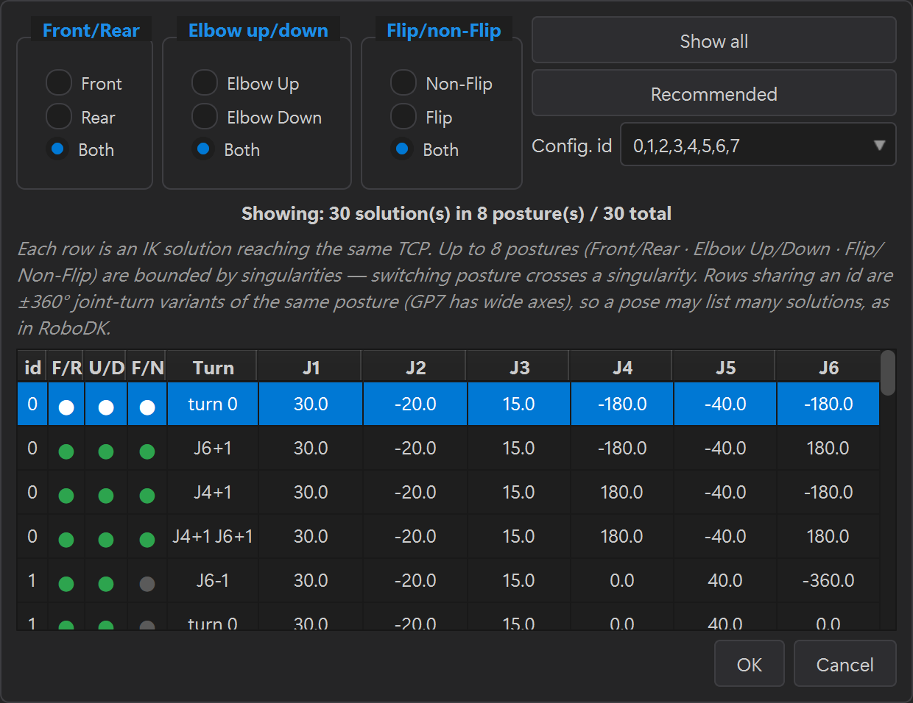</p>

Mở từ nhóm **Other configurations** (Robot Panel) hoặc nút **Config** `F4` (§5):

- **Find branches** — liệt kê tất cả nghiệm IK cho TCP hiện tại (Pieper analytical), mỗi
  dòng kèm cờ tư thế và nhãn turn. Quy ước turn: `turn 0` là nghiệm chính (góc khớp trong
  (−180°, 180°]); `J6+1` nghĩa là J6 cuộn thêm một vòng +360°. Nhiều dòng cùng `id` nhưng
  khác turn là cùng cấu hình, khác số vòng.
- **Configurations…** — bảng đầy đủ với cột **id · F/R · U/D · F/N · Turn · J1…J6**, bộ
  lọc Front/Rear · Elbow Up/Down · Flip/Non-Flip và các nút **Show all / Recommended /
  Config.id**. Dòng tóm tắt ghi số nghiệm và số tư thế.
- **Dropdown** — chọn một nghiệm để robot chuyển sang tư thế đó (giữ nguyên vị trí TCP).
  Nếu khác cấu hình (id khác) thì thao tác băng qua singularity; nếu chỉ khác turn thì không.

---

## §7. Program Panel — Lập trình INFORM

Mở bằng **View → Window → Program panel**. Panel dùng để dựng chương trình INFORM, cấu
trúc từ trên xuống: **Job selector → danh sách lệnh → thanh sửa → Targets (§5) → 4 tab
thêm lệnh → thanh chạy → hàng file**.

### 7.1. Job selector, danh sách lệnh và thanh sửa

<table>
<tr>
<td width="430">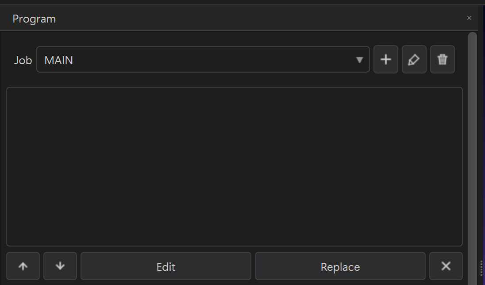</td>
<td valign="top">

**Hàng Job** — một project chứa nhiều job (chương trình con); chỉ một job đang active được
hiển thị.
- **Dropdown Job** — chọn job đang xem/sửa.
- **➕** — thêm job mới.
- **✏️** — đổi tên job (tự cập nhật mọi `CALL JOB` trỏ tới tên cũ).
- **🗑️** — xoá job (cảnh báo nếu job khác đang `CALL JOB` tới; phải còn tối thiểu một job).

**Danh sách lệnh** — các dòng INFORM đánh số `1. 2. 3…`, thụt lề theo khối IF/WHILE. Khi
chạy Sim, dòng đang chạy được tô vàng kèm dấu ▶ và tự cuộn theo. Double-click để Edit.

**Thanh sửa:**
- **↑ / ↓** — di chuyển lệnh đang chọn lên/xuống.
- **Edit** `F2` (hoặc double-click) — sửa tham số của lệnh, giữ nguyên loại lệnh.
- **Replace** — đổi loại lệnh, giữ nguyên vị trí; danh sách loại có cả các biến thể EXP
  (IfThenExp / ElseIfExp / WhileExp).
- **✕** — xoá lệnh đang chọn.

</td>
</tr>
</table>

### 7.2. Tab Motion — lệnh chuyển động

<table>
<tr>
<td width="430">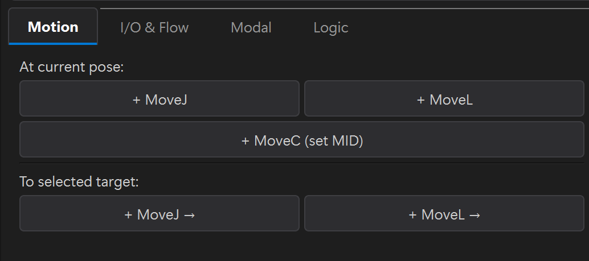</td>
<td valign="top">

**At current pose** — đi tới tư thế robot hiện tại:
- **+ MoveJ** — di chuyển khớp (nhanh, không kiểm soát quỹ đạo).
- **+ MoveL** — di chuyển thẳng trong không gian.
- **+ MoveC (set MID)** — cung tròn, thực hiện theo hai bước: lần click đầu lưu điểm MID
  (nút đổi thành "set END"), lần click sau lưu END và tạo lệnh.

**To selected target** — đi tới target đang chọn (§5):
- **+ MoveJ →** / **+ MoveL →** — tạo lệnh tham chiếu target.

</td>
</tr>
</table>

### 7.3. Tab I/O & Flow — vào/ra, định thời, gọi job

<table>
<tr>
<td width="430">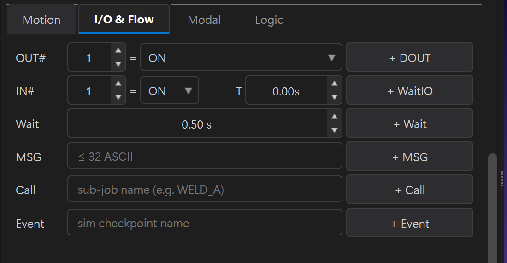</td>
<td valign="top">

- **OUT# [n] = [ON/OFF]** → **+ DOUT** — đặt ngõ ra số `OT#(n)`. Nếu n trùng
  `gripper_do_index` trong config, Sim thực thi gắp/thả vật.
- **IN# [n] = [ON/OFF] T [s]** → **+ WaitIO** — chờ tín hiệu vào; `T` là timeout, giá trị
  0 nghĩa là chờ vô hạn.
- **Wait [s]** → **+ Wait** — tạm dừng N giây (INFORM `TIMER`).
- **MSG** (≤ 32 ký tự) → **+ MSG** — hiển thị thông báo trên teach pendant.
- **Call** (tên job) → **+ Call** — gọi job con (`CALL JOB:…`).
- **Event** → **+ Event** — checkpoint chỉ dùng cho mô phỏng (SimEvent), không xuất ra
  `.JBI`.

</td>
</tr>
</table>

### 7.4. Tab Modal — trạng thái áp cho lệnh chuyển động kế tiếp

<table>
<tr>
<td width="430">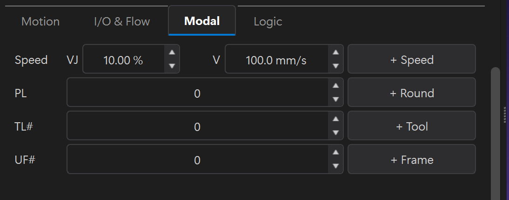</td>
<td valign="top">

Lệnh modal không gây chuyển động; nó đặt thông số áp cho mọi lệnh MOV phía sau cho tới
lệnh modal cùng loại tiếp theo. Khi export, các thông số này gộp vào tag inline trên mỗi
dòng MOV.

- **Speed** (VJ% cho khớp, V mm/s cho đường thẳng) → **+ Speed**.
- **PL** (0–8) → **+ Round** — mức bo góc (0 sắc/chính xác, 8 mượt/nhanh).
- **TL#** (0–15) → **+ Tool** — chọn hệ toạ độ tool (§3).
- **UF#** (0–15) → **+ Frame** — chọn user frame (§4).

Trong mô phỏng, SetSpeed ảnh hưởng tốc độ phát lại; Rounding/Tool/RefFrame chỉ là metadata
nhưng vẫn được ghi đúng vào `.JBI`.

</td>
</tr>
</table>

### 7.5. Tab Logic — điều khiển luồng và biến

<table>
<tr>
<td width="430">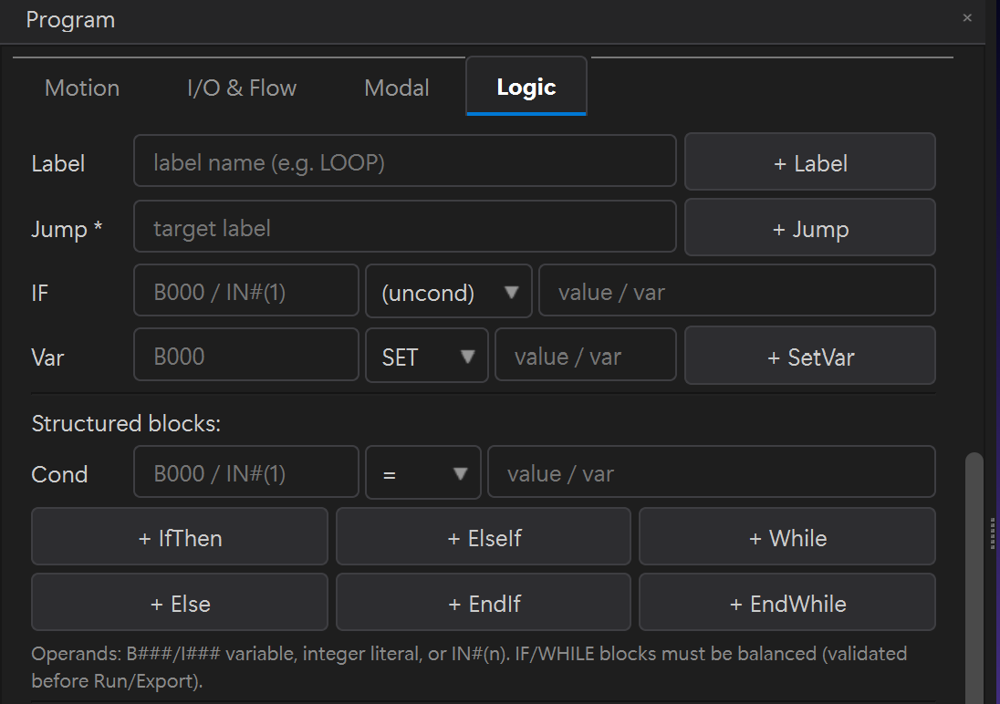</td>
<td valign="top">

Toán hạng dùng chung: biến `B###` / `I###`, số nguyên, hoặc `IN#(n)`.

**Lệnh đơn:**
- **Label** → **+ Label** — tạo nhãn `*LABEL` (đích nhảy).
- **Jump \*** (kèm điều kiện) → **+ Jump** — nhảy tới nhãn; chọn `(uncond)` để nhảy vô
  điều kiện.
- **Var** (`B000` + phép `SET/ADD/…/INC/DEC` + toán hạng) → **+ SetVar** — gán hoặc biến
  đổi biến.

**Khối có cấu trúc** (dùng ô **Cond** chung):
- **+ IfThen** / **+ ElseIf** / **+ While** — mở khối điều kiện.
- **+ Else** / **+ EndIf** / **+ EndWhile** — nhánh mặc định hoặc đóng khối.

Khối IF/WHILE phải cân bằng trước khi Run hoặc Export. Điều kiện ghép (`ANDEXP` / `OREXP`)
và dạng `IFTHENEXP` được tạo qua nút **Edit/Replace** (dialog có ô nhập điều kiện ghép và
ô chọn **EXP**).

</td>
</tr>
</table>

**Nhóm I/O & registers** (cuộn tiếp trong tab Logic — lệnh INFORM mở rộng):

<table>
<tr>
<td width="430">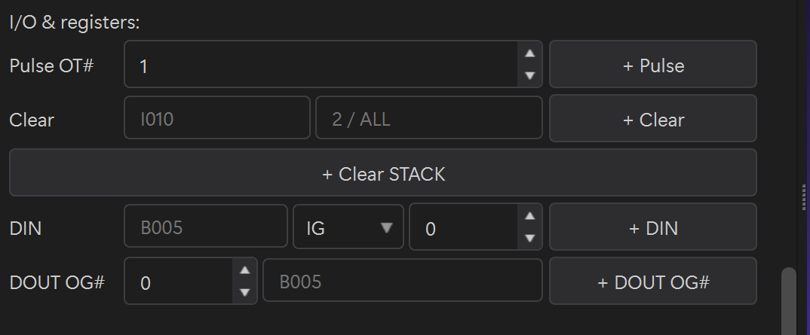</td>
<td valign="top">

- **Pulse OT#** → **+ Pulse** — xung ngõ ra tức thời `PULSE OT#(n)`.
- **Clear** (`I010` + `n / ALL`) → **+ Clear** — xoá n thanh ghi liên tiếp về 0.
- **+ Clear STACK** — xoá stack lệnh gọi.
- **DIN** (`B005` + `IG/SOUT` + nhóm) → **+ DIN** — đọc nhóm input/status vào thanh ghi.
- **DOUT OG#** (nhóm + `B005`) → **+ DOUT OG#** — ghi thanh ghi ra nhóm output.

Trong mô phỏng không có PLC: DIN đọc về 0, DOUT OG# chỉ ghi log, CLEAR thực thi thật,
PULSE kích kẹp nếu trùng gripper index. Mọi lệnh vẫn xuất đúng cú pháp ra `.JBI`.

</td>
</tr>
</table>

### 7.6. Thanh chạy và hàng file

<table>
<tr>
<td width="430">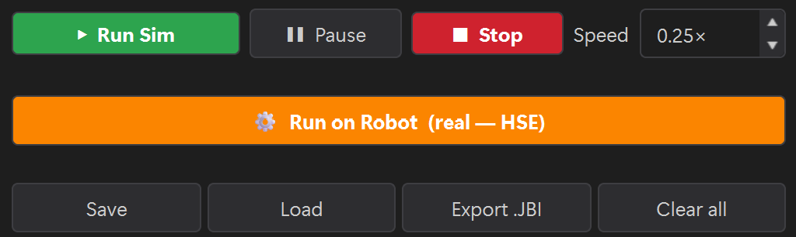</td>
<td valign="top">

**Hàng Sim** (mô phỏng):
- **▶ Run Sim** — chạy mô phỏng trên robot ảo.
- **▮▮ Pause** — tạm dừng / tiếp tục.
- **■ Stop** — dừng sim, đồng thời E-stop robot thật (servo OFF).
- **Speed** — hệ số tốc độ phát lại (0.25×–5×).

**Hàng robot thật:**
- **⚙ Run on Robot (real — HSE)** — nạp và chạy thật trên YRC1000; robot sẽ chuyển động,
  có dialog an toàn (§11).

**Hàng file:**
- **Save** — lưu project (mọi job + targets) ra `.json`.
- **Load** — mở project `.json`.
- **Export .JBI** — xuất job ra `.JBI` cho robot.
- **Clear all** — xoá toàn bộ và reset về MAIN rỗng (có xác nhận).

</td>
</tr>
</table>

Phân biệt định dạng: `.json` là định dạng project nội bộ (giữ nhiều job, targets, cấu hình
post-processor và văn bản gốc) để mở lại trong ứng dụng; `.JBI` là định dạng INFORM nạp lên
robot. Job import từ `.JBI` mà chưa chỉnh sửa sẽ được Export lại giống hệt file gốc đến từng
byte. Cấu trúc chi tiết file `.json` (schema từng lệnh): xem
[`HUONG_DAN_LAP_TRINH.md` §12](HUONG_DAN_LAP_TRINH.md#12-định-dạng-project-json-kiến-trúc-chương-trình).

### 7.7. Chương trình đầu tiên

Mục tiêu: HOME → PICK → đóng kẹp → HOME. Khi **Run Sim**, robot ảo chạy theo quỹ đạo
HOME → PICK → về HOME (đường nét đỏ là đường đi mô phỏng của TCP).

<p align="center">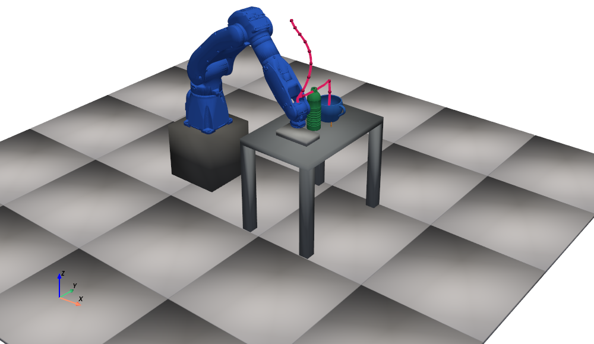</p>

1. **File → Load Robot GP7**.
2. **View → Window** — bật **Controls panel** và **Program panel**.
3. Teach HOME: jog robot về tư thế mong muốn, nhập tên `HOME`, bấm **+ Teach** `Ctrl+T`.
4. Teach PICK: jog tới vị trí gắp, nhập tên `PICK`, bấm **+ Teach**.
5. Dựng chuỗi lệnh:
   - Chọn `HOME` trong Targets → tab **Motion** → **+ MoveJ →** (tạo MOVJ HOME).
   - Chọn `PICK` → **+ MoveJ →** (tạo MOVJ PICK).
   - Tab **I/O & Flow**: OUT# = 1, chọn **ON**, bấm **+ DOUT** (đóng kẹp).
   - Tab **I/O & Flow**: **+ Wait** 0.3 s.
   - Chọn `HOME` → **+ MoveJ →** (về home).
6. Bấm **▶ Run Sim** (giảm **Speed** để quan sát rõ).
7. **File → Save program (.json)** `Ctrl+S`.
8. **File → Export .JBI** để có file nạp cho YRC1000.
9. Vận hành thật: **⚙ Run on Robot (real — HSE)** (§11).

---

## §8. Camera và dẫn hướng thị giác

Mở bằng **View → Window → Camera (D455)**.

<table>
<tr>
<td width="250">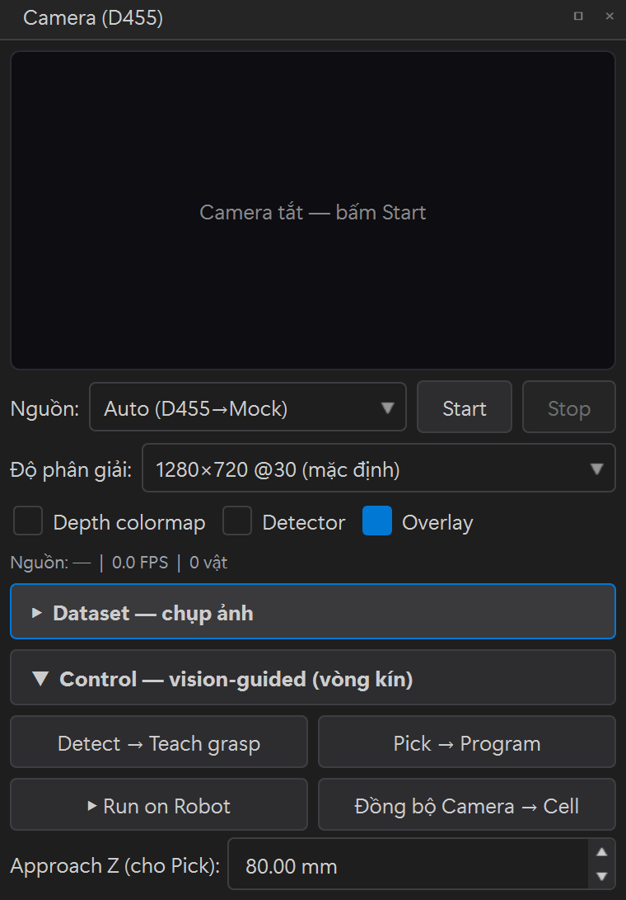</td>
<td valign="top">

1. **Source + Start** — chọn nguồn ở combo **Source** (**Auto (D455→Mock)**, **D455**,
   hoặc **Mock**) rồi bấm **Start**. Khi không có D455, hệ thống tự dùng Mock. Bấm **Stop**
   để dừng. Đổi **Resolution** cần Stop rồi Start lại để áp dụng.
2. **Toggle hiển thị** — **Depth colormap**, **Detector**, **Overlay**. Đổi Detector cần
   Stop rồi Start để nạp model mới.
3. **Dataset — capture images** (mục gập) — chọn **Class** (nút **Manage…** định nghĩa
   danh sách lớp và lưu vào cell), tuỳ chọn **Save depth (.npy)**, bấm **📷 Capture**.
4. **Control — vision-guided (closed-loop)** — **Detect → Teach grasp** (vật → grasp pose →
   IK → target), **Pick → Program** (chèn chuỗi approach → grasp → đóng kẹp → nhấc),
   **▶ Run on Robot**, **Sync Camera → Cell** (ghi pose + intrinsics, vẽ frustum).

</td>
</tr>
</table>

Sau **Sync Camera → Cell**, frustum (nón nhìn) hiển thị trong viewport:

<table>
<tr>
<td width="380">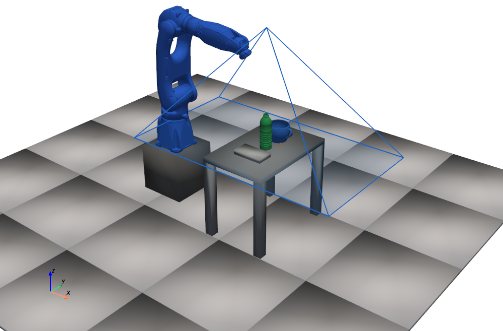</td>
<td valign="top">

Điều kiện trước khi Teach grasp: đã **Load Robot GP7** (cho IK) và có
`config/calibration/T_base_camera.npy` (sinh bằng `calibration_from_layout.py` cho mô
phỏng, hoặc `02_run_calibration.py` cho robot thật).

Dialog Manage classes có các nút: **＋ Add**, **✎ Edit**, **－ Delete**, **↑ Up**,
**↓ Down**, **OK**, **Cancel**.

</td>
</tr>
</table>

---

## §9. Teach on Surface

Tạo target bằng cách click trực tiếp lên bề mặt vật thể trong scene 3D.

<table>
<tr>
<td width="260">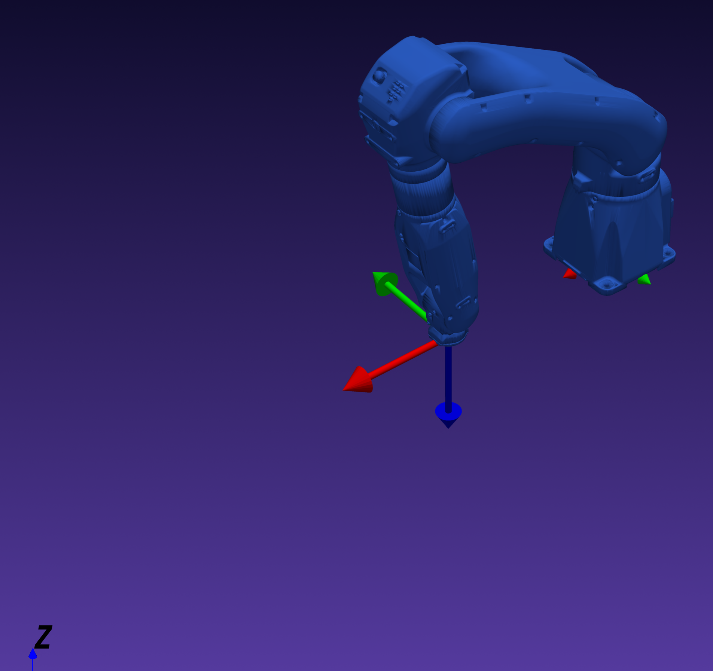</td>
<td valign="top">

- **Bật:** `Ctrl+Shift+T` hoặc **Robot → Teach on surface** (xám khi chưa nạp robot).
- **Sử dụng:** click vào mesh trong scene; hệ thống raycast lấy điểm và pháp tuyến bề mặt,
  giải IK, tạo target với trục Z của TCP vuông góc bề mặt.
- **Tắt:** bấm `Ctrl+Shift+T` lần nữa.

</td>
</tr>
</table>

Nếu target tạo ra có cấu hình tay bất tiện, dùng **Config** `F4` (§6) để chọn cấu hình
khác cho cùng điểm.

---

## §10. Hệ thống menu

<table>
<tr>
<td width="230">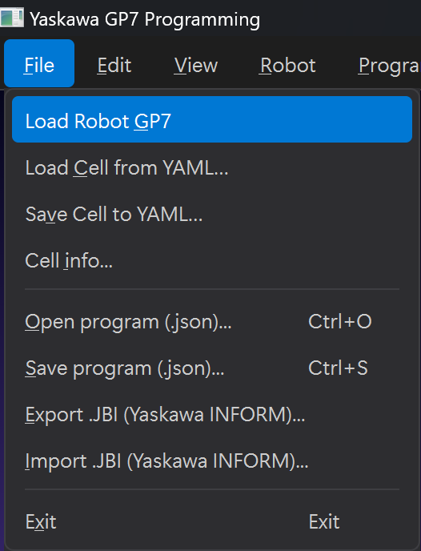</td>
<td valign="top">

**File**
- **Load Robot GP7** — nạp robot GP7 vào scene.
- **Load Cell from YAML…** — nạp cell từ file `.yaml`.
- **Save Cell to YAML…** — lưu cell hiện tại ra `.yaml`.
- **Cell info...** — xem thông tin cell (frames, objects, base pose).
- **Open program (.json)...** `Ctrl+O` — mở chương trình đã lưu.
- **Save program (.json)...** `Ctrl+S` — lưu chương trình (mọi job + targets) ra `.json`.
- **Export .JBI (Yaskawa INFORM)...** — xuất chương trình ra file nạp cho YRC1000.
- **Import .JBI (Yaskawa INFORM)...** — nạp file `.JBI` để xem/sửa/mô phỏng; tự nạp các
  sub-job được `CALL JOB` trong cùng thư mục.
- **Exit** `Ctrl+Q`.

</td>
</tr>
</table>

<table>
<tr>
<td width="150">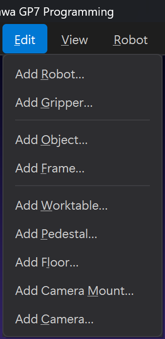</td>
<td valign="top">

**Edit** — thiết kế cell (trùng menu chuột phải trên cây Cell).
- **Add Robot…** — thêm robot (variant GP7, base pose, home joints).
- **Add Gripper…** — gắn kẹp vào mặt bích, đặt TCP offset (§3).
- **Add Object…** — thêm vật thể để gắp (mesh + pose).
- **Add Frame…** — thêm frame tham chiếu (§4).
- **Add Worktable…** — thêm bàn làm việc (tối đa một).
- **Add Pedestal…** — thêm bệ đỡ robot (tối đa một).
- **Add Floor…** — thêm sàn (tối đa một).
- **Add Camera Mount…** — thêm giá đỡ camera (tối đa một).
- **Add Camera…** — thêm camera (pose + intrinsics + frustum) (§8).

</td>
</tr>
</table>

<table>
<tr>
<td width="390">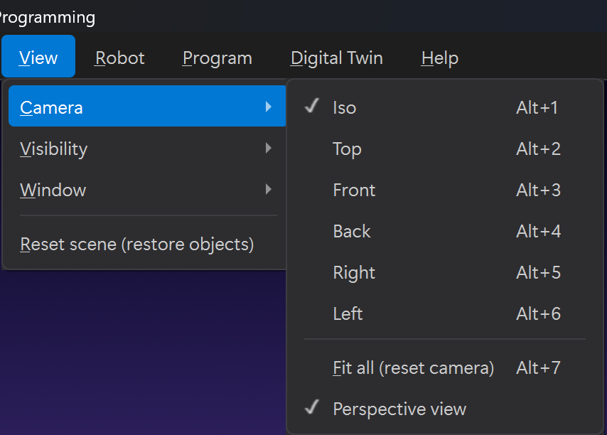</td>
<td valign="top">

**View → Camera** — góc nhìn viewport 3D.
- **Iso** `Alt+1` · **Top** `Alt+2` · **Front** `Alt+3` · **Back** `Alt+4` ·
  **Right** `Alt+5` · **Left** `Alt+6`.
- **Fit all (reset camera)** `Alt+7` — khung lại toàn scene.
- **Perspective view** — bật/tắt phối cảnh (✓ là đang bật).

</td>
</tr>
</table>

<table>
<tr>
<td width="320">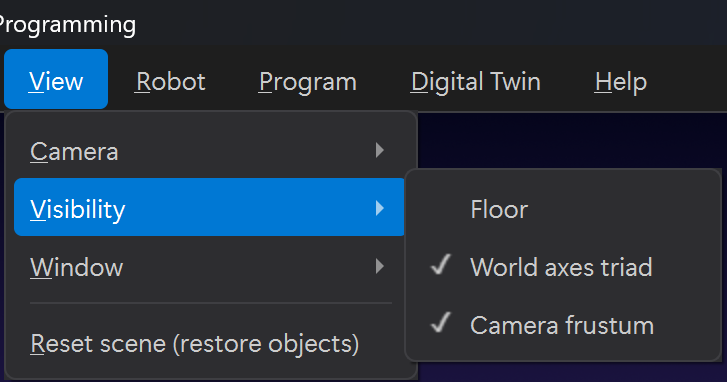</td>
<td valign="top">

**View → Visibility** — bật/tắt hiển thị (✓ là đang hiện).
- **Floor** — mặt sàn.
- **World axes triad** — bộ trục toạ độ thế giới (X/Y/Z gốc).
- **Camera frustum** — nón nhìn của camera trong scene.

</td>
</tr>
</table>

<table>
<tr>
<td width="390">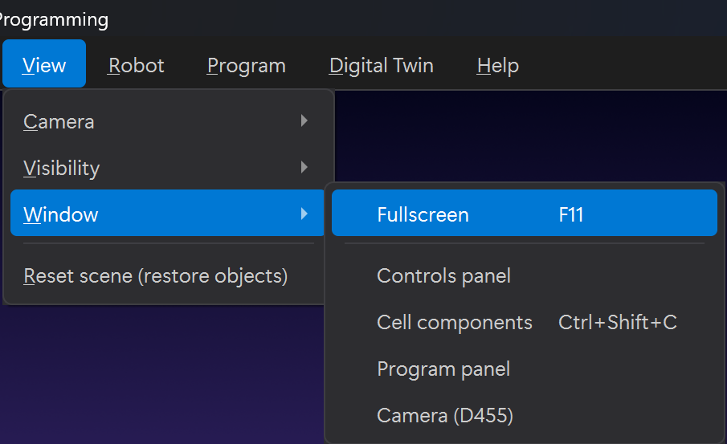</td>
<td valign="top">

**View → Window** — hiện/ẩn cửa sổ và panel.
- **Fullscreen** `F11`.
- **Controls panel** — panel jog robot (§2).
- **Cell components** `Ctrl+Shift+C` — panel cây Cell (§12).
- **Program panel** — panel lập trình (§7).
- **Camera (D455)** — panel camera và vision (§8).

</td>
</tr>
</table>

**View → Reset scene (restore objects)** — đưa vật về vị trí ban đầu sau khi đã gắp hoặc
di chuyển.

<table>
<tr>
<td width="190">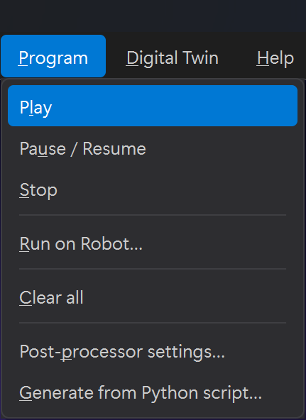</td>
<td valign="top">

**Robot**
- **Home** — về tư thế home.
- **Zero** — đưa tất cả khớp về 0°.
- **Parameters (URDF/DH)...** — xem tham số động học (link, joint, limit).
- **Teach on surface** `Ctrl+Shift+T` — bật chế độ click mesh tạo target (§9).
- **Connection settings... (HSE IP)** — cấu hình và kiểm tra kết nối YRC1000 (§11).
- **⬇ Send current pose to REAL robot (HSE move)** — điều khiển trực tiếp *rời rạc*
  (Phase 1): gửi pose hiện tại xuống robot thật, 1 lần/lần bấm (§11.3).
- **◀▶ Live jog → REAL robot (streaming HSE)** — điều khiển trực tiếp *liên tục*
  (Phase 2): bật để mọi thao tác jog stream xuống robot thật như RoboDK (§11.3).

</td>
</tr>
</table>

<table>
<tr>
<td width="190"></td>
<td valign="top">

**Program** — trùng các nút trên thanh chạy của Program panel (§7.6).
- **Play** — chạy mô phỏng.
- **Pause / Resume** — tạm dừng / tiếp tục.
- **Stop** — dừng sim (và E-stop robot thật nếu đang chạy).
- **Run on Robot…** — chạy thật qua HSE, có dialog an toàn (§11).
- **Clear all** — xoá toàn bộ lệnh và targets.
- **Post-processor settings…** — đặt `max_speed_pct`, VJ/V mặc định cho `.JBI`.
- **Generate from Python script…** — mở editor sinh lệnh bằng Python
  ([`HUONG_DAN_LAP_TRINH.md` §4](HUONG_DAN_LAP_TRINH.md)).

</td>
</tr>
</table>

<table>
<tr>
<td width="160">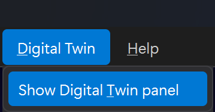</td>
<td valign="top">

**Digital Twin**
- **Show Digital Twin panel** — mở dock Digital Twin (mirror robot thật và chạy thí
  nghiệm pick-place tự động) (§11).

</td>
</tr>
</table>

**Help → About...** — thông tin phiên bản ứng dụng và động học GP7.

---

## §11. Vận hành robot thật (HSE) và Digital Twin

### 11.1. Kết nối và chạy một job

<table>
<tr>
<td width="180">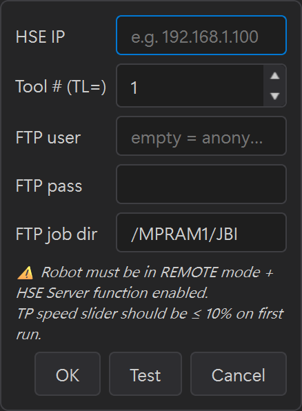</td>
<td valign="top">

1. **Robot → Connection settings... (HSE IP)** — mở dialog **Robot connection (HSE)**:
   nhập IP YRC1000, tool#, FTP; bấm **Test** (heartbeat, đọc joints, kiểm tra alarm).
2. **⚙ Run on Robot (real — HSE)** (thanh chạy) hoặc **Program → Run on Robot…**:
   - Hệ thống hiển thị dialog an toàn (xác nhận REMOTE mode, speed ≤ 10%, E-stop sẵn sàng).
   - Trình tự thực thi: connect → **upload job đang chọn + mọi sub-job gọi qua `CALL JOB`
     (đệ quy)** qua FTP → JOB_SELECT job chính → START → chờ hoàn tất.
   - Nếu một `CALL JOB:X` trỏ tới job **không có** trong project, app cảnh báo trước
     (job đó phải đã nằm sẵn trên controller, nếu không sẽ alarm khi chạy).
3. **■ Stop** (hoặc **Program → Stop**) — dừng khẩn cấp, servo OFF.

</td>
</tr>
</table>

Điều kiện: YRC1000 ở REMOTE mode, HSE Server bật, đã setup **TOOL01**. Chi tiết tại
[`HUONG_DAN_CAI_DAT.md` §2.9–§2.10](HUONG_DAN_CAI_DAT.md).

### 11.2. Panel Digital Twin

Mở bằng **Digital Twin → Show Digital Twin panel**. Trước khi dùng cần đã **Load Robot
GP7** và đã nhập IP ở **Robot → Connection settings...**.

<table>
<tr>
<td width="340">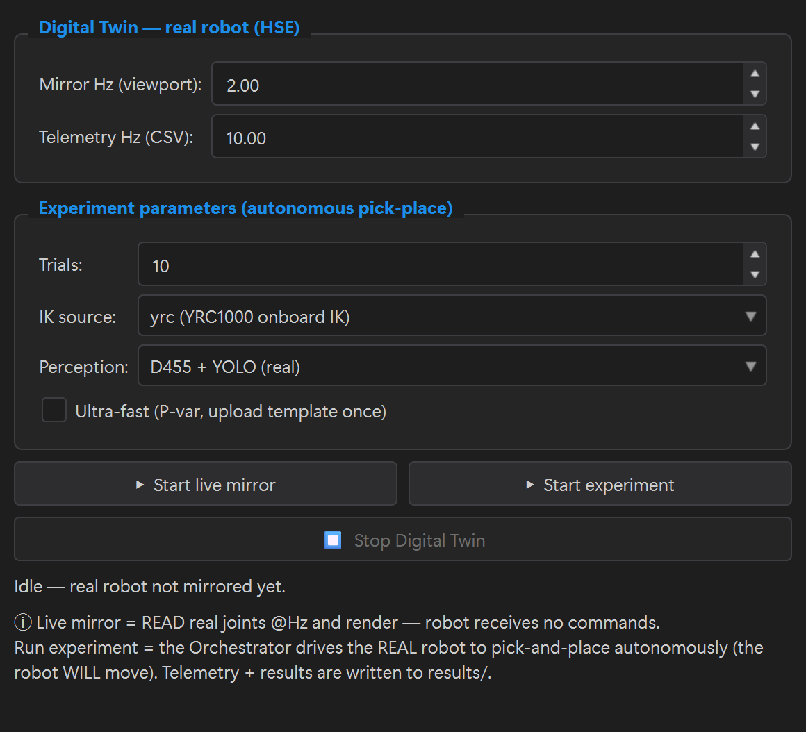</td>
<td valign="top">

**Nhóm tham số:**
- **Digital Twin — real robot (HSE)** — **Mirror Hz (viewport)** (tần số vẽ joint thật,
  mặc định 2 Hz), **Telemetry Hz (CSV)** (tần số ghi telemetry, mặc định 10 Hz).
- **Experiment parameters (autonomous pick-place)** — **Trials**, **IK source**
  (`yrc` / `client`), **Perception** (`D455 + YOLO (real)` / `Mock (dry-run test)`),
  **Ultra-fast (P-var, upload template once)**.

**Nút điều khiển:**
- **▶ Start live mirror** — chỉ đọc joint thật từ YRC1000, vẽ vào viewport theo Mirror Hz
  và ghi telemetry CSV; robot không nhận lệnh. Có dialog xác nhận.
- **▶ Start experiment** — Orchestrator điều khiển robot thật gắp-thả tự động qua
  perception; robot sẽ chuyển động và hệ thống hiển thị dialog an toàn (workspace trống,
  E-stop trong tầm tay, YRC ở PLAY/REMOTE). Cần `config/calibration/T_base_camera.npy`.
- **⏹ Stop Digital Twin** — dừng; với experiment đang chạy thì servo OFF ngay.

</td>
</tr>
</table>

Sau khi bấm **⏹ Stop Digital Twin**, robot dừng và không nhận thêm lệnh motion cho tới khi
khởi động lại; ứng dụng cũng tự dừng khi gặp alarm nghiêm trọng. Chế độ Mock dry-run vẫn khiến
robot di chuyển tới pose tính từ detection giả, do đó cần đảm bảo workspace trống. Kết quả
và telemetry được ghi vào thư mục `results/`.

### 11.3. Điều khiển trực tiếp robot thật (không cần job) — Send pose & Live jog

Ngoài cách **Run on Robot** (nạp `.JBI` rồi chạy), app có **2 chế độ điều khiển trực
tiếp** qua HSE MOVE (lệnh `0x8B`, **không nạp job**), kiểu RoboDK online control. Dùng để
**căn chỉnh nhanh / dạy điểm trên robot thật** mà không phải viết job.

Cả hai đều nằm trong menu **Robot** (xem ảnh menu ở §10):

| | **Phase 1 — Send pose** | **Phase 2 — Live jog** |
|---|---|---|
| Menu | ⬇ Send current pose to REAL robot | ◀▶ Live jog → REAL robot (toggle) |
| Kiểu | **Rời rạc** — 1 lệnh/lần bấm | **Liên tục** — stream ~8 Hz khi jog |
| Dùng khi | Đưa robot tới đúng 1 tư thế đã jog sẵn | Rà/căn robot thật theo thời gian thực |
| Servo | Bật khi gửi, giữ on sau đó | Bật khi ON, **OFF khi tắt toggle/Stop** |

> ⚠️ **AN TOÀN — đọc trước khi dùng.** Cả hai là **chuyển động thật**. Bắt buộc:
> - YRC1000 ở **REMOTE mode**, **HSE Server** bật, đã setup **TOOL**.
> - **Workspace trống**, tay luôn trên **E-stop** vật lý.
> - Tốc độ giới hạn **≤ 10%** (cap cứng trong code).
> - Streaming (Phase 2) **chưa kiểm chứng trên robot thật** → thử jog **nhỏ & chậm** trước.
> - Dừng bất kỳ lúc nào: tắt toggle · **Program → Stop** (`■`) · đóng app → đều **servo OFF**.
> - 3 nguồn lệnh (Send/Live jog · Run on Robot · Mirror/Experiment) **chặn lẫn nhau** —
>   chỉ 1 cái chạy tại một thời điểm.

#### a) Phase 1 — Send pose (rời rạc)

<table>
<tr>
<td width="300">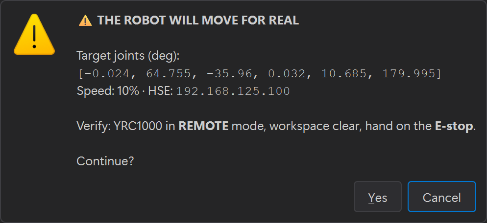</td>
<td valign="top">

**Các bước:**
1. Jog robot **ảo** (Cartesian/joint) tới tư thế mong muốn (kiểm IK/limit trong viewport).
2. **Robot → ⬇ Send current pose to REAL robot (HSE move)**.
3. Dialog an toàn hiện **joints đích (deg)**, **dòng "YRC pendant frame"** (X/Y/Z/Rx/Ry/Rz),
   **speed + IP** → kiểm rồi bấm **Yes**. (Chạy trên worker thread → UI không treo.)
4. Trình tự: connect → kiểm alarm/job → **servo ON** → **MOVE** (point-to-point @ ≤10%) → ngắt.
5. Robot đi tới pose đó **một lần**. Muốn pose khác: jog tiếp rồi bấm lại.

Bị chặn (báo "Robot busy"/"Live jog ON") nếu đang Run on Robot / Live jog / experiment.

> 💡 **Đối chiếu với teach pendant.** Dòng **"YRC pendant frame"** hiển thị pose trong
> đúng frame của controller (**BASE + quy ước TOOL**) nên **khớp 1:1 với CURRENT POSITION
> trên pendant** (đã verify HW: ≤0.1mm/0.02°). Lưu ý các giá trị này **khác** với readout
> Cartesian thường của app: app mặc định hiển thị ở frame **"Base (0)"** (lệch +154.8mm theo
> Z) và quy ước **tool0** (lệch 180° quanh trục tool). Đây chỉ là **khác cách biểu diễn
> frame** — `move_joints` gửi joints trực tiếp nên **robot luôn tới đúng pose vật lý**.
> *Joints = 0 vẫn cho pose Cartesian khác 0 (vd X560 Z485) vì đó là forward-kinematics của
> tư thế Zero — bình thường.*

</td>
</tr>
</table>

#### b) Phase 2 — Live jog (liên tục, streaming)

<table>
<tr>
<td width="300">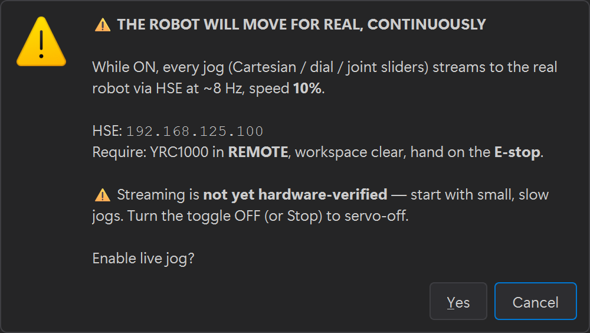</td>
<td valign="top">

**Các bước:**
1. **Robot → ◀▶ Live jog → REAL robot (streaming HSE)** — tích vào (toggle ON).
2. Dialog an toàn → **Yes**.
3. App **đọc joints thật** và **đồng bộ robot ảo về đúng pose thật** (nên cú jog đầu là
   bước nhỏ, **không** nhảy từ pose ảo bất kỳ).
4. Từ đó **mọi thao tác jog** (knob/dial Cartesian, các joint slider) được **stream xuống
   robot thật ~8 Hz** — robot bám theo như online jog của RoboDK.
5. Tắt toggle (hoặc **Stop**) → **servo OFF**.

**Cơ chế an toàn của streaming:**
- **Coalesced** (chỉ gửi pose mới nhất) → jog nhanh cỡ nào cũng **không dồn lệnh**.
- **Chặn bước nhảy > 30°**: nếu pose ảo bị "teleport" (paste/Home/load target) khi đang
  live jog → lệnh bị **chặn**, báo *"toggle off/on để đồng bộ lại"* (an toàn, không phóng robot).
- **Poll alarm** định kỳ; gặp alarm hoặc lỗi gửi → **servo OFF + tự bỏ tick** toggle.

</td>
</tr>
</table>

**Thông báo trạng thái thường gặp** (góc dưới cửa sổ):

| Thông báo | Ý nghĩa |
|---|---|
| `LIVE JOG ON @ 10% — synced to real pose` | Đã bật + đồng bộ xong, sẵn sàng jog |
| `jog step NN° > 30° BLOCKED (sim out of sync…)` | Pose ảo nhảy lớn — tắt/bật lại toggle để đồng bộ |
| `Robot busy (Run / Mirror / experiment)…` | Đang có nguồn lệnh khác — dừng nó trước |
| `move failed (…) — servo OFF, live jog OFF` | Lỗi gửi MOVE — đã servo OFF; kiểm REMOTE/mạng |
| `ALARM 0x…during jog — servo OFF` | Controller báo alarm — reset trên TP |

#### c) Xem tham số động học

Bất kỳ lúc nào, **Robot → Parameters (URDF/DH)...** mở bảng tham số (link, trục, giới hạn
khớp, flange, tool0) — tiện đối chiếu giá trị joints khi điều khiển trực tiếp.

<p align="center">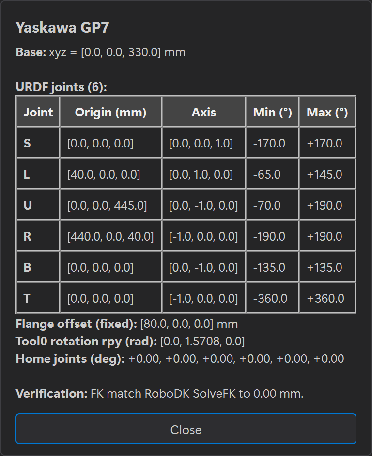</p>

---

## §12. Cell — Cây thành phần ô làm việc

Mở bằng **View → Window → Cell components** `Ctrl+Shift+C`.

<table>
<tr>
<td width="170">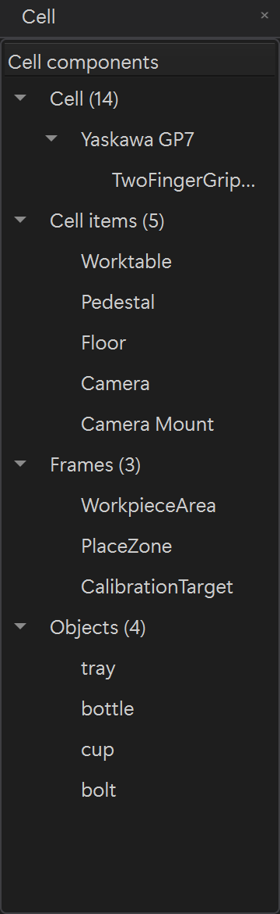</td>
<td valign="top">

Cây liệt kê các thành phần: robot, gripper, objects, frames, worktable, pedestal, floor,
camera, camera mount.

- **Thêm:** menu **Edit →** hoặc menu chuột phải trên cây → **Add
  Robot/Object/Frame/Worktable/Pedestal/Floor/Camera Mount/Camera/Gripper…**.
- **Menu chuột phải trên một thành phần:** **Edit…**, **Hide/Show**, **Move (drag in
  viewport)**, **Delete**; với robot có thêm **Edit base pose…**.
- Khi chọn **Move**, các tay nắm (handle) hiển thị trên vật trong viewport; kéo để tịnh
  tiến/xoay, sau đó dùng menu chuột phải → **Commit move** (lưu vào cell) hoặc **Cancel
  move** (hoàn tác).
- **Lưu:** **File → Save Cell to YAML…**.

</td>
</tr>
</table>

---

## §13. Xử lý sự cố

| Triệu chứng | Cách xử lý |
|---|---|
| Không thấy panel (Controls/Program/Camera) | Bật panel tương ứng ở **View → Window** |
| Nút jog hoặc teach bị xám | Chưa nạp robot → **File → Load Robot GP7** |
| **Detect → Teach grasp** báo chưa nạp robot | Load Robot GP7 và có `T_base_camera.npy` |
| Camera không lên hình | Bấm **Start**; không có D455 thì hệ thống tự dùng Mock |
| Đổi Detector hoặc độ phân giải không áp dụng | Bấm **Stop** rồi **Start** lại camera |
| Panel kéo ra ngoài không về | Thả về vùng dock, hoặc bỏ-nổi để gộp lại tab group |
| Viewport không hiển thị | Cần GPU/OpenGL; chạy trên máy thật, không qua remote thiếu GL |
| **Replace** đổi loại nhưng dòng không đổi | IFTHEN và IFTHENEXP khác nhau ở hậu tố "EXP"; nếu vừa cập nhật ứng dụng thì đóng và mở lại |
| **Align** không di chuyển | Công cụ đã thẳng hàng frame (góc dưới 0.5°); status báo "already aligned" |
| **Find branches** ra ít nghiệm | Đúng khi pose vướng giới hạn khớp; danh sách gồm cả joint turn (§6) |
| Đóng ứng dụng không hỏi lưu | Chỉ hỏi khi project có thay đổi chưa lưu so với lần Save/Load/Import gần nhất |

---

## Phụ lục A — Phím tắt

| Phím | Chức năng |
|---|---|
| `Ctrl+O` / `Ctrl+S` | Mở / Lưu chương trình (`.json`) |
| `Ctrl+Q` | Thoát ứng dụng |
| `Ctrl+Shift+C` | Bật/tắt panel Cell |
| `Ctrl+T` | Teach target mới từ tư thế hiện tại |
| `F2` | Edit lệnh đang chọn (Program) |
| `F3` | Modify target đang chọn |
| `F4` | Đổi cấu hình IK (Configurations) |
| `Ctrl+Shift+T` | Bật/tắt Teach on Surface |
| `Alt+1…6` | Góc nhìn Iso / Top / Front / Back / Right / Left |
| `Alt+7` | Fit all (reset camera) |
| `F11` | Fullscreen |

---

## Phụ lục B — Điều hướng chuột trong khung nhìn 3D

| Thao tác | Kết quả |
|---|---|
| Chuột trái + kéo | Xoay (orbit) quanh tâm scene |
| Chuột giữa + kéo | Tịnh tiến khung nhìn (pan) |
| Chuột phải + kéo | Phóng to / thu nhỏ (zoom) |
| Lăn chuột | Phóng to / thu nhỏ |
| Click mesh (khi bật Teach on Surface) | Tạo target tại điểm click, Z vuông góc bề mặt (§9) |
| Kéo handle (khi Move một thành phần) | Tịnh tiến/xoay thành phần trong cell (§12) |

Bấm `Alt+7` (Fit all) để khung lại toàn cell, hoặc `Alt+1` để về góc Iso.

---

## Tài liệu liên quan

- Digital Twin (robot thật): [`HUONG_DAN_DIGITAL_TWIN.md`](HUONG_DAN_DIGITAL_TWIN.md)
- Lập trình bằng code / API: [`HUONG_DAN_LAP_TRINH.md`](HUONG_DAN_LAP_TRINH.md)
- Quy trình và CLI: [`HUONG_DAN_SU_DUNG.md`](HUONG_DAN_SU_DUNG.md)
- Cài đặt: [`HUONG_DAN_CAI_DAT.md`](HUONG_DAN_CAI_DAT.md)
- Giới thiệu phần mềm: [`GIOI_THIEU_PHAN_MEM.md`](GIOI_THIEU_PHAN_MEM.md)
