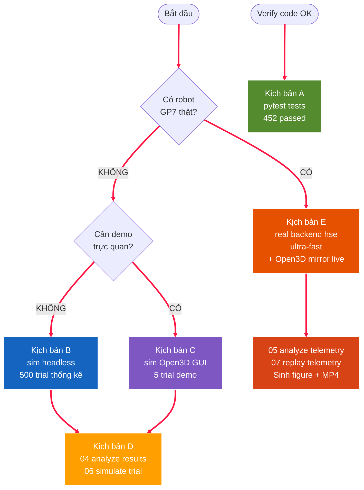
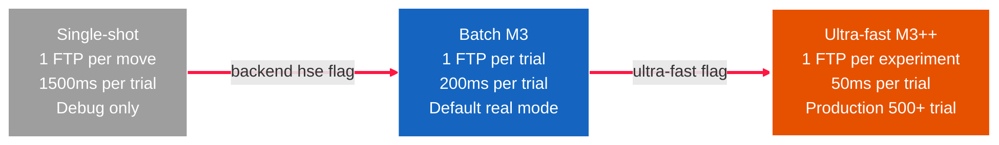
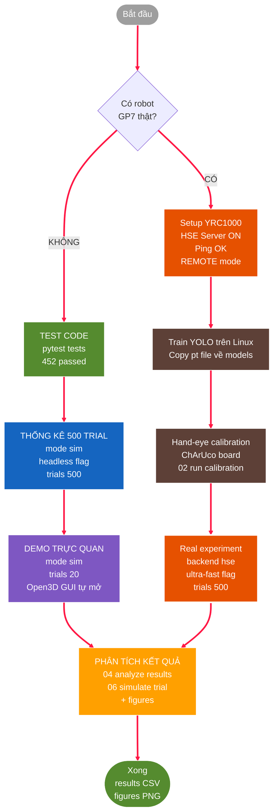

# HƯỚNG DẪN SỬ DỤNG — PickPlaceGP7 / DTwinGP7

> File này tập trung vào **workflow + commands theo kịch bản sử dụng**.
> Đọc xong → chạy được mọi tính năng.
>
> **Phạm vi**: 6 kịch bản workflow + CLI flags + hiểu output + debug khi chạy.
> **KHÔNG bao gồm**:
> - Giới thiệu tổng quan + chức năng các phần → [`GIOI_THIEU_PHAN_MEM.md`](GIOI_THIEU_PHAN_MEM.md)
> - Cài đặt phần mềm/phần cứng → [`HUONG_DAN_CAI_DAT.md`](HUONG_DAN_CAI_DAT.md)
> - Kiến trúc + sơ đồ + thiết kế hệ thống → [`phat_bieu_bai_toan_v3_2_HD.md`](phat_bieu_bai_toan_v3_2_HD.md)

---

## 1. Bộ code này làm gì?

**1.1. Mục tiêu**: 
> Hệ thống pick-and-place (gắp-thả) dùng robot Yaskawa GP7 với:
- Camera Intel RealSense D455 nhận diện vật qua **YOLOv8-seg**
- Robot di chuyển + gắp vật + đặt vào vị trí khác
- **Digital Twin Level-4 bidirectional** — 3D viewport phản ánh robot thật real-time
- Statistical evaluation 500+ trials

**1.2. Repo này có thể**

| # | Mục đích | Cần phần cứng | Thời gian |
|---|---|---|---|
| 1 | Test logic code | KHÔNG (chỉ cần PC) | ~10 giây |
| 2 | Chạy 500 trial sim cho thống kê | KHÔNG (chỉ cần PC) | ~30 giây |
| 3 | Demo trực quan Open3D GUI | Open3D (pip, không license) | ~5 phút |
| 4 | Phân tích + sinh figure | KHÔNG | ~10 giây |
| 5 | Chạy trên GP7 thật | YRC1000 + GP7 + D455 + YOLO weights | Cần setup hardware |
| 6 | **Lập trình robot qua GUI Program editor** | KHÔNG để design, YRC1000 để chạy thật | ~2 phút khởi động |

> **Quan trọng**: 4/6 use case **KHÔNG cần phần cứng** → chạy được ngay trên PC.

---

## 2. Verify cài đặt (10 giây)

```powershell
.venv\Scripts\Activate.ps1                      # activate venv (đã cài theo HUONG_DAN_CAI_DAT)
pytest tests/ -q                                # → 452 passed
```

Nếu **452 passed** → sẵn sàng dùng mọi use case không cần phần cứng.

> **Chưa cài đặt?** → [`HUONG_DAN_CAI_DAT.md`](HUONG_DAN_CAI_DAT.md) (cài đặt từ A-Z).

---

## 3. Cấu trúc tối thiểu cần biết

**3.1. Thư mục thường tương tác**
- **`scripts/`** — file `.py` ở đây = lệnh BẠN CHẠY (xem mục 4)
- **`config/`** — file `.yaml` ở đây = tham số BẠN SỬA (KHÔNG sửa code)
- **`results/`, `figures/`** — output sinh khi chạy

**3.2. Các thư mục code (logic, không chạy trực tiếp)**
- **`src/`** — logic Python
- **`models/`** — STL meshes + YOLO weights
- **`tests/`** — 452 unit/integration tests

Module tree đầy đủ: [`phat_bieu_bai_toan_v3_2_HD.md` mục 3](phat_bieu_bai_toan_v3_2_HD.md#3-cấu-trúc-thư-mục-code).

---

## 4. Workflow theo kịch bản sử dụng



### 🎯 Kịch bản A — Test code đang hoạt động (10 giây)

**Bạn muốn**: Verify code OK, chưa cần làm gì.

```powershell
pytest tests/ -q
```

→ Kỳ vọng `452 passed`. Nếu fail → có issue, xem section 6 Debug.

---

### 🎯 Kịch bản B — Chạy 500 trial thống kê quy mô lớn (30 giây, không cần gì)

**Bạn muốn**: Sinh CSV success rate quy mô lớn, không có hardware.

```powershell
python scripts/03_run_experiment.py --mode sim --trials 500 --headless
```

**Output**:
- Console: log từng trial (PASS/FAIL)
- `results/experiment_headless_<timestamp>.csv` — 500 rows
- Tóm tắt: `success_rate=XX.X%`, failure modes

**Inject failure để stress test**:
```powershell
python scripts/03_run_experiment.py --mode sim --trials 500 --headless \
    --grasp-fail-rate 0.05 --detection-miss-rate 0.1
# 5% trial bị slip + 10% trial detection miss
```

---

### 🎯 Kịch bản C — Demo trực quan Open3D GUI

**Bạn muốn**: Xem robot 3D di chuyển trong sim viewport.

```powershell
# 1. Sinh hand-eye matrix cho sim
python scripts/calibration_from_layout.py

# 2. Chạy 20 trial — Open3D viewport tự mở (O3DGuiSimRobot, Filament)
python scripts/03_run_experiment.py --mode sim --trials 20
```

**Stack viewport**: SimRobot làm motion backend (pure Python) + Open3D
Filament GUI render từ URDF model (verified match RoboDK FK 0.00mm). GUI chạy
main thread, experiment chạy worker thread. Đóng cửa sổ Open3D để kết thúc.

---

### 🎯 Kịch bản D — Phân tích kết quả + sinh figure (10 giây)

**Bạn muốn**: Đọc CSV results từ kịch bản B/C → sinh figure phân tích.

```powershell
# Stats success rate
python scripts/04_analyze_results.py --csv "results/*.csv"

# Predictive trajectory (KHÔNG cần CSV, sinh từ planning logic)
python scripts/06_simulate_trial.py --no-show
# → figures/predicted_trial_3d.png, predicted_trial_joints.png
```

---

### 🎯 Kịch bản E — Chạy trên Yaskawa GP7 THẬT (HSE backend)

**Bạn muốn**: Robot thật di chuyển, gắp vật thật.

> **Hai cách chạy**: (a) **CLI** `03_run_experiment.py --mode real` (mục này), hoặc
> (b) **trong app** `16_app_qt.py` qua panel **Digital Twin** — có nút Stop ngắt giữa
> chừng. Thao tác panel + **quy trình lên robot thật 3 bậc an toàn** mô tả trong
> [`HUONG_DAN_DIGITAL_TWIN.md`](HUONG_DAN_DIGITAL_TWIN.md).

**3-tier performance ladder** — chọn theo nhu cầu:



**Yêu cầu phần cứng + setup 1 lần**: xem [`HUONG_DAN_CAI_DAT.md` §2.9](HUONG_DAN_CAI_DAT.md) (HSE Server function, network, REMOTE mode, CIO ladder). Pre-flight checklist:
- ✅ `ping <IP_YRC1000>` reply OK
- ✅ YRC1000 ở **REMOTE mode** (teach pendant)
- ✅ **TOOL01** đã setup trên TP với TCP offset gripper — xem [`HUONG_DAN_CAI_DAT.md` §2.10](HUONG_DAN_CAI_DAT.md)
- ✅ `config/cell_layout_real.yaml`: `robot_connection.ip` đã sửa đúng IP
- ✅ `models/yolov8s-seg_best.pt` đã copy về (cho `--mode real`)

**Phase 1-2 verify (trước khi production)**:

```powershell
# Phase 1: protocol verify (KHÔNG di chuyển robot)
python scripts/11_test_yrc_cartesian.py --phase 1

# Phase 2: touch test 50mm Z up @ 10% speed
python scripts/11_test_yrc_cartesian.py --phase 2 --speed-pct 10
```

**Chạy thí nghiệm**:

```powershell
# Mode A — Demo trực quan có Open3D mirror render robot THẬT @ 2Hz (5-50 trial)
# Default --ik-source yrc: YRC1000 tự IK, 0 PC IK overhead
# Open3D mirror tự mở (Filament GUI); đóng cửa sổ để kết thúc.
python scripts/03_run_experiment.py --mode real --backend hse \
    --hse-ip 192.168.1.100 --trials 5

# Mode B — Thống kê quy mô lớn (500+ trial, ~50ms overhead/trial)
# Tắt live viewport để giảm overhead; telemetry CSV vẫn ghi 10Hz.
python scripts/03_run_experiment.py --mode real --backend hse \
    --hse-ip 192.168.1.100 --trials 500 \
    --ultra-fast --no-viewport-mirror

# Mode C — Backup nếu chưa setup TOOL01 trên TP
# Dùng client IK (PC compute): Pieper analytical (exact, chọn nhánh gần),
# DLS chỉ là fallback. URDF chain match RoboDK 0.00mm.
python scripts/03_run_experiment.py --mode real --backend hse \
    --hse-ip 192.168.1.100 --trials 50 --ik-source client
```

**C2 safety pipeline** (real mode tự bật):
- **Reach envelope check** (per pose, ~µs): `ReachEnvelope.gp7_default()` sphere
  150–927 mm tính từ J1. Reject pose ngoài envelope tại PLAN state.
- **Predictive safety check** (per trial, **~2ms** sau optimization): solve client
  IK (Pieper analytical, DLS fallback) cho 6 waypoint (current → lift → grasp → lift
  → place_lift → place → place_lift), interpolate trajectory, pure-Python FK verify
  joint limit +
  self-collision sphere **toàn bộ path** trước khi gửi MoveJ đầu tiên. Reject
  trial với failure_reason `predicted_joint_limit` hoặc `predicted_self_collision`.

Overhead nhỏ (~2ms vs HSE+MoveJ ~200ms/trial) nhờ batched numpy FK + LRU caching
+ einsum vectorization — chi tiết kỹ thuật trong [phat_bieu §7.5.2](phat_bieu_bai_toan_v3_2_HD.md#752-kinematics-performance-optimization).

Xem chi tiết: [phat_bieu §7.4 reach_envelope + §7.10 C2 safety](phat_bieu_bai_toan_v3_2_HD.md#710-c2-safety-pipeline--reachability--predictive-collision).

**Sau khi chạy xong**:
```powershell
# Visualize joint trajectory thật từ HSE telemetry
python scripts/05_analyze_telemetry.py latest --no-show
# → figures/joint_trajectory_*.png, joint_velocity_*.png, drift_events_*.png, cycle_time_*.png

# Replay thành MP4 cho demo / presentation
python scripts/07_replay_telemetry.py latest --mp4 figures/replay.mp4
```

#### Chạy ngay trong app (panel Digital Twin)

Ngoài CLI, có thể chạy robot thật trực tiếp trong app `16_app_qt.py` qua panel
**Digital Twin** (menu **Digital Twin → Show Digital Twin panel**) — tái dùng đúng
pipeline real-mode (`MotomanHSEBackend` + `DigitalTwinMirror` + `Orchestrator`) nhưng
vòng trial **ngắt được** giữa chừng bằng nút Stop (E-stop latch + servo OFF).

Toàn bộ thao tác panel (Live mirror vs Run experiment, tham số Mirror/Telemetry Hz, IK
source, Perception, Ultra-fast), cơ chế **E-stop latch** và **quy trình lên robot thật
3 bậc an toàn** (live mirror → experiment Mock dry-run → experiment thật D455+YOLO) được
mô tả đầy đủ trong [`HUONG_DAN_DIGITAL_TWIN.md`](HUONG_DAN_DIGITAL_TWIN.md).

---

### 🎯 Kịch bản F — Lập trình robot qua GUI (Program Editor)

**Bạn muốn**: Lập trình GP7 trực quan như RoboDK — teach pose, build MoveJ/L/C sequence, save .JBI, chạy trên robot thật.

> 📘 **Thao tác GUI chi tiết** (menu/phím tắt/panel, click-by-click): xem sổ tay
> [`HUONG_DAN_GUI.md`](HUONG_DAN_GUI.md).
> Học lập trình bằng code (INFORM + Python script trong app + Python SDK + API) với
> ví dụ chạy được: xem [`HUONG_DAN_LAP_TRINH.md`](HUONG_DAN_LAP_TRINH.md).

```powershell
python scripts/16_app_qt.py                       # mở app, dùng cell_layout.yaml
python scripts/16_app_qt.py --config config/cell_layout_real.yaml   # cell thật
```

**Stack**: PyQt6 + pyvistaqt (VTK 9.6) — cùng stack ROS RViz/MoveIt, industrial-standard. Cùng FK/IK đã verify khớp RoboDK 0.00mm.

**Quy trình tóm tắt** (chi tiết click-by-click: [`HUONG_DAN_GUI.md`](HUONG_DAN_GUI.md)):
kết nối YRC1000 (**Robot → Connection settings…**) → jog robot (Cartesian/Joint) →
teach pose (`Ctrl+T`) → thêm lệnh chuyển động / logic / modal → **▶ Run Sim** kiểm tra →
**File → Save** (`.json`) hoặc **Program → Export .JBI** → **⚙ Run on Robot** (HSE).

**Tính năng đáng chú ý** (thao tác chi tiết xem GUI guide):
- **Teach on Surface** (`Ctrl+Shift+T`): click mesh trong scene → raycast lấy điểm +
  pháp tuyến bề mặt → IK → target có trục Z vuông góc bề mặt.
- **Multi-job project**: một `.json` chứa nhiều job (`MAIN`, `WELD_A`, …) liên kết bằng
  `CALL JOB`; export tất cả cùng lúc.
- **Python Script generator** (**Program → Generate from Python script…**): sinh hàng
  loạt lệnh bằng API `p` — xem [`HUONG_DAN_LAP_TRINH.md` §4](HUONG_DAN_LAP_TRINH.md).
- **Post-processor settings**: giới hạn `max_speed_pct`, VJ%/V mặc định cho INFORM codegen.
- **Camera (D455) dock** (**View → Window → Camera (D455)**): live RGB/depth, chụp
  dataset, và vòng kín thị giác (Detect → Teach grasp → Pick → Program → Run on Robot).
  Cần đã **Load Robot GP7** và có `config/calibration/T_base_camera.npy`.

**Kinematics**: Pieper analytical IK (~0.24 ms/call, sai số ~1e-13 mm = RoboDK SolveIK),
trả 3–8 nghiệm cho Change Configuration; DLS chỉ là fallback khi Pieper rỗng.

**Thu dataset bằng CLI** (thay cho dock): `python scripts/01_collect_dataset.py` — live
OpenCV, phím tắt chọn metadata + SPACE để chụp (xem docstring script).

---

## 5. Hiểu output

### 5.1. Console log khi chạy `03_run_experiment.py`

```
21:23:24 | experiment | INFO | ============================================================
21:23:24 | experiment | INFO | Thí nghiệm pick-and-place — mode=sim, trials=30
21:23:24 | experiment | INFO | Backend: sim
21:23:24 | src.orchestrator.orchestrator | INFO | ─── Trial 1/30 ───
21:23:24 | src.orchestrator.orchestrator | INFO | Trial 1: gắp-thả 'tray' THÀNH CÔNG
21:23:24 | src.logging.logger | INFO | Trial 1 logged: OK
...
21:23:38 | experiment | INFO | KẾT QUẢ: success_rate=96.7% (29/30)
21:23:38 | experiment | INFO | Failure modes: {'unreachable': 1}
21:23:38 | experiment | INFO | CSV: results/experiment_headless_20260520_212324.csv
```

Đọc dòng cuối → có CSV ở đó.

### 5.2. CSV `results/experiment_*.csv`

Mỗi row = 1 trial:
| Cột | Ý nghĩa |
|---|---|
| `trial_id` | Số thứ tự trial |
| `success` | True/False |
| `class_name` | Vật được gắp (tray/bottle/cup/bolt) |
| `cycle_time_s` | Thời gian trial |
| `failure_reason` | Lý do fail (nếu có) |
| `final_state` | State machine kết thúc ở đâu |
| `lighting`, `overlap`, `mode` | Context |

### 5.3. CSV `results/telemetry_*.csv` (chỉ HSE backend)

Mỗi row = 1 tick (~100ms):
| Cột | Ý nghĩa |
|---|---|
| `timestamp` | Unix time |
| `j1..j6` | Joint angle thật (độ) |
| `running` | Robot đang chạy hay idle |
| `alarm` | Alarm code (0 = không có) |

### 5.4. Figures `figures/*.png`

| File | Sinh bởi | Nội dung |
|---|---|---|
| `joint_trajectory_*.png` | `05_analyze_telemetry.py` | 6 joint angles vs time |
| `joint_velocity_*.png` | `05_analyze_telemetry.py` | Velocity profile |
| `drift_events_*.png` | `05_analyze_telemetry.py` | Running state + alarm events |
| `cycle_time_*.png` | `05_analyze_telemetry.py` | Histogram chu kỳ |
| `predicted_trial_3d.png` | `06_simulate_trial.py` | 3D TCP path (predicted) |
| `predicted_trial_joints.png` | `06_simulate_trial.py` | Joint timeline (predicted) |

---

## 6. Câu hỏi thường gặp (FAQ)

### Q: Không có robot. Có chạy được không?
**A**: Có. Dùng `--mode sim --headless` cho 4/5 kịch bản ở section 4 (A, B, D, và phần predictive simulation của E). Chỉ kịch bản E "chạy robot thật" mới cần hardware.

### Q: Có cần GPU không?
**A**: Không cho sim/headless. Cho real mode (YOLO inference) thì CPU OK nhưng GPU nhanh hơn.

### Q: Khác nhau giữa `--backend sim` và `--backend hse` là gì?
**A**:
- **sim** = SimRobot (pure Python, không gửi command thật). Default cho `--mode sim`
  hoặc `--headless`. Khi non-headless, SimRobot chạy trong `O3DGuiSimRobot` để
  render **viewport Open3D** Filament (demo trực quan) — KHÔNG dùng RoboDK.
- **hse** = nói chuyện thẳng với YRC1000 qua UDP HSE protocol (cần robot thật).
  Default và lựa chọn duy nhất cho `--mode real`.

### Q: Ultra-fast khác batch thế nào?
**A**:
- **Batch** (default cho `--mode real`): 1 INFORM upload/trial, ~200ms/trial overhead
- **Ultra-fast** (`--ultra-fast`): 1 INFORM upload cho **cả thí nghiệm**, ~50ms/trial
- Ultra-fast yêu cầu cấu trúc trial giống nhau (cùng số waypoint).

### Q: Mirror @2Hz có chức năng gì?
**A**: Mỗi 500ms (mirror-hz=2Hz): đọc joint state thật từ YRC1000 → gọi viewport_callback render Open3D mirror + log CSV @telemetry-hz (mặc định 10Hz) + check drift + (mỗi 2.5s) check alarm. Tăng `--telemetry-hz 20` cho phân tích chi tiết hơn; `--no-viewport-mirror` để tắt live render khi chạy batch lớn.

### Q: Test fail thì sao?
**A**: Xem section 6 Debug. Đa số do thiếu STL primitive — chạy `python scripts/gen_primitive_meshes.py`.

### Q: Cần file `.pt` (YOLO weights) cho mọi mode không?
**A**: Không. Chỉ cần khi `--mode real`. Sim mode dùng `MockDetector`.

### Q: Hand-eye calibration `T_base_camera.npy` ở đâu ra?
**A**:
- **Sim**: tự sinh bằng `scripts/calibration_from_layout.py` (lấy từ YAML)
- **Real**: chạy `scripts/02_run_calibration.py` với ChArUco board

### Q: `--ik-source client` giờ dùng solver nào?
**A**: **Pieper analytical** (giải tích, closed-form, exact — ~0.24ms, accuracy
1e-13mm bằng RoboDK SolveIK), chọn nhánh nghiệm gần joints hiện tại để chuyển động
liên tục. **DLS chỉ còn là fallback** khi Pieper rỗng (pose ngoài tầm hoàn toàn —
hiếm). `yrc` (YRC1000 tự IK qua HSE Cartesian) vẫn là mặc định cho real mode. Áp dụng
cả CLI lẫn panel Digital Twin trong app.

### Q: Real mode `yrc` có batch / ultra-fast được không?
**A**: `yrc` gửi **pose Cartesian** thẳng tới YRC1000 (controller tự IK) → backend HSE
chưa hỗ trợ Cartesian trong batch/ultra-fast, nên mỗi move chạy **single-shot** (chỉ
tốn thêm vài INFORM upload/trial, vẫn chạy đúng). Muốn **batch / ultra-fast** thì dùng
`--ik-source client` (joint-list, Pieper) — gom 5-7 motion thành 1 INFORM upload/trial.

---

## 7. Debug khi gặp lỗi

| Triệu chứng | Nguyên nhân | Cách fix |
|---|---|---|
| `pytest` báo lỗi import | Chưa activate venv | `.venv\Scripts\Activate.ps1` |
| `FileNotFoundError: T_base_camera.npy` | Chưa sinh calibration | `python scripts/calibration_from_layout.py` |
| `MissingMeshError: worktable.stl` | Thiếu STL | `pip install trimesh && python scripts/gen_primitive_meshes.py` |
| Open3D cửa sổ không mở | Thiếu `pip install open3d` | `pip install -r requirements.txt` |
| `--mode real chỉ chấp nhận --backend hse` | Truyền `--backend sim` cùng `--mode real` | Bỏ flag — mặc định auto-pick `hse` cho real mode |
| `HSE request timeout` | YRC1000 không phản hồi | Check `ping IP`, HSE Server enable, REMOTE mode |
| `Trial X: vật không với tới được` | Pose ngoài ReachEnvelope GP7 (927mm) | Kiểm tra place_position và base pose trong cell config |
| `predictive safety reject — predicted_joint_limit` | Trajectory IK đi qua joint vượt limit | Tinh chỉnh approach_height_mm / yaw_offset_deg, hoặc đổi place_position |
| `predictive safety reject — predicted_self_collision` | Arm tự đụng nhau ở config trung gian | Đổi `--ik-source yrc` (controller chọn config khác), hoặc thay đổi trajectory |
| Telemetry CSV thưa | Mirror rate thấp | `--telemetry-hz 10` (mặc định) |

---

## 8. Tham chiếu nhanh

### 8.1. File cần sửa khi nào

| File | Sửa khi nào |
|---|---|
| `config/cell_layout.yaml` | Đổi vị trí robot/bàn/camera trong sim |
| `config/cell_layout_real.yaml` | Đổi IP YRC1000, vị trí cell thật |
| `config/experiment.yaml` | Tốc độ joint/linear, approach height, gripper delay |
| `requirements.txt` | Thêm thư viện mới |

**KHÔNG nên sửa**:
- `src/**/*.py` (logic core, có test cover)
- `tests/**/*.py` (test cố định)

### 8.2. Scripts thường dùng (theo tần suất)

| Tần suất | Script | Mục đích |
|---|---|---|
| ★★★ Hàng ngày | `03_run_experiment.py` | Chạy trial |
| ★★★ Hàng ngày | `04_analyze_results.py` | Phân tích success rate |
| ★★★ Lập trình | **`16_app_qt.py`** | **GP7 Program editor GUI** (PyQt6+VTK, teach + build + .JBI + run-on-robot) |
| ★★ Real mode | `05_analyze_telemetry.py` | Visualize HSE joint state |
| ★ Setup | `calibration_from_layout.py` | Sinh T_BC sim |
| ★ Setup | `gen_primitive_meshes.py` | Sinh STL primitive |
| ★ Figure | `06_simulate_trial.py` | Predictive figure |
| ★ Real bring-up | `13_verify_vs_robodk.py` | Verify FK + DLS IK match RoboDK trên fixed configs (bảng) + `--samples N --histogram` cho figure |
| ★ Real bring-up | `11_test_yrc_cartesian.py` | 3-phase YRC Cartesian motion test |
| ★ Verification | **`17_compare_fk_ik.py`** | **So sánh 6 IK methods** (Pieper / DLS / LM / SDLS / BFGS / RoboDK) — CSV + 6-panel PNG histogram. `--fair` cho thesis apples-to-apples; `--methods Pieper,DLS,LM` chọn subset |
| ★ Defense | `07_replay_telemetry.py` | Replay MP4 |

### 8.3. CLI flags — bảng đầy đủ (PRIMARY reference)

`scripts/03_run_experiment.py` (entry chính):

| Flag | Default | Khi nào dùng |
|---|---|---|
| `--mode {sim, real}` | sim | Sim → không cần robot. Real → cần GP7. |
| `--backend {sim, hse}` | auto | Override motion backend. Auto-pick: mode=sim→sim, mode=real→hse. |
| `--headless` | off | SimRobot mock, không viewport, scale 500+ trial. Sim non-headless tự dùng O3DGuiSimRobot; real mode tự mở Open3D mirror (xem `--no-viewport-mirror`). |
| `--trials N` | 50 | Số trial chạy |
| `--config PATH` | config/experiment.yaml | Override experiment config (tốc độ, approach height, `model_path`, gripper delay…) |
| `--cell-config PATH` | auto | Override cell YAML (auto: cell_layout.yaml cho sim, cell_layout_real.yaml cho real) |
| `--minimal-build` | off | Open3D viewport tối giản (bỏ items phụ) |
| `--grasp-fail-rate N` | 0.0 | (Headless only) Inject failure xác suất N |
| `--detection-miss-rate N` | 0.0 | (Headless only) Inject detection miss xác suất N |
| `--seed N` | 42 | (Headless only) Seed RNG |
| `--lighting LABEL` | "" | Nhãn điều kiện ánh sáng ghi vào CSV trial (phân tích sau) |
| `--overlap LABEL` | "" | Nhãn mức chồng lấn ghi vào CSV trial |
| **IK source** | | |
| `--ik-source {yrc, client}` | auto | Cách compute IK. Auto: `yrc` cho real, `client` cho sim. `client` = Pieper analytical (exact, DLS chỉ fallback), URDF chain verified match RoboDK 0.00mm. |
| `--tool-no N` | 1 | TOOL coordinate trên YRC (TOOL01 default). Cần setup trên TP — xem `docs/HUONG_DAN_CAI_DAT.md` §2.10 |
| **HSE backend specific** | | |
| `--hse-ip IP` | (từ cell YAML) | Override IP YRC1000 |
| `--mirror-hz N` | 2.0 | Tần số gọi viewport_callback render Open3D mirror (Hz). Real mode mirror render @ tần số này; telemetry CSV vẫn ghi @ telemetry-hz. |
| `--telemetry-hz N` | 10.0 | Tần số backend Joints poll + CSV log (resolution analysis) |
| `--no-viewport-mirror` | off | Tắt live Open3D mirror trong real mode (chỉ ghi telemetry CSV). Replay sau bằng `07_replay_telemetry.py`. |
| `--ultra-fast` | off | M3++ P-variable template caching (~50ms/trial overhead) |

### IK source — 2 lựa chọn

| Source | Tốc độ | Accuracy | Khi nào dùng |
|---|---|---|---|
| `yrc` | ~50ms/move (HSE) | YRC controller's own IK | **Real mode default**, cần setup TOOL01 trên TP |
| `client` | ~0.24ms/move (Pieper) | 1e-13mm (= RoboDK SolveIK) | **Sim default** + real backup; URDF chain pure Python |

**Client IK = Pieper analytical** (giải tích, closed-form, exact — chọn nhánh gần
joints hiện tại để chuyển động liên tục), nhanh + chuẩn hơn DLS. **DLS chỉ còn là
fallback** khi Pieper rỗng (pose ngoài tầm hoàn toàn — hiếm). `yrc` (YRC1000 tự IK)
vẫn là mặc định cho real mode.

URDF chain (`src/orchestrator/kinematics/urdf_chain.py`) lấy từ ros-industrial/motoman
noetic-devel, đã verify match RoboDK SolveFK exactly (0.00mm/0.00°). Verify lại
bất kỳ lúc nào: `python scripts/13_verify_vs_robodk.py`.

`scripts/05_analyze_telemetry.py` (visualize HSE CSV):

| Flag | Default | Mô tả |
|---|---|---|
| `csv_path` | `latest` | Đường dẫn CSV hoặc `latest` để chọn file mới nhất |
| `--no-show` | off | Không mở matplotlib window (chỉ save PNG) |
| `--out-dir PATH` | `figures/` | Thư mục xuất PNG |
| `--rest-threshold-deg-s N` | 2.0 | Ngưỡng velocity coi là rest (cho cycle time detection) |

`scripts/07_replay_telemetry.py` (replay CSV):

| Flag | Default | Mô tả |
|---|---|---|
| `csv_path` | `latest` | CSV path |
| `--mp4 PATH` | (none) | Export MP4 (cần ffmpeg) |
| `--png PATH` | (none) | Export 1 PNG summary |
| `--speedup N` | 1.0 | Tốc độ playback (1.0 = realtime) |
| `--max-frames N` | 300 | Subsample max N frames |

---

## 9. Workflow tổng — Cheatsheet 1 trang



---

## 10. Cần giúp đỡ?

- **Giới thiệu phần mềm + chức năng các phần**: [`GIOI_THIEU_PHAN_MEM.md`](GIOI_THIEU_PHAN_MEM.md)
- **Thao tác giao diện (click-by-click)**: [`HUONG_DAN_GUI.md`](HUONG_DAN_GUI.md)
- **Học lập trình (INFORM + Python + SDK)**: [`HUONG_DAN_LAP_TRINH.md`](HUONG_DAN_LAP_TRINH.md)
- **Digital Twin + vận hành robot thật**: [`HUONG_DAN_DIGITAL_TWIN.md`](HUONG_DAN_DIGITAL_TWIN.md)
- **Cài đặt setup chi tiết**: [`HUONG_DAN_CAI_DAT.md`](HUONG_DAN_CAI_DAT.md)
- **Thiết kế hệ thống chi tiết**: [`phat_bieu_bai_toan_v3_2_HD.md`](phat_bieu_bai_toan_v3_2_HD.md)
- **Tổng quan + quickstart**: [`../README.md`](../README.md)
- **STL mesh + YOLO weights**: [`../models/README.md`](../models/README.md)
- **GitHub issue**: https://github.com/manhhv87/DTwinGP7/issues

---

*Hướng dẫn sử dụng — DTwinGP7.*
