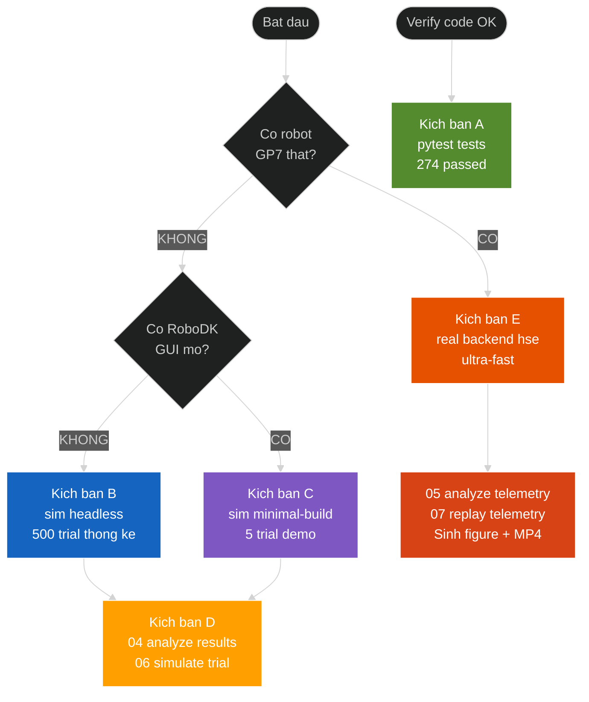
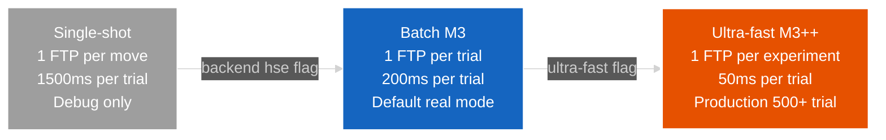
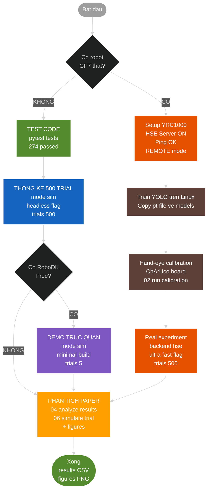

# HƯỚNG DẪN SỬ DỤNG — pickplace_gp7 / DTwinGP7

> File này tập trung vào **workflow + commands theo kịch bản sử dụng**.
> Đọc xong → chạy được mọi tính năng.
>
> **Phạm vi**: 5 kịch bản workflow + CLI flags + hiểu output + debug khi chạy.
> **KHÔNG bao gồm**:
> - Cài đặt phần mềm/phần cứng → [`HUONG_DAN_CAI_DAT.md`](HUONG_DAN_CAI_DAT.md)
> - Kiến trúc + sơ đồ + research context → [`phat_bieu_bai_toan_v3_2_HD.md`](phat_bieu_bai_toan_v3_2_HD.md)

---

## 1. Bộ code này làm gì?

**Mục tiêu**: Hệ thống pick-and-place (gắp-thả) dùng robot Yaskawa GP7 với:
- Camera Intel RealSense D455 nhận diện vật qua **YOLOv8-seg**
- Robot di chuyển + gắp vật + đặt vào vị trí khác
- **Digital Twin Level-4 bidirectional** — 3D viewport phản ánh robot thật real-time
- Statistical evaluation 500+ trials cho thesis paper

**5 thứ bạn làm được với repo này:**

| # | Mục đích | Cần phần cứng | Thời gian |
|---|---|---|---|
| 1 | Test logic code | KHÔNG (laptop bất kỳ) | ~10 giây |
| 2 | Chạy 500 trial sim cho thống kê | KHÔNG (laptop bất kỳ) | ~30 giây |
| 3 | Demo trực quan trên RoboDK | RoboDK Free | ~5 phút |
| 4 | Phân tích + sinh figure cho paper | KHÔNG | ~10 giây |
| 5 | Chạy trên GP7 thật | YRC1000 + GP7 + D455 + YOLO weights | Cần setup hardware |

> **Quan trọng**: 4/5 use case **KHÔNG cần phần cứng** → chạy được ngay trên laptop.

---

## 2. Verify cài đặt (10 giây)

```powershell
.venv\Scripts\Activate.ps1                      # activate venv (đã cài theo HUONG_DAN_CAI_DAT)
pytest tests/ -q                                # → 274 passed
```

Nếu **274 passed** → sẵn sàng dùng mọi use case không cần phần cứng.

> **Chưa cài đặt?** → [`HUONG_DAN_CAI_DAT.md`](HUONG_DAN_CAI_DAT.md) (cài đặt từ A-Z).

---

## 3. Cấu trúc tối thiểu cần biết

3 thư mục bạn tương tác hàng ngày:
- **`scripts/`** — file `.py` ở đây = lệnh BẠN CHẠY (xem mục 4)
- **`config/`** — file `.yaml` ở đây = tham số BẠN SỬA (KHÔNG sửa code)
- **`results/`, `figures/`** — output sinh khi chạy

3 thư mục code (logic, không chạy trực tiếp):
- **`src/`** — logic Python
- **`models/`** — STL meshes + YOLO weights
- **`tests/`** — 274 unit/integration tests

Module tree đầy đủ: [`phat_bieu_bai_toan_v3_2_HD.md` mục 3](phat_bieu_bai_toan_v3_2_HD.md#3-cấu-trúc-thư-mục-code).

---

## 4. Workflow theo kịch bản sử dụng



5 kịch bản chi tiết:


### 🎯 Kịch bản A — Test code đang hoạt động (10 giây)

**Bạn muốn**: Verify code OK, chưa cần làm gì.

```powershell
pytest tests/ -q
```

→ Kỳ vọng `274 passed`. Nếu fail → có issue, xem section 6 Debug.

---

### 🎯 Kịch bản B — Chạy 500 trial thống kê cho paper (30 giây, không cần gì)

**Bạn muốn**: Sinh CSV success rate cho thesis paper, không có hardware.

```powershell
python scripts/03_run_experiment.py --mode sim --trials 500 --headless
```

**Output**:
- Console: log từng trial (PASS/FAIL)
- `results/experiment_headless_<timestamp>.csv` — 500 rows
- Tóm tắt: `success_rate=XX.X%`, failure modes

**Inject failure để stress test**:
```powershell
python scripts/03_run_experiment.py --mode sim --trials 500 --headless \
    --grasp-fail-rate 0.05 --detection-miss-rate 0.1
# 5% trial bị slip + 10% trial detection miss
```

---

### 🎯 Kịch bản C — Demo trực quan trên RoboDK GUI (cần RoboDK Free)

**Bạn muốn**: Xem robot 3D di chuyển trong RoboDK.

```powershell
# 1. Mở RoboDK GUI (station rỗng)
# 2. Sinh hand-eye matrix cho sim
python scripts/calibration_from_layout.py

# 3. Dựng cell trong RoboDK
python scripts/build_station.py --minimal

# 4. Chạy 5 trial (đủ trước khi RoboDK Free hết quota)
python scripts/03_run_experiment.py --mode sim --trials 5 --minimal-build
```

**Lưu ý RoboDK Free**: Chỉ chạy ~3-5 trial trước khi popup "Robot stopped by user".
Nếu cần nhiều hơn, dùng Kịch bản B (headless).

---

### 🎯 Kịch bản D — Phân tích kết quả + sinh figure (10 giây)

**Bạn muốn**: Đọc CSV results từ kịch bản B/C → sinh figure cho thesis paper.

```powershell
# Stats success rate
python scripts/04_analyze_results.py --csv "results/*.csv"

# Predictive trajectory (KHÔNG cần CSV, sinh từ planning logic)
python scripts/06_simulate_trial.py --no-show
# → figures/predicted_trial_3d.png, predicted_trial_joints.png
```

---

### 🎯 Kịch bản E — Chạy trên Yaskawa GP7 THẬT (HSE backend)

**Bạn muốn**: Robot thật di chuyển, gắp vật thật.

**3-tier performance ladder** — chọn theo nhu cầu:



**Yêu cầu phần cứng + setup 1 lần**: xem [`HUONG_DAN_CAI_DAT.md` §2.9](HUONG_DAN_CAI_DAT.md) (HSE Server function, network, REMOTE mode, CIO ladder). Pre-flight checklist:
- ✅ `ping <IP_YRC1000>` reply OK
- ✅ YRC1000 ở **REMOTE mode** (teach pendant)
- ✅ `config/cell_layout_real.yaml`: `robot_connection.ip` đã sửa đúng IP
- ✅ `models/yolov8s-seg_best.pt` đã copy về (cho `--mode real`)

**Chạy thí nghiệm**:

```powershell
# Mode A — Demo trực quan có viewport mirror robot thật (5-50 trial)
python scripts/03_run_experiment.py --mode real --backend hse \
    --hse-ip 192.168.1.100 --trials 5

# Mode B — Thống kê quy mô lớn (500+ trial, ~50ms overhead/trial)
python scripts/03_run_experiment.py --mode real --backend hse \
    --hse-ip 192.168.1.100 --trials 500 \
    --ultra-fast --no-viewport-mirror
```

**Sau khi chạy xong**:
```powershell
# Visualize joint trajectory thật từ HSE telemetry
python scripts/05_analyze_telemetry.py latest --no-show
# → figures/joint_trajectory_*.png, joint_velocity_*.png, drift_events_*.png, cycle_time_*.png

# Replay thành MP4 cho thesis defense
python scripts/07_replay_telemetry.py latest --mp4 figures/replay.mp4
```

---

## 5. Hiểu output

### 5.1. Console log khi chạy `03_run_experiment.py`

```
21:23:24 | experiment | INFO | ============================================================
21:23:24 | experiment | INFO | Thí nghiệm pick-and-place — mode=sim, trials=30
21:23:24 | experiment | INFO | Backend: sim
21:23:24 | src.orchestrator.orchestrator | INFO | ─── Trial 1/30 ───
21:23:24 | src.orchestrator.orchestrator | INFO | Trial 1: gắp-thả 'tray' THÀNH CÔNG
21:23:24 | src.logging.logger | INFO | Trial 1 logged: OK
...
21:23:38 | experiment | INFO | KẾT QUẢ: success_rate=96.7% (29/30)
21:23:38 | experiment | INFO | Failure modes: {'unreachable': 1}
21:23:38 | experiment | INFO | CSV: results/experiment_headless_20260520_212324.csv
```

Đọc dòng cuối → có CSV ở đó.

### 5.2. CSV `results/experiment_*.csv`

Mỗi row = 1 trial:
| Cột | Ý nghĩa |
|---|---|
| `trial_id` | Số thứ tự trial |
| `success` | True/False |
| `class_name` | Vật được gắp (tray/bottle/cup/bolt) |
| `cycle_time_s` | Thời gian trial |
| `failure_reason` | Lý do fail (nếu có) |
| `final_state` | State machine kết thúc ở đâu |
| `lighting`, `overlap`, `mode` | Context |

### 5.3. CSV `results/telemetry_*.csv` (chỉ HSE backend)

Mỗi row = 1 tick (~100ms):
| Cột | Ý nghĩa |
|---|---|
| `timestamp` | Unix time |
| `j1..j6` | Joint angle thật (độ) |
| `running` | Robot đang chạy hay idle |
| `alarm` | Alarm code (0 = không có) |

### 5.4. Figures `figures/*.png`

| File | Sinh bởi | Nội dung |
|---|---|---|
| `joint_trajectory_*.png` | `05_analyze_telemetry.py` | 6 joint angles vs time |
| `joint_velocity_*.png` | `05_analyze_telemetry.py` | Velocity profile |
| `drift_events_*.png` | `05_analyze_telemetry.py` | Running state + alarm events |
| `cycle_time_*.png` | `05_analyze_telemetry.py` | Histogram chu kỳ |
| `predicted_trial_3d.png` | `06_simulate_trial.py` | 3D TCP path (predicted) |
| `predicted_trial_joints.png` | `06_simulate_trial.py` | Joint timeline (predicted) |

---

## 6. Câu hỏi thường gặp (FAQ)

### Q: Tôi không có robot. Có chạy được không?
**A**: Có. Dùng `--mode sim --headless` cho 4/5 kịch bản ở section 4 (A, B, D, và phần predictive simulation của E). Chỉ kịch bản E "chạy robot thật" mới cần hardware.

### Q: Tôi không có RoboDK. Có chạy được không?
**A**: Có. `--mode sim --headless` không cần RoboDK. Chỉ cần Python.

### Q: Có cần GPU không?
**A**: Không cho sim/headless. Cho real mode (YOLO inference) thì CPU OK nhưng GPU nhanh hơn.

### Q: Khác nhau giữa `--backend sim`, `robodk`, `hse` là gì?
**A**:
- **sim** = robot mô phỏng pure Python (không cần RoboDK)
- **robodk** = robot trong RoboDK GUI (cần RoboDK Free cho sim, Educational cho real)
- **hse** = nói chuyện thẳng với YRC1000 qua UDP (cần robot thật)

### Q: Tại sao `--mode real --backend robodk` báo lỗi license?
**A**: RoboDK Free **KHÔNG** support robot drivers. Phải mua Educational ($340) HOẶC dùng `--backend hse` để bypass.

### Q: Ultra-fast khác batch thế nào?
**A**:
- **Batch** (default cho `--mode real`): 1 INFORM upload/trial, ~200ms/trial overhead
- **Ultra-fast** (`--ultra-fast`): 1 INFORM upload cho **cả thí nghiệm**, ~50ms/trial
- Ultra-fast yêu cầu cấu trúc trial giống nhau (cùng số waypoint).

### Q: Mirror @2Hz có chức năng gì?
**A**: Mỗi 500ms: đọc joint state thật từ YRC1000 → cập nhật viewport RoboDK + log CSV + check drift + (mỗi 2.5s) check alarm. Default 2Hz an toàn cho RoboDK Free. Tăng `--telemetry-hz 10` cho phân tích chi tiết hơn.

### Q: Test fail thì sao?
**A**: Xem section 6 Debug. Đa số do thiếu STL primitive — chạy `python scripts/gen_primitive_meshes.py`.

### Q: Cần file `.pt` (YOLO weights) cho mọi mode không?
**A**: Không. Chỉ cần khi `--mode real`. Sim mode dùng `MockDetector`.

### Q: Hand-eye calibration `T_base_camera.npy` ở đâu ra?
**A**:
- **Sim**: tự sinh bằng `scripts/calibration_from_layout.py` (lấy từ YAML)
- **Real**: chạy `scripts/02_run_calibration.py` với ChArUco board

---

## 7. Debug khi gặp lỗi

| Triệu chứng | Nguyên nhân | Cách fix |
|---|---|---|
| `pytest` báo lỗi import | Chưa activate venv | `.venv\Scripts\Activate.ps1` |
| `FileNotFoundError: T_base_camera.npy` | Chưa sinh calibration | `python scripts/calibration_from_layout.py` |
| `MissingMeshError: worktable.stl` | Thiếu STL | `pip install trimesh && python scripts/gen_primitive_meshes.py` |
| `Robot stopped by user` | RoboDK Free quota hit | Restart RoboDK, dùng `--minimal-build` hoặc `--headless` |
| `Invalid license: using robot drivers` | RoboDK Free không support driver | Dùng `--backend hse` thay vì `--backend robodk` |
| `HSE request timeout` | YRC1000 không phản hồi | Check `ping IP`, HSE Server enable, REMOTE mode |
| `Robot stopped by user` ở trial 3 | RoboDK Free chặn motion | Đổi sang headless: `--mode sim --headless` |
| `[WinError 10053]` lặp lại | RoboDK socket chết | Restart RoboDK; orchestrator auto-abort sau 3 lỗi |
| Telemetry CSV thưa | Mirror rate thấp | `--telemetry-hz 10` (mặc định) |

---

## 8. Tham chiếu nhanh

### 8.1. File cần sửa khi nào

| File | Sửa khi nào |
|---|---|
| `config/cell_layout.yaml` | Đổi vị trí robot/bàn/camera trong sim |
| `config/cell_layout_real.yaml` | Đổi IP YRC1000, vị trí cell thật |
| `config/experiment.yaml` | Tốc độ joint/linear, approach height, gripper delay |
| `requirements.txt` | Thêm thư viện mới |

**KHÔNG nên sửa**:
- `src/**/*.py` (logic core, có test cover)
- `tests/**/*.py` (test cố định)

### 8.2. Scripts thường dùng (theo tần suất)

| Tần suất | Script | Mục đích |
|---|---|---|
| ★★★ Hàng ngày | `03_run_experiment.py` | Chạy trial |
| ★★★ Hàng ngày | `04_analyze_results.py` | Phân tích success rate |
| ★★ Demo | `build_station.py` | Dựng cell RoboDK |
| ★★ Real mode | `05_analyze_telemetry.py` | Visualize HSE joint state |
| ★ Setup | `calibration_from_layout.py` | Sinh T_BC sim |
| ★ Setup | `gen_primitive_meshes.py` | Sinh STL primitive |
| ★ Paper | `06_simulate_trial.py` | Predictive figure |
| ★ Defense | `07_replay_telemetry.py` | Replay MP4 |

### 8.3. CLI flags — bảng đầy đủ (PRIMARY reference)

`scripts/03_run_experiment.py` (entry chính):

| Flag | Default | Khi nào dùng |
|---|---|---|
| `--mode {sim, real}` | sim | Sim → không cần robot. Real → cần GP7. |
| `--backend {sim, robodk, hse}` | auto | Override backend. Auto-pick: headless→sim, mode=sim→robodk, mode=real→hse |
| `--headless` | off | SimRobot mock, 0 API call, scale 500+ trial |
| `--trials N` | 50 | Số trial chạy |
| `--cell-config PATH` | auto | Override cell YAML (auto: cell_layout.yaml cho sim, cell_layout_real.yaml cho real) |
| `--minimal-build` | off | Cell tối giản (chỉ tray), tiết kiệm RoboDK API call |
| `--no-build` | off | Bỏ qua dựng cell (dùng station đã có sẵn trong RoboDK) |
| `--grasp-fail-rate N` | 0.0 | (Headless only) Inject failure xác suất N |
| `--detection-miss-rate N` | 0.0 | (Headless only) Inject detection miss xác suất N |
| `--seed N` | 42 | (Headless only) Seed RNG |
| **HSE backend specific** | | |
| `--hse-ip IP` | (từ cell YAML) | Override IP YRC1000 |
| `--mirror-hz N` | 2.0 | Tần số viewport setJoints (an toàn RoboDK Free nagware) |
| `--telemetry-hz N` | 10.0 | Tần số HSE Joints poll + CSV log (resolution analysis) |
| `--no-viewport-mirror` | off | Tắt setJoints RoboDK → 0 API call vào RoboDK |
| `--ultra-fast` | off | M3++ P-variable template caching (~50ms/trial overhead) |

`scripts/05_analyze_telemetry.py` (visualize HSE CSV):

| Flag | Default | Mô tả |
|---|---|---|
| `csv_path` | `latest` | Đường dẫn CSV hoặc `latest` để chọn file mới nhất |
| `--no-show` | off | Không mở matplotlib window (chỉ save PNG) |
| `--out-dir PATH` | `figures/` | Thư mục xuất PNG |
| `--rest-threshold-deg-s N` | 2.0 | Ngưỡng velocity coi là rest (cho cycle time detection) |

`scripts/07_replay_telemetry.py` (replay CSV):

| Flag | Default | Mô tả |
|---|---|---|
| `csv_path` | `latest` | CSV path |
| `--mp4 PATH` | (none) | Export MP4 (cần ffmpeg) |
| `--png PATH` | (none) | Export 1 PNG summary |
| `--speedup N` | 1.0 | Tốc độ playback (1.0 = realtime) |
| `--max-frames N` | 300 | Subsample max N frames |

---

## 9. Workflow tổng — Cheatsheet 1 trang



---

## 10. Cần giúp đỡ?

- **Cài đặt setup chi tiết**: `docs/HUONG_DAN_CAI_DAT.md`
- **Cell module (cell_loader, build_station)**: `docs/Phu_luc_A_README_HD.md`
- **Tài liệu đề tài thesis**: `docs/phat_bieu_bai_toan_v3_2_HD.md`
- **Architecture tổng quan**: `README.md`
- **STL mesh + YOLO weights**: `models/README.md`
- **GitHub issue**: https://github.com/manhhv87/DTwinGP7/issues

---

*Hướng dẫn sử dụng v1.0 — pickplace_gp7 / DTwinGP7. Cập nhật cuối: 2026-05.*
