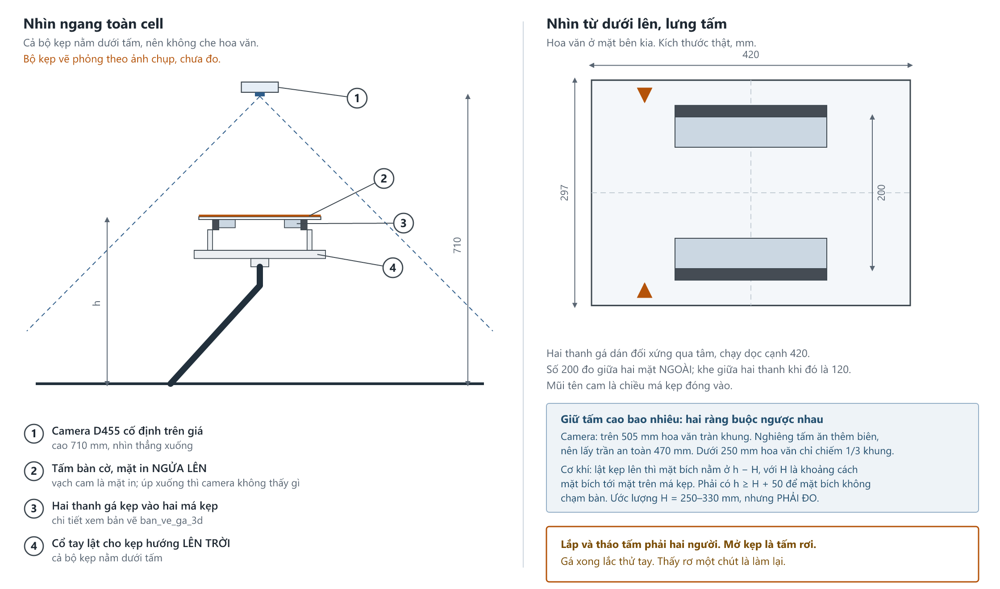
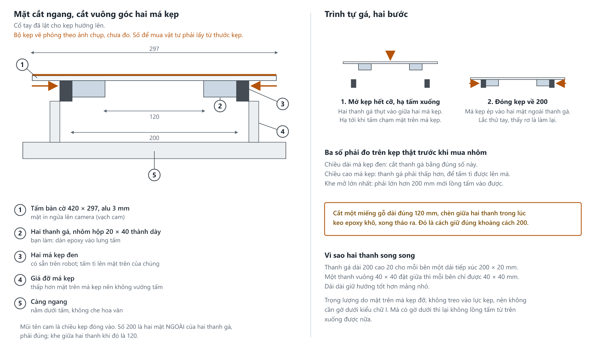
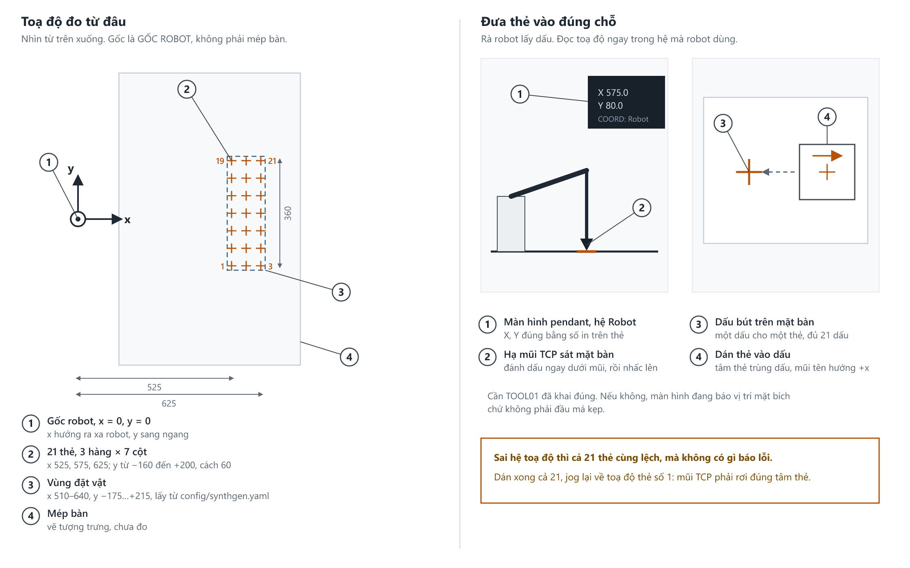

# HƯỚNG DẪN CHẠY THÍ NGHIỆM TRÊN CELL GP7

## 0. Chú ý

- Bản ngày 21/09/2026, khớp với Methods/Results của bài báo cùng ngày.
- Người chạy cell làm theo đúng các lệnh trong đây; số lượt và tên buổi trong lệnh là số đã
  dùng để lập lịch. Người huấn luyện giữ [campaign manifest](CAMPAIGN_MANIFEST.md) và
  [TRAINING_WORKFLOW.md](TRAINING_WORKFLOW.md); hai file đó nằm trong `docs\` của mã nguồn,
  người chạy cell không cần mở.
- Ba mục đầu là chuẩn bị, sau đó là **5 pha, chặn nhau**: pha trước còn vướng mục DỪNG thì không chạy pha sau.
- IP tủ điều khiển: **192.168.1.100**.

**Cảnh báo:**

- **Đo sai cạnh ô bàn cờ** là lỗi nguy hiểm nhất: không báo lỗi, mọi khoảng cách co giãn sai
  tỷ lệ. Thước kẹp, đo hai lần, hai người đọc.
- **Sửa bố cục cell sau khi hiệu chuẩn = hiệu chuẩn lại.**

---

## Quy trình tổng thể

| Bước | Chạy ở đâu | Robot | Người làm gì | Ra cái gì |
|---|---|---|---|---|
| Chuẩn bị, mục 1–3 | máy tính cạnh cell | không | đo bốn số, in và gá bàn cờ | các file cấu hình đã điền số thật |
| Pha 1, hiệu chuẩn | cell, chế độ TEACH | người jog, robot không tự đi | **đã làm 18/09/2026**; còn đo cạnh ô bàn cờ và chạm thử 8 điểm | 4 file trong `config\calibration\`, đã có trên git |
| Pha 2, chạy thử | cell, chế độ REMOTE | robot tự chạy | 1 lượt rồi 5 lượt, đo lệch điểm thả, dán vạch 30 mm | 1 CSV + 1 telemetry |
| Pha 3, E1 | cell | 50 lượt | đặt vật, bấm ENTER, chấm y/n | `e1_*`, CSV, telemetry, 4 PNG |
| Pha 4, E2 | cell | 3 nhánh × 200 lượt, bộ khó 200 lượt, kèm đối chứng 20+20 mỗi buổi | đặt vật, chấm y/n, không mở file khoá | 24 CSV khối mỗi buổi, file khoá, thư mục khung ảnh |
| Pha 5, sinh ảnh và huấn luyện | **máy GPU Linux** | không | viết luật chọn κ trước, huấn luyện đủ seed, chọn κ và mô hình | `specs`/`render`/`dataset`, gói `dsv<k>/`, `runs/seed<n>/` |
| Pha 5, đo lại | cell | như Pha 4, số lượt do người huấn luyện gửi kèm mô hình | chép mô hình mới về rồi chạy lại đúng danh sách thẻ cũ | CSV gắp của mô hình mới |
| Phân tích | máy tính | không | gõ đúng lệnh có `>` hoặc `\| tee` | `e2_phan_tich.txt`, `results_summary.png` |

### Mã trong bài báo nằm ở pha nào

Bài báo gọi tên bốn đóng góp là C1 đến C4, và sáu thí nghiệm là E1 đến E6. Hướng dẫn này chia
theo pha, nên đây là bảng tra:

| Mã | Là gì | Chạy ở đâu trong hướng dẫn này |
|---|---|---|
| **C1** | Digital twin của cell, kèm cách đo độ trễ đồng bộ, sai số hình học, chi phí lập quỹ đạo | Pha 3 (E1) |
| **C2** | Ảnh tổng hợp neo theo hiệu chuẩn, so với ngẫu nhiên hoá dải rộng cùng ngân sách | Pha 5 (E3) |
| **C3** | Phân bổ ảnh theo lỗi, so với tăng cường ngẫu nhiên cùng ngân sách | Pha 5 (E4, có E5 bổ trợ) |
| **C4** | Ba chế độ độ sâu `rgbd`, `plane`, `fusion`, gồm cả vật inox phản chiếu | **Pha 4 (E2)**, 600 lượt của lệnh chiến dịch mù |

E5 và E6 không mang mã đóng góp riêng: E5 khảo sát yếu tố của recipe sinh ảnh, E6 cho khoảng cách mô phỏng với thật và
thời gian chu kỳ.

### Chia việc

Hai vai, không chồng lên nhau: **người chạy cell** làm mọi thứ có robot, **người huấn luyện** làm
mọi thứ trên máy GPU và phần phân tích.

| Việc | Người chạy cell | Người huấn luyện |
|---|---|---|
| Chuẩn bị mục 1–3, đo bốn số, in và gá bàn cờ | x | |
| Pha 1 hiệu chuẩn, chạm thử 8 điểm | x | |
| Pha 2, Pha 3, Pha 4: chạy cell, đặt vật, chấm y/n | x | |
| Nhật ký buổi, sao lưu `results\` và `logs\` | x | |
| Mở file khoá mù | | x |
| Phân tích: tỷ lệ thành công, McNemar, Holm | | x |
| Sinh ảnh, render, gán nhãn | | x |
| Viết luật chọn κ, chạy val, chọn ra κ | | x |
| Huấn luyện mọi cấu hình, mọi seed | | x |
| Pha 5 đo lại ở cell, sau khi nhận mô hình mới | x | |

**Sau mỗi buổi, người chạy cell gửi đi:** cả thư mục `results\<tên buổi>\`, file
`logs\experiment.log`, thư mục khung ảnh trên ổ D, file khoá
`results\blinding_keys\key_<buổi>.json` **còn nguyên chưa mở**, và trang nhật ký của buổi.

**Người huấn luyện gửi lại:** file `.pt` của mô hình mới kèm SHA-256, κ đã chọn kèm luật validation đã ghi trước,
dòng `model_path` cần sửa trong `config\experiment.yaml`, và ID danh sách pose evaluation đã khóa; không thay danh sách theo kết quả.

**Hai ranh giới không được vượt.** Người chạy cell không mở file khoá và không xem tỷ lệ thành
công đang chạy: biết cấu hình nào đang chạy là hỏng phần chấm bằng mắt. Người huấn luyện không
đổi danh sách thẻ giữa chiến dịch: đổi là mất ghép cặp, và mọi kiểm định McNemar đã chạy thành vô
nghĩa.

Ba việc chi phối cả quy trình:

1. **Pha trước còn vướng mục DỪNG thì không sang pha sau.** Gặp mục DỪNG thì dừng và ghi vào nhật
   ký, không tự đổi cấu hình rồi chạy tiếp.
2. **Chỉ Pha 5 phần sinh ảnh và huấn luyện là rời cell.** Mọi con số gắp đều phải đo ở cell thật,
   kể cả sau khi huấn luyện lại.
3. **Kết quả tự vào file, người chỉ ghi thứ đo bằng thước.** Chi tiết ở mục Ghi nhật ký.

---

## 1. An toàn — đọc trước

1. **Nút dừng khẩn luôn trong tầm tay.**
2. Không đưa tay vào vùng làm việc khi servo bật, kể cả robot đứng yên.
3. **Không đổi giới hạn tốc độ** cho tới khi chạy trơn 50 lượt.
4. Cấu hình mới: chạy 1 lượt, đứng nhìn, rồi mới chạy nhiều.
5. Tiếng lạ, cánh tay đi sai hướng, má kẹp sắp chạm bàn: **dừng ngay**.

**Hai cờ bắt buộc cho mọi lệnh chạy thật**:

- `--confirm-each-trial`: dừng chờ ENTER trước mỗi lượt. Thiếu nó, robot chạy lượt sau 1 giây
  sau lượt trước, lúc tay người còn trong cell.
- `--no-viewport-mirror`: tắt gương 3D. Khi gương bật, đoạn mã bắt Ctrl+C nằm sai luồng và
  **không bao giờ chạy**.

Riêng E6 đo chu kỳ: nếu lấy chu kỳ từ telemetry của Pha 4 thì không phải chạy thêm. Nếu chạy
riêng, chỉ được bỏ `--confirm-each-trial` khi vật đã đặt sẵn và **không còn ai trong cell**.

---

## 2. Chuẩn bị

Máy cần Python 3.10 trở lên và Git. Mở **PowerShell**. **Lần đầu** trên một máy, lấy mã nguồn về
và cài:

```
git clone -b feat/synthgen-c2-c3-dataset https://github.com/manhhv87/DTwinGP7.git
cd DTwinGP7
python -m venv .venv
.venv\Scripts\activate
pip install -r requirements.txt
```

**Những lần sau**, vào đúng thư mục đó, lấy bản mới nhất rồi bật môi trường:

```
cd DTwinGP7
git pull
.venv\Scripts\activate
```

Nếu `git pull` báo `config/synthgen.yaml` hoặc file trong `config/calibration/` đã bị sửa ở máy,
chạy `git checkout -- config/synthgen.yaml config/calibration/` rồi `git pull` lại: bản trên git
đã có sẵn thông số camera thật và bốn file hiệu chuẩn ngày 18/09/2026 của chính cell này.

Sau bước này đầu dòng lệnh sẽ hiện `(.venv)`. Nếu không hiện, môi trường ảo chưa bật, mọi lệnh phía sau sẽ báo thiếu thư viện.

**Mô hình nhận dạng** `models/e2_seed1_best.pt` có sẵn trên git và `model_path` trong
`config/experiment.yaml` đã trỏ tới nó; không đổi. Các mô hình huấn luyện lại ở Pha 5 sẽ do
người huấn luyện gửi riêng kèm mã SHA-256.

Kiểm tra máy chạy được, chưa cần robot:

```
pytest tests/ -q
```

**DỪNG nếu:** dòng cuối có chữ `failed`, hoặc không chạy hết. Ghi số `passed` vào nhật ký (bản
ngày 21/09/2026 in `849 passed`; số này tăng khi mã có thêm test, nên không lấy nó làm cửa chặn).
Có một bài kiểm đo nhịp thời gian, thỉnh thoảng trượt khi máy đang bận việc khác: hỏng đúng một
bài, tắt các chương trình nặng rồi chạy lại; qua thì đi tiếp.

```
python scripts/03_run_experiment.py --mode sim --headless --trials 5
```

**DỪNG nếu:** không chạy hết, hoặc không tạo được file mới trong `results\`. Đây là chế độ mô phỏng, robot **không** di chuyển.
Tỷ lệ gắp in ra ở bước này **không có ý nghĩa**: cấu hình còn giữ số giữ chỗ ở mục 3, nên báo
`success_rate=0.0%` và các lượt `unreachable` là bình thường.

> Thư mục làm việc: `scripts\` là các lệnh chạy, `config\` là cấu hình, `results\` là nơi > mọi kết quả rơi vào, `logs\` là nhật ký chi tiết khi cần tra lỗi.

---

## 3. Bốn số phải đo, và một số phải khoá

Chưa có đủ thì phần mềm **từ chối chạy** chế độ thật.

**Bốn số phải đo:**

| # | Việc | Ghi vào đâu | Hiện tại |
|---|---|---|---|
| 1 | Đo lại tấm bàn cờ **đã in** bằng thước kẹp: cạnh một ô, cạnh một dấu. Máy in có thể co giãn vài phần trăm | gõ vào lệnh ở Pha 1 | Tấm in sẵn 7×5 ô, ô 45 mm, dấu 34 mm. **Gõ số đo được, không gõ 45/34** |
| 2 | TCP má kẹp thật, khai TOOL01 trên teach pendant (cách làm ở mục Khai TOOL01 ngay dưới) | `config/cell_layout_real.yaml` → `gripper.tcp_offset_xyz_mm` | `[0, 0, 100]`, số giữ chỗ |
| 3 | Điểm thả trên băng tải. Mặt băng tải **không được cao hơn** mặt bàn; thấp hơn thì vật rơi đúng phần chênh, chỉ chấp nhận vài cm | `config/experiment.yaml` → `place_position` | `[700, 120, 700]`, số giữ chỗ |
| 4 | Thông số camera D455 thật | `config/synthgen.yaml` → `camera.intrinsics` | **đã điền sẵn** từ hiệu chuẩn 18/09/2026 (fx 645,007); chỉ sửa khi thay camera |

**Không sửa `robot.pose.xyz_mm`** (đang là `[0, 0, 630]`). Giá trị này phải giống nhau lúc
hiệu chuẩn và lúc chạy; preflight tự kiểm và từ chối chạy nếu khác. Đã sửa thì hiệu chuẩn lại.

Lệnh đọc thông số camera (cắm camera vào máy trước):

```
python -c "from src.perception.camera import D455Camera; print(D455Camera().intrinsics)"
```

### Khai TOOL01

Robot phải biết đầu má kẹp nằm cách mặt bích bao xa. Khai sai thì mọi lệnh gắp đưa sai điểm
xuống bàn, và không có gì báo lỗi.

1. **Đo.** Kẹp đóng, dùng thước kẹp đo từ mặt bích tới đầu má kẹp, dọc theo trục cổ tay: đó là
   Z. Má kẹp nằm đúng tâm mặt bích thì X và Y bằng 0.
2. **Khai trên teach pendant.** Chìa khoá ở MAINTENANCE hoặc MANAGEMENT, servo tắt. Vào
   MAIN MENU → ROBOT → TOOL, chọn TOOL: 1, bấm SELECT, sửa Z bằng số vừa đo, rồi
   COMPLETE/REGISTER. Bấm DISP xem lại.
3. **Ghi đúng số đó** vào `config/cell_layout_real.yaml` → `gripper.tcp_offset_xyz_mm`. Hai
   chỗ phải cùng một số.
4. **Kiểm bằng cách xoay quanh đầu kẹp.** Chế độ TEACH, tốc độ thấp. Dựng một đầu bút đứng yên
   trên bàn, jog cho đầu má kẹp chạm đúng đầu bút. Chọn hệ toạ độ Robot rồi bấm các phím xoay:
   khai đúng thì má kẹp chỉ xoay quanh đầu bút, đầu kẹp không rời khỏi đầu bút. Đầu kẹp văng ra
   xa là số khai sai, đo lại.

Đừng kiểm bằng cách cho robot nâng lên hạ xuống: đi thẳng không xoay thì mọi điểm trên má kẹp
đi y hệt nhau, số TCP sai cũng không lộ ra.

### In và gá tấm bàn cờ

In file `charuco_a3_o45mm.pdf`. Không tải bảng ChArUco từ web: bảng kiểu cũ trông y hệt nhưng
bộ nhận dạng đọc sai.

| Bước | Yêu cầu |
|---|---|
| In | **100% / actual size**, không *fit to page*. Đo vạch 100 mm in sẵn; sai là in lại |
| Giấy | Mặt mờ, không cán bóng |
| Tấm nền | Alu composite 3 mm, dán phẳng (tiệm in dán decal, hoặc keo xịt). Không keo nước |
| Đo lại | Thước kẹp đo cạnh một ô và cạnh dấu. **Số đo được là số gõ vào lệnh** |

### Gá tấm bàn cờ lên má kẹp

*Chỉ cần khi phải làm lại Pha 1. Lần hiệu chuẩn 18/09/2026 đã gá xong và chụp đủ 25 tư thế.*





> **Bộ kẹp trong hai bản vẽ vẽ phỏng theo ảnh chụp, chưa đo.** Hình để hiểu cách lắp; mọi số đi
> mua vật tư phải lấy từ thước kẹp trên kẹp thật.

**Cách gá:** dán hai thanh nhôm song song vào lưng tấm, cho hai má kẹp ép vào hai mặt ngoài của chúng.

**Mặt in phải NGỬA LÊN, hướng về camera.** Camera nhìn từ trên xuống, mặt in úp xuống thì nó chỉ
thấy lưng tấm. Nghĩa là kẹp nằm dưới tấm: xoay cổ tay cho trục kẹp hướng lên trời. Càng ngang có
thò ra ngoài mép tấm cũng không sao, nó nằm dưới tấm.

Độ cao tấm phải thoả **hai ràng buộc ngược nhau**:

- *Camera:* trên 505 mm hoa văn tràn khung, nghiêng tấm còn ăn thêm biên nên lấy trần **470 mm**. Dưới 250 mm hoa văn chỉ chiếm một phần ba bề ngang, đọc góc kém.
- *Cơ khí:* lật kẹp lên thì mặt bích, xi lanh, càng ngang, giá đỡ đều nằm **dưới** tấm. Tấm ở độ cao h thì mặt bích ở **h − H**. Muốn mặt bích cách bàn ít nhất 50 mm thì **h ≥ H + 50**.

H đo được khoảng 180 mm (mặt bích tới mặt dưới kẹp, đo ngày 21/09/2026), nên ràng buộc cơ
khí là h ≥ 230 mm; cộng giới hạn camera thì cửa sổ là **250 đến 470 mm**.

**Về độ nghiêng:** nghiêng càng đa dạng phép giải càng chắc, nhưng nghiêng quá thì dấu bị bóp méo và
bộ nhận dạng bỏ qua tư thế đó. Không có ngưỡng đo được, nên lấy chính chương trình làm thước:
nghiêng thêm tới khi nó thôi in `Captured pose` rồi lùi lại một chút. Điều bắt buộc là đừng để
cả 25 tư thế nằm ngang y hệt nhau.

---

## Pha 1 — Hiệu chuẩn tay–mắt và đo mặt bàn

**Mục tiêu:** cho phần mềm biết camera nằm ở đâu so với robot, và mặt bàn cao bao nhiêu.

**Kết quả ra:** bốn file trong `config\calibration\`: `T_base_camera.npy`,
`T_base_camera_meta.json`, `table_plane.json`, `T_base_camera_sigma.json`. Chép `tilt_deg` và
`rms_mm` từ `table_plane.json` vào nhật ký. Đo tay: bảng chạm thử 8 điểm.

**Trạng thái: đã làm ngày 18/09/2026.** Bốn file đã nằm trong `config\calibration\` trên git
(25 tư thế, bootstrap 200/200, camera cách mặt bàn 713 mm, mặt bàn nghiêng 0,32°, `rms_mm` 0,67). Camera **không được đụng
vào** từ hôm đó. Còn hai việc chưa có số:

1. **Đo cạnh ô và cạnh dấu của tấm bàn cờ đã in** bằng thước kẹp, ghi vào nhật ký. File hiệu
   chuẩn ghi đúng 45,0 và 34,0, tức số in danh nghĩa. Đo ra đúng 45,0 và 34,0, sai dưới 0,2 mm (tức
   dưới 0,5%, cỡ độ bất định 2 mm của chính hiệu chuẩn), thì hiệu chuẩn hiện tại dùng được. Đo ra khác thì mọi khoảng cách đã co giãn theo, phải chạy
   lại lệnh dưới với số đo được.
2. **Chạm thử ít nhất 8 điểm**, ghi ở mục GHI SỐ.

Phần còn lại của Pha 1 chỉ dùng khi phải làm lại: cạnh ô đo ra khác 45,0, hoặc camera đã bị
đụng.

**Cần có trước (khi làm lại):** bốn số đo ở mục 3. Bàn dọn trống. Bàn cờ đã gá chắc lên má kẹp.
Robot để chế độ **TEACH** (chỉ đọc khớp, robot không tự chạy).

> **Bàn cờ gắn lên robot, không đặt trên bàn.** Camera đứng yên, nên thứ phải di chuyển giữa
> các lần chụp là bàn cờ; robot là thứ duy nhất mà ta biết chính xác nó đi đâu.
>
> **Gá lệch tâm không sao**, phép giải tự tìm ra khoảng lệch. Nhưng tấm **xê dịch giữa chừng**
> thì hỏng cả 25 tư thế, và hỏng lặng lẽ.

Thay `<cạnh ô>` và `<cạnh dấu>` bằng số vừa đo (đơn vị mm):

```
python scripts/02_run_calibration.py --hse-ip 192.168.1.100 --squares 7 5 --square-mm <cạnh ô> --marker-mm <cạnh dấu> --dict DICT_4X4_50 --method park --bootstrap 200
```

**Làm gì:**

1. Dùng teach pendant đưa robot tới một tư thế sao cho camera **nhìn thấy rõ cả tấm bàn cờ**.
2. Quay lại máy tính, bấm **ENTER**. Màn hình in `Captured pose #n`. Nếu không in, camera
   chưa thấy đủ ô bàn cờ: đổi tư thế rồi thử lại.
3. Lặp lại cho đủ **25 đến 30 tư thế**. Yêu cầu quan trọng: **xoay mặt bích đa dạng** theo
   nhiều hướng, và rải khắp mặt bàn. Nếu 25 tư thế đều na ná nhau thì kết quả sai mà không
   báo lỗi. Nghiêng tới mức nào thì xem đoạn về độ nghiêng ở mục 4.
4. Gõ **s** rồi ENTER để giải.
5. Chương trình hỏi tiếp: **dọn sạch bàn, đưa robot ra khỏi tầm nhìn camera**, rồi bấm ENTER
   để đo mặt bàn.

**DỪNG nếu:**
- Không sinh đủ bốn file trong `config\calibration\`.
- Dưới 25 tư thế (phần mềm chỉ đòi 10, nhưng 25 là số đã chốt cho bài).
- 25 tư thế na ná nhau. Không có gì tự bắt, phải tự nhìn.

**GHI SỐ:**
- `tilt_deg` mặt bàn. Phần mềm cảnh báo trên 2 nhưng không chặn; bàn nghiêng 2,3 độ là sự
  thật về cái bàn. Lớn thì kiểm xem bàn có nghiêng thật không.
- `rms_mm` mặt bàn. Chưa có ngưỡng; dùng để so giữa các lần hiệu chuẩn.
- **Chạm thử ít nhất 8 điểm** rải khắp vùng gắp, ghi trung bình, RMS, lớn nhất. Mục tiêu 3 mm
  là mục tiêu, không phải cửa chặn: cell đạt 3,4 mm vẫn chạy, báo cáo đúng 3,4.

Sau này chỉ xê dịch **bàn**: chạy lại với `--table-only`. Đụng vào **camera**: làm lại toàn bộ Pha 1.

---


## Pha 2 — Chạy thử, một lượt rồi năm lượt

**Mục tiêu:** chắc chắn robot đi đúng chỗ trước khi chạy hàng trăm lượt.

**Kết quả ra:** `results\experiment_real_<thời điểm>.csv` và `results\telemetry_<thời điểm>.csv`
của lượt chạy thử. Đo tay: vật rơi lệch bao nhiêu so với điểm dạy. Ghi vào nhật ký: số lượt hỏng
trên 5 và lý do từng lượt.

> **Chuyển TEACH sang REMOTE. Đây là khoảnh khắc nguy hiểm nhất cả quy trình.** Từ Pha 1 tới giờ
> robot ở chế độ TEACH, chỉ đi khi có người bóp công tắc an toàn. Từ đây nó **tự đi khi máy tính
> bảo**. Trước khi xoay chìa khoá, làm đủ bốn việc: dọn hết vật lạ khỏi vùng làm việc, đếm đủ số
> người và xác nhận không còn tay ai trong cell, kiểm nút dừng khẩn còn trong tầm tay, và nói to
> cho cả phòng biết. Xoay chìa xong mới bật servo.

**Cần có trước:** Pha 1 xong, không vướng mục DỪNG nào. Đặt sẵn một vật lên bàn. Tay đặt trên nút dừng khẩn.

```
python scripts/03_run_experiment.py --mode real --trials 1 --depth-mode rgbd --ik-source yrc --tool-no 1 --confirm-each-trial --no-viewport-mirror
```

Trước khi robot nhúc nhích, phần mềm tự kiểm tra một loạt điều kiện (gọi là *preflight*). Nếu
thiếu thứ gì nó sẽ **từ chối chạy và in rõ lý do kèm cách sửa** — đọc dòng đó, đừng bỏ qua.

**DỪNG nếu:**
- Preflight báo bất kỳ lỗi nào.
- Đầu má kẹp xuống thấp hơn mặt bàn cộng khoảng an toàn, dù chỉ một lần. Đây là an toàn.
- Robot đi sai hướng rõ rệt, hoặc có `motion_error` lặp lại.

**GHI SỐ:**
- **Vật rơi lệch bao nhiêu so với điểm dạy.** Đo bằng thước, ghi số. Con số ±15 mm là dung sai
  đã chốt cho bài báo, nhưng nếu cell thật cho 22 mm thì đó là một phát hiện về cell, không
  phải một lần trượt. Ghi lại; lệch nhiều thì dạy lại điểm thả.
- Số lượt hỏng trong 5 lượt đầu và lý do từng lượt.

**Xong Pha 2, dán vạch chấm:** hai vạch băng dính ở điểm thả, cách nhau **30 mm**, tức ±15 mm mỗi
bên tâm. Từ Pha 3 trở đi mắt chấm đạt hay hỏng là chấm theo vạch này, không chấm theo cảm tính.
Ghi vào nhật ký chọn mốc nào của vật để so với vạch (tâm vật hay mép vật) và giữ nguyên mốc đó cả
chiến dịch.

> **Người chấm bằng mắt không được biết đang chạy cấu hình nào.** Từ Pha 4 trở đi, chính người
> đặt vật là người chấm, nên buổi nào cũng phải chạy mù (xem mục làm mù ở dưới). Người biết cấu
> hình mà lại đi chấm là chỗ phản biện sẽ chỉ ra ngay.

**Vướng DỪNG:** không sang Pha 3. Preflight tự in lý do và cách sửa. TOOL01 xem mục Khai TOOL01 ở mục 3.

---

## Pha 3 — E1: đo nền tảng

**Mục tiêu:** lấy số về tốc độ và độ chính xác của hệ, chưa cần gắp nhiều.

**Kết quả ra:** `results\e1_tests.txt`; `figures\compare_fk_ik_<thời điểm>.csv` và `.png`;
`results\e1_hse_rtt.csv`; `results\experiment_real_<thời điểm>.csv` và
`results\telemetry_<thời điểm>.csv` của 50 lượt; bốn ảnh PNG telemetry trong `figures\`
(`joint_trajectory`, `joint_velocity`, `drift_events`, `cycle_time`); hai bản tóm tắt màn hình
`results\e1_rtt_tomtat.txt` và `results\e1_telemetry_tomtat.txt` (nơi có `p50` / `p95` / `p99` và
tần số telemetry thật đạt được).

**Cần có trước:** Pha 2 xong, không vướng mục DỪNG nào.

```
pytest tests/ -q > results/e1_tests.txt
```
```
python scripts/17_compare_fk_ik.py --samples 500 --fair
```
```
python tools/hse_rtt.py 192.168.1.100 --n 1000 --csv results/e1_hse_rtt.csv | tee results/e1_rtt_tomtat.txt
```
```
python scripts/03_run_experiment.py --mode real --trials 50 --depth-mode rgbd --pose-list config/pose_lists/std_v2.csv --telemetry-hz 10 --confirm-each-trial --no-viewport-mirror
```
```
python scripts/05_analyze_telemetry.py latest | tee results/e1_telemetry_tomtat.txt
```

Lệnh `hse_rtt` chỉ **đọc** trạng thái, robot không di chuyển. Lệnh thứ tư có gắp 50 lượt.

**DỪNG nếu:** có lần tự động dừng ngoài ý muốn, hoặc mất kết nối giữa chừng.

**GHI SỐ:** tốc độ ghi telemetry thật sự đạt được, và `p50` / `p95` / `p99` của RTT. Công cụ
cảnh báo khi `p95` vượt 100 ms, và cảnh báo đó có nghĩa là **vòng telemetry 10 Hz không giữ nổi
nhịp** — tức phải hạ tần số ghi xuống, chứ không phải huỷ chiến dịch. Mạng của cell là mạng của
cell; bài báo báo cáo con số đo được.

---

## Pha 4 — E2: chiến dịch chính, ba chế độ độ sâu (đóng góp C4)

**Mục tiêu:** đo tỷ lệ gắp thành công của ba cách tính độ sâu. Đây là phần nhiều số liệu nhất.

**Kết quả ra:** mỗi khối 25 lượt của mỗi nhánh sinh một `results\experiment_real_<thời điểm>.csv`
kèm một `results\telemetry_<thời điểm>.csv`; file khoá `results\blinding_keys\key_<session>.json`;
thư mục khung ảnh trên ổ D; `figures\results_summary.png` và `results\e2_phan_tich.txt` do lệnh so
sánh sinh ra. Người chấm bằng mắt sau mỗi lượt, câu trả lời tự vào cột `human_ok` của CSV.

**Cần có trước:** Pha 3 xong, không vướng mục DỪNG nào.

**Thẻ** là mốc vị trí dán trên bàn, đánh số 1–21. Mỗi lượt chương trình gọi một thẻ và một góc:

```
▶ Trial 7 — PLACE OBJECT: card=14  x=575.0 mm  y=80.0 mm  yaw=85.0 deg  class=metal_box
```

Cùng một danh sách 300 tư thế được phát lại cho mọi cấu hình, 200 tư thế đầu cho chiến dịch
chính, nên kết quả ghép cặp được từng lượt qua `pose_id`; đó là điều kiện của kiểm định McNemar.
Đặt đại là mất ghép cặp. Chạy lại một lượt hỏng không tạo thêm một lượt mới.

**Chuẩn bị bàn:**

Lưới 21 thẻ (3 hàng × 7 cột) chỉ phủ phần bàn mà camera nhìn trọn cả vật cao lẫn chồng hai lớp,
tính cả dung sai ±15 mm, và robot với tới mọi tư thế tiếp cận. Lưới tính từ hiệu chuẩn 18/09/2026
và dụng cụ khoảng 180 mm; lý do ghi trong `config/synthgen.yaml`. Đổi camera hoặc đổi dụng cụ thì
lưới phải tính lại.

1. In `position_cards.pdf` (21 thẻ, hai trang A4) ở **100% / actual size**, đo vạch 50 mm
   in sẵn, cắt theo viền.

2. **Lấy dấu bằng robot.** Toạ độ của mỗi thẻ in sẵn trên chính thẻ đó (x từ 525 đến 625 mm,
   y từ −160 đến +200 mm), tính theo **gốc robot**, không phải mép bàn. Trên teach pendant bấm
   COORD chọn hệ Robot, jog tới đúng X, Y của thẻ, hạ Z sát mặt bàn, đánh dấu ngay dưới đầu TCP
   rồi nhấc lên. Cần TOOL01 đã khai đúng. Hai mươi mốt lần, hết một buổi.



*Bản in: `ban_ve_toa_do_the.pdf`.*

3. **Dán thẻ vào dấu**, tâm thẻ trùng dấu, mũi tên trên thẻ hướng **+x, tức ra xa robot**. Dán
   băng dính trong phủ kín cả thẻ để nó không bong và không xê dịch. Dán xong cả 21, jog lại về
   toạ độ thẻ số 1: mũi TCP phải rơi đúng tâm thẻ đó.

4. Mỗi lượt, chương trình đọc to số thẻ và góc xoay, rồi **dừng chờ**. Người đặt vật:

   - lấy đúng loại vật được gọi, đặt tâm vật lên chữ thập giữa thẻ;
   - xoay cho cạnh dài trùng vạch góc, đếm từ mũi tên 0 độ;
   - **rút tay ra khỏi vùng làm việc**, rồi mới bấm ENTER.

   Bấm ENTER xong robot mới chụp ảnh và gắp. **Không nhìn màn hình kết quả nhận dạng** trong
   lúc đặt — nhìn vào sẽ vô tình đặt "cho dễ nhận", làm hỏng số liệu.

5. **Gắp xong, màn hình hỏi:** `Trial N — part in the right place? [y]=yes [n]=no`. Trả lời
   theo đúng cái mắt vừa thấy:

   - **y**: vật nằm gọn trong vạch 30 mm ở điểm thả.
   - **n**: kẹp trượt không lấy được vật, vật rơi giữa đường, hoặc vật nằm ngoài vạch.

   Câu trả lời vào cột `human_ok` của cùng file CSV. Cột `success` bên cạnh là máy tự chấm; máy
   chỉ biết lúc đóng kẹp có vật hay không, không biết vật có rơi giữa đường không.

6. **Lấy vật về khỏi điểm thả**, trong lúc đang chờ ENTER của lượt kế (robot chắc chắn đứng
   yên). Không với ra băng tải lúc robot đang về.

**Đặt góc:** góc trong danh sách đã làm tròn về bội số 5 độ, đặt đúng vạch gần nhất. Dung sai vị
trí ±15 mm.

> Vật dài 190 mm, thẻ cách nhau 50 đến 60 mm, nên vật đặt xuống **phủ kín thẻ**. Cầm vật lơ lửng, ngắm
> từ trên xuống, xoay cạnh dài song song vạch cần, rồi hạ thẳng.

### Chạy: xen kẽ và mù, bằng một lệnh

Đừng chạy hết 200 lượt của một chế độ rồi mới sang chế độ khác: mọi trôi trong buổi (hiệu chuẩn,
tay người, ánh sáng) sẽ lẫn vào kết quả y hệt một hiệu ứng thật. Và người đặt vật cũng là người
chấm bằng mắt, nên không được biết đang chạy cấu hình nào.

Một lệnh làm cả hai việc:

```
python tools/run_blinded_campaign.py --arm rgbd "--depth-mode rgbd" --arm plane "--depth-mode plane" --arm fusion "--depth-mode fusion" --pose-list config/pose_lists/std_v2.csv --trials 200 --block 25 --session 2026-09-20-sang --operator AN --seed 7 --common "--mode real --ik-source yrc --tool-no 1 --confirm-each-trial --no-viewport-mirror --save-frames --frames-dir D:/Scientific/Dataset/DigitalTwin/frames"
```

- Đổi `2026-09-20-sang` thành tên buổi thật (ngày và sáng/chiều), và **dùng đúng tên đó** cho mọi
  lệnh và thư mục của buổi. `--operator AN` là tên viết tắt người đặt vật.
- Chạy `--dry-run` trước để xem lịch.
- Màn hình chỉ hiện `[A] Trial 7/25 — PLACE: card=14 yaw=85 class=inox_box`, rồi câu hỏi chấm
  `[y]/[n]` sau khi gắp xong. Mã A, B, C bốc ngẫu nhiên; máy chấm ra sao thì không hiện, nên
  người chấm không bị số của máy kéo theo.
- File khoá `results/blinding_keys/key_<session>.json` ghi mã nào là cấu hình nào. **Không mở
  cho tới khi chạy xong và chấm xong.**
- Thứ tự nhánh đảo mỗi vòng 25 lượt; `session`, `block`, `operator` ghi vào từng dòng CSV.
- Lỗi và cảnh báo vẫn hiện (an toàn không giấu). Nếu một lỗi lộ tên chế độ, ghi vào nhật ký là
  khối đó đã lộ.

**Khối đối chứng:** mỗi buổi chạy thêm 20 lượt của **cùng một cấu hình, cùng 20 tư thế**, một lần
lúc đầu buổi và một lần lúc cuối. Dùng đoạn 200:220 của danh sách, đoạn mà chiến dịch chính không
đụng tới (chiến dịch chạy 0:200), nên hai khối này không đè `pose_id` của ai:

```
python scripts/03_run_experiment.py --mode real --depth-mode rgbd --pose-list config/pose_lists/std_v2.csv --pose-slice 200:220 --session-id 2026-09-20-sang --block-id doichung-dau --operator-id AN --confirm-each-trial --no-viewport-mirror
```

Cuối buổi chạy lại đúng lệnh đó, đổi `--block-id doichung-cuoi`. Chênh lệch đầu–cuối dùng để
đánh giá drift, không phải lý do loại buổi dựa trên độ lớn hiệu ứng giữa cấu hình. Chỉ loại
theo tiêu chí hợp lệ phần cứng/hiệu chuẩn đã khóa độc lập trước khi đo; giữ bản gốc, ghi lý do
và phân tích độ nhạy trên tất cả lượt đã ghi nếu có loại dữ liệu.

**Bộ khó**: một điều kiện duy nhất, nền lạ và thiếu sáng cùng lúc, dựng một lần và giữ nguyên cả
buổi. Phải dựng **đúng như buổi chụp `novelbg_dim` ngày 27/08/2026** trong dataset (thư mục
`novelbg_dim/mixed`, 110 ảnh): tấm nền xanh lá phủ kín mặt bàn, đèn để ở mức "dim" của buổi đó;
mở vài ảnh trong thư mục ấy ra so trước khi chạy. Tấm nền che mất thẻ đã dán trên bàn, nên dán
một bộ thẻ thứ hai lên tấm nền, lấy dấu lại bằng robot y như Pha 4, đúng 21 toạ độ cũ.

```
python tools/run_blinded_campaign.py --arm real_only "--depth-mode rgbd" --pose-list config/pose_lists/hard_v2.csv --trials 200 --block 25 --session 2026-09-21-sang --operator AN --seed 8 --common "--mode real --ik-source yrc --tool-no 1 --confirm-each-trial --no-viewport-mirror --save-frames --frames-dir D:/Scientific/Dataset/DigitalTwin/frames --lighting dim"
```

### Cuối buổi: dồn file

Chiến dịch mù sinh **một file CSV cho mỗi khối 25 lượt**, không phải một file cho mỗi nhánh: ba
nhánh × 200 lượt là 24 file trong một buổi. Tên nhánh nằm trong **cột** `depth_mode` của từng
dòng, không nằm trong tên file. Cuối buổi dồn file vào thư mục của buổi, tách khối đối chứng ra
riêng:

```
mkdir results\2026-09-20-sang
mkdir results\2026-09-20-sang-doichung
move results\experiment_real_*.csv results\2026-09-20-sang\
move results\telemetry_*.csv results\2026-09-20-sang\
```

Hai file của khối đối chứng nhận ra bằng giờ chạy (đầu buổi và cuối buổi); chuyển hai file đó
sang `results\2026-09-20-sang-doichung\`. Rồi gửi đi theo mục Chia việc. **Không mở file khoá.**

### So sánh: nộp cả họ một lần

*Việc của người huấn luyện, làm sau khi đã nhận đủ dữ liệu và mở file khoá.*

So sánh cả họ trong một lệnh:

```
python scripts/04_analyze_results.py --csv "results/2026-09-20-sang/experiment_real_*.csv" --split-col depth_mode --baseline rgbd --pair-key pose_id --score-col human_ok > results/e2_phan_tich.txt
```

`--split-col depth_mode` tự gom các khối rời của cùng một nhánh lại, nên không phải nối file bằng
tay. Chương trình áp Holm cho cả họ. Chạy từng cặp riêng thì mỗi cặp tự thấy mình có ý nghĩa. Ví
dụ: hai kiểm định p = 0,03 và 0,04, sau Holm cả hai đều không.

Khối đối chứng đầu buổi so với cuối buổi thì so theo file, vì cùng một nhánh:

```
python scripts/04_analyze_results.py --csv results/2026-09-20-sang-doichung/<file đầu buổi>.csv --paired-with results/2026-09-20-sang-doichung/<file cuối buổi>.csv --label-a dau_buoi --labels-b cuoi_buoi --pair-key pose_id --score-col human_ok > results/e2_doichung.txt
```

`--score-col human_ok` dùng đánh giá toàn bộ thao tác; chấm đạt chỉ khi đúng vật được gắp,
vận chuyển và thả đúng tiêu chí đã khóa. Chạy thêm một lần **bỏ cờ đó** để lấy số của máy vào
`results/e2_phan_tich_may.txt`. Báo cáo hai cách ghi nhận và đối chiếu từng lượt bất đồng với
log; chênh lệch tổng không tự xác định nguyên nhân là rơi vật hay sai vị trí thả.

Script này **không tự ghi log ra file**, nên phần chuyển hướng `> results/e2_phan_tich.txt` là bắt
buộc: không có nó thì p sau Holm chỉ nằm trên màn hình.

Nếu một lượt nào đó không được chấm, chương trình **từ chối chạy** và nói còn bao nhiêu dòng
trống: chấm một nửa rồi so sánh sẽ lặng lẽ bỏ bớt lượt của đúng một nhánh.

**DỪNG nếu:** các lần chạy không dùng cùng danh sách và cùng `pose_id`. Phân tích tự từ chối, nhưng
lúc đó đã muộn.

**GHI SỐ:** tỷ lệ thành công từng cấu hình; chênh lệch bộ chuẩn với bộ khó. Bộ khó không thấp hơn
rõ rệt là một kết quả, không phải lần trượt: ghi lại, **không dựng lại điều kiện rồi chạy lại**.

---


## Pha 5 — E3 đến E6: sinh ảnh và huấn luyện trên máy GPU Linux

*Việc của người huấn luyện, trừ mục Mang mô hình mới về cell.*

**Mục tiêu:** sinh ảnh tổng hợp, huấn luyện lại mô hình, chọn mô hình bằng tập validation ảnh
thật, rồi đo lại tỷ lệ gắp trên chính cell.

**Kết quả ra:** mỗi cấu hình một bộ `data/synth/<tên>/specs`, `/render`, `/dataset`; một gói
`data/packages/<tên>/dsv<k>/` (kèm `manifest.json`, `training.json`, `train.py`); trên máy GPU,
mỗi seed một thư mục `runs/seed<n>/` chứa `weights/best.pt`, `results.csv`, `run_record.json`;
`results/adaptation/<vòng>/failure_modes.json` của E4. Mô hình đem về cell phải kèm SHA-256.

**Phần nào cần robot:** sinh ảnh, render, gán nhãn, huấn luyện, chọn κ đều **không** cần robot.
Nhưng E3, E4, E5 chỉ có mAP là chưa đủ: mỗi mô hình mới phải mang về cell gắp thật.

**Số lượt gắp thật của Pha 5, chốt ngày 21/09/2026 theo hướng ít lượt nhất**, đã sửa bài báo cho
khớp: E3 gắp ở một κ đã chọn (400); E4 chạy adaptation 80 lượt mỗi vòng và chỉ đánh giá sau vòng
cuối (400); E5 gắp ba yếu tố neo (600). Bảng đầy đủ ở phụ lục cuối. Mọi lượt Pha 5 đều chạy trên
**bộ khó** (`hard_v2.csv`, nền xanh và thiếu sáng như Pha 4).

### E3: wide-range so với anchored, và quét κ

Mỗi recipe dùng cùng ngân sách **3000 ảnh tổng hợp** đưa vào train, cộng tập ảnh thật đã khóa.
`--mode blind` trong lệnh là recipe wide-range của bài. Sinh bốn cấu hình, cùng seed sinh cảnh:

```bash
python scripts/20_generate_synth.py --mode blind --n 3000 --seed 0 --out data/synth/blind
python scripts/20_generate_synth.py --mode anchored --kappa 1 --n 3000 --seed 0 --out data/synth/anchored_k1
python scripts/20_generate_synth.py --mode anchored --kappa 2 --n 3000 --seed 0 --out data/synth/anchored_k2
python scripts/20_generate_synth.py --mode anchored --kappa 4 --n 3000 --seed 0 --out data/synth/anchored_k4
```

Bộ sinh đọc `config/calibration/T_base_camera.npy` và `T_base_camera_sigma.json` (bản 18/09/2026,
đã trên git) để neo; thiếu sigma thì nó dùng số dự phòng trong YAML và **báo cảnh báo**, lô như
vậy không được dùng cho bài. Render rồi gán nhãn từng cấu hình:

```bash
blenderproc run --custom-blender-path <thư mục blender> src/synthgen/render_blenderproc.py -- --scenes data/synth/anchored_k2/specs --out data/synth/anchored_k2/render --samples 24 --device gpu
python scripts/20_generate_synth.py --make-labels --val-frac 0 --out data/synth/anchored_k2
```

`--val-frac 0` giữ đủ 3000 ảnh cho train; validation luôn là ảnh thật. Sau mỗi lô đếm lại số
ảnh và số nhãn, số spec không phải số ảnh đã render xong.

### Huấn luyện: đóng gói ở đây, chạy trên Linux

`23_launch_retrain.py` **không huấn luyện**; nó kiểm và đóng một gói mang sang máy GPU, val chỉ
gồm ảnh thật, năm lớp đúng thứ tự (kể cả `inox_box`):

```powershell
python scripts/23_launch_retrain.py --real D:/Scientific/Dataset/DigitalTwin/_work/yolo --synth data/synth/anchored_k2/dataset --experiment E3 --version 1 --out data/packages/e3_k2 --expected-real-train 1318 --expected-synth-train 3000 --zip
```

Số 1318 là số ảnh đang có trong `_work/yolo/images/train` (đếm 21/09/2026): 1256 ảnh của
`splits/train.txt` cộng 62 ảnh negative mà `export_yolo.py` nối thêm. Chưa đối chiếu được
baseline trên Linux đã học bộ nào; đối chiếu log Linux rồi mới khóa con số này.

Trên máy GPU, giải nén gói rồi:

```bash
python -m pip install -r requirements-training.txt
python train.py --dry-run
python train.py --device 0 --seeds 0 1 2 3 4
```

Recipe cố định theo bài báo: Ultralytics 8.4.66, YOLOv8s-seg, 130 epoch, `imgsz=1280`,
`batch=8`, AdamW `lr0=0.001111`, `warmup_epochs=3`, `close_mosaic=10`; gói đã ghi sẵn trong
`training.json`, không sửa tay. E2 và E3 dùng năm seed `0..4`, E4 và E5 dùng ba seed `0..2`.
Mỗi seed một thư mục `runs/seed<n>/`, không ghi đè run đã có.

### Chọn κ và mô hình bằng validation, luật viết trước khi nhìn số

Luật đúng theo Methods, chép vào nhật ký trước khi chạy đánh giá:

1. Trong mỗi run, giữ checkpoint có **tổng box mAP@0.5:0.95 + mask mAP@0.5:0.95** trên
   validation ảnh thật cao nhất (thang 0–1, không cộng phần trăm).
2. Với mỗi κ, lấy trung bình điểm đó của đủ năm seed. **κ có trung bình cao nhất thắng; bằng nhau
   thì lấy κ nhỏ hơn.** Không có vùng hoà, không làm tròn trước khi so.
3. Trong cấu hình đã chọn, seed đem đi gắp là seed có điểm cao nhất; bằng nhau thì seed đứng
   trước trong `0, 1, 2, 3, 4`.
4. Không dùng bất kỳ kết quả gắp thật hay ảnh test nào để chọn.

`e2_seed1_best.pt` được chọn từ trước theo mask mAP, không phải theo tổng box + mask; ghi đúng
như vậy, không viết lại lịch sử.

### Đo mAP

Chấm `best.pt` đã chọn của từng run, không lấy dòng cuối `results.csv`:

```bash
yolo segment val model=runs/seed0/weights/best.pt data=dataset.yaml imgsz=1280 | tee val_seed0.txt
```

Lấy dòng `all`, cột `mAP50-95` của phần **Mask** cho bảng kết quả; điểm box + mask chỉ để chọn
mô hình. Bộ ảnh `test-hard` cũ đã dùng khi phát triển bộ sinh, nên kết quả trên nó là phân tích
phát triển, không phải kiểm định độc lập; bài báo ghi rõ giới hạn này.

### E4: vòng lặp học từ lỗi và nhánh đối chứng cùng ngân sách

Từ checkpoint E3 đã chọn `f0`, hai nhánh: guided (ảnh sinh theo lỗi) và control (ảnh sinh
ngẫu nhiên, **cùng số ảnh**). Mỗi vòng thêm 1000 ảnh mỗi nhánh; hai vòng.

Lỗi để khai thác lấy từ **buổi adaptation**, chạy trên đoạn 220:300 của `hard_v2.csv` (80 tư thế
mà chiến dịch chính 0:200 và khối đối chứng 200:220 không đụng tới), bằng mô hình guided của vòng
trước (vòng 1 là `f0`), một nhánh, không cần mù:

```
python scripts/03_run_experiment.py --mode real --depth-mode rgbd --pose-list config/pose_lists/hard_v2.csv --pose-slice 220:300 --session-id <buổi> --block-id adapt-vong1 --operator-id AN --confirm-each-trial --no-viewport-mirror --save-frames --frames-dir D:/Scientific/Dataset/DigitalTwin/frames --lighting dim
```

Chỉ khai thác đúng các CSV của buổi đó, không quét `results/experiment_real_*.csv`:

```bash
python scripts/21_mine_failures.py --runs results/adaptation/e4_k1/block_001.csv results/adaptation/e4_k1/block_002.csv --n-budget 1000 --out results/adaptation/e4_k1/failure_modes.json
python scripts/20_generate_synth.py --from-failures results/adaptation/e4_k1/failure_modes.json --kappa <κ đã chọn> --seed 10000 --out data/synth/loop_k1
python scripts/20_generate_synth.py --mode anchored --kappa <κ đã chọn> --n 1000 --seed 20000 --out data/synth/control_k1
```

Seed ở đây là seed **sinh cảnh**, và bộ sinh dùng `seed + chỉ số ảnh`: E3 đã chiếm 0–2999, nên
vòng 1 dùng 10000 (guided) và 20000 (control), vòng 2 dùng 30000 và 40000. Dùng seed 2000 cho
1000 ảnh control là sinh lại đúng 1000 ảnh cuối của E3, không phải ảnh mới.

Đóng gói E4 bắt buộc truyền `--model` (checkpoint cha) và `--epochs` (đã khóa); từ vòng 2 mỗi
seed nối tiếp checkpoint của chính nó nên mỗi cặp nhánh/seed một gói riêng, `--seeds <n>`.
Không có lỗi trong buổi adaptation thì ghi "không cập nhật" và dừng, không đọc lại file lỗi cũ.

Đánh giá gắp thật **một lần, sau vòng 2**: hai nhánh guided-2 và control-2 chạy chung một chiến
dịch mù trên `hard_v2.csv` 0:200; `f0` không chạy lại, lấy đúng lượt của nhánh anchored ở E3.
Checkpoint vòng 1 chỉ chấm bằng mAP validation.

### E5: bỏ từng yếu tố

Cờ `--ablation` nhận `illumination`, `background`, `distractors`, `camera`, `pose`, chỉ đi với
`--mode anchored`; mỗi cấu hình 3000 ảnh, cùng κ đã chọn và cùng seed sinh cảnh với recipe đầy đủ:

```bash
python scripts/20_generate_synth.py --mode anchored --kappa <κ đã chọn> --ablation illumination --n 3000 --seed 0 --out data/synth/e5_illumination
```

Định nghĩa "tắt một yếu tố" của từng cờ ghi trong `docs/E5_ABLATION_PROTOCOL.md`; đọc trước khi
sinh lô lớn. Huấn luyện ba seed mỗi cấu hình. Hiệu ứng báo cáo là `ablation − full` theo điểm
phần trăm, âm hay dương đều ghi, các phép so sánh hiệu chỉnh Holm chung một họ.

**Gắp thật cho ba yếu tố neo**: `camera`, `illumination`, `background`, ba nhánh trong một chiến
dịch mù trên `hard_v2.csv` 0:200; recipe đầy đủ không chạy lại, lấy lượt của nhánh anchored ở E3.
`distractors` và `pose` chỉ so bằng mAP: hai yếu tố đó cả hai recipe đều ngẫu nhiên hoá như nhau
(bảng yếu tố trong bài), nên không nói gì về việc neo theo hiệu chuẩn.

### Mang mô hình mới về cell

Chép `best.pt` đã chọn vào `models\` với tên riêng theo cấu hình và seed, tính SHA-256 hai đầu
Linux và Windows phải trùng, sửa `model_path` trong `config\experiment.yaml`. Rồi chạy **đúng
danh sách thẻ cũ**, vẫn chia khối xen kẽ và mù bằng chính lệnh chiến dịch ở Pha 4. Bước này bắt
buộc có robot; không có nó thì E3, E4, E5 chỉ còn mAP. Nút Experiment trong giao diện đồ hoạ
không thay được lệnh này: nó không chạy preflight hiệu chuẩn và độ sâu.

### E6: khoảng cách mô phỏng với thật, và thời gian chu kỳ

Khoảng cách mô phỏng với thật: chấm cùng một checkpoint trên một tập ảnh tổng hợp **sinh riêng
để đánh giá** (dải seed không giao dải huấn luyện) và trên tập ảnh thật đánh giá, báo
`100 × (mAP tổng hợp − mAP thật)`.

Thời gian chu kỳ: kế hoạch **100 chu kỳ hoàn chỉnh**. Lấy từ telemetry và CSV của Pha 4 nếu đủ
mốc; `05_analyze_telemetry.py` suy đoạn chuyển động từ vận tốc khớp, chưa có mốc riêng cho nhận
dạng, định vị, lập quỹ đạo và kẹp, nên bảng theo từng công đoạn cần thêm mốc ghi trước khi đo.
P50 và P95 tính trên tổng thời gian của từng chu kỳ, không cộng percentile từng đoạn. Thống kê
chỉ trên lượt thành công phải ghi rõ số lượt hỏng đã bỏ. Mốc 10 giây là mục tiêu ứng dụng, chưa
phải số đo.

**Những điều dễ sai ở pha này:**

- **Luôn thêm `--device gpu`.** Thiếu cờ đó, Blender có thể lặng lẽ render bằng CPU và chạy
  lâu gấp đôi. Có cờ này, nếu máy không có GPU dùng được nó sẽ dừng hẳn và báo, thay vì âm
  thầm chạy chậm.
- **Chạy thử 20 cảnh trước** rồi mới chạy 3000. Đo thời gian một khung để biết lô lớn mất bao
  lâu. Tốc độ đo trên laptop (24 mẫu/px): GPU 11,2 giây/khung, CPU 18,0 giây/khung — nghĩa là
  cả bốn cấu hình E3 (12000 ảnh) mất khoảng 37 giờ trên GPU laptop, 60 giờ trên CPU.
- **Sau mỗi lô render phải kiểm tay:** mở vài file nhãn xem có rỗng không, mở vài ảnh xem có
  đen hoặc trắng bệt không. Bốn lỗi render từng gặp đều kết thúc "thành công" với mã thoát 0
  trong khi nhãn rỗng hoặc ảnh sai.
- **Đừng chạy `pytest` trong lúc đang render.** Có một bài kiểm đo nhịp thời gian sẽ trượt oan
  vì hai việc tranh CPU.
- Ổ C: chỉ còn 15 GB trống trên 150 GB (đo ngày 12/09/2026). Đặt `data/synth` sang ổ D:
  trước khi render, và kiểm lại dung lượng trống trước mỗi lô.

---

## Ghi nhật ký sau mỗi buổi

**Máy tự ghi, không phải chép tay:**

| Ghi ở đâu | Có gì |
|---|---|
| `results\experiment_real_<thời điểm>.csv` | mỗi lượt một dòng: thành công hay không, lý do hỏng, thời gian chu kỳ, toạ độ và độ tin cậy của nhận dạng, `pose_id`, điều kiện, `session` / `block` / `operator` |
| `results\telemetry_<thời điểm>.csv` | góc sáu khớp theo thời gian |
| `logs\experiment.log`, `logs\calibration.log` | toàn bộ những gì hiện trên màn hình, kể cả buổi chạy mù |
| `config\calibration\` | kết quả hiệu chuẩn; `tilt_deg` và `rms_mm` nằm trong `table_plane.json` |

**Hai cột chấm, đừng lẫn.** `success` là máy chấm: ở `--mode real`, lúc đóng kẹp phần mềm đọc cảm
biến có vật trong kẹp, không có vật thì ghi `grasp_failed`. Nhưng cảm biến chỉ biết lúc đóng kẹp,
nên vật rơi giữa đường hoặc thả sai chỗ vẫn được máy ghi là thành công. `human_ok` là người chấm,
do chính người đặt vật bấm y hoặc n sau mỗi lượt. Bài báo báo cáo `human_ok`; giữ cả hai cột để so.

**Số chỉ in ra màn hình thì đã có chỗ hứng sẵn trong lệnh:** `04_analyze_results.py`,
`hse_rtt.py`, `05_analyze_telemetry.py` và `yolo segment val` đều không tự ghi log ra file, nên
các lệnh trong hướng dẫn đã kèm sẵn `>` hoặc `| tee`. Gõ thiếu phần đó thì p sau Holm, các mốc
RTT, tần số telemetry và mAP chỉ còn trên màn hình.

**Người phải ghi, vì không công cụ nào ghi hộ:** bốn số đo ở mục 3; bảng chạm thử 8 điểm; vật
rơi lệch bao nhiêu so với điểm dạy; điều kiện thật của phòng; mọi bất thường.

Chép bảng này vào file văn bản, điền sau mỗi buổi chạy:

| Mục | Ghi gì |
|---|---|
| Ngày, giờ bắt đầu và kết thúc | |
| Pha nào, cấu hình gì | ví dụ: Pha 4, chế độ plane, bộ chuẩn |
| Số lượt chạy, số lượt thành công | |
| Tên các file kết quả trong `results\` | |
| Điều kiện thật của phòng | đèn gì, có che nắng không, có ai đi qua chắn sáng không |
| Bất thường | robot dừng, vật rơi, thẻ bị xê dịch, camera bị chạm... |

Rồi **sao lưu cả thư mục `results\` và `logs\` ra ổ ngoài**, đặt tên theo ngày và cấu hình.

---

## Từ điển thuật ngữ

| Từ | Nghĩa |
|---|---|
| **preflight** | loạt kiểm tra tự động chạy **trước khi** nối tới robot; không đạt là không cho chạy |
| **pose list / thẻ** | danh sách vị trí đặt vật in sẵn; mọi cấu hình đem so sánh phải dùng chung một danh sách |
| **pose_id** | mã của một lần đặt vật, ví dụ `P0042`; dùng để ghép cặp kết quả giữa các lần chạy |
| **hiệu chuẩn tay–mắt** | phép đo cho biết camera nằm ở đâu so với gốc robot |
| **TCP** | điểm tác động cuối, tức đầu má kẹp; khai trên teach pendant |
| **chế độ độ sâu** | ba cách tính độ cao vật: `rgbd` đọc ảnh độ sâu, `plane` tính từ mặt bàn, `fusion` kết hợp |
| **telemetry** | file ghi trạng thái khớp robot theo thời gian, 10 lần mỗi giây |
| **canary** | lô nhỏ chạy thử trước lô lớn để bắt lỗi sớm |
| **thẻ** *(card)* | mốc vị trí đánh số dán trên bàn; chương trình gọi số thẻ, người đặt vật đặt đúng thẻ đó, để mọi cấu hình chạy trên cùng bộ vị trí |

---

## Phụ lục: số lượt gắp người chạy cell sẽ làm

| Lúc nào | Chạy gì | Số lượt | Từ lệnh nào |
|---|---|---:|---|
| Pha 2 | chạy thử | 1 rồi 5 | lệnh Pha 2 |
| Pha 3 | E1 | 50 | lệnh thứ tư của Pha 3 |
| Pha 4, bộ chuẩn | 3 chế độ độ sâu × 200 | 600 | lệnh chiến dịch mù, `--trials 200` cho mỗi nhánh |
| Pha 4, bộ khó | real-only, nền lạ và thiếu sáng | 200 | lệnh bộ khó |
| Pha 4, mỗi buổi | khối đối chứng đầu và cuối buổi | 20 + 20 | lệnh khối đối chứng |
| Pha 5, E3 | anchored κ đã chọn và wide-range, bộ khó | 200 + 200 | lệnh chiến dịch mù, 2 nhánh, `hard_v2.csv` |
| Pha 5, E4 adaptation | mô hình guided của vòng trước, đoạn 220:300 | 80 + 80 | lệnh adaptation ở mục E4 |
| Pha 5, E4 đánh giá | guided-2 và control-2, bộ khó | 200 + 200 | lệnh chiến dịch mù, 2 nhánh |
| Pha 5, E5 | ba ablation camera, illumination, background, bộ khó | 3 × 200 | lệnh chiến dịch mù, 3 nhánh |
| E6 | không chạy thêm | 0 | trích từ telemetry Pha 4 |
| | **Tổng** | **2360** | |

Không chạy lại: real-only trên bộ khó (đã có ở Pha 4) là nhánh real-only của E3; nhánh anchored
của E3 là `f0` của E4 và là recipe đầy đủ của E5. Muốn dùng lại được thì ba chiến dịch đó phải
cùng danh sách `hard_v2.csv` 0:200, cùng cách dựng bộ khó, và mỗi buổi đều có khối đối chứng.

Chốt ngày 21/09/2026 theo hướng ít lượt nhất; bài báo đã sửa cho khớp. Đổi nữa thì sửa cả hai.

Mỗi lượt đều phải đặt vật bằng tay. Trước khi bắt đầu một chiến dịch, bấm giờ 10 lượt đầu rồi
nhân lên để biết 200 lượt mất bao lâu, đừng ước lượng.

---

## Phụ lục: ghi chú Blender

Máy hiện tại bị chặn `download.blender.org`, nên `blenderproc` không tự tải Blender được. Đã
tải sẵn qua mirror và giải nén tại `C:\Users\manhh\blender\blender-4.2.1-windows-x64`; khi
chạy render nhớ trỏ `--custom-blender-path` vào đó. Máy GPU mới cũng có thể vướng như vậy:
lấy `blender-4.2.1-linux-x64.tar.xz` từ mirror (clarkson, nluug, dotsrc, freedif).
