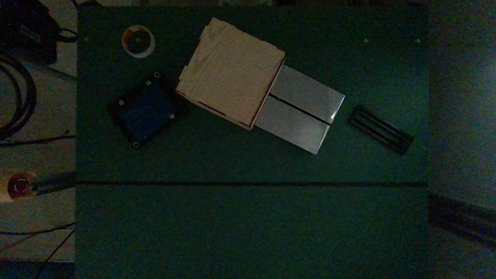

# HƯỚNG DẪN CHẠY THÍ NGHIỆM TRÊN CELL GP7

Bản 22/09/2026, cho người chạy cell. Sinh ảnh, huấn luyện và phân tích do người huấn luyện làm.

**Luật chung**

- Robot chỉ tự chạy từ Pha 2. Chép nguyên lệnh trong hướng dẫn, không thêm bớt. Mọi lệnh chạy
  thật đã có `--confirm-each-trial` (robot chờ ENTER trước mỗi lượt) và `--no-viewport-mirror`
  (thiếu nó, Ctrl+C không dừng được robot).
- **DỪNG** nghĩa là: dừng ngay, ghi lại, gửi về, chờ trả lời. Không tự sửa rồi chạy tiếp.
- Nút dừng khẩn luôn trong tầm tay. Không đưa tay vào cell khi servo bật. Không đổi tốc độ.
- Mọi lệnh gõ trong PowerShell, ở thư mục `DTwinGP7`, sau khi đã chạy `.venv\Scripts\activate`.
  IP tủ điều khiển: `192.168.1.100`.

**Thứ tự công việc**

| # | Việc | Robot | Mục |
|---|---|---|---|
| 1 | Lấy mã, kiểm máy | không | 1 |
| 2 | Chuẩn bị cell: kiểm camera, làm tool, chạm thử, dán thẻ, đo điểm thả | chỉ jog tay | 2 |
| 3 | Đọc cách đặt vật và chấm một lượt | | 3 |
| 4 | Pha 2: chạy thử 1 lượt rồi 5 lượt | tự chạy | 4 |
| 5 | Pha 3 (E1): 50 lượt | tự chạy | 5 |
| 6 | Pha 4 (E2): 4 buổi | tự chạy | 6, 7 |
| 7 | Pha 5 (E3, E4, E5): 8 buổi, khi người huấn luyện gửi mô hình | tự chạy | 6, 8 |

**Cần sẵn:** thước kẹp, thước lá, bút dạ, băng dính giấy, băng dính trong, tấm bàn cờ A3 đã in,
hai bộ thẻ vị trí đã in, một thanh gỗ hoặc nhựa cứng và một đinh dài (làm cây chỉ, mục 2.4),
thêm một đinh nữa làm điểm mốc.

---

## 1. Lấy mã và kiểm máy

Máy cần Python 3.10 trở lên và Git. Lần đầu:

```
git clone -b feat/synthgen-c2-c3-dataset https://github.com/manhhv87/DTwinGP7.git
cd DTwinGP7
python -m venv .venv
.venv\Scripts\activate
pip install -r requirements.txt
```

Những lần sau:

```
cd DTwinGP7
.venv\Scripts\activate
git pull
```

Nếu `git pull` báo lỗi vì file ở máy đã sửa (sẽ gặp sau khi làm mục 2.4 và 2.7), chạy bốn lệnh
này; các số đã sửa ở máy vẫn được giữ:

```
git checkout -- config/calibration/
git stash
git pull
git stash pop
```

Kiểm máy, chưa cần robot:

```
git log -1
pytest tests/ -q
python scripts/03_run_experiment.py --mode sim --headless --trials 5
```

**Đạt khi:** `git log -1` hiện mã `PIN_HASH` hoặc một mã mới hơn; dòng cuối của `pytest` không có
chữ `failed`; lệnh thứ ba tạo một file mới `results\experiment_headless_*.csv` (tỷ lệ `0.0%` ở lệnh
này là bình thường). Một bài test đo nhịp thời gian thỉnh thoảng trượt khi máy bận: hỏng đúng một
bài thì chạy lại `pytest`.

**Ghi:** số `passed`.

---

## 2. Chuẩn bị cell (một lần, đúng thứ tự)

Robot không tự chạy ở mục này: chỉ jog tay, chế độ TEACH, tốc độ thấp. Mỗi bước có **Đạt khi**
và **Ghi**; bước nào không đạt thì DỪNG.

### 2.1 Đúng camera đã hiệu chuẩn

Cắm camera D455, chạy:

```
python -c "from src.perception.camera import D455Camera; print(D455Camera().intrinsics)"
```

**Đạt khi:** `fx` 645,0; `fy` 644,2; `ppx` 647,3; `ppy` 368,8; mỗi số lệch dưới 0,1.
**Ghi:** bốn số in ra.

### 2.2 Camera chưa bị xê dịch

Dọn bàn trống, jog robot ra ngoài vùng bàn cho khuất camera, rồi chạy:

```
python scripts/02_run_calibration.py --table-only
```

**Đạt khi:** dòng `Table plane:` in `top` từ 591,9 đến 595,9 mm và `tilt` từ 0,12 đến 0,52°.
**Ghi:** `top`, `rms`, `tilt`.

Lệnh này ghi đè file mặt bàn. Đạt thì trả lại file gốc:

```
git checkout -- config/calibration/table_plane.json
```

Không đạt nghĩa là camera đã bị dịch: DỪNG.

### 2.3 Đo tấm bàn cờ

Thước kẹp: đo ba ô vuông đen rồi lấy trung bình cạnh ô; đo ba ô dấu ArUco (ô có hoa văn) rồi lấy
trung bình cạnh dấu; đo độ dày tấm.

**Đạt khi:** cạnh ô từ 44,8 đến 45,2 mm; cạnh dấu từ 33,8 đến 34,2 mm.
**Ghi:** ba số. Không đạt: DỪNG.

### 2.4 Làm cây chỉ, khai TOOL02 và TOOL01

Robot dùng hai tool:

- **TOOL01** là điểm gắp: điểm giữa hai đầu má kẹp. Nó nằm trong không khí nên không chạm được
  gì. Lệnh gắp dùng tool này.
- **TOOL02** là mũi một **cây chỉ** kẹp trong má. Mọi việc phải chạm (chạm thử, lấy dấu thẻ, đo
  điểm thả) đều dùng tool này.

**a) Làm cây chỉ.** Lấy một thanh gỗ hoặc nhựa cứng dài 200 mm (má kẹp chỉ kẹp được vật rộng từ
180 đến 216 mm). Đóng một đinh hoặc bu lông dài xuyên qua giữa thanh, vuông góc với thanh. Kẹp
thanh vào má: thanh nằm ngang, đinh thẳng đứng, mũi hướng xuống. Mũi đinh phải thò xuống **thấp
hơn đầu má kẹp ít nhất 20 mm**; ngắn hơn thì má kẹp chạm bàn trước mũi, phải thay đinh dài hơn.

**b) Khai TOOL02** bằng chức năng hiệu chuẩn tool 5 điểm của pendant:

1. Dựng đinh thứ hai thẳng đứng trên bàn, mũi hướng lên, cố định chắc. Đầu đinh này là **điểm mốc**.
2. Trên pendant: đặt chế độ bảo mật MANAGEMENT, vào MAIN MENU → ROBOT → TOOL, chọn tool số 2, rồi
   vào menu UTILITY → CALIBRATION.
3. Chọn TC1. Jog cho mũi cây chỉ chạm đúng điểm mốc, cây chỉ thẳng đứng. Bấm MODIFY rồi ENTER.
4. Lần lượt chọn TC2 đến TC5. Mỗi lần nghiêng cổ tay theo một hướng khác (trước, sau, trái, phải),
   mũi vẫn chạm đúng điểm mốc, bấm MODIFY rồi ENTER.
5. Bấm COMPLETE. Pendant tự tính X, Y, Z của mũi và lưu vào tool 2.
6. Kiểm: chọn TOOL02, hệ Robot, đưa mũi chạm điểm mốc, bấm các phím xoay (Rx, Ry, Rz).

Tên menu có thể khác đôi chút theo phiên bản; xem mục Tool calibration trong sổ tay YRC1000.

**c) Khai TOOL01** từ TOOL02:

1. Vẫn kẹp cây chỉ. Thước kẹp đo **d**: khoảng cách theo phương thẳng đứng từ mũi đinh lên tới
   ngang đầu dưới má kẹp.
2. Mở tool 2 trên pendant, đọc X, Y, Z.
3. Mở tool 1, nhập: X và Y giống tool 2; Z bằng Z của tool 2 trừ d.
4. Mở `config\cell_layout_real.yaml`, tìm dòng `tcp_offset_xyz_mm: [0, 0, 100]`, thay ba số trong
   ngoặc bằng X, Y, Z của tool 1. Lưu file.

**Đạt khi:** ở bước b6, mũi không rời điểm mốc khi xoay.
**Ghi:** X, Y, Z của tool 2; d; X, Y, Z của tool 1.

Mỗi lần tháo rồi lắp lại cây chỉ, làm lại phép kiểm b6. Mũi rời điểm mốc thì khai lại tool 2 (phần
b). Tool 1 không phải khai lại.

### 2.5 Chạm thử 8 điểm

1. Nếu tấm bàn cờ còn gắn trên má kẹp, tháo nó ra. Lắp cây chỉ, chọn TOOL02, hệ Robot.
2. Jog mũi cây chỉ tới X 575, Y 20, hạ xuống sát bàn. Đặt tấm bàn cờ nằm phẳng trên bàn, mặt in
   lên, tâm tấm ngay dưới mũi. Nâng mũi lên, jog robot ra ngoài cho khuất camera.
3. Chạy, thay ba số đo ở mục 2.3:

   ```
   python tools/touch_test.py --square-mm <cạnh ô> --marker-mm <cạnh dấu> --board-thickness-mm <độ dày>
   ```

4. Công cụ lưu ảnh `results\touch_test_<giờ>.png`, trên đó 8 góc ô được khoanh và đánh số, rồi hỏi
   lần lượt từng góc. Mở ảnh. Với góc số 1: jog mũi cây chỉ chạm đúng góc đó trên tấm, đọc X và Y
   trên pendant (hệ Robot, TOOL02), gõ hai số cách nhau một dấu cách rồi ENTER. Làm tiếp đến góc
   số 8. Góc nào không với tới thì gõ `s`.

**Đạt khi:** có file `results\touch_test_<giờ>.json`. Mục tiêu sai số là 3 mm; vượt vẫn làm tiếp,
chỉ cần ghi đúng số.
**Ghi:** trung bình (mean), RMS, lớn nhất (max), và độ lệch trung bình dx, dy mà công cụ in ra.

Nếu dx hoặc dy lớn hơn hẳn các số còn lại (mọi điểm lệch cùng một chiều), khai lại TOOL02 rồi chạm
thử lại một lần.

### 2.6 Lấy dấu và dán 21 thẻ

In `position_cards.pdf` ở 100%, kiểm vạch 50 mm in sẵn phải đúng 50 mm, cắt 21 thẻ theo viền.

1. Lắp cây chỉ, chọn TOOL02, hệ Robot. Với từng thẻ: jog mũi tới đúng X, Y in trên thẻ, hạ mũi chạm
   bàn, chấm một dấu bút dạ. Thẻ 1, 2, 3 ở Y = −160 với X = 525, 575, 625; mỗi hàng sau Y tăng
   60 mm; thẻ 19, 20, 21 ở Y = 200 (hình dưới).
2. Dán thẻ: chữ thập giữa thẻ trùng dấu, mũi tên trên thẻ chỉ ra xa robot (hướng +X). Băng dính
   trong phủ kín thẻ.
3. Kiểm: jog mũi về thẻ 1 (X 525, Y −160) và thẻ 21 (X 625, Y 200).

**Đạt khi:** tới được cả 21 điểm mà pendant không báo giới hạn khớp, và ở bước 3 mũi rơi đúng tâm
chữ thập.
**Ghi:** đạt hoặc không.


### 2.7 Điểm thả trên băng tải

Robot luôn thả vật tại cùng một X, Y. Độ cao lúc thả bằng độ cao lúc gắp, nên khi má mở đáy vật
ngang mặt bàn; băng tải thấp hơn bàn bao nhiêu thì vật rơi xuống bấy nhiêu.

1. Tắt băng tải. Chọn một điểm giữa băng, giữa hai thanh chắn.
2. TOOL02, hệ Robot: hạ mũi chạm mặt băng tải tại điểm đó, đọc X, Y, Z. Hạ mũi chạm mặt bàn ở chỗ
   bất kỳ trong vùng thẻ, đọc Z.
3. Mở `config\experiment.yaml`, tìm dòng `place_position: [700.0, 120.0, 700.0]`: thay hai số đầu
   bằng X, Y vừa đọc, giữ nguyên số thứ ba (không dùng). Lưu file.
4. Chấm dấu điểm đó trên băng tải. Dán hai vạch băng dính **cắt ngang băng tải** (vuông góc với
   chiều băng chạy), mép trong mỗi vạch cách dấu 15 mm về hai phía: khoảng trống giữa hai vạch rộng
   30 mm, dấu nằm chính giữa. Đây là **vạch thả**.

**Đạt khi:** Z mặt băng tải không cao hơn Z mặt bàn. Cao hơn: DỪNG (vật sẽ va vào băng tải).
**Ghi:** X, Y, Z mặt băng tải; Z mặt bàn.

### 2.8 Gửi về

Gửi các số đã ghi ở mục 1 và 2.1 đến 2.7. Mọi bước đạt thì tháo cây chỉ và sang mục 3, không cần
chờ trả lời.

---

## 3. Một lượt gắp: đặt vật và chấm

Trước mỗi lượt, màn hình in một dòng có `card=` (số thẻ), `yaw=` (góc) và `class=` (loại vật), ví dụ
`card=14  yaw=85.0 deg  class=metal_box`, rồi dừng chờ.

1. Đặt đúng loại vật: tâm vật lên chữ thập giữa thẻ, cạnh dài trùng vạch góc trên thẻ. Dung sai
   ±15 mm. Có dòng `STACKED` thì đặt vật đế trước, vật được gọi đặt lên trên.
2. **Rút tay ra**, bấm ENTER. Không nhìn màn hình nhận dạng trong lúc đặt.
3. Robot gắp và thả xong, màn hình hỏi `part in the right place? [y]=yes [n]=no`. Băng tải vẫn tắt.
   Gõ **y** nếu tâm vật nằm giữa hai vạch thả. Gõ **n** nếu kẹp trượt, vật rơi giữa đường, hoặc tâm
   vật nằm ngoài vạch.
4. Lấy vật khỏi băng tải trong lúc màn hình chờ ENTER của lượt sau. Không với ra băng tải khi robot
   đang chạy về.

---

## 4. Pha 2: chạy thử

**Chuyển chìa từ TEACH sang REMOTE là lúc nguy hiểm nhất.** Trước khi xoay chìa: tháo cây chỉ khỏi
má, dọn vật lạ trên bàn, đếm người, không còn tay ai trong cell, nút dừng khẩn trong tầm tay, nói
to cho cả phòng. Xoay chìa xong mới bật servo.

Đặt một hộp carton lên thẻ 11, rồi chạy:

```
python scripts/03_run_experiment.py --mode real --trials 1 --depth-mode rgbd --ik-source yrc --tool-no 1 --confirm-each-trial --no-viewport-mirror
```

Phần mềm tự kiểm tra (preflight) trước khi robot nhúc nhích; thiếu gì nó từ chối chạy và in cách
sửa. Lượt đầu chạy được thì chạy lại lệnh trên với `--trials 5` thay cho `--trials 1`. Lệnh này
không gọi thẻ: mỗi lượt tự đặt một vật bất kỳ lên một thẻ bất kỳ, rồi làm bước 2 đến 4 của mục 3.

**DỪNG nếu:** preflight báo lỗi; đầu má kẹp xuống gần mặt bàn hơn 20 mm (phần mềm không cho xuống
thấp hơn, xuống thấp hơn là TOOL01 sai); vật hoặc má kẹp va vào băng tải hay thanh chắn; robot đi
sai hướng; lỗi `motion_error` lặp lại.

**Ghi:** mỗi lượt, tâm vật rơi cách dấu điểm thả bao nhiêu mm (thước lá); số lượt hỏng trên 6 và lý do.

Xong, dồn file vào thư mục riêng:

```
mkdir results\pha2
move results\experiment_real_* results\pha2\
move results\telemetry_* results\pha2\
```

---

## 5. Pha 3: E1, đo nền tảng

`AN` là tên viết tắt người đặt vật: đổi thành tên thật, giữ nguyên trong mọi lệnh về sau.

```
pytest tests/ -q > results/e1_tests.txt
python scripts/17_compare_fk_ik.py --samples 500 --fair
python tools/hse_rtt.py 192.168.1.100 --n 1000 --csv results/e1_hse_rtt.csv | tee results/e1_rtt_tomtat.txt
python scripts/03_run_experiment.py --mode real --trials 50 --depth-mode rgbd --pose-list config/pose_lists/std_v2.csv --telemetry-hz 10 --session-id e1 --operator-id AN --ik-source yrc --tool-no 1 --confirm-each-trial --no-viewport-mirror
python scripts/05_analyze_telemetry.py latest | tee results/e1_telemetry_tomtat.txt
```

Ba lệnh đầu không di chuyển robot. Lệnh thứ tư gắp 50 lượt theo thẻ, mỗi lượt làm như mục 3.

**DỪNG nếu:** robot tự dừng ngoài ý muốn hoặc mất kết nối.
**Ghi:** `p50`, `p95`, `p99` của RTT và tần số telemetry đạt được (có trong hai file `_tomtat.txt`).
`p95` trên 100 ms là cảnh báo, không phải lỗi.

Xong, dồn file:

```
mkdir results\e1
move results\experiment_real_* results\e1\
move results\telemetry_* results\e1\
```

---

## 6. Cách chạy một buổi (dùng cho Pha 4 và Pha 5)

Mỗi buổi có một dòng **biến** lấy từ bảng ở mục 7 hoặc 8, và một **điều kiện**: *chuẩn* (bàn trống,
đèn phòng bình thường) hoặc *khó* (dựng như mục 7.2). Các lệnh dưới đây chép nguyên, không sửa chữ
nào: biến đã mang tên buổi và các số riêng của buổi.

1. **Đặt biến và dựng điều kiện.** Mở PowerShell, `cd DTwinGP7`, `.venv\Scripts\activate`, rồi dán
   dòng biến của buổi, ví dụ buổi đầu tiên:

   ```
   $B = "e2chuan-1"; $F = 0; $S = 1
   ```

   Đóng cửa sổ PowerShell giữa buổi thì mở lại và dán lại dòng này. Dựng điều kiện của buổi. Kiểm
   không còn file rời của buổi trước:

   ```
   dir results\experiment_real_*
   ```

   Không in ra gì là đúng. Còn file thì dồn về thư mục của buổi trước đã.

2. **Khối đối chứng đầu buổi**, 20 lượt, luôn chạy bằng mô hình gốc. Buổi *chuẩn*:

   ```
   python scripts/03_run_experiment.py --mode real --depth-mode rgbd --pose-list config/pose_lists/std_v2.csv --pose-slice 200:220 --session-id $B --block-id doichung-dau --operator-id AN --ik-source yrc --tool-no 1 --confirm-each-trial --no-viewport-mirror
   ```

   Buổi *khó*:

   ```
   python scripts/03_run_experiment.py --mode real --depth-mode rgbd --pose-list config/pose_lists/hard_v2.csv --pose-slice 200:220 --session-id $B --block-id doichung-dau --operator-id AN --ik-source yrc --tool-no 1 --confirm-each-trial --no-viewport-mirror --lighting dim
   ```

   Xong, dồn file:

   ```
   mkdir results\$B\doichung
   move results\experiment_real_* results\$B\doichung\
   move results\telemetry_* results\$B\doichung\
   ```

3. **Chiến dịch chính**: lệnh của buổi ở mục 7 hoặc 8. Với lệnh A, B, C, E, F: chạy trước một lần
   có thêm `--dry-run` ở cuối lệnh để xem lịch (robot không chạy), rồi chạy thật, bỏ `--dry-run`.
   Màn hình chỉ hiện mã A, B, C; mã nào là cấu hình nào nằm trong file khoá
   `results\blinding_keys\key_<tên buổi>.json`: **không mở file này**. Thấy dòng nào lộ tên cấu hình
   thì ghi vào nhật ký. Lệnh D chạy thẳng, không có `--dry-run`. Xong, dồn file:

   ```
   move results\experiment_real_* results\$B\
   move results\telemetry_* results\$B\
   ```

4. **Khối đối chứng cuối buổi**: chạy lại đúng lệnh của bước 2, chỉ đổi `doichung-dau` thành
   `doichung-cuoi`. Xong, dồn file:

   ```
   move results\experiment_real_* results\$B\doichung\
   move results\telemetry_* results\$B\doichung\
   ```

5. **Gửi về:** thư mục `results\<tên buổi>\`, file khoá (chưa mở), `logs\experiment.log`, các thư
   mục con mới trong `D:\Scientific\Dataset\DigitalTwin\frames`, trang nhật ký. Sao lưu `results\`
   và `logs\` ra ổ ngoài.

Chiến dịch dừng giữa chừng (lỗi, bấm dừng khẩn, mất điện): DỪNG. Không chạy lại lệnh chiến dịch với
cùng tên buổi (phần mềm sẽ từ chối). Ghi lượt cuối cùng đã chạy rồi gửi về.

Một buổi được phép nghỉ giữa chừng, miễn không đổi gì trong cell: camera, đèn, nền, thẻ, người đặt
vật. Bấm giờ 10 lượt đầu của buổi đầu tiên để biết một buổi mất bao lâu.

---

## 7. Pha 4: E2, bốn buổi

### 7.1 Các buổi

| Dòng biến | Điều kiện | Lệnh | Số lượt |
|---|---|---|---:|
| `$B = "e2chuan-1"; $F = 0; $S = 1` | chuẩn | A | 300 + 40 đối chứng |
| `$B = "e2chuan-2"; $F = 100; $S = 2` | chuẩn | A | 300 + 40 đối chứng |
| `$B = "e2kho-1"; $F = 0; $S = 3` | khó | B | 100 + 40 đối chứng |
| `$B = "e2kho-2"; $F = 100; $S = 4` | khó | B | 100 + 40 đối chứng |

**Lệnh A** (chuẩn, ba cấu hình độ sâu):

```
python tools/run_blinded_campaign.py --arm rgbd "--depth-mode rgbd" --arm plane "--depth-mode plane" --arm fusion "--depth-mode fusion" --pose-list config/pose_lists/std_v2.csv --first-pose $F --trials 100 --block 25 --session $B --operator AN --seed $S --common "--mode real --ik-source yrc --tool-no 1 --confirm-each-trial --no-viewport-mirror --save-frames --frames-dir D:/Scientific/Dataset/DigitalTwin/frames"
```

**Lệnh B** (khó, một cấu hình):

```
python tools/run_blinded_campaign.py --arm real_only "--depth-mode rgbd" --pose-list config/pose_lists/hard_v2.csv --first-pose $F --trials 100 --block 25 --session $B --operator AN --seed $S --common "--mode real --ik-source yrc --tool-no 1 --confirm-each-trial --no-viewport-mirror --save-frames --frames-dir D:/Scientific/Dataset/DigitalTwin/frames --lighting dim"
```

### 7.2 Dựng điều kiện khó

Điều kiện khó phải giống buổi chụp ngày 27/08/2026. Hai ảnh mẫu chụp từ chính camera của cell:
`anh_mau_bo_kho_1.jpg` và `anh_mau_bo_kho_2.jpg`.

1. Tấm nền xanh lá phủ kín mặt bàn như trong ảnh mẫu.
2. Giảm đèn phòng cho tới khi ảnh camera tối như ảnh mẫu: mặt nền gần như đen, vật vẫn nhận ra được.
3. Tấm nền che mất thẻ, nên dán **bộ thẻ thứ hai** lên tấm nền, lấy dấu bằng robot đúng như mục 2.6.
   Bộ thẻ này để luôn trên tấm nền, dùng lại cho mọi buổi khó.

Dựng xong, không đổi gì cho đến hết buổi. Hết buổi, cất tấm nền, bật đèn lại.



---

## 8. Pha 5: tám buổi, khi có mô hình mới

Mọi buổi Pha 5 dùng **điều kiện khó**, trình tự như mục 6.

### 8.1 Nhận mô hình

Người huấn luyện gửi các file mô hình (đuôi `.pt`), mỗi file kèm một mã SHA-256. Chép file vào thư
mục `models\`, giữ đúng tên, rồi kiểm từng file, ví dụ:

```
Get-FileHash models\e3_anchored.pt
```

Mã in ra (cột `Hash`) phải trùng mã được gửi, không kể chữ hoa hay chữ thường; không trùng thì
DỪNG. **Không sửa** `model_path` trong
`config\experiment.yaml`: khối đối chứng luôn chạy bằng mô hình gốc ghi ở đó, còn mô hình mới đã
ghi sẵn trong lệnh chiến dịch.

### 8.2 Các buổi

Chạy theo thứ tự trong bảng. Buổi nào cần file chưa có thì chờ người huấn luyện gửi.

| Dòng biến | Cần file trong `models\` | Lệnh | Số lượt |
|---|---|---|---:|
| `$B = "e3-1"; $F = 0; $S = 5` | `e3_anchored.pt`, `e3_wide.pt` | C | 200 + 40 đối chứng |
| `$B = "e3-2"; $F = 100; $S = 6` | như trên | C | 200 + 40 đối chứng |
| `$B = "e4adapt-1"; $M = "models/e3_anchored.pt"` | `e3_anchored.pt` | D | 80 + 40 đối chứng |
| `$B = "e4adapt-2"; $M = "models/e4_guided1.pt"` | `e4_guided1.pt` | D | 80 + 40 đối chứng |
| `$B = "e4-1"; $F = 0; $S = 7` | `e4_guided2.pt`, `e4_control2.pt` | E | 200 + 40 đối chứng |
| `$B = "e4-2"; $F = 100; $S = 8` | như trên | E | 200 + 40 đối chứng |
| `$B = "e5-1"; $F = 0; $S = 9` | `e5_camera.pt`, `e5_illumination.pt`, `e5_background.pt` | F | 300 + 40 đối chứng |
| `$B = "e5-2"; $F = 100; $S = 10` | như trên | F | 300 + 40 đối chứng |

**Lệnh C** (E3):

```
python tools/run_blinded_campaign.py --arm anchored "--depth-mode rgbd --model-path models/e3_anchored.pt" --arm wide "--depth-mode rgbd --model-path models/e3_wide.pt" --pose-list config/pose_lists/hard_v2.csv --first-pose $F --trials 100 --block 25 --session $B --operator AN --seed $S --common "--mode real --ik-source yrc --tool-no 1 --confirm-each-trial --no-viewport-mirror --save-frames --frames-dir D:/Scientific/Dataset/DigitalTwin/frames --lighting dim"
```

**Lệnh D** (E4, buổi adaptation): một cấu hình, không có mã A, B, không có file khoá; bước 3 của
mục 6 vẫn dồn file như thường.

```
python scripts/03_run_experiment.py --mode real --depth-mode rgbd --model-path $M --pose-list config/pose_lists/hard_v2.csv --pose-slice 220:300 --session-id $B --block-id adapt --operator-id AN --ik-source yrc --tool-no 1 --confirm-each-trial --no-viewport-mirror --save-frames --frames-dir D:/Scientific/Dataset/DigitalTwin/frames --lighting dim
```

**Lệnh E** (E4, đánh giá):

```
python tools/run_blinded_campaign.py --arm guided2 "--depth-mode rgbd --model-path models/e4_guided2.pt" --arm control2 "--depth-mode rgbd --model-path models/e4_control2.pt" --pose-list config/pose_lists/hard_v2.csv --first-pose $F --trials 100 --block 25 --session $B --operator AN --seed $S --common "--mode real --ik-source yrc --tool-no 1 --confirm-each-trial --no-viewport-mirror --save-frames --frames-dir D:/Scientific/Dataset/DigitalTwin/frames --lighting dim"
```

**Lệnh F** (E5):

```
python tools/run_blinded_campaign.py --arm camera "--depth-mode rgbd --model-path models/e5_camera.pt" --arm illumination "--depth-mode rgbd --model-path models/e5_illumination.pt" --arm background "--depth-mode rgbd --model-path models/e5_background.pt" --pose-list config/pose_lists/hard_v2.csv --first-pose $F --trials 100 --block 25 --session $B --operator AN --seed $S --common "--mode real --ik-source yrc --tool-no 1 --confirm-each-trial --no-viewport-mirror --save-frames --frames-dir D:/Scientific/Dataset/DigitalTwin/frames --lighting dim"
```

### 8.3 Tổng số lượt

| Pha | Việc | Lượt chính | Đối chứng |
|---|---|---:|---:|
| 2 | chạy thử | 1 + 5 | |
| 3 | E1 | 50 | |
| 4 | E2 chuẩn, 2 buổi | 600 | 80 |
| 4 | E2 khó, 2 buổi | 200 | 80 |
| 5 | E3, 2 buổi | 400 | 80 |
| 5 | E4 adaptation, 2 buổi | 160 | 80 |
| 5 | E4 đánh giá, 2 buổi | 400 | 80 |
| 5 | E5, 2 buổi | 600 | 80 |

---

## 9. Nhật ký

Máy tự ghi từng lượt vào CSV (kết quả máy, câu trả lời y/n, lý do hỏng, thời gian, toạ độ, thẻ,
buổi, khối, người đặt), telemetry, và toàn bộ màn hình vào `logs\experiment.log`. Người chỉ ghi thứ
máy không biết. Sau mỗi buổi, điền một trang:

| Mục | Ghi gì |
|---|---|
| Tên buổi, ngày, giờ bắt đầu và kết thúc | |
| Người đặt vật | |
| Số lượt đã chạy, số lượt hỏng | |
| Điều kiện phòng | đèn nào bật, có che nắng không, ai đi qua chắn sáng |
| Bất thường | robot dừng, vật rơi, thẻ xê dịch, camera bị chạm, dòng lỗi lộ tên cấu hình |

---

## Phụ lục: hiệu chuẩn lại (chỉ làm khi người huấn luyện yêu cầu)

Chỉ cần khi mục 2.2 hoặc 2.3 không đạt.

1. In `charuco_a3_o45mm.pdf` ở 100%, kiểm vạch 100 mm in sẵn, giấy mặt mờ, dán lên tấm alu 3 mm. Gá
   lên má kẹp bằng hai thanh nhôm hộp 20 × 40 dán ở lưng tấm, hai mặt ngoài cách nhau 200 mm, mặt in
   ngửa lên, tấm cao 250 đến 470 mm trên bàn (hai bản vẽ dưới).
2. Robot ở TEACH, bàn trống, chạy (thay hai số đo mới của tấm):

   ```
   python scripts/02_run_calibration.py --hse-ip 192.168.1.100 --squares 7 5 --square-mm <cạnh ô> --marker-mm <cạnh dấu> --dict DICT_4X4_50 --method park --bootstrap 200
   ```

3. Mỗi tư thế: jog cho camera thấy rõ cả tấm, bấm ENTER, đợi dòng `Captured pose #n`. Lấy 25 đến 30
   tư thế, xoay mặt bích nhiều hướng, rải khắp bàn. Gõ `s` để giải. Rồi tháo tấm, dọn bàn, đưa robot
   ra khỏi tầm nhìn, bấm ENTER để đo mặt bàn.

**DỪNG nếu:** không ra đủ bốn file trong `config\calibration\`, hoặc dưới 25 tư thế.
**Ghi:** `tilt_deg`, `rms_mm` trong `table_plane.json`. Gửi cả bốn file về. Không chạy `git pull`
cho tới khi người huấn luyện báo đã đưa bốn file này lên git. Sau đó làm lại mục 2.5.


