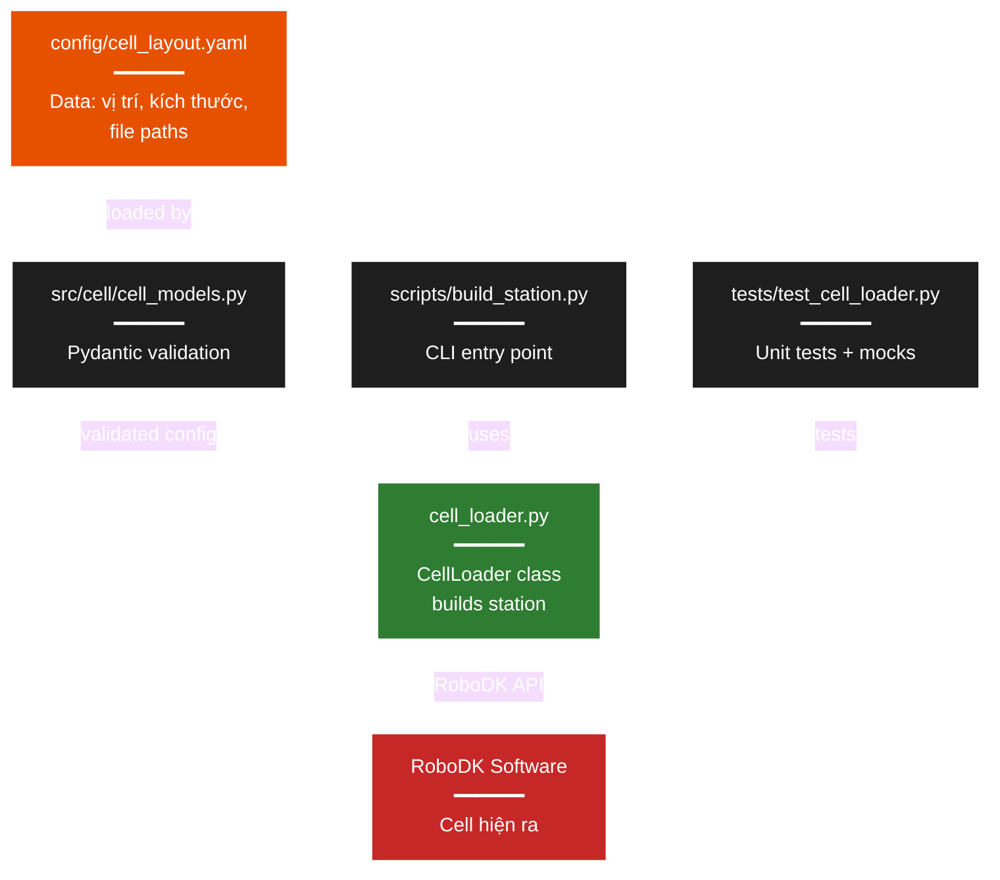
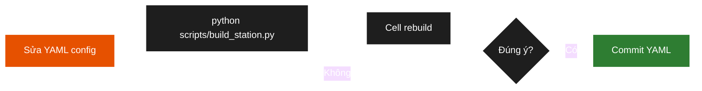

# PHỤ LỤC A — Cell Management Module

Module quản lý RoboDK cell theo paradigm **code-first**: cell được mô tả bằng config YAML + Python code, dựng lại bằng script mỗi lần mở RoboDK. Áp dụng khi RoboDK Free không lưu được `.rdk`, đồng thời cho version-control + reproducibility.

---

## A.1. Tổng quan

### Cấu trúc file

```
pickplace_gp7/
├── config/
│   ├── cell_layout.yaml             config cell — chế độ mô phỏng
│   └── cell_layout_real.yaml        config cell — chế độ robot thật
├── src/cell/                        Package cell
│   ├── __init__.py                  public API
│   ├── cell_models.py               Pydantic schemas + validation
│   ├── cell_loader.py               CellLoader — dựng station từ config (hỗ trợ flag minimal_build)
│   ├── exceptions.py                custom exceptions
│   └── pose_utils.py                pose math helpers
├── scripts/                         (các script cell-related)
│   ├── build_station.py             CLI dựng cell từ YAML, hỗ trợ --minimal
│   ├── gen_primitive_meshes.py      sinh STL primitive (gripper, worktable)
│   ├── convert_glb_to_stl.py        chuyển GLB → STL
│   ├── diagnose_layout.py           kiểm tra cell_layout.yaml hợp lý
│   ├── set_home_pose.py             quét IK để chọn home_joints_deg phù hợp
│   ├── calibration_from_layout.py   sinh T_base_camera.npy từ camera.pose
│   └── probe_api_limit.py           đo RoboDK API rate-limit
└── tests/
    └── test_cell_loader.py          22 unit + integration tests cho module này
                                     (tổng cộng 79 test cho toàn bộ repo)
```

### Yêu cầu

```bash
pip install robodk pydantic pyyaml numpy
pip install pytest pytest-mock     # cho tests
```

Python 3.10+ (type hints hiện đại).

### 5 nguyên tắc design

1. **Config as Data** — tham số cell (vị trí, kích thước, file mesh) sống trong YAML, text, version-control-able.
2. **Code as Logic** — logic dựng cell là Python, testable + debuggable.
3. **Validation first** — Pydantic schema → fail-fast nếu config sai.
4. **Idempotent** — chạy lại `build_station.py` luôn cho cùng kết quả (clear + rebuild).
5. **Composable** — nhiều file config (sim/real/dev/…) cho các kịch bản khác nhau.

---

## A.2. Kiến trúc



---

## A.3. Schema YAML

### A.3.1. Top-level structure

```yaml
metadata:         # Optional - version, author, last_modified, notes
robot:            # Required - robot configuration
worktable:        # Required - main work surface
camera:           # Required - virtual camera (sim) or info (real)
gripper:          # Required - end-effector tool
frames:           # Optional - reference frames list
objects:          # Optional - object templates list
robot_connection: # Optional - for online mode with real robot
camera_mount:     # Optional - giàn lắp camera
```

#### `robot`

| Field | Type | Required | Default | Description |
|---|---|---|---|---|
| `name` | string | ✅ | — | Tên hiển thị trong RoboDK |
| `source` | enum: "library" \| "file" | ✅ | "library" | Nguồn load robot |
| `library_name` | string | If source=library | — | Tên file trong RoboDK Library |
| `file_path` | string | If source=file | — | Đường dẫn `.robot` file |
| `pose.xyz_mm` | [float, float, float] | ✅ | — | Vị trí gốc (mm) |
| `pose.rpy_deg` | [float, float, float] | ❌ | [0,0,0] | Roll-Pitch-Yaw (độ) |
| `home_joints_deg` | list[float] | ✅ | — | 6 góc khớp home (độ) |

#### `worktable`

| Field | Type | Required | Default | Description |
|---|---|---|---|---|
| `mesh` | string | ✅ | — | Đường dẫn relative tới mesh file |
| `pose.xyz_mm` | [float, float, float] | ✅ | — | Vị trí bàn |
| `pose.rpy_deg` | [float, float, float] | ❌ | [0,0,0] | Hướng bàn |
| `color_rgb` | [float, float, float] | ❌ | [0.6, 0.6, 0.7] | Màu RGB [0–1] |

#### `camera`

| Field | Type | Required | Description |
|---|---|---|---|
| `type` | enum: "virtual" \| "real" | ❌ | Default "virtual". `real` = info-only |
| `model` | string | ❌ | Tên model (vd "D455") |
| `pose.xyz_mm` | [float, float, float] | ✅ | Vị trí camera |
| `pose.rpy_deg` | [float, float, float] | ❌ | Hướng nhìn (default [0,0,0]) |
| `intrinsics.fov_deg` | float | ❌ | FOV horizontal, ∈ (0, 180) nếu cung cấp |
| `intrinsics.focal_length_mm` | float | ❌ | Tiêu cự, > 0 nếu cung cấp |
| `intrinsics.size_px` | [int, int] | ❌ | [width, height], ∈ [100, 8192] |

> Nếu `intrinsics` được cung cấp thì cả 3 sub-field bên trong đều bắt buộc.

#### `gripper`

| Field | Type | Required | Description |
|---|---|---|---|
| `name` | string | ✅ | Tên tool |
| `mesh` | string | ❌ | Đường dẫn mesh (có warn nếu thiếu, TCP vẫn được tạo) |
| `tcp_offset_xyz_mm` | [float, float, float] | ✅ | TCP cách flange |
| `tcp_offset_rpy_deg` | [float, float, float] | ❌ | Xoay TCP (default [0,0,0]) |

#### `frames` (list)

| Field | Type | Required | Description |
|---|---|---|---|
| `name` | string | ✅ | Tên frame |
| `pose.xyz_mm` | [float, float, float] | ✅ | Vị trí |
| `pose.rpy_deg` | [float, float, float] | ❌ | Hướng |
| `parent` | string | ❌ | Tên frame cha (phải tồn tại trong cùng list) |

#### `objects` (list)

| Field | Type | Required | Description |
|---|---|---|---|
| `name` | string | ✅ | Class name (bottle, cup, bolt…) |
| `mesh` | string | ✅ | Đường dẫn CAD STL |
| `visible` | bool | ❌ | Default `false` (ẩn ban đầu) |
| `parent_frame` | string | ❌ | Tên frame chứa object |

#### `robot_connection`

| Field | Type | Required | Description |
|---|---|---|---|
| `enabled` | bool | ❌ | Default `False`. `True` = connect khi build |
| `ip` | string | If enabled | IP YRC1000 |
| `port` | int | ❌ | Default 80 |
| `driver` | string | ❌ | Default "Motoman" |
| `max_speed_percent` | float | ❌ | Default 30.0, range 1–100 (giới hạn an toàn) |
| `acceleration_percent` | float | ❌ | Default 50.0, range 1–100 |

#### `camera_mount` (optional)

| Field | Type | Required | Description |
|---|---|---|---|
| `mesh` | string | ✅ | Đường dẫn mesh giàn camera |
| `pose.xyz_mm` | [float, float, float] | ✅ | Vị trí giàn |
| `pose.rpy_deg` | [float, float, float] | ❌ | Hướng giàn |

### A.3.2. Validation rules

**Pydantic schema** — kiểm khi `CellConfig.from_yaml()` parse YAML:
- `home_joints_deg` phải có đúng 6 giá trị
- `pose.xyz_mm` mỗi component ∈ [−5000, 5000] mm
- `pose.rpy_deg` mỗi component ∈ [−360, 360] độ
- `color_rgb` mỗi component ∈ [0, 1]
- `camera.intrinsics`: `fov_deg ∈ (0, 180)`, `focal_length_mm > 0`, `size_px ∈ [100, 8192]`
- `frames[i].parent` + `objects[i].parent_frame` phải trỏ vào frame đã khai báo
- `robot_connection.enabled=true` ⇒ `ip` bắt buộc

**Runtime check** — kiểm khi `CellLoader.build()` chạy:
- `mesh` paths phải tồn tại trên disk → raise `MissingMeshError`
- Robot library file phải có trong `C:/RoboDK/Library/` → raise `MissingRobotError`
- Kết nối RoboDK Software → raise `RoboDKConnectionError` nếu GUI chưa mở

---

## A.4. Cách dùng

### A.4.1. Lần đầu setup

```bash
# 1. Tải GP7 về Library
#    RoboDK GUI > File > Open Online Library > tìm "Yaskawa GP7" > drag vào
#    → file tự download về C:/RoboDK/Library/Yaskawa-GP7.robot

# 2. Đặt mesh files vào project:
#      models/worktable.stl                     (bắt buộc)
#      models/gripper.stl                       (optional, có warn nếu thiếu)
#      models/camera_mount.stl                  (optional)
#      models/objects/{bottle,cup,bolt}.stl     (theo objects khai báo trong YAML)

# 3. Sửa config/cell_layout.yaml cho phù hợp setup

# 4. Verify config hợp lệ
python -m src.cell.cell_models validate config/cell_layout.yaml
```

### A.4.2. Chạy hàng ngày

```bash
# Mở RoboDK GUI (empty station), rồi:
python scripts/build_station.py                                      # config mặc định
python scripts/build_station.py --config config/cell_layout_real.yaml
python scripts/build_station.py --no-clear                           # giữ items hiện tại
python scripts/build_station.py --verbose                            # DEBUG log
python scripts/build_station.py --minimal                            # build tối giản (~12 API call thay vì ~22)
```

**`--minimal` flag**: bỏ các item cosmetic — floor, Cam2D viewport (giữ CameraFrame),
CalibrationTarget frame, 2/3 object templates (chỉ giữ object đầu tiên). Hữu ích
khi RoboDK Free hit rate-limit hoặc khi chạy iteratively trong dev. Object detection
vẫn hoạt động đầy đủ vì MockDetector sinh detection độc lập với template trong RoboDK.

**Exit codes**: `0` thành công · `1` connection/runtime · `2` config validation · `3` missing file. Log đầy đủ ở `logs/build_station.log`.

### A.4.3. Vòng iterate khi đổi cell



### A.4.4. VS Code task (tuỳ chọn)

`.vscode/tasks.json`:

```json
{
  "version": "2.0.0",
  "tasks": [
    {
      "label": "RoboDK: Build Station (sim)",
      "type": "shell",
      "command": "python",
      "args": ["scripts/build_station.py", "--config", "config/cell_layout.yaml"]
    },
    {
      "label": "RoboDK: Build Station (real)",
      "type": "shell",
      "command": "python",
      "args": ["scripts/build_station.py", "--config", "config/cell_layout_real.yaml"]
    }
  ]
}
```

→ Ctrl+Shift+P → "Run Task".

---

## A.5. Troubleshooting

| Lỗi | Nguyên nhân | Fix |
|---|---|---|
| `RoboDKConnectionError` | RoboDK GUI chưa mở | Mở RoboDK trước, rồi chạy script |
| `MissingRobotError` | Chưa drag GP7 từ Online Library | RoboDK > File > Open Online Library > search "GP7" > drag vào |
| `MissingMeshError` | STL file thiếu | Check path trong YAML, đặt mesh đúng chỗ |
| `InvalidConfigError: home_joints_deg must have 6 values` | Schema sai | Đếm element trong YAML |
| `ValueError: rpy_deg must be in [-360, 360]` | Góc out-of-range | Giảm về [−180, 180] |
| Cell load OK nhưng robot ở sai vị trí | `xyz_mm` sai unit (m vs mm) | Verify dùng mm (số thường > 100) |
| Robot quay tay sai sau `MoveJ` | Joints sai convention | Check `home_joints_deg` đúng convention Yaskawa `[S, L, U, R, B, T]` |
| Exit code 2 | Config validation fail | Đọc kỹ message lỗi, sửa YAML |
| Exit code 3 | Missing file (mesh hoặc robot) | Đặt file đúng vị trí được trỏ trong YAML |

---

## A.6. Testing

```bash
pytest tests/test_cell_loader.py -v     # 22 test riêng cho module này
pytest tests/ -v                         # toàn bộ — kỳ vọng 79 passed
```

**Chiến lược test**:
- **Unit** — pose math, Pydantic validation (không cần RoboDK)
- **Integration** — `CellLoader` logic với mock RoboDK API
- **End-to-end** — chạy thủ công với RoboDK GUI thật trước khi merge

Output mong đợi:
```
tests/test_cell_loader.py::TestPoseUtils::test_make_identity PASSED
tests/test_cell_loader.py::TestPoseConfig::test_xyz_too_large_raises PASSED
tests/test_cell_loader.py::TestRobotConfig::test_wrong_num_joints_raises PASSED
tests/test_cell_loader.py::TestCellConfig::test_frame_reference_validation PASSED
tests/test_cell_loader.py::TestCellLoader::test_loader_can_instantiate PASSED
tests/test_cell_loader.py::TestCellConfigFromYAML::test_load_from_valid_yaml_file PASSED
...
======================== 79 passed in 8s ========================
```

CI/CD chạy được unit + integration; end-to-end để chạy local.

---

## A.7. Mở rộng

### Thêm item type mới (ví dụ conveyor)

**Bước 1** — Thêm Pydantic model trong `cell_models.py`:

```python
class ConveyorConfig(BaseModel):
    name: str
    mesh: str
    pose: PoseConfig
    speed_mm_s: float = 100.0
    direction: Literal['x', 'y'] = 'x'
```

**Bước 2** — Thêm field vào `CellConfig`:

```python
class CellConfig(BaseModel):
    # ... existing fields ...
    conveyors: List[ConveyorConfig] = []
```

**Bước 3** — Thêm method `_load_conveyors()` trong `CellLoader` theo pattern các `_load_*` hiện có (pose → `make_homogeneous(xyz, rpy)`, mesh → `_resolve_path()`, item → `_rdk.AddFile(...)`), rồi gọi trong `build()`.

### Multi-config

```bash
python scripts/build_station.py --config config/cell_layout.yaml         # sim
python scripts/build_station.py --config config/cell_layout_real.yaml    # real
python scripts/build_station.py --config config/cell_layout_dev.yaml     # dev (tự tạo)
```

Mỗi config copy từ base, chỉ override field khác biệt.

---

## A.8. Best practices

1. **Commit YAML, không commit STL lớn** — dùng Git LFS hoặc script tải mesh riêng.
2. **Đặt tên config theo kịch bản** — `cell_layout.yaml` (sim), `cell_layout_real.yaml`, `cell_layout_exp2_ablation.yaml`, …
3. **Tận dụng `metadata` trong YAML** để track version cell:
   ```yaml
   metadata:
     version: "1.2.0"
     last_modified: "2025-01-15"
     author: "Your Name"
     notes: "Updated camera height to 850 mm after calibration"
   ```
4. **Logging** — `build_station.py` đã tự ghi `logs/build_station.log`; script mới follow pattern:
   ```python
   logging.basicConfig(handlers=[
       logging.FileHandler('logs/<script_name>.log'),
       logging.StreamHandler(),
   ])
   ```
5. **CI validate config** — chạy `python -m src.cell.cell_models validate config/cell_layout.yaml` trong pipeline để bắt sai schema sớm.

---

*Phụ lục A — v1.0. Mã nguồn: `pickplace_gp7/src/cell/`, `scripts/build_station.py`, `tests/test_cell_loader.py`.*
