# HỆ THỐNG PICK-AND-PLACE CÙNG ROBOT GP7

Vision-guided pick-and-place dùng Yaskawa GP7, YOLOv8-seg cho perception, RealSense
D455 cho RGB-D, Open3D Filament GUI làm viewport 3D, pure-Python kinematics
client-side cho FK/IK.

**Tóm tắt kiến trúc**:
- HSE là motion path cho robot thật — Python nói chuyện thẳng với YRC1000 qua
  UDP HSE protocol. FK/IK chạy client-side bằng URDF chain pure numpy (verified 
  match RoboDK SolveFK 0.00mm qua `scripts/13_verify_vs_robodk.py`).
- Hai motion backend: `SimRobot` (dev / headless / sim GUI) và `MotomanHSEBackend`
  (real). CLI `--backend {sim, hse}`. `--mode real` force `hse`.
- Sim non-headless + real cùng pattern: motion backend wrap trong DigitalTwinMirror
  facade, Open3D viewport (`O3DGuiSimRobot`) nhận setJoints @2Hz qua mirror
  thread để mirror state thật.
- 293 test case cover L1–L3 (HSE protocol + backend, INFORM codegen,
  ultra-fast P-var, digital twin mirror, kinematics FK + IK, frame conversion, ...).

---

## MỤC LỤC

1. Kiến trúc tổng thể (mục 1–3)
2. Xây dựng dataset (mục 4)
3. Xây dựng & huấn luyện model (mục 5)
4. Hand-eye calibration (mục 6)
5. Tích hợp model vào hệ thống (mục 7)
6. Test, hiệu chỉnh, thí nghiệm (mục 8–10)
7. Lộ trình triển khai + checklist (mục 11–13)

---

# PHẦN A: KIẾN TRÚC TỔNG THỂ

## 1. Stack

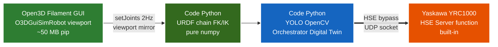

**Stack** dùng 1 motion path cho robot thật:
- Python → UDP HSE → YRC1000 → GP7. HSE Server là function built-in của
  YRC1000, không phụ thuộc vendor driver license.
- Open3D Filament GUI (`O3DGuiSimRobot`) là viewport 3D mirror robot thật @2Hz.
  Không tham gia motion path.
- FK/IK client-side dùng URDF chain pure numpy (`urdf_chain.py` +
  `inverse_kinematics.py`). Verified match RoboDK SolveFK 0.00mm qua
  `scripts/13_verify_vs_robodk.py`.

## 2. Sơ đồ kết nối hệ thống — Level-4 Bidirectional Digital Twin

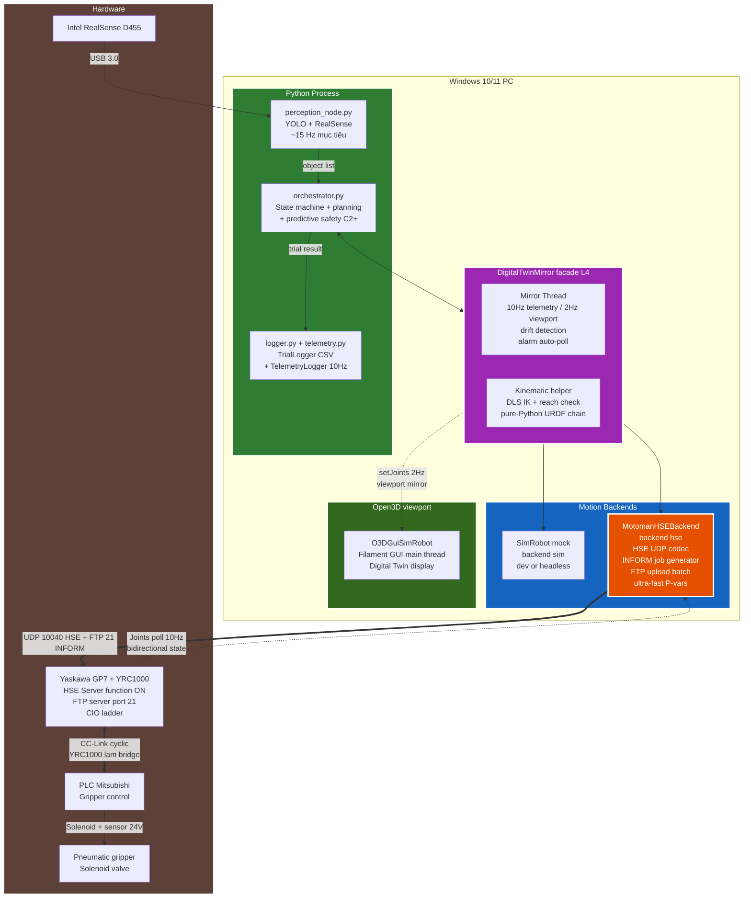

### Giải thích kiến trúc

**5 tầng** (từ ngoài vào trong):

| Tầng | Component | Vai trò |
|---|---|---|
| **1. Perception** | `perception_node`, YOLO, D455 | RGB-D → detection 3D pose |
| **2. Orchestrator** | `orchestrator.py` | State machine pick-and-place + planning + safety C2+ |
| **3. Digital Twin Facade** | `digital_twin.py` `DigitalTwinMirror` | **Tầng then chốt L4** — facade kết hợp motion backend + kinematic helper + mirror thread |
| **4. Motion Backends (pluggable)** | `backends/` — 2 implementations | `SimRobot` (dev/headless) + **`MotomanHSEBackend`** (real). |
| **5. Hardware/Sim** | Open3D viewport (`O3DGuiSimRobot`) + YRC1000+GP7 thật (motion) | Open3D chỉ display, motion qua HSE UDP |

### Vai trò "Digital Twin" cấp Level-4 trong stack này

Theo phân loại Gartner (L1–L5 digital twin maturity), hệ thống đạt **Level-4 Comprehensive Bidirectional Digital Twin**:

| Cấp | Khả năng | Implementation |
|---|---|---|
| L1 — Descriptive | Mô hình 3D tĩnh | Open3D viewport mesh từ YAML |
| L2 — Informative | + sensor data | Telemetry CSV @10Hz |
| L3 — Predictive | + simulate future | Pure-Python FK + trajectory check (mục 7.5) |
| **L4 — Comprehensive** | + bidirectional + analytics + auto-response | Mirror thread + drift detection + alarm auto-Stop |
| L5 — Autonomous | self-optimizing | Ngoài scope project |

### Bidirectional state sync

Mirror thread trong `digital_twin.py` chạy 2 luồng dữ liệu song song:

1. **Command path** (PC → robot): Orchestrator gọi `MoveJ()/setDO()` → backend gửi
   INFORM job qua FTP + JOB_START qua HSE UDP → robot thật chạy.
2. **State sync path** (robot → PC): Mỗi 100ms, mirror thread đọc joint state thật
   qua HSE `READ_POSITION` (0x75) → `setJoints()` lên Open3D viewport
   (`O3DGuiSimRobot`) → viewport phản ánh **vị trí THẬT** của robot, không phải
   vị trí được lệnh.

Tách rời 2 rate (`telemetry_hz=10`, `mirror_hz=2`) để:
- CSV resolution cao cho post-analysis (velocity, cycle time)
- Viewport setJoints thấp giảm tải GUI rendering thread

### Lý do chọn HSE làm motion path

Bảng dưới so sánh HSE với phương án vendor driver (không dùng) để làm rõ
quyết định kiến trúc:

| Yếu tố | Vendor driver | HSE (chọn) |
|---|---|---|
| License | Cần tier có driver | **Không cần** — HSE Server built-in |
| Setup phía YRC1000 | Driver IP + port | HSE Server function ON (Maintenance mode) |
| Per-trial overhead | ~50ms | ~200ms (M3 batch) hoặc **~50ms (M3++ ultra-fast)** |
| Visibility | Black-box | Open protocol, byte-level testable |
| Foundation độc lập | ❌ Phụ thuộc commercial tool | ✅ Standalone, citable |

**Đóng góp kỹ thuật của project**: implement HSE path hoàn chỉnh từ public protocol
spec (Yaskawa HSE Server Function Manual HW1485553), bao gồm packet codec, INFORM
job generator, P-variable ultra-fast pattern.

## 3. Cấu trúc thư mục code

```
DTwinGP7/                               # BỘ CODE + TÀI LIỆU (repo DTwinGP7)
├── README.md
├── requirements.txt
├── pyproject.toml
├── clean.bat                           # tiện ích xóa __pycache__
├── docs/                               # TÀI LIỆU
│   ├── phat_bieu_bai_toan_v3_2_HD.md
│   ├── HUONG_DAN_CAI_DAT.md
│   ├── HUONG_DAN_SU_DUNG.md            # workflow + CLI flags theo kịch bản
│   └── SETUP_YRC_TOOL.md               # setup TOOL01 trên teach pendant (real mode)
├── config/
│   ├── cell_layout.yaml                # cell mô phỏng
│   ├── cell_layout_real.yaml           # cell cho robot thật
│   ├── experiment.yaml                 # tham số Orchestrator + thí nghiệm
│   └── calibration/
│       └── T_base_camera.npy           # output hand-eye (sinh khi chạy)
├── data/
│   └── raw/                            # ảnh thô từ D455
├── models/
│   ├── README.md
│   ├── yolov8s-seg_best.pt             # trọng số (copy từ máy train Linux)
│   ├── gripper.stl                     # parallel-jaw 2-finger 120×50×110mm
│   ├── worktable.stl                   # bàn làm việc (primitive procedural)
│   ├── floor.stl                       # sàn cell (primitive procedural)
│   ├── pedestal.stl                    # bệ robot GP7
│   ├── gp7_links/                      # 7 STL link Yaskawa GP7 cho URDF chain
│   │   ├── gp7_base_link.stl
│   │   ├── gp7_link_1_s.stl … gp7_link_6_t.stl
│   └── objects/                        # mesh STL: tray + bottle/cup/bolt
├── src/
│   ├── cell/                           # Cell config schema (Pydantic)
│   │   ├── __init__.py
│   │   ├── cell_models.py              # Pydantic schemas (CellConfig.from_yaml)
│   │   ├── exceptions.py
│   │   └── pose_utils.py
│   ├── perception/
│   │   ├── __init__.py
│   │   ├── camera.py                   # D455 wrapper + MockCamera
│   │   ├── detector.py                 # YOLO inference + MockDetector
│   │   ├── postprocess.py              # mask centroid + PCA + depth
│   │   └── perception_node.py
│   ├── orchestrator/
│   │   ├── __init__.py
│   │   ├── coord_conv.py               # transform utilities
│   │   ├── state_machine.py
│   │   ├── orchestrator.py             # pick-place state machine + predictive safety C2+
│   │   ├── sim_robot.py                # SimRobot mock thuần Python (--headless)
│   │   ├── digital_twin.py             # L4 façade: mirror, telemetry, drift, alarm
│   │   ├── telemetry.py                # CSV logger thread-safe (joint + alarm)
│   │   ├── frame_convert.py            # world → robot BASE + Yaskawa XYZ-fixed RPY (HSE Cartesian)
│   │   ├── viewports/                  # Open3D Filament GUI viewport
│   │   │   ├── open3d_gui_sim_robot.py # O3DGuiSimRobot: sim viewport + real mirror @2Hz
│   │   │   └── urdf_gen.py             # URDF spec → tessellated mesh cho Open3D
│   │   ├── kinematics/                 # Pure-Python FK + IK + trajectory (UC1/UC2/UC4)
│   │   │   ├── urdf_chain.py           # GP7 URDF chain — source-of-truth, match RoboDK 0.00mm (qua 
|   |   |   |                           # scripts/13_verify_vs_robodk.py)
│   │   │   ├── dh_model.py             # GP7 Modified DH params (legacy, backward compat)
│   │   │   ├── forward_kinematics.py   # joints → pose 4x4 (pure numpy)
│   │   │   ├── inverse_kinematics.py   # Damped Least Squares IK (URDF/DH polymorphic)
│   │   │   └── trajectory.py           # interpolate + joint limit + collision check
│   │   └── backends/                   # Pluggable motion backends
│   │       ├── base.py                 # RobotBackend Protocol
│   │       ├── hse_protocol.py         # Yaskawa HSE packet codec (UDP 10040)
│   │       ├── inform_codegen.py       # INFORM .JBI generator (C-var + P-var template)
│   │       ├── motoman_hse.py          # MotomanHSEBackend (HSE + FTP + batch + ultra-fast)
│   │       ├── reach_envelope.py       # GP7 sphere reach client-side (thay MoveJ_Test)
│   │       └── alarm_codes.py          # YRC1000 alarm decoder + severity
│   ├── calibration/
│   │   ├── __init__.py
│   │   ├── capture_calibration.py
│   │   └── hand_eye_solver.py
│   ├── logging/
│   │   ├── __init__.py
│   │   └── logger.py
│   └── utils/
│       ├── __init__.py
│       └── helpers.py
├── scripts/
│   ├── 01_collect_dataset.py
│   ├── 02_run_calibration.py
│   ├── 03_run_experiment.py            # main: --mode sim/real, --backend sim/hse,
│   │                                   #   --headless, --ultra-fast, --no-viewport-mirror
│   ├── 04_analyze_results.py
│   ├── 05_analyze_telemetry.py         # visualize CSV telemetry → 4 PNG (joint, velocity, alarm, cycle)
│   ├── 06_simulate_trial.py            # UC1: predictive simulation offline → 3D figure
│   ├── 07_replay_telemetry.py          # UC4: replay CSV → 3D animation/MP4
│   ├── 11_test_yrc_cartesian.py        # 3-phase test YRC Cartesian motion trên robot thật
│   ├── 13_verify_vs_robodk.py          # FK fidelity + DLS IK round-trip vs RoboDK; --samples N --histogram cho figure
│   ├── calibration_from_layout.py      # sinh T_BC từ camera.pose cho headless
│   ├── convert_glb_to_stl.py           # GLB → STL utility
│   └── gen_primitive_meshes.py         # sinh STL primitive (gripper, ...)
├── tests/                              # 293 test cases (pytest, 100% pass)
│   ├── test_coord_conv.py
│   ├── test_postprocess.py
│   ├── test_state_machine.py
│   ├── test_hand_eye_solver.py
│   ├── test_orchestrator_sim.py        # integration với MagicMock robot + CC-Link gripper
│   ├── test_sim_robot.py               # test SimRobot reach + grasp injection
│   ├── test_hse_protocol.py            # HSE packet codec byte-level verify + Cartesian encode
│   ├── test_motoman_hse.py             # HSE backend với mock socket + Cartesian routing
│   ├── test_inform_codegen.py          # INFORM .JBI generator
│   ├── test_ultra_fast.py              # M3++ P-variable template caching
│   ├── test_digital_twin.py            # mirror thread + drift + alarm + sim backend compat
│   ├── test_telemetry.py               # CSV logger thread-safety
│   ├── test_kinematics.py              # forward kinematics + trajectory
│   ├── test_inverse_kinematics.py      # Damped Least Squares IK round-trip
│   ├── test_frame_convert.py           # world→base + Yaskawa RPY round-trip
│   ├── test_alarm_codes.py             # alarm severity decoder
│   ├── test_reach_envelope.py          # sphere reach model
│   ├── test_predict_safety.py          # UC2 orchestrator integration
│   └── test_analyze_telemetry.py       # telemetry analyzer smoke
└── results/ · figures/ · logs/         # thư mục output khi chạy
```

> **Lưu ý về huấn luyện model:** việc train YOLOv8 (mục 5) thực hiện trên
> máy Linux + GPU riêng, không nằm trong `DTwinGP7/`. Repo chỉ nhận file
> trọng số `.pt`/`.onnx` đã train để inference. Dataset thu ở `data/raw/`,
> gán nhãn trên Roboflow rồi chuyển sang máy Linux để train.

> **Lưu ý về 4 chế độ chạy thí nghiệm**:
>
> | Chế độ | CLI | Phụ thuộc | Use case |
> |---|---|---|---|
> | Sim với Open3D GUI | `--mode sim` | Open3D | Demo trực quan (SimRobot + Open3D viewport mirror) |
> | Sim headless | `--mode sim --headless` | KHÔNG | Thống kê 500+ trial, failure injection |
> | **Real qua HSE** | `--mode real` | YRC1000 HSE | **Motion path cho real** |
> | **Real ultra-fast** | `--mode real --ultra-fast` | Như trên | **Thống kê 500+ trial trên robot thật, ~50ms/trial overhead** |
>
> Xem `docs/HUONG_DAN_SU_DUNG.md` và `docs/HUONG_DAN_CAI_DAT.md` §2.9.

---

# PHẦN B: XÂY DỰNG DATASET

## 4. Quy trình xây dựng dataset chi tiết

### 4.1. Tổng quan workflow

```mermaid
flowchart LR
    A[Chốt 3 loại vật] --> B[Setup cell vật lý:<br/>D455 + đèn + nền]
    B --> C[Capture protocol:<br/>3 điều kiện × 3 góc ×<br/>3 mức chồng lấn]
    C --> D[Chụp 2100 ảnh raw<br/>~6–8 giờ]
    D --> E[Label trên Roboflow<br/>polygon segmentation<br/>~3 ngày]
    E --> F[Export YOLOv8 format]
    F --> G[Augmentation pipeline<br/>tăng × 3–4 lần]
    G --> H[Split 70/15/15<br/>train/val/test]
    H --> I[Dataset version v1.0]

    style A fill:#E65100,stroke:#fff,stroke-width:2px,color:#fff
    style D fill:#2E7D32,stroke:#fff,stroke-width:2px,color:#fff
    style E fill:#2E7D32,stroke:#fff,stroke-width:2px,color:#fff
    style I fill:#1565C0,stroke:#fff,stroke-width:2px,color:#fff
```

### 4.2. Chọn 3 loại vật (Object Selection)

**Tiêu chí chọn**:

| Tiêu chí | Yêu cầu |
|---|---|
| Kích thước | 50–150 mm (vừa cho gripper) |
| Khối lượng | < 500 g |
| Hình dạng | Đơn giản (hộp, trụ, khối), tránh dạng phức tạp lúc đầu |
| Vật liệu | Không trong suốt, không phản chiếu gương |
| Màu sắc | Khác biệt nhau (để vision dễ tách) |
| Có CAD model | Yes (cho viewport mesh + augmentation) |
| Sẵn có / dễ mua | Yes (để in 5–10 cái mỗi loại) |

**Gợi ý 3 loại điển hình**:

1. **Class 1: "bottle"** — chai nhựa nước ngọt 330ml (cylinder, dài, dễ nhận)
2. **Class 2: "cup"** — hộp giấy carton nhỏ 80×60×40 mm (cuboid)
3. **Class 3: "bolt"** — bulông M16 dài 100 mm (cylinder ngắn, kim loại sáng)

→ 3 vật này có **hình dạng và màu sắc khác biệt** → vision không bị nhầm lẫn. Có thể đổi theo tài nguyên sẵn có, nhưng giữ nguyên tắc đa dạng.

**Lưu ý**: phải mua/in **≥ 5 cái mỗi loại** để chụp nhiều scene khác nhau (đặt 3–5 vật cùng lúc trên bàn).

### 4.3. Setup cell vật lý cho data capture

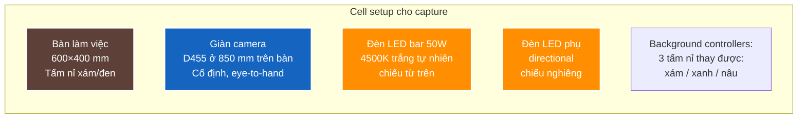

**Vật tư cần chuẩn bị**:
- 1 tấm nỉ xám 600×400 mm (mặt bàn chính)
- 2 tấm nỉ thay thế (xanh, nâu) — cho augmentation natural
- 1 thước đo + bút marker để vẽ vùng làm việc
- 1 đèn LED bar 30–50 W trắng — đèn chính
- 1 đèn LED nhỏ rời (cho ánh sáng nghiêng)
- Giàn camera: extrusion nhôm 20×20 hoặc 30×30, cao ~1.2 m

### 4.4. Capture Protocol (giao thức chụp ảnh)

**Tổng số ảnh cần chụp**: 2100 ảnh raw (700/class)

Phân bổ chi tiết:

| Biến | Mức | Số ảnh/class | Ghi chú |
|---|---|---|---|
| **Điều kiện ánh sáng** | Sáng (700–1000 lux) | 280 | Đèn LED bar |
| | Trung bình (400–600 lux) | 280 | Giảm 1 đèn |
| | Yếu (200–300 lux) | 140 | Tắt đèn phụ |
| **Góc camera** | Top-down (0°) | 280 | Default |
| | Nghiêng nhẹ X (±10°) | 280 | Lắc nhẹ giàn |
| | Nghiêng nhẹ Y (±10°) | 140 | |
| **Mức chồng lấn** | Vật rời rạc | 280 | Mỗi ảnh 2–3 vật cách nhau |
| | Chồng lấn nhẹ ≤ 10% | 280 | Vật chạm mép |
| | Chồng lấn 10–20% | 140 | Vật đè nhẹ |
| **Nền (background)** | Nỉ xám (default) | 420 | Đa số |
| | Nỉ xanh | 140 | |
| | Nỉ nâu | 140 | |

→ Mỗi ảnh là **một combination các biến trên**. Tổng = 700 ảnh/class × 3 class = 2100 ảnh.

**Script hỗ trợ chụp** — `scripts/01_collect_dataset.py`:

Triển khai: `DTwinGP7/scripts/01_collect_dataset.py` — hiển thị live view D455, phím tắt chuyển nhãn cảnh (class / lighting / overlap / background), nhấn SPACE để lưu đồng thời ảnh RGB + depth. Tên file tự sinh theo quy ước `class_lighting_angle_overlap_background_NNN` để truy vết điều kiện chụp.

**Lịch chụp gợi ý** (2 ngày làm việc):
- **Ngày 1 sáng** (3h): chụp 700 ảnh class "bottle" — đổi qua tất cả conditions
- **Ngày 1 chiều** (3h): chụp 700 ảnh class "cup"
- **Ngày 2 sáng** (3h): chụp 700 ảnh class "bolt"
- **Ngày 2 chiều** (3h): chụp **multi-class scenes** (2–3 vật khác class trên cùng ảnh) — quan trọng cho test mixing

### 4.5. Labeling — Quy trình trên Roboflow

**Roboflow Free tier** (đăng ký free, đủ cho 10,000 ảnh):

1. Tạo project: **"GP7 Pick Place"** → Type: **Instance Segmentation**
2. Upload 2100 ảnh RGB (skip depth, chỉ label RGB)
3. Define 3 classes: `bottle`, `cup`, `bolt`
4. Label từng ảnh bằng **polygon tool** (segmentation)
   - Click các điểm xung quanh viền vật
   - Roboflow có "Smart Polygon" hỗ trợ (Cmd+click) — tăng tốc 3–5x
5. Khi xong: Generate Dataset → Format **YOLOv8** → Download

**Thời gian ước tính**:
- Vật đơn giản (rời rạc): 15–25 giây/ảnh
- Vật chồng lấn (nhiều polygon): 40–60 giây/ảnh
- Trung bình: ~30 s/ảnh × 2100 = **17.5 giờ** ≈ 3 ngày làm việc tập trung

**Tips tăng tốc labeling**:
- Dùng Smart Polygon (Roboflow AI assist) cho vật rời rạc → click 1 lần ra mask gần đúng, chỉnh nhẹ
- Outsource cho team labeling Việt Nam nếu có ngân sách
- Train sơ một model trên 200 ảnh đầu, dùng nó **pre-label** 1900 ảnh còn lại → chỉnh sửa, nhanh hơn 5–10x

### 4.6. Data Augmentation chiến lược

Sau khi có 2100 ảnh labeled, **augmentation** giúp tăng dataset hiệu dụng lên ~6000–8000 ảnh mà không cần chụp thêm.

**2 cách augmentation**:

**Cách 1 — Roboflow built-in** (đơn giản, làm 1 lần):

Trong Roboflow Generate dataset, bật augmentations:
- Flip: horizontal, vertical
- Rotation: -30° to +30°
- Brightness: ±25%
- Saturation: ±25%
- Hue: ±15°
- Noise: up to 5%
- Cutout: 3 boxes, 10% size

→ Generate 3 augmented per original = **6300 ảnh total**

**Cách 2 — Albumentations runtime** (linh hoạt, làm khi train):

Pipeline biến đổi chạy động mỗi epoch: brightness/contrast, HSV, Gaussian noise, motion blur, rotate ±30°, scale, horizontal flip, coarse dropout.

→ Ultralytics YOLOv8 đã có augmentation mặc định khá tốt (Mosaic, MixUp, HSV). **Mặc định + Cách 1 Roboflow** là đủ. Không cần Cách 2 trừ khi muốn nâng cao.

### 4.7. Train/Val/Test split

| Split | Tỷ lệ | Số ảnh | Mục đích |
|---|---|---|---|
| **Train** | 70% | ~1470 (×3 sau aug = ~4400) | Huấn luyện model |
| **Val** | 15% | ~315 | Hyperparameter tuning, early stopping |
| **Test** | 15% | ~315 | **CHỈ dùng cuối cùng** để báo cáo metrics |

**Quy tắc quan trọng**:
- Split theo **session chụp**, không random theo ảnh. Nếu chụp 30 ảnh liên tiếp cùng scene → tất cả phải vào cùng split. Tránh leak.
- Đảm bảo mỗi split có đủ **mọi condition** (lighting, angle, overlap, bg) và mỗi class có ~tỷ lệ tương đương.

Roboflow tự lo split khi Generate dataset. **Verify thủ công** rằng split đúng tỷ lệ.

### 4.8. Dataset versioning

Track version dataset thường xuyên:
- **v1.0**: Initial 2100 ảnh, baseline
- **v1.1**: Sau thêm 200 ảnh edge cases (chồng lấn nặng, vật bị che)
- **v1.2**: Thêm 100 ảnh "fail mode" — sau khi phân tích thấy model fail ở scene nào

→ Mỗi version save thành 1 dataset riêng trên Roboflow (free unlimited versions).

---

# PHẦN C: XÂY DỰNG & HUẤN LUYỆN MODEL

## 5. Pipeline huấn luyện chi tiết

### 5.1. Vì sao chọn YOLOv8-seg

**Yêu cầu của bài toán**:
- Real-time inference (≥ 15 FPS)
- Segmentation (không chỉ bounding box) — cần mask để tính centroid + PCA chính xác
- Đào tạo nhanh với dataset vừa (~2000 ảnh)
- Cộng đồng lớn, dễ deploy

**So sánh các option**:

| Model | mAP COCO | FPS GPU | Train time | Phù hợp? |
|---|---|---|---|---|
| YOLOv8-seg (Ultralytics) | 36–50% | 80–300 | 4–8h | ✅ Chính |
| Mask R-CNN (Detectron2) | 37–45% | 5–15 | 12–24h | Quá chậm cho real-time |
| YOLOv5-seg | 32–44% | 80–250 | 4–8h | Cũ hơn YOLOv8 |
| YOLOv9/v10/v11 | 38–52% | tương tự | tương tự | Mới, ít cộng đồng |
| SAM (Segment Anything) | N/A | 0.5–2 | N/A | Không real-time, không class |

→ **YOLOv8-seg** chọn vì balance accuracy/speed/maturity tốt nhất.

### 5.2. Chọn variant: n / s / m

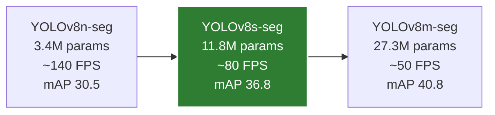

**Chiến lược**:
- Train **cả 3 variants** trong pha đầu
- So sánh trên test set → bảng trade-off accuracy/speed
- Production: dùng **YOLOv8s-seg** (cân bằng tốt nhất)

### 5.3. Hyperparameters huấn luyện

| Nhóm | Tham số | Giá trị |
|---|---|---|
| Cơ bản | epochs / patience / batch / imgsz | 150 / 30 / 16 / 640 |
| Optimizer | AdamW · lr0 / lrf | 0.001 / 0.01 |
| | momentum / weight_decay / warmup | 0.937 / 0.0005 / 3 epoch |
| Augmentation | mosaic / mixup / copy_paste | 1.0 / 0.15 / 0.30 |
| | hsv (h,s,v) / degrees / scale | (0.015, 0.7, 0.4) / 10° / 0.5 |

AdamW được chọn thay SGD vì ổn định hơn với dataset vừa (~2000 ảnh); `copy_paste=0.3` đặc biệt hiệu quả cho instance segmentation.

### 5.4. Quy trình huấn luyện

Quy trình mỗi variant: khởi tạo từ trọng số COCO pretrained → train với early stopping (patience 30) → đánh giá trên test set (mAP box/seg, per-class AP, tốc độ) → tổng hợp 3 variant thành bảng so sánh accuracy/speed.

Việc train thực hiện trên máy Linux + GPU (xem mục 3). Trên RTX 4060/4070, một run YOLOv8s-seg 150 epoch (~1500 ảnh) mất 4–6 giờ; cả 3 variant ~15–18 giờ (chạy qua đêm).

### 5.5. Validation metrics — đo gì, đo thế nào

Sau training, evaluate trên test set:

Các metric COCO-style được dùng: mAP@0.5 và mAP@0.5:0.95 cho cả bounding box lẫn segmentation mask, AP từng class, và tốc độ inference (ms / FPS).

**Target metrics**:

| Metric | Target | Reason |
|---|---|---|
| Box mAP@0.5 | ≥ 0.85 | Detection chính xác |
| Box mAP@0.5:0.95 | ≥ 0.55 | Localization chặt chẽ |
| Seg mAP@0.5 | ≥ 0.80 | Segmentation tốt cho centroid |
| Per-class AP@0.5 | ≥ 0.75 | Không bị "ăn" class nào |
| FPS | ≥ 15 | Real-time |

### 5.6. Khắc phục các vấn đề thường gặp

| Vấn đề | Nguyên nhân | Giải pháp |
|---|---|---|
| Train loss tăng đột ngột | LR quá cao | Giảm `lr0` còn 0.0005 |
| Val mAP < 0.5 | Dataset quá ít/đơn điệu | Thêm ảnh + tăng augmentation |
| Overfitting (train ↑↑, val ↓) | Quá nhiều epoch | Patience=20, dùng best.pt |
| 1 class AP rất thấp | Imbalance | Oversample class đó, hoặc tăng `cls` loss weight |
| FPS chậm | Model lớn | Đổi xuống YOLOv8n hoặc s |
| Mask "cắt khúc", không liền | imgsz quá nhỏ | Tăng `imgsz=800` hoặc 960 |

---

# PHẦN D: HAND-EYE CALIBRATION

## 6. Hiệu chuẩn camera ↔ robot

### 6.1. Bài toán + setup

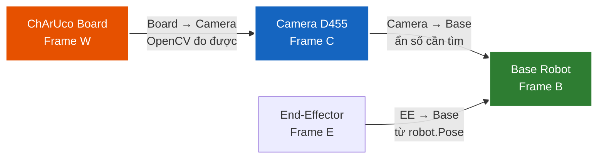

**Mục tiêu**: Tìm ma trận $T_C^B$ chuyển từ Camera frame sang Base frame robot.

> Trong code, ma trận này được đặt tên `T_BC` (`T_base_camera`): `p_base = T_BC @ p_camera`. Hai cách viết tương đương.

**Setup eye-to-hand**:
- D455 lắp **cố định** trên giàn cao (KHÔNG gắn lên end-effector)
- Robot giữ **ChArUco board** ở end-effector (gắn bằng kẹp hoặc gripper)
- Hoặc: ChArUco đặt trên bàn cố định, robot di chuyển → đọc pose tool

**Phương pháp**: **Park-Martin** (1994) — sai số ≤ 3 mm khả thi.

> ⚠ **Không dùng Tsai-Lenz cho setup này.** Tsai-Lenz (1989) là phương pháp
> kinh điển nhưng tham số hóa rotation bằng vector kiểu Rodrigues cải biên,
> có **điểm kỳ dị tại góc xoay 180°**. Trong setup eye-to-hand với camera
> lắp trên cao **nhìn thẳng xuống**, ma trận $T_C^B$ chứa thành phần xoay
> xấp xỉ 180° (trục Z camera ngược trục Z base) — rơi đúng vào điểm kỳ dị
> → kết quả calibration sai lệch lớn. Kiểm chứng bằng dữ liệu tổng hợp cho
> thấy Tsai-Lenz **không khôi phục được** $T_C^B$ trong khi Park-Martin và
> Daniilidis (1998) khôi phục chính xác trên cùng bộ dữ liệu.
>
> Khuyến nghị: dùng **Park** (mặc định) hoặc **Daniilidis**. Cả hai không có
> điểm kỳ dị 180°. Trong OpenCV: `cv2.CALIB_HAND_EYE_PARK` /
> `cv2.CALIB_HAND_EYE_DANIILIDIS`.

### 6.2. Chuẩn bị ChArUco board

**Sinh ảnh board để in**:
Dùng OpenCV `cv2.aruco` sinh bảng ChArUco 7×5 ô (cạnh ô 40 mm, marker 30 mm, từ điển `DICT_4X4_50`), xuất ảnh PNG để in.

In trên giấy A3 **plain matte** (chống phản chiếu). Dán lên bìa cứng phẳng (foam board, gỗ ván) để không bị cong.

**Verify kích thước**: dùng thước đo 1 ô vuông phải đúng **40 mm**. Nếu không đúng, hiệu chỉnh `square_length` cho phù hợp với in thực tế.

### 6.3. Quy trình thu pose

Triển khai: `DTwinGP7/src/calibration/` + `scripts/02_run_calibration.py`. Thu 25–30 cặp pose — $T_W^C$ (pose board trong camera frame, đo bằng OpenCV `solvePnP` trên ChArUco corner) và $T_E^B$ (pose end-effector trong base, đọc từ `robot.Pose()`) — rồi giải bằng `cv2.calibrateHandEye` với phương pháp Park.

Quy ước eye-to-hand: phải nghịch đảo `gripper2base → base2gripper` trước khi đưa vào OpenCV thì output mới đúng là $T_C^B$ (camera trong base).

**Capture protocol** (~1.5 giờ):
1. Robot start ở Home pose
2. Đặt ChArUco trên end-effector (gắn bằng gripper hoặc kẹp custom)
3. Cho robot di chuyển tới **25–30 pose khác nhau** trong vùng hoạt động:
   - **5 pose** ở 3 độ cao khác nhau (300 mm, 500 mm, 700 mm trên bàn)
   - Tại mỗi độ cao, di chuyển sang trái/phải/trước/sau
   - **Rotate end-effector** ±30° quanh từng trục giữa các pose
4. Tại mỗi pose: chờ robot dừng hẳn (5 giây) → press SPACE → script log

→ **Quan trọng**: pose phải **đa dạng về rotation**, không chỉ translation. Nếu chỉ translation, calibration sẽ ill-conditioned (sai số lớn).

### 6.4. Validation: Touch Test

Sau khi có `T_base_camera.npy`, **test bằng tay**:

Chọn 5 điểm có toạ độ đã biết trong camera frame (vd các corner ChArUco), chuyển sang base frame qua $T_C^B$, cho robot đưa TCP tới từng điểm và quan sát/đo độ lệch thực tế.

**Kết quả mong đợi**: TCP gripper chạm trong vòng **2–3 mm** của điểm thật. Nếu > 5 mm → calibration sai, làm lại với nhiều pose hơn.

### 6.5. Sai số calibration thường gặp

| Sai số | Nguyên nhân | Cách giảm |
|---|---|---|
| 5–10 mm | Pose calibration chỉ translation | Thêm rotation |
| > 10 mm | ChArUco in sai kích thước | Đo lại, sửa `square_length` |
| 3–5 mm | Robot rung khi chụp | Chờ 5 giây sau MoveJ |
| 2–3 mm | Camera intrinsics chưa chính xác | OK, accept hoặc calibrate intrinsics riêng |
| < 2 mm | Tốt | Đủ cho pick-and-place |

---

# PHẦN E: TÍCH HỢP MODEL VÀO HỆ THỐNG

## 7. Pipeline integration

### 7.1. Module Perception

Triển khai: `DTwinGP7/src/perception/`. Perception chạy trên thread riêng, vòng lặp: frame D455 → YOLO detect → trích pose 3D → đẩy vào queue. Gồm 4 thành phần:

- **Camera** (`camera.py`) — bọc D455, align depth↔color, lọc nhiễu depth.
- **Detector** (`detector.py`) — inference YOLOv8-seg → list detection (class, confidence, mask, bbox).
- **Pose extractor** (`postprocess.py`) — từ mask + depth tính centroid, độ sâu (median chống nhiễu), deproject về toạ độ 3D camera frame, và yaw (PCA trên mask).
- **PerceptionNode** (`perception_node.py`) — điều phối vòng lặp, đẩy message `{timestamp, objects, fps}` vào queue (bỏ frame cũ nếu nghẽn).

Mỗi thành phần có bản giả lập (`MockCamera`, `MockDetector`) cho test/sim không cần phần cứng.

### 7.2. Module Orchestrator

Triển khai: `DTwinGP7/src/orchestrator/`. Orchestrator điều phối một chu trình pick-and-place:

1. Nhận detection mới nhất từ queue của Perception.
2. Chuyển pose vật từ camera frame sang base frame qua $T_C^B$.
3. Chọn vật "trên cùng" (Z lớn nhất) để gắp trước.
4. **Kiểm tra với-tới-được + va chạm bằng digital twin** (`ReachEnvelope` sphere check client-side) TRƯỚC mỗi lần gắp vật lý — lớp an toàn **C2**.
5. **Predictive safety check C2+**: pure-Python FK trên toàn trajectory verify joint limit + self-collision TRƯỚC khi gửi MoveJ → catch unsafe path mà single-point check miss (~50ms/trial overhead).
6. Thực thi chuỗi chuyển động approach → grasp → lift → transfer → place → retreat; điều khiển gripper qua Digital Output.
7. Ghi kết quả từng trial (thành/bại, lý do, cycle time) ra CSV.
8. **Batch context manager** (HSE backend): gom toàn bộ motion + IO của 1 trial vào 1 INFORM job → giảm overhead từ ~1500ms xuống ~200ms/trial.

Luồng trạng thái được kiểm soát bằng state machine (IDLE→DETECT→PLAN→APPROACH→…→DONE/ERROR) để bắt lỗi chuyển trạng thái.

### 7.3. Module Digital Twin (Level-4 facade)

Triển khai: `DTwinGP7/src/orchestrator/digital_twin.py`. `DigitalTwinMirror` là facade kết hợp 3 thành phần để đạt Level-4 comprehensive bidirectional digital twin:

| Thành phần | Vai trò |
|---|---|
| **Motion backend** (HSE hoặc Sim) | Gửi command tới robot |
| **Kinematic helper** (pure-Python URDF chain) | DLS IK + sphere reach check client-side |
| **Mirror thread** | Poll joint state thật @10Hz → setJoints Open3D viewport @2Hz (decoupled rates) + log telemetry CSV + drift detection + alarm auto-poll |

**Đặc trưng L4**:
- **Bidirectional state sync**: command path (PC→robot) song song với state sync path (robot→PC).
- **Drift detection**: so sánh commanded vs actual mỗi tick, warn ≥ 2°.
- **Alarm auto-response**: severity MAJOR/SYSTEM → auto-trigger `Stop()` (servo off).
- **Decoupled rates**: telemetry @10Hz (resolution cao cho analysis), viewport @2Hz (giảm tải GUI render thread).

### 7.4. Module Backends (pluggable motion drivers)

Triển khai: `DTwinGP7/src/orchestrator/backends/`. Interface chung `RobotBackend` (Protocol) cho phép Orchestrator dùng nguyên văn `MoveJ()/MoveL()/setDO()` qua các backend:

| Backend | Use case | Dependency |
|---|---|---|
| `SimRobot` | `--backend sim` — dev / headless / sim với Open3D viewport | Không |
| **`MotomanHSEBackend`** | **`--backend hse`** — production cho robot thật | YRC1000 HSE Server |

> Open3D viewport (`O3DGuiSimRobot`) chỉ làm render mirror cho cả sim non-headless
> lẫn real mode. KHÔNG tham gia motion path.

#### 7.4.1. MotomanHSEBackend chi tiết

Implement từ public spec Yaskawa HSE Server Function Manual (HW1485553):

| Module | Vai trò |
|---|---|
| `hse_protocol.py` | Packet codec: 32-byte sub-header "YERC" + payload, command 0x70-0x87 |
| `inform_codegen.py` | INFORM .JBI generator: C-variable (per-trial) hoặc P-variable template (ultra-fast) |
| `motoman_hse.py` | UDP socket wrapper + FTP upload + batch context manager + ultra-fast logic |
| `reach_envelope.py` | Sphere reach model GP7 client-side (150–927 mm từ J1, dùng cho `Orchestrator._is_reachable` PLAN-state check) |
| `alarm_codes.py` | Decode 12+ alarm codes với severity + recovery hint |

**3-tier performance ladder cho real motion**:

| Tier | FTP/trial | HSE calls/trial | Overhead | Use case |
|---|---|---|---|---|
| Single-shot | 5-7 | 15-21 | ~1500ms | Debug |
| **Batch M3** | 1 | 3-4 | **~200ms** | Production (1-100 trials) |
| **Ultra-fast M3++** | **1 cho cả thí nghiệm** | 8-12 (mostly UDP) | **~50ms** | Thống kê 500+ trial quy mô lớn |

Ultra-fast pattern: upload INFORM template với P-variables 1 lần, mỗi trial chỉ `WRITE_POS_VAR` (UDP ~10ms) cho từng waypoint + `JOB_START`. Signature-based template caching để tránh upload lại khi structure không đổi.

### 7.5. Module Kinematics (pure-Python FK)

Triển khai: `DTwinGP7/src/orchestrator/kinematics/`. Forward kinematics + inverse kinematics (DLS) + trajectory interpolation + safety check **pure numpy**. Foundation cho 3 use case:

| UC | Script / API | Mục đích |
|---|---|---|
| **UC1** Offline sanity check | `scripts/06_simulate_trial.py` | Sinh figure 3D TCP path + joint timeline cho phân tích |
| **UC2** Online predictive safety C2+ | `Orchestrator._predict_safety()` | Verify joint limit + self-collision toàn trajectory **TRƯỚC** khi gửi MoveJ |
| **UC4** Replay mode | `scripts/07_replay_telemetry.py` | Replay CSV telemetry → 3D animation/MP4 cho demo video |

Core modules:
- `urdf_chain.py` — Yaskawa GP7 URDF chain (từ ros-industrial/motoman noetic-devel
  `gp7_macro.xacro`). Origin xyz + axis cho mỗi joint, flange offset (80mm X),
  tool0 rotation rpy(180°,-90°,0). **Verified match RoboDK SolveFK 0.00mm/0.00°**
  qua `scripts/13_verify_vs_robodk.py`.
- `dh_model.py` — Modified DH parameters (Craig 1986). Giữ cho backward compat.
  URDF chain là source-of-truth.
- `forward_kinematics.py` — joints → TCP pose, ~60µs/call. Polymorphic giữa URDF
  và DH model. Hỗ trợ `joint_positions_batch(model, joints_NJ)` vectorized cho
  N trajectory samples.
- `inverse_kinematics.py` — Damped Least Squares IK, ~3ms/call. Dùng URDF chain
  → IK joints match RoboDK chính xác → không cần vendor SDK ở runtime.
- `trajectory.py` — linear joint interpolation + joint limit check + sphere
  self-collision (vectorized batch FK, ~30× nhanh hơn naive per-sample loop).

### 7.5.1. URDF vs Modified DH — vì sao chọn URDF

Với Modified DH (Craig 1986) — convention truyền thống cho robotics textbook — 
khi verify vs RoboDK SolveFK qua `scripts/13_verify_vs_robodk.py`, tìm thấy 
diff hàng nghìn mm vì:

1. **Joint axis sign convention**: Yaskawa/RoboDK URDF có joints J3/J4/J5/J6
   axes negative direction (`(0,-1,0)`, `(-1,0,0)`...). Modified DH convention
   thông thường giả định positive — gây mismatch.
2. **Flange + tool0 frames**: URDF có 2 fixed joints SAU joint_6_t (flange
   offset 80mm + tool0 rotation rpy(180°,-90°,0)). Modified DH gộp vào d6/last
   link nhưng convention rotation khác.
3. **Robot base frame**: RoboDK SolveFK trả pose relative to **J1 axis** (không
   phải base_link / floor). URDF có `joint_1_s origin (0,0,0.33)` = 330mm
   từ base_link đến J1. Để match RoboDK, set joint_1 origin = (0,0,0) và move
   d1=330mm vào `base_xyz_mm` của caller.

→ URDF chain trực tiếp ánh xạ datasheet vật lý, tránh các DH convention pitfall.
Code tổ chức theo URDF, FK chạy bằng `T = base · ∏ (Translate(origin_i) ·
Rotate(axis_i, q_i))`.

### 7.5.2. Kinematics performance optimization

Hot path real-mode predictive safety check (`_predict_safety_for_trajectory`)
gọi FK + IK + collision check trên 6 waypoint × ~50-200 samples/trial. Pure-
Python naive impl tốn ~25-50ms/trial overhead → khó scale 500+ trial. Áp dụng
3 kỹ thuật pure-Python/numpy để đạt **12-32× speedup** mà giữ kết quả
bit-identical (verify trên 3000+ random configs, max_error = 0.0).

**Kỹ thuật 1 — LRU caching cho per-model constants** (`functools.lru_cache`):

```python
@lru_cache(maxsize=None)
def _dh_link_consts(link: DHLink):
    """cos(α), sin(α), theta_offset + template matrix với các entry hằng
    (a, -sa, -sa·d, ca, ca·d, hàng cuối) — không phụ thuộc joint angle."""
    ca, sa = np.cos(link.alpha), np.sin(link.alpha)
    tpl = np.zeros((4, 4))
    tpl[0, 3] = link.a
    tpl[1, 2] = -sa; tpl[1, 3] = -sa * link.d
    tpl[2, 2] = ca;  tpl[2, 3] = ca * link.d
    tpl[3, 3] = 1.0
    return ca, sa, link.theta_offset, tpl
```

FK chỉ phải set 6 entry phụ thuộc `theta`, sao chép template từ cache → tiết
kiệm `np.array([[...]])` parsing + trig của `alpha` mỗi call. Cùng trick cho
`_base_transform_cached(model)` và `_urdf_consts(model)` (pre-compute base +
unit-normalized axes + translate matrices).

**Kỹ thuật 2 — Batched FK cho trajectory** (`_dh_transform_batch`,
`joint_positions_batch`):

```python
def _dh_transform_batch(link, q_col):
    """Stack (N, 4, 4) DH transform — vectorized cho N samples cùng lúc."""
    ca, sa, off, _ = _dh_link_consts(link)
    theta = q_col + off
    ct, st = np.cos(theta), np.sin(theta)
    M = np.zeros((q_col.shape[0], 4, 4))
    M[:, 0, 0] = ct; M[:, 0, 1] = -st; M[:, 0, 3] = link.a
    # ... (5 entries phụ thuộc theta + 5 entries hằng)
    return M
```

`joint_positions_batch(model, joints_NJ)` chain các batched matmul → tính FK
cho toàn trajectory trong **vài phép matmul (N,4,4)** thay vì N call lẻ. Hiệu
ứng kết hợp với BLAS auto-parallel + cache locality.

**Kỹ thuật 3 — Vectorized self-collision với pre-filter** (`trajectory.py`):

Naive O(N · K · K) với K = số joint (~8) tính `np.linalg.norm(p_i - p_j)` cho
mỗi sample → ~27ms/trial. Vectorize:

```python
P = np.stack(joint_positions_batch(model, J), axis=1)   # (N, K, 3)
for i in range(K):
    for j in range(i + gap, K):
        diff = P[:, i, :] - P[:, j, :]
        # Pre-filter: squared-distance vectorized cho cả N samples (numpy SIMD)
        dist_sq = np.einsum("kc,kc->k", diff, diff)
        thr_sq_pad = (thr * (1 + 1e-9) + 1e-6) ** 2   # superset, ULP-safe
        for k in np.nonzero(dist_sq < thr_sq_pad)[0]:
            # Xác nhận bằng ĐÚNG công thức cũ → bit-identical với reference
            dist = float(np.linalg.norm(P[k, i] - P[k, j]))
            if dist < thr:
                violations.append((k, i, j, dist))
```

`einsum("kc,kc->k", diff, diff)` tính N giá trị d² trong 1 BLAS call (SIMD).
Superset filter với threshold padded `(thr·(1+1e-9) + 1e-6)²` đảm bảo KHÔNG
bỏ sót cặp nào < thr (sai số ULP). Cặp pass-filter mới chạy exact
`np.linalg.norm` + `< thr` → vi phạm + giá trị dist bit-identical với reference.

**Kỹ thuật 4 — DLS IK redundant-FK removal** (`inverse_kinematics.py`):

Inner loop DLS: tính `T_cur = FK(q)` cho convergence check (so `pos_err`,
`rot_err` với tol), sau đó gọi `_jacobian_numerical(model, q)` mà bên trong
TÍNH LẠI `T0 = FK(q)` để làm reference cho finite-differences. Thêm param
`T0=T_cur` để reuse → tiết kiệm 1 FK call/iter:

```python
T_cur = _fk(model, q)
err = _pose_error(T_cur, target)
if np.linalg.norm(err[:3]) < tol_mm and np.linalg.norm(err[3:]) < tol_rad:
    return q.tolist()
J = _jacobian_numerical(model, q, T0=T_cur)    # ← reuse, không tính lại
```

**Kết quả benchmark** (single trial, 224 samples):

| Hot path | Naive | Optimized | Speedup |
|---|---:|---:|---:|
| `forward_kinematics_urdf` | 135 µs | 111 µs | 1.22× |
| `joint_positions` (DH) | 70 µs | 58 µs | 1.21× |
| `inverse_kinematics` (DH) | 3,538 µs | 2,830 µs | 1.25× |
| `check_self_collision_spheres` | 27,373 µs | **853 µs** | **32.1×** |
| `interpolate + limits + collision` (trial) | 26,685 µs | **2,095 µs** | **12.7×** |

**Verify bit-identical**: 3000 random configs FK max_err = 0.00, 266 collision
violations IDENTICAL (order + indices + float distances), IK convergence rate
+ accuracy không đổi (177/200, median pos err 0.26 µmm).

Tác động real mode: predictive safety overhead **~25ms → ~2ms/trial** → vô
hại so với HSE FTP + MoveJ ~200ms/trial → C2 safety auto-bật cho mọi trial
real mode mà không impact throughput. Test suite **293/293 pass** confirm
không regression hành vi.

### 7.6. Điểm vào thí nghiệm

`scripts/03_run_experiment.py` ghép toàn bộ: load cell config YAML → mở Open3D viewport (nếu non-headless), khởi động Perception, chạy N trial qua Orchestrator, ghi kết quả ra `results/`. **4 chế độ** (xem bảng cuối Section 3).

CLI flags đầy đủ + workflow scenarios: xem [`HUONG_DAN_SU_DUNG.md`](HUONG_DAN_SU_DUNG.md) §4 + §8.3.

### 7.7. Cell config YAML

Cell được mô tả bằng config YAML (`config/cell_layout.yaml` cho sim,
`config/cell_layout_real.yaml` cho real). `CellConfig.from_yaml()` (Pydantic v2)
parse + validate file, cấp:
- **Base pose robot** (`robot.pose.xyz_mm/rpy_deg`) cho FK/IK frame
- **Camera pose** cho hand-eye sim (`scripts/calibration_from_layout.py`)
- **Mesh paths** (table, gripper, objects) cho Open3D viewport render

Triển khai: `DTwinGP7/src/cell/cell_models.py`.

### 7.8. IK source — 2 paths

Orchestrator có 2 phương án compute IK, chọn qua CLI `--ik-source`:

| Path | Cách hoạt động | Accuracy | Use case |
|---|---|---|---|
| `--ik-source yrc` | PC gửi pose Cartesian thẳng qua HSE → YRC1000 tự IK | YRC controller's own IK (chuẩn nhất) | **Real mode default** — khi đã setup TOOL01 trên TP |
| `--ik-source client` | DLS numerical IK pure Python với URDF chain | Match RoboDK SolveFK 0.00mm (verified qua `scripts/13_verify_vs_robodk.py`) | **Sim default**, hoặc real backup khi không có TP setup |

**Default**: `yrc` cho `--mode real`, `client` cho `--mode sim`.

#### 7.8.1. YRC IK (controller-side) — recommended cho real

Pipeline: orchestrator → `world_to_robot_base(T_world)` → `MotomanHSEBackend.MoveJ(T_base)` → HSE `WRITE_POS_VAR` với data_type=BASE (Cartesian) → INFORM `MOVJ P000 TL=1` → YRC1000 internal IK + motion.

Yêu cầu: TOOL01 trên teach pendant nhập TCP offset gripper (xem `docs/SETUP_YRC_TOOL.md`).

#### 7.8.2. Client DLS IK (PC-side numerical)

Damped Least Squares iterative, dùng URDF chain forward kinematics (verified
match RoboDK SolveFK 0.00mm). ~5-15ms/call, accuracy 0.001-0.058mm trên random
samples (`scripts/13_verify_vs_robodk.py --samples 500 --histogram`).

Khi DLS fail (singularity / out-of-reach), orchestrator raise lỗi rõ ràng và
ghi vào trial log.

#### 7.8.3. Frame conversion

`src/orchestrator/frame_convert.py`: convert pose 4x4 giữa frames:
- `world_to_robot_base(T_world, base_xyz, base_rpy) → T_base` — cho HSE Cartesian
- `matrix_to_xyzrpy_yaskawa(T) → (x,y,z, Rx,Ry,Rz)` — encoding Yaskawa XYZ-fixed RPY

### 7.9. Gripper subsystem — PC ↔ YRC1000 ↔ PLC qua 2 giao thức

Gripper khí nén double-acting được điều khiển bằng PLC Mitsubishi, KHÔNG bởi
robot trực tiếp. PC giao tiếp với PLC **qua YRC1000 làm bridge** (Path A):
PC chỉ biết HSE protocol, PLC chỉ biết CC-Link, YRC1000 handle conversion.

#### 7.9.1. Layered architecture — 3 devices, 2 protocols

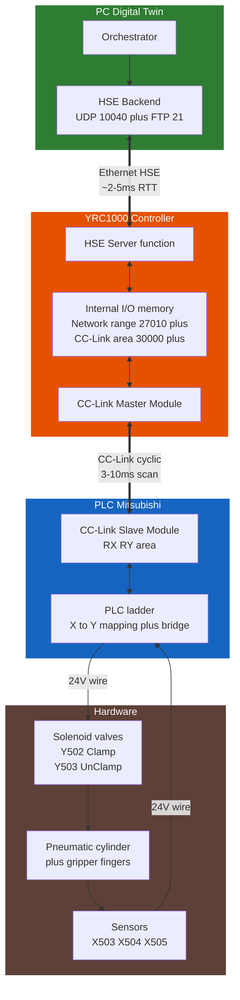

PC chỉ kết nối qua HSE. PLC chỉ kết nối qua CC-Link. YRC1000 đóng vai trò
**bridge** giữa 2 giao thức.

#### 7.9.2. Sequence — close gripper command

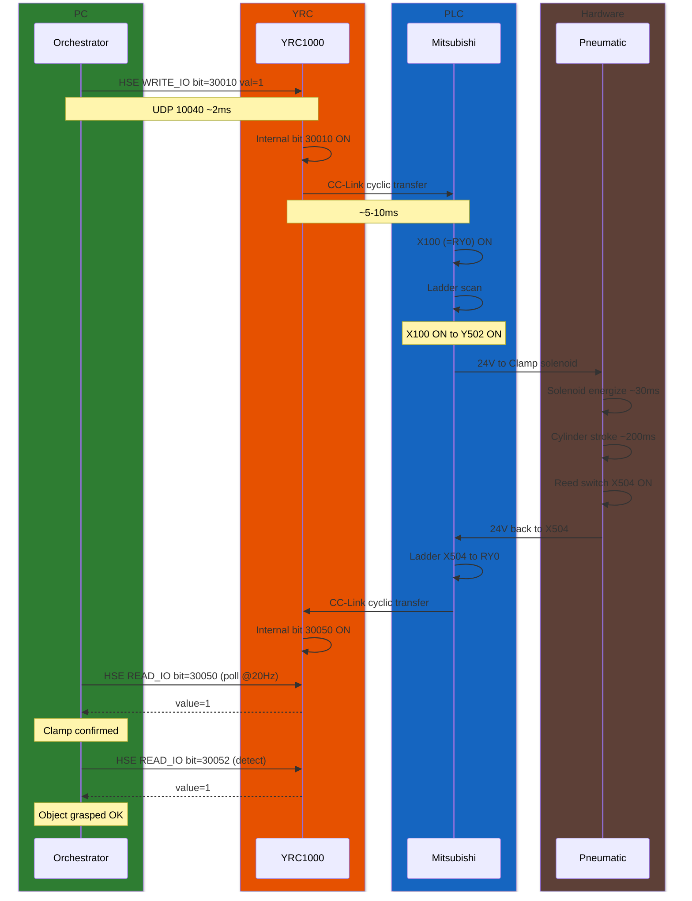

Total latency: ~150-400ms (dominated bởi pneumatic stroke, không network).

#### 7.9.3. Sequence — sensor feedback polling

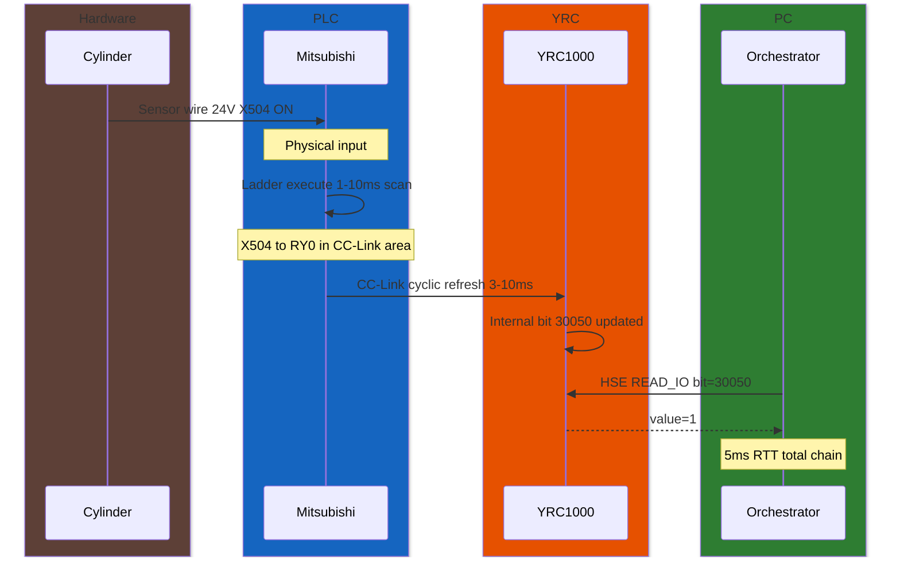

Sensor → PC total latency: **15-50ms**. Đủ nhanh cho closed-loop gripper control.

#### 7.9.4. Memory mapping — 5 bits cho gripper subsystem

| PLC physical | Direction | PLC ladder bridge | CC-Link slot | YRC bit | PC HSE call |
|---|---|---|---|---|---|
| Y502 Clamp solenoid | OUT to HW | RY0 to Y502 | RY0 | 30010 | `set_io(30010, 1)` |
| Y503 UnClamp solenoid | OUT to HW | RY1 to Y503 | RY1 | 30011 | `set_io(30011, 1)` |
| X504 Clamp sensor | IN from HW | X504 to RX0 | RX0 | 30050 | `read_io(30050)` |
| X503 UnClamp sensor | IN from HW | X503 to RX1 | RX1 | 30051 | `read_io(30051)` |
| X505 Carrier Detect | IN from HW | X505 to RX2 | RX2 | 30052 | `read_io(30052)` |

⚠ Bảng giả định — verify trên YRC TP `Setup → I/O Module → CC-Link` + PLC ladder
project. Override mapping nếu khác trong `config["gripper_cc_link"]`.

#### 7.9.5. Latency budget per layer

| Layer | Direction | Typical | Worst case |
|---|---|---|---|
| HSE UDP (PC ↔ YRC) | RTT | 2-5 ms | 20 ms |
| YRC CC-Link cyclic | one-way | 3-10 ms | 50 ms (config max) |
| PLC ladder scan | one-way | 1-10 ms | 50 ms (slow CPU) |
| Solenoid energize | one-way | 20-50 ms | 100 ms |
| Pneumatic stroke | one-way | 100-300 ms | 500 ms (large cylinder) |
| Sensor wire + debounce | one-way | <1 ms | 10 ms |
| **Total close command** | | **150-400 ms** | ~700 ms |
| **Total sensor read** | | **15-50 ms** | 200 ms |

→ Pneumatic stroke dominate. Optimizing network không cải thiện đáng kể.

#### 7.9.6. Tách trách nhiệm 3 thiết bị

| Device | Biết gì | Không biết gì |
|---|---|---|
| **PC** | HSE protocol, bit number cần read/write | PLC ladder, CC-Link, sensor wiring |
| **YRC1000** | HSE server, CC-Link master, I/O memory mapping | Solenoid, sensor logic |
| **PLC Mitsubishi** | CC-Link slave, ladder logic, X/Y physical wiring | Robot motion, HSE |

→ Mỗi device 1 responsibility. Đổi gripper hardware (vd analog servo gripper)
chỉ cần sửa PLC ladder, code PC + YRC giữ nguyên.

### 7.10. C2 safety pipeline — Reachability + Predictive collision

C2 là **lớp an toàn dựa trên digital twin** — verify mọi pose + trajectory bằng
pure-Python TRƯỚC khi gửi command vật lý lên YRC1000. Mục tiêu: catch unsafe motion sớm ở PC, 
tránh trigger alarm trên controller (mỗi alarm major mất ~30s recovery + có thể yêu cầu reset TP).

**2 tầng kiểm tra, tăng dần độ chặt**:

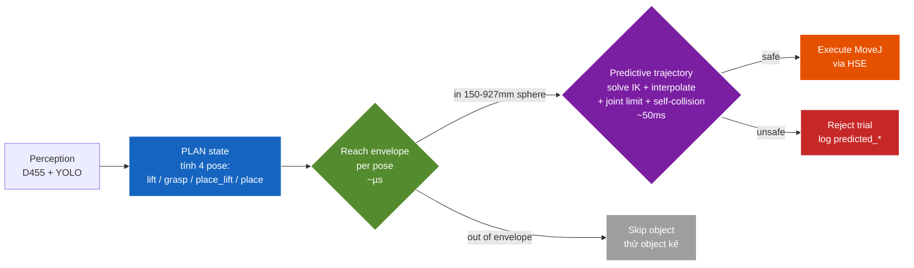

#### 7.10.1. Tầng 1 — Reach envelope (per-pose, ~µs)

`Orchestrator._is_reachable(target_T)` (lines ~161-189 trong `orchestrator.py`):

```python
def _is_reachable(self, target_T: np.ndarray) -> bool:
    from .backends.reach_envelope import ReachEnvelope
    base_xyz = tuple(self.config.get("robot_base_xyz_mm", (0,0,0)))
    if not hasattr(self, "_reach_env_cached"):
        self._reach_env_cached = ReachEnvelope.gp7_default(base_xyz_mm=base_xyz)
    target_xyz = np.asarray(target_T)[:3, 3]
    return self._reach_env_cached.can_reach(target_xyz)
```

- **Model**: sphere envelope từ J1, datasheet GP7 (`reach_max=927mm`, `reach_min=150mm`)
- **Cost**: ~µs/check (numpy norm), cached object
- **Khi**: PLAN state, gọi cho 4 pose (approach, grasp, place_lift, place).
  Nếu vật nào fail → skip vật đó, thử vật kế tiếp (failure_reason=`unreachable`)
- **Triết lý**: cheap filter để loại early. Sphere không model joint limit
  từng axis nên có thể false-positive (báo reachable nhưng IK fail) — đó là
  job của tầng 2.

#### 7.10.2. Tầng 2 — Predictive trajectory check (per-trial, ~50ms)

`Orchestrator._predict_safety_for_trajectory()` (mới wire vào `_execute_pick_place`):

1. Solve client DLS IK cho 6 waypoint world frame (current → lift → grasp →
   lift → place_lift → place → place_lift) — pure-Python URDF chain
2. Interpolate trajectory joint-space @ `predict_max_speed_deg_s` (default 30°/s),
   sample mỗi 50ms
3. Pure-Python FK trên TỪNG sample:
   - **Joint limit check**: bất kỳ joint nào vượt `[joint_min, joint_max]` từ
     URDF → fail với reason `predicted_joint_limit: J{i}=...° @ sample {s_idx}`
   - **Self-collision check**: sphere model 6 link, khoảng cách min < `r_i + r_j`
     → fail `predicted_self_collision: joint {i} vs {j} dist={d}mm`

Đoạn code chính trong `orchestrator.py:_execute_pick_place`:

```python
reason = self._predict_safety_for_trajectory(
    [lift_T, grasp_T, lift_T, place_lift_T, place_T, place_lift_T]
)
if reason is not None:
    logger.warning("Trial %d: predictive safety reject — %s", trial_id, reason)
    self.stats["failed"] += 1
    self.sm.fail(reason)
    return False
```

**Khi bật**: `config["predictive_safety_enabled"]=True`. Real mode tự bật
(`03_run_experiment.py`). Sim mode default OFF để chạy fast — nhưng có thể
bật để stress-test trajectory.

**Đóng góp C2 cho luận văn**: lớp safety pure-Python này không phụ thuộc
controller — catch unsafe trajectory BẰNG kinematic model digital twin, không
phải đợi alarm vật lý. Đặc biệt cho self-collision arm-vs-arm mà single-point
reach check không bắt được. Verified bằng `tests/test_predict_safety.py`
(5 case: disabled / safe / joint limit / too-few-waypoints / speed param).

#### 7.10.3. Failure reason taxonomy

Khi safety reject, `failure_reason` ghi vào CSV để phân tích sau:

| Reason | Nguồn | Khắc phục |
|---|---|---|
| `unreachable` | Reach envelope (tất cả objects) | Đổi `place_position` gần robot hơn, hoặc dời object về workspace |
| `predicted_joint_limit: J{i}=...° @ sample {s}/{n}` | Predictive interpolation | Tinh chỉnh `approach_height_mm` / `yaw_offset_deg`; URDF joint limit từ datasheet GP7 |
| `predicted_self_collision: joint {i} vs {j} dist={d}mm @ sample {s}/{n}` | Sphere self-collision | Đổi `--ik-source yrc` (YRC chọn config khác), hoặc thay đổi `place_position` để planner tránh elbow-down config |

→ Trial nào fail tại C2 KHÔNG bao giờ tới HSE → controller thật KHÔNG nhận
command unsafe → giảm rate alarm trong runtime + log CSV chi tiết failure
mode để tuning iterate.

---

# PHẦN F: TEST, HIỆU CHỈNH, THÍ NGHIỆM

## 8. Test strategy 5 lớp

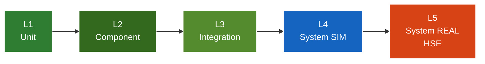

| Lớp | Phạm vi | Phần cứng | Cách chạy |
|---|---|---|---|
| **L1** Unit | Hàm độc lập: `coord_conv`, `postprocess`, state machine, hand-eye solver, HSE codec, INFORM gen, kinematics FK | Không | `pytest tests/` |
| **L2** Component | Module isolation: perception (Mock), orchestrator (mock robot), MotomanHSEBackend (mock socket), DigitalTwinMirror (mock backend) | Không | `pytest tests/test_orchestrator_sim.py tests/test_motoman_hse.py tests/test_digital_twin.py` |
| **L3** Integration | 2–3 module ghép: vision → transform → Open3D viewport | Open3D | `pytest tests/` |
| **L4** System SIM | Full pipeline + digital twin, detection giả lập | Open3D | `03_run_experiment.py --mode sim` |
| **L5** System REAL (HSE) | Full pipeline + D455 + GP7 qua HSE — path DUY NHẤT cho real | YRC1000 HSE + D455 + GP7 | `03_run_experiment.py --mode real` |

Thư viện phần cứng (`pyrealsense2`, `ultralytics`, `pyserial`) đều lazy-import → L1–L2 chạy được trên máy không có phần cứng. Open3D + numpy là core dependencies, không cần GPU.

Hiện có **293 test case** ở `DTwinGP7/tests/` cover L1–L3. Bao quát: HSE protocol + Cartesian encode, HSE backend mock socket, INFORM codegen, ultra-fast P-var, digital twin mirror, kinematics FK, inverse kinematics DLS, frame conversion, và các unit khác. Toàn bộ chạy được trên máy không phần cứng (lazy-import + mock).

## 9. Hiệu chỉnh (Tuning)

### 9.1. Các parameter cần tune

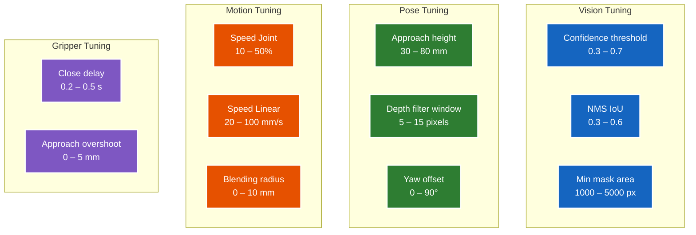

### 9.2. Tuning workflow

**Đừng tune tất cả cùng lúc!** Làm theo thứ tự:

1. **Vision first**: tune confidence/NMS để detection chính xác. Đo metric mAP.
2. **Pose extraction**: tune depth window, kiểm tra localization error.
3. **Motion params**: tune speed, blending — bắt đầu chậm, tăng dần.
4. **Gripper timing**: tune close delay để gripper kẹp chặt trước khi lift.

Mỗi parameter, **vary 5–10 giá trị**, chạy 10 trials mỗi giá trị, plot success rate.

### 9.3. Failure mode analysis

Sau mỗi 50 trials, log chi tiết failure để phân tích:

Mỗi trial thất bại được ghi kèm **lý do** vào CSV — các nhóm: `detection_miss`, `wrong_class`, `wrong_yaw`, `unreachable`, `collision`, `gripper_slip`, `placement_drop`.

Cuối thí nghiệm, build failure mode matrix:

| Reason | Count | % | Action |
|---|---|---|---|
| detection_miss | 3 | 6% | Augmentation thêm |
| wrong_yaw | 5 | 10% | PCA refinement |
| gripper_slip | 4 | 8% | Tune close timing |
| collision | 0 | 0% | OK |
| unreachable | 2 | 4% | Adjust workspace |

→ **Đây là phần discussion quan trọng cần ghi lại**.

## 10. Thí nghiệm chính thức

### 10.1. Thiết kế thí nghiệm

**Experiment 1 — Baseline performance**
- 50 trials, 3 loại vật, điều kiện chuẩn (sáng đầy đủ, nỉ xám)
- Đo: pick success rate, cycle time, localization error

**Experiment 2 — Ablation depth fusion**
- 50 trials × 2 modes (with depth / RGB only)
- So sánh success rate, đặc biệt khi có chồng lấn

**Experiment 3 — Robustness**
- 50 trials × 3 điều kiện ánh sáng (sáng/vừa/yếu)
- Đo success rate degradation

**Experiment 4 — HSE backend performance**
- 500 trials với `--ultra-fast --no-viewport-mirror` trên robot thật
- Đo: per-trial overhead (kỳ vọng ~50ms), drift rate (commanded vs actual ≥ 2°), alarm frequency
- So sánh 3-tier: single-shot (~1500ms) vs batch M3 (~200ms) vs ultra-fast M3++ (~50ms)
- Telemetry CSV 10Hz → vẽ joint trajectory, velocity profile, cycle time histogram

**Tổng**: ~650 trials (50+50+50 cho Exp1-3 sim + 500 cho Exp4 real HSE). HSE ultra-fast cho phép scale lên 500 trial trong ~30 phút thí nghiệm thực (cycle time chính + 50ms overhead).

### 10.2. Protocol mỗi trial

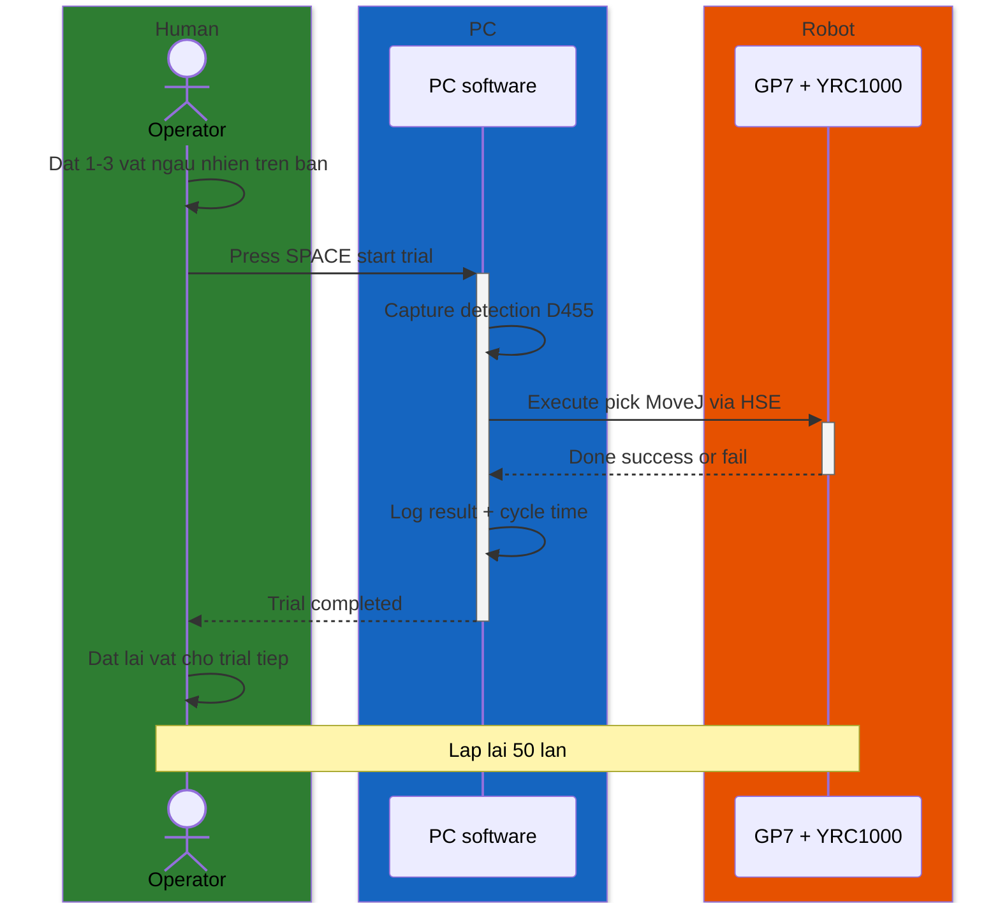

**0. Chuẩn bị trước khi bắt đầu** (làm 1 lần đầu session, không lặp mỗi trial)

- Bật YRC1000, đặt teach pendant về **REMOTE mode**, servo ON.
- Verify cell config: `python -c "from src.cell.cell_models import CellConfig; CellConfig.from_yaml('config/cell_layout_real.yaml')"`.
- Verify HSE: `ping <IP_YRC1000>` reply OK.
- Khởi động script chính:
  ```powershell
  python scripts/03_run_experiment.py --mode real --trials 50 \
      --lighting bright --overlap none
  ```
- Script sẽ in `Trial 1/50 - chờ detection...` và đứng chờ.

**Bước 1 — Operator đặt 1-3 vật ngẫu nhiên trên bàn** (`H->>H`)

- Dùng **template position cards** (in giấy 20 ô đánh số) → bốc thăm vài ô,
  đặt vật vào đúng ô đó. Hoặc lăn xúc xắc chọn (x, y, yaw).
- **Quan trọng**: KHÔNG nhìn output camera khi đặt → tránh bias (vô thức đặt
  vào vị trí "dễ" cho robot).
- Đảm bảo vật nằm gọn trong workspace 600×400 mm, không tràn ra mép bàn.

**Bước 2 — Bấm SPACE để start trial** (`H->>+S`)

- Trong terminal đang chạy `03_run_experiment.py`, nhấn `SPACE` (hoặc Enter,
  tùy CLI flag).
- Lúc này operator **không cần làm gì nữa** cho đến khi trial xong.

**Bước 3 — PC capture + detection** (`S->>S: Capture detection D455`)

- Code tự động (chạy trong `perception_node.py` thread, ~15Hz):
  1. RealSense D455 chụp RGB + depth frame
  2. YOLOv8-seg detect → ra bbox + mask + class cho từng vật
  3. Postprocess: deproject pixel + depth → tọa độ 3D trong camera frame
  4. Áp `T_BC` (hand-eye matrix) → tọa độ trong base frame robot
  5. PCA trên mask → yaw angle để gripper align
- Output: list các vật, mỗi vật có `(x, y, z, yaw, class, confidence)`.

**Bước 4 — PC gửi command MoveJ qua HSE** (`S->>+R: Execute pick MoveJ via HSE`)

- Orchestrator (`orchestrator.py`) làm:
  1. Chọn vật top-Z (nằm cao nhất → gắp trước)
  2. Tính grasp pose (xyz + yaw + offset)
  3. **Predictive safety check C2+**: pure-Python FK verify trajectory không
     vi phạm joint limit / self-collision → reject nếu unsafe
  4. Gen INFORM job: approach → grasp → lift → transfer → place → retreat
  5. FTP upload `.JBI` lên YRC1000 (`/MPRAM1/JBI/`)
  6. HSE `JOB_SELECT` + `START` → YRC1000 chạy job
- Đồng thời: **mirror thread @10Hz** poll joint state thật từ HSE → setJoints
  lên Open3D viewport (operator có thể nhìn 3D robot di chuyển real-time).

**Bước 5 — Robot trả về kết quả** (`R-->>-S: Done success or fail`)

- Robot chạy xong job → READ_STATUS trả `Running = False`.
- PC kiểm tra: gripper có còn nắm vật không (qua force sensor hoặc Y-output
  feedback), vật có ở đúng place position không (visual confirm tùy chọn).
- Failure modes có thể: `detection_miss` (không thấy vật), `unreachable`
  (vật ngoài tầm với), `grasp_slip` (gắp trượt), `motion_error` (HSE timeout
  / alarm), `predicted_unsafe` (C2 reject).

**Bước 6 — Log result + cycle time** (`S->>S: Log result + cycle time`)

- `TrialLogger` ghi 1 row vào `results/experiment_real_<timestamp>.csv` với:
  - `trial_id`, `class_name`, `success` (True/False)
  - `failure_reason` (rỗng nếu success)
  - `cycle_time_s` (từ Bước 2 đến Bước 5)
  - `lighting`, `overlap` (từ CLI flag, dùng để phân tích sau)
- `TelemetryLogger` đã ghi sẵn joint trajectory @10Hz vào CSV riêng
  (`results/telemetry_<timestamp>.csv`).

**Bước 7 — Trial completed** (`S-->>-H: Trial completed`)

- Console in: `Trial 5/50 - success - cycle 6.2s | stats: 4/5 = 80%`.
- Script tự động chờ operator setup trial kế.

**Bước 8 — Operator đặt lại vật cho trial tiếp** (`H->>H: Dat lai vat cho trial tiep`)

- **Pattern 1 (recommended)**: vật vẫn ở place position cũ → operator bốc về
  starting area, đặt vị trí mới ngẫu nhiên.
- **Pattern 2**: nếu vật rơi / lệch / robot làm hỏng → ghi note vào trial log
  manually, sau bỏ qua row đó khi phân tích.
- Lặp lại từ Bước 1.

**Lặp 50 lần** (`Note over H,R: Lap lai 50 lan`)

- 50 trials cho 1 condition (1 lighting + 1 overlap setting).
- Mỗi trial ~10-15s (cycle time robot ~7-10s + setup operator 3-5s) → tổng
  ~10-15 phút.
- Sau 50, đổi `--lighting` hoặc `--overlap`, chạy 50 trial khác.

#### Best practices

| Tình huống | Cách xử |
|---|---|
| Tay run khi đặt vật → vị trí không đều | Dùng template card cứng, đặt vật vào lỗ cố định |
| Quên không đặt vật trước khi bấm SPACE | Detection sẽ trả `[]`, log `detection_miss`, trial bỏ qua, không sao |
| Robot báo alarm giữa session | DigitalTwinMirror auto-trigger `Stop()`, reset alarm trên TP, restart script |
| RealSense D455 disconnect | Restart script + verify USB 3.0 |
| Trial bất thường cần loại | Note `trial_id` riêng, lọc khi phân tích bằng `04_analyze_results.py --exclude` |
| Cần dừng giữa chừng | `Ctrl+C` — script auto-call `robot.Stop()` an toàn |

#### Checklist trước session

- [ ] YRC1000 ở **REMOTE mode**, servo ON
- [ ] `ping <IP_YRC1000>` OK
- [ ] D455 USB 3.0 connect (`scripts/check_d455.py`)
- [ ] `models/yolov8s-seg_best.pt` đã có
- [ ] `config/calibration/T_base_camera.npy` ≤ 3 mm sai số
- [ ] Workspace bàn sạch, đủ ánh sáng đồng đều
- [ ] Template position cards in sẵn
- [ ] Sổ ghi note hoặc spreadsheet để log trial bất thường
- [ ] Ổ đĩa đủ free space (~100 MB cho 500 trial telemetry CSV)

**Tự động đặt vật**: không khả thi với master. Thực hiện bằng tay là OK, nhưng:
- Dùng **template position cards** (in giấy có vị trí số 1–20) → bốc random
- Lăn xúc xắc → chọn vị trí + góc
- Đảm bảo người đặt vật **không nhìn camera output** (tránh bias)

### 10.3. Phân tích thống kê

`scripts/04_analyze_results.py` đọc các file CSV trial, tính success rate tổng / theo class / theo điều kiện, dựng ma trận failure-mode, kiểm định **paired t-test** so sánh RGB-only với RGB-D fusion, và xuất figure tổng hợp (bar chart success rate + boxplot cycle time) vào `figures/`.

**Kết quả mong đợi**:

| Metric | Target |
|---|---|
| Overall success rate | ≥ 80% |
| Per-class | bottle: 85%, cup: 82%, bolt: 75% |
| Cycle time | 7–10 s |
| Depth fusion improvement | +8–15 điểm khi overlap ≥ 10% |
| Localization error | < 5 mm |

---

# PHẦN G: LỘ TRÌNH & CHECKLIST

## 11. Lộ trình

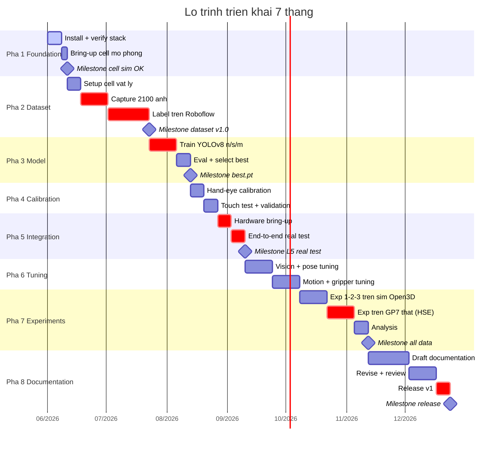

### Chi tiết từng pha

| Pha | Tuần | Nội dung | Deliverable |
|---|---|---|---|
| 1 — Foundation | 1–2 | Install + verify stack, mở Open3D viewport sim | `03_run_experiment.py --mode sim` mở viewport OK |
| 2 — Dataset | 2–8 | Capture + label + augment | Dataset v1.0 (~2100 ảnh labeled) |
| 3 — Model | 8–11 | Train n/s/m + chọn best (máy GPU sẵn có) | Best model `.pt` + bảng so sánh |
| 4 — Calibration | 11–13 | Hand-eye + touch test | T_base_camera.npy ≤ 3 mm |
| 5 — Integration | 13–15 | Hardware bring-up + end-to-end real | Robot pick-place đầu tiên chạy |
| 6 — Tuning | 15–19 | Tune params từng layer | Pipeline tuned ready for exp |
| 7 — Experiments | 19–24 | 3 experiments + analysis | Tables + figures phân tích |
| 8 — Documentation | 24–30 | Draft docs + revise + release | Release v1 |

## 12. Rủi ro tổng hợp

| ID | Rủi ro | Mức | Đối phó |
|---|---|---|---|
| R1 | Dataset không đủ đa dạng | TB | Capture thêm session 2 tuần |
| R2 | YOLO mAP < target | TB | Augmentation heavy + YOLOv8m |
| R3 | Hand-eye calibration sai | TB | Repeat với 35 poses, more rotation |
| R4 | Gripper không tin cậy | TB | Force feedback từ DI controller |
| R5 | Lab time conflict GP7 | Thấp | Đã có GP7; đặt lịch lab từ Tuần 1, plan sim làm backup nếu trùng |
| R6 | Coordinate confusion (frame conversion) | Cao | Unit test sớm (`test_frame_convert.py`), Z-up mm consistent |
| R7 | Khó argue value của approach | TB | Nhấn 3 điểm engineering rõ ràng |

## 13. Action items 2 tuần đầu — chi tiết theo ngày

### Tuần 1

**Ngày 1–2** (Setup):
- [ ] Cài Python 3.10 + venv
- [ ] `pip install -r requirements.txt` (xem `DTwinGP7/requirements.txt`)
- [ ] Cài RealSense SDK 2.0
- [ ] `pytest tests/` → 293 passed
- [ ] `python scripts/03_run_experiment.py --mode sim --trials 1` → Open3D viewport hiện

**Ngày 3–4** (Camera basics):
- [ ] Verify D455 với `rs-viewer.exe` Windows
- [ ] Viết `test_realsense.py` → save 1 RGB + 1 depth PNG
- [ ] Verify kinematics: `python scripts/08_verify_ik.py` → IK round-trip OK

**Ngày 5–7** (Cell + verify):
- [ ] Review `config/cell_layout.yaml` — chỉnh table/camera/object position theo lab thực
- [ ] Verify cell load: `python -c "from src.cell.cell_models import CellConfig; CellConfig.from_yaml('config/cell_layout.yaml')"`
- [ ] (Tuỳ chọn) Mở RoboDK Free + chạy `python scripts/13_verify_vs_robodk.py --samples 100` → confirm FK/IK match RoboDK 0.00mm
- [ ] Họp GVHD: chốt 3 vật + gripper + lịch GP7

### Tuần 2

**Ngày 8–10** (Cell vật lý):
- [ ] Mua/in vật liệu: 3 loại vật × 5 cái, đèn, tấm nỉ, ChArUco board A3
- [ ] Lắp giàn camera (extrusion 30×30)
- [ ] Lắp D455 trên giàn ở 850 mm
- [ ] Đo và đánh dấu vùng làm việc trên bàn (600×400)

**Ngày 11–12** (Calibration prep):
- [ ] Review + verify `02_run_calibration.py`
- [ ] Verify ChArUco detection với 1 ảnh test
- [ ] In bảng A3 calibration

**Ngày 13–14** (First capture session):
- [ ] Review + verify `01_collect_dataset.py`
- [ ] Test capture với 30 ảnh đầu — verify naming, depth save OK
- [ ] **MILESTONE TUẦN 2**: Video screencast 3 phút:
  - Show `03_run_experiment.py --mode sim` mở Open3D viewport, robot animate
  - Show D455 streaming
  - Show 30 ảnh đã capture
- [ ] Push code lên GitHub private

---

## 14. Phụ lục: Checklist tổng

### Trước khi ship / release:

- [ ] Dataset v1.0+ với ≥ 2000 ảnh labeled
- [ ] Model YOLOv8s-seg với mAP@0.5 ≥ 0.85 trên test set
- [ ] T_base_camera.npy với sai số touch test ≤ 3 mm
- [ ] Code chạy end-to-end trong simulation (≥ 50 trials)
- [ ] Code chạy end-to-end trên GP7 thật (≥ 30 trials, nếu có)
- [ ] Pipeline log đầy đủ vào CSV
- [ ] 3 experiments hoàn thành với statistical analysis
- [ ] Tables + figures phân tích
- [ ] Code public GitHub với README + setup guide
- [ ] Video demo 3–5 phút

---
