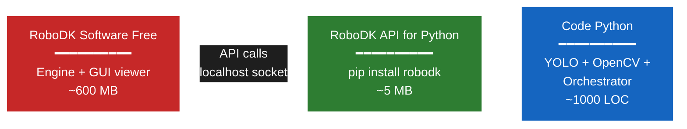
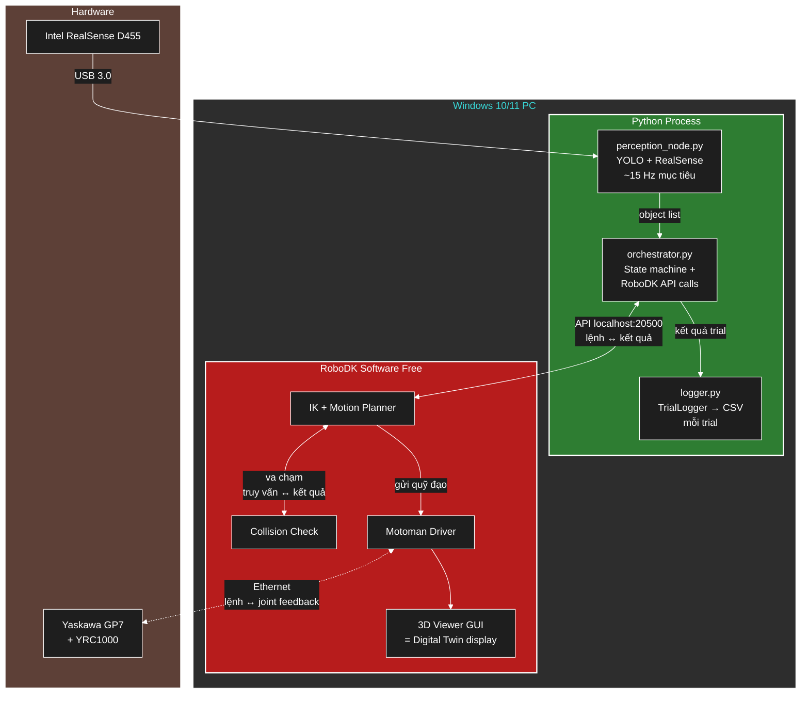
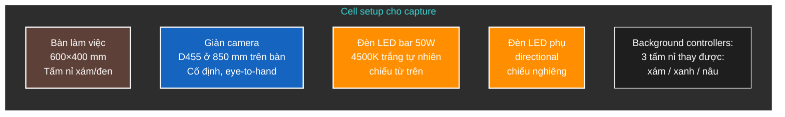
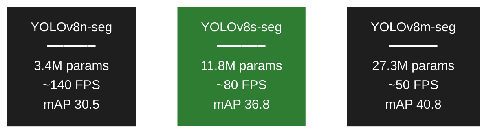
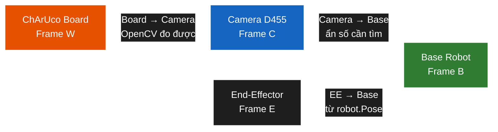
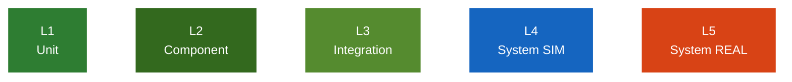
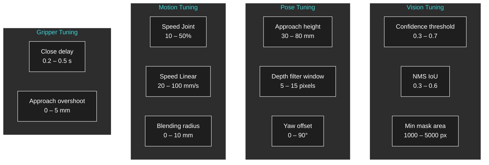
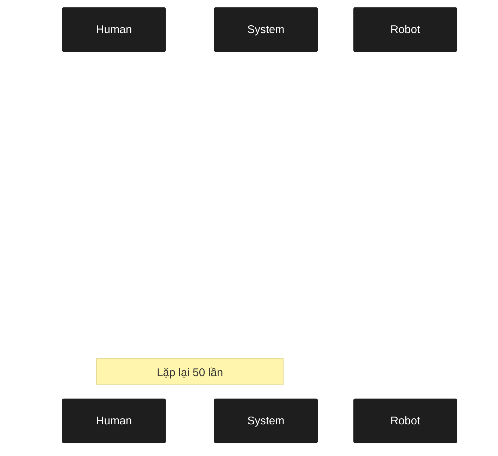
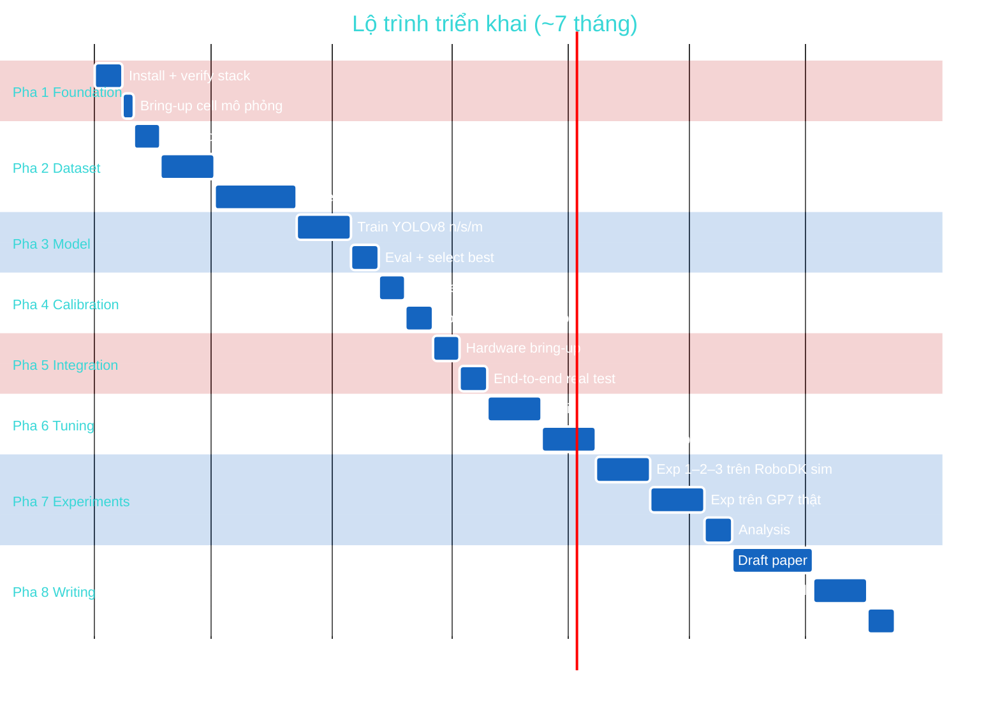

# RoboDK Free + Python

**Đề tài:** Tích hợp mô hình học sâu vào hệ thống Digital Twin cho bài toán gắp–thả sản phẩm có vị trí ngẫu nhiên bằng robot Yaskawa GP7

**Phiên bản:** v3.2

---

## Mục lục

- **Phần A**. Kiến trúc tổng thể (mục 1–3)
- **Phần B**. Xây dựng dataset (mục 4) — **Chi tiết**
- **Phần C**. Xây dựng & huấn luyện model (mục 5) — **Chi tiết**
- **Phần D**. Hand-eye calibration (mục 6) — **Chi tiết**
- **Phần E**. Tích hợp model vào hệ thống (mục 7) — **Chi tiết**
- **Phần F**. Test, hiệu chỉnh, thí nghiệm (mục 8–10) — **Chi tiết**
- **Phần G**. Lộ trình ~7 tháng + Action items (mục 11–13)

---

# PHẦN A — KIẾN TRÚC TỔNG THỂ

## 1. Stack



**Không cần**: Unity 3D, ROS 2, Linux, Gazebo, Isaac Sim, Educational license.

## 2. Sơ đồ kết nối hệ thống



**Vai trò "Digital Twin" trong stack này** = RoboDK 3D Viewer GUI hiển thị real-time joint thật từ GP7 + scene 3D đầy đủ. Đây CHÍNH LÀ digital twin theo định nghĩa kinh điển: bản sao 3D đồng bộ với thực tại.

## 3. Cấu trúc thư mục code

```
files/
├── pickplace_gp7/                   # BỘ CODE (chạy trên máy Windows gần robot)
│   ├── README.md
│   ├── requirements.txt
│   ├── pyproject.toml
│   ├── clean.bat                    # tiện ích xóa __pycache__
│   ├── config/
│   │   ├── cell_layout.yaml         # cell mô phỏng
│   │   ├── cell_layout_real.yaml    # cell cho robot thật
│   │   ├── experiment.yaml          # tham số Orchestrator + thí nghiệm
│   │   └── calibration/
│   │       └── T_base_camera.npy    # output hand-eye (sinh khi chạy)
│   ├── data/
│   │   └── raw/                     # ảnh thô từ D455
│   ├── models/
│   │   ├── README.md
│   │   ├── yolov8s-seg_best.pt      # trọng số (copy từ máy train Linux)
│   │   └── objects/                 # mesh STL: bottle/box/bolt
│   ├── src/
│   │   ├── cell/                    # Phụ lục A — "Cell là code"
│   │   │   ├── __init__.py
│   │   │   ├── cell_models.py       # Pydantic schemas
│   │   │   ├── cell_loader.py       # dựng RoboDK station
│   │   │   ├── exceptions.py
│   │   │   └── pose_utils.py
│   │   ├── perception/
│   │   │   ├── __init__.py
│   │   │   ├── camera.py            # D455 wrapper + MockCamera
│   │   │   ├── detector.py          # YOLO inference + MockDetector
│   │   │   ├── postprocess.py       # mask centroid + PCA + depth
│   │   │   └── perception_node.py
│   │   ├── orchestrator/
│   │   │   ├── __init__.py
│   │   │   ├── coord_conv.py        # transform utilities
│   │   │   ├── state_machine.py
│   │   │   └── orchestrator.py
│   │   ├── calibration/
│   │   │   ├── __init__.py
│   │   │   ├── capture_calibration.py
│   │   │   └── hand_eye_solver.py
│   │   ├── logging/
│   │   │   ├── __init__.py
│   │   │   └── logger.py
│   │   └── utils/
│   │       ├── __init__.py
│   │       └── helpers.py
│   ├── scripts/
│   │   ├── build_station.py          # dựng cell từ config YAML
│   │   ├── dump_cell_to_yaml.py      # capture cell GUI → YAML
│   │   ├── 01_collect_dataset.py
│   │   ├── 02_run_calibration.py
│   │   ├── 03_run_experiment.py
│   │   └── 04_analyze_results.py
│   ├── tests/
│   │   ├── test_cell_loader.py
│   │   ├── test_coord_conv.py
│   │   ├── test_postprocess.py
│   │   ├── test_state_machine.py
│   │   ├── test_hand_eye_solver.py
│   │   └── test_orchestrator_sim.py
│   └── results/ · figures/ · logs/    # thư mục output khi chạy
└── tai_lieu/                          # TÀI LIỆU
    ├── phat_bieu_bai_toan_v3_2_HD.md
    ├── Phu_luc_A_README_HD.md
    └── HUONG_DAN_CAI_DAT.md
```

> **Lưu ý về huấn luyện model:** việc train YOLOv8 (mục 5) thực hiện trên một
> máy Linux + GPU riêng, không nằm trong `pickplace_gp7/`. Repo chỉ nhận file
> trọng số `.pt`/`.onnx` đã train để inference. Dataset thu ở `data/raw/`,
> gán nhãn trên Roboflow rồi chuyển sang máy Linux để train.

---

# PHẦN B — XÂY DỰNG DATASET

## 4. Quy trình xây dựng dataset chi tiết

### 4.1. Tổng quan workflow

```mermaid
%%{init: {'theme':'base', 'themeVariables': {'fontSize':'16px','primaryColor':'#1565C0','primaryTextColor':'#fff','primaryBorderColor':'#fff','lineColor':'#fff','secondaryColor':'#2E7D32','tertiaryColor':'#C62828','background':'#1e1e1e','mainBkg':'#1e1e1e','secondBkg':'#252525','clusterBkg':'#2d2d2d','clusterBorder':'#fff','edgeLabelBackground':'#1e1e1e','textColor':'#fff'}}}%%
flowchart LR
    A[Chốt 3 loại vật] --> B[Setup cell vật lý:<br/>D455 + đèn + nền]
    B --> C[Capture protocol:<br/>3 điều kiện × 3 góc ×<br/>3 mức chồng lấn]
    C --> D[Chụp 2100 ảnh raw<br/>~6–8 giờ]
    D --> E[Label trên Roboflow<br/>polygon segmentation<br/>~3 ngày]
    E --> F[Export YOLOv8 format]
    F --> G[Augmentation pipeline<br/>tăng × 3–4 lần]
    G --> H[Split 70/15/15<br/>train/val/test]
    H --> I[Dataset version v1.0]

    style A fill:#E65100,stroke:#fff,stroke-width:2px,color:#fff
    style D fill:#2E7D32,stroke:#fff,stroke-width:2px,color:#fff
    style E fill:#2E7D32,stroke:#fff,stroke-width:2px,color:#fff
    style I fill:#1565C0,stroke:#fff,stroke-width:2px,color:#fff
```



### 4.2. Chọn 3 loại vật (Object Selection)

**Tiêu chí chọn**:

| Tiêu chí | Yêu cầu |
|---|---|
| Kích thước | 50–150 mm (vừa cho gripper) |
| Khối lượng | < 500 g |
| Hình dạng | Đơn giản (hộp, trụ, khối), tránh dạng phức tạp lúc đầu |
| Vật liệu | Không trong suốt, không phản chiếu gương |
| Màu sắc | Khác biệt nhau (để vision dễ tách) |
| Có CAD model | Yes (cho build_station.py + augmentation) |
| Sẵn có / dễ mua | Yes (để in 5–10 cái mỗi loại) |

**Gợi ý 3 loại điển hình**:

1. **Class 1: "bottle"** — chai nhựa nước ngọt 330ml (cylinder, dài, dễ nhận)
2. **Class 2: "cup"** — hộp giấy carton nhỏ 80×60×40 mm (cuboid)
3. **Class 3: "bolt"** — bulông M16 dài 100 mm (cylinder ngắn, kim loại sáng)

→ 3 vật này có **hình dạng và màu sắc khác biệt rõ rệt** → vision không bị nhầm lẫn. Có thể đổi theo tài nguyên sẵn có, nhưng giữ nguyên tắc đa dạng.

**Lưu ý**: phải mua/in **≥ 5 cái mỗi loại** để chụp nhiều scene khác nhau (đặt 3–5 vật cùng lúc trên bàn).

### 4.3. Setup cell vật lý cho data capture



**Vật tư cần chuẩn bị**:
- 1 tấm nỉ xám 600×400 mm (mặt bàn chính)
- 2 tấm nỉ thay thế (xanh, nâu) — cho augmentation natural
- 1 thước đo + bút marker để vẽ vùng làm việc
- 1 đèn LED bar 30–50 W trắng (4500–5000 K) — đèn chính
- 1 đèn LED nhỏ rời (cho ánh sáng nghiêng)
- Giàn camera: extrusion nhôm 20×20 hoặc 30×30, cao ~1.2 m

### 4.4. Capture Protocol (giao thức chụp ảnh)

**Tổng số ảnh cần chụp**: 2100 ảnh raw (700/class)

Phân bổ chi tiết:

| Biến | Mức | Số ảnh/class | Ghi chú |
|---|---|---|---|
| **Điều kiện ánh sáng** | Sáng (700–1000 lux) | 280 | Đèn LED bar |
| | Trung bình (400–600 lux) | 280 | Giảm 1 đèn |
| | Yếu (200–300 lux) | 140 | Tắt đèn phụ |
| **Góc camera** | Top-down (0°) | 280 | Default |
| | Nghiêng nhẹ X (±10°) | 280 | Lắc nhẹ giàn |
| | Nghiêng nhẹ Y (±10°) | 140 | |
| **Mức chồng lấn** | Vật rời rạc | 280 | Mỗi ảnh 2–3 vật cách nhau |
| | Chồng lấn nhẹ ≤ 10% | 280 | Vật chạm mép |
| | Chồng lấn 10–20% | 140 | Vật đè nhẹ |
| **Nền (background)** | Nỉ xám (default) | 420 | Đa số |
| | Nỉ xanh | 140 | |
| | Nỉ nâu | 140 | |

→ Mỗi ảnh là **một combination các biến trên**. Tổng = 700 ảnh/class × 3 class = 2100 ảnh.

**Script hỗ trợ chụp** — `scripts/01_collect_dataset.py`:

Triển khai: `pickplace_gp7/scripts/01_collect_dataset.py` — hiển thị live view D455, phím tắt chuyển nhãn cảnh (class / lighting / overlap / background), nhấn SPACE để lưu đồng thời ảnh RGB + depth. Tên file tự sinh theo quy ước `class_lighting_angle_overlap_background_NNN` để truy vết điều kiện chụp.

**Lịch chụp gợi ý** (2 ngày làm việc):
- **Ngày 1 sáng** (3h): chụp 700 ảnh class "bottle" — đổi qua tất cả conditions
- **Ngày 1 chiều** (3h): chụp 700 ảnh class "cup"
- **Ngày 2 sáng** (3h): chụp 700 ảnh class "bolt"
- **Ngày 2 chiều** (3h): chụp **multi-class scenes** (2–3 vật khác class trên cùng ảnh) — quan trọng cho test mixing

### 4.5. Labeling — Quy trình trên Roboflow

**Roboflow Free tier** (đăng ký free, đủ cho 10,000 ảnh):

1. Tạo project: **"GP7 Pick Place"** → Type: **Instance Segmentation**
2. Upload 2100 ảnh RGB (skip depth, chỉ label RGB)
3. Define 3 classes: `bottle`, `cup`, `bolt`
4. Label từng ảnh bằng **polygon tool** (segmentation)
   - Click các điểm xung quanh viền vật
   - Roboflow có "Smart Polygon" hỗ trợ (Cmd+click) — tăng tốc 3–5x
5. Khi xong: Generate Dataset → Format **YOLOv8** → Download

**Thời gian ước tính**:
- Vật đơn giản (rời rạc): 15–25 giây/ảnh
- Vật chồng lấn (nhiều polygon): 40–60 giây/ảnh
- Trung bình: ~30 s/ảnh × 2100 = **17.5 giờ** ≈ 3 ngày làm việc tập trung

**Tips tăng tốc labeling**:
- Dùng Smart Polygon (Roboflow AI assist) cho vật rời rạc → click 1 lần ra mask gần đúng, chỉnh nhẹ
- Outsource cho team labeling rẻ Việt Nam (~\$15–30/1000 ảnh) nếu có ngân sách
- Train sơ một model trên 200 ảnh đầu, dùng nó **pre-label** 1900 ảnh còn lại → chỉnh sửa, nhanh hơn 5–10x

### 4.6. Data Augmentation chiến lược

Sau khi có 2100 ảnh labeled, **augmentation** giúp tăng dataset hiệu dụng lên ~6000–8000 ảnh mà không cần chụp thêm.

**2 cách augmentation**:

**Cách 1 — Roboflow built-in** (đơn giản, làm 1 lần):

Trong Roboflow Generate dataset, bật augmentations:
- Flip: horizontal, vertical
- Rotation: -30° to +30°
- Brightness: ±25%
- Saturation: ±25%
- Hue: ±15°
- Noise: up to 5%
- Cutout: 3 boxes, 10% size

→ Generate 3 augmented per original = **6300 ảnh total**

**Cách 2 — Albumentations runtime** (linh hoạt, làm khi train):

Pipeline biến đổi chạy động mỗi epoch: brightness/contrast, HSV, Gaussian noise, motion blur, rotate ±30°, scale, horizontal flip, coarse dropout.

→ Ultralytics YOLOv8 đã có augmentation mặc định khá tốt (Mosaic, MixUp, HSV). **Mặc định + Cách 1 Roboflow** là đủ. Không cần Cách 2 trừ khi muốn nâng cao.

### 4.7. Train/Val/Test split

| Split | Tỷ lệ | Số ảnh | Mục đích |
|---|---|---|---|
| **Train** | 70% | ~1470 (×3 sau aug = ~4400) | Huấn luyện model |
| **Val** | 15% | ~315 | Hyperparameter tuning, early stopping |
| **Test** | 15% | ~315 | **CHỈ dùng cuối cùng** để báo cáo metrics |

**Quy tắc quan trọng**:
- Split theo **session chụp**, không random theo ảnh. Nếu chụp 30 ảnh liên tiếp cùng scene → tất cả phải vào cùng split. Tránh leak.
- Đảm bảo mỗi split có đủ **mọi condition** (lighting, angle, overlap, bg) và mỗi class có ~tỷ lệ tương đương.

Roboflow tự lo split khi Generate dataset. **Verify thủ công** rằng split đúng tỷ lệ.

### 4.8. Dataset versioning

Đề tài tốt cần track version dataset:
- **v1.0**: Initial 2100 ảnh, baseline
- **v1.1**: Sau thêm 200 ảnh edge cases (chồng lấn nặng, vật bị che)
- **v1.2**: Thêm 100 ảnh "fail mode" — sau khi phân tích thấy model fail ở scene nào

→ Mỗi version save thành 1 dataset riêng trên Roboflow (free unlimited versions).

---

# PHẦN C — XÂY DỰNG & HUẤN LUYỆN MODEL

## 5. Pipeline huấn luyện chi tiết

### 5.1. Vì sao chọn YOLOv8-seg

**Yêu cầu của bài toán**:
- Real-time inference (≥ 15 FPS)
- Segmentation (không chỉ bounding box) — cần mask để tính centroid + PCA chính xác
- Đào tạo nhanh với dataset vừa (~2000 ảnh)
- Cộng đồng lớn, dễ deploy

**So sánh các option**:

| Model | mAP COCO | FPS GPU | Train time | Phù hợp? |
|---|---|---|---|---|
| YOLOv8-seg (Ultralytics) | 36–50% | 80–300 | 4–8h | ✅ Chính |
| Mask R-CNN (Detectron2) | 37–45% | 5–15 | 12–24h | Quá chậm cho real-time |
| YOLOv5-seg | 32–44% | 80–250 | 4–8h | Cũ hơn YOLOv8 |
| YOLOv9/v10/v11 | 38–52% | tương tự | tương tự | Mới, ít cộng đồng |
| SAM (Segment Anything) | N/A | 0.5–2 | N/A | Không real-time, không class |

→ **YOLOv8-seg** chọn vì balance accuracy/speed/maturity tốt nhất.

### 5.2. Chọn variant: n / s / m



**Chiến lược**:
- Train **cả 3 variants** trong pha đầu
- So sánh trên test set → bảng trade-off accuracy/speed → **đóng góp C2 của paper**
- Production: dùng **YOLOv8s-seg** (cân bằng tốt nhất)

### 5.3. Hyperparameters huấn luyện

| Nhóm | Tham số | Giá trị |
|---|---|---|
| Cơ bản | epochs / patience / batch / imgsz | 150 / 30 / 16 / 640 |
| Optimizer | AdamW · lr0 / lrf | 0.001 / 0.01 |
| | momentum / weight_decay / warmup | 0.937 / 0.0005 / 3 epoch |
| Augmentation | mosaic / mixup / copy_paste | 1.0 / 0.15 / 0.30 |
| | hsv (h,s,v) / degrees / scale | (0.015, 0.7, 0.4) / 10° / 0.5 |

AdamW được chọn thay SGD vì ổn định hơn với dataset vừa (~2000 ảnh); `copy_paste=0.3` đặc biệt hiệu quả cho instance segmentation.

### 5.4. Quy trình huấn luyện

Quy trình mỗi variant: khởi tạo từ trọng số COCO pretrained → train với early stopping (patience 30) → đánh giá trên test set (mAP box/seg, per-class AP, tốc độ) → tổng hợp 3 variant thành bảng so sánh accuracy/speed.

Việc train thực hiện trên máy Linux + GPU (xem mục 3). Trên RTX 4060/4070, một run YOLOv8s-seg 150 epoch (~1500 ảnh) mất 4–6 giờ; cả 3 variant ~15–18 giờ (chạy qua đêm).

### 5.5. Validation metrics — đo gì, đo thế nào

Sau training, evaluate trên test set:

Các metric COCO-style được dùng: mAP@0.5 và mAP@0.5:0.95 cho cả bounding box lẫn segmentation mask, AP từng class, và tốc độ inference (ms / FPS).

**Target metrics cho luận văn**:

| Metric | Target | Reason |
|---|---|---|
| Box mAP@0.5 | ≥ 0.85 | Detection chính xác |
| Box mAP@0.5:0.95 | ≥ 0.55 | Localization chặt chẽ |
| Seg mAP@0.5 | ≥ 0.80 | Segmentation tốt cho centroid |
| Per-class AP@0.5 | ≥ 0.75 | Không bị "ăn" class nào |
| FPS | ≥ 15 | Real-time |

### 5.6. Khắc phục các vấn đề thường gặp

| Vấn đề | Nguyên nhân | Giải pháp |
|---|---|---|
| Train loss tăng đột ngột | LR quá cao | Giảm `lr0` còn 0.0005 |
| Val mAP < 0.5 | Dataset quá ít/đơn điệu | Thêm ảnh + tăng augmentation |
| Overfitting (train ↑↑, val ↓) | Quá nhiều epoch | Patience=20, dùng best.pt |
| 1 class AP rất thấp | Imbalance | Oversample class đó, hoặc tăng `cls` loss weight |
| FPS chậm | Model lớn | Đổi xuống YOLOv8n hoặc s |
| Mask "cắt khúc", không liền | imgsz quá nhỏ | Tăng `imgsz=800` hoặc 960 |

---

# PHẦN D — HAND-EYE CALIBRATION

## 6. Hiệu chuẩn camera ↔ robot

### 6.1. Bài toán + setup



**Mục tiêu**: Tìm ma trận $T_C^B$ chuyển từ Camera frame sang Base frame robot.

> Trong code, ma trận này được đặt tên `T_BC` (`T_base_camera`): `p_base = T_BC @ p_camera`. Hai cách viết tương đương.

**Setup eye-to-hand**:
- D455 lắp **cố định** trên giàn cao (KHÔNG gắn lên end-effector)
- Robot giữ **ChArUco board** ở end-effector (gắn bằng kẹp hoặc gripper)
- Hoặc: ChArUco đặt trên bàn cố định, robot di chuyển → đọc pose tool

**Phương pháp**: **Park-Martin** (1994) — sai số ≤ 3 mm khả thi.

> ⚠ **Không dùng Tsai-Lenz cho setup này.** Tsai-Lenz (1989) là phương pháp
> kinh điển nhưng tham số hóa rotation bằng vector kiểu Rodrigues cải biên,
> có **điểm kỳ dị tại góc xoay 180°**. Trong setup eye-to-hand với camera
> lắp trên cao **nhìn thẳng xuống**, ma trận $T_C^B$ chứa thành phần xoay
> xấp xỉ 180° (trục Z camera ngược trục Z base) — rơi đúng vào điểm kỳ dị
> → kết quả calibration sai lệch lớn. Kiểm chứng bằng dữ liệu tổng hợp cho
> thấy Tsai-Lenz **không khôi phục được** $T_C^B$ trong khi Park-Martin và
> Daniilidis (1998) khôi phục chính xác trên cùng bộ dữ liệu.
>
> Khuyến nghị: dùng **Park** (mặc định) hoặc **Daniilidis**. Cả hai không có
> điểm kỳ dị 180°. Trong OpenCV: `cv2.CALIB_HAND_EYE_PARK` /
> `cv2.CALIB_HAND_EYE_DANIILIDIS`.

### 6.2. Chuẩn bị ChArUco board

**Sinh ảnh board để in**:
Dùng OpenCV `cv2.aruco` sinh bảng ChArUco 7×5 ô (cạnh ô 40 mm, marker 30 mm, từ điển `DICT_4X4_50`), xuất ảnh PNG để in.

In trên giấy A3 **plain matte** (chống phản chiếu). Dán lên bìa cứng phẳng (foam board, gỗ ván) để không bị cong.

**Verify kích thước**: dùng thước đo 1 ô vuông phải đúng **40 mm**. Nếu không đúng, hiệu chỉnh `square_length` cho phù hợp với in thực tế.

### 6.3. Quy trình thu pose

Triển khai: `pickplace_gp7/src/calibration/` + `scripts/02_run_calibration.py`. Thu 25–30 cặp pose — $T_W^C$ (pose board trong camera frame, đo bằng OpenCV `solvePnP` trên ChArUco corner) và $T_E^B$ (pose end-effector trong base, đọc từ `robot.Pose()`) — rồi giải bằng `cv2.calibrateHandEye` với phương pháp Park.

Quy ước eye-to-hand: phải nghịch đảo `gripper2base → base2gripper` trước khi đưa vào OpenCV thì output mới đúng là `T_C^B` (camera trong base).

**Capture protocol** (~1.5 giờ):
1. Robot start ở Home pose
2. Đặt ChArUco trên end-effector (gắn bằng gripper hoặc kẹp custom)
3. Cho robot di chuyển tới **25–30 pose khác nhau** trong vùng hoạt động:
   - **5 pose** ở 3 độ cao khác nhau (300 mm, 500 mm, 700 mm trên bàn)
   - Tại mỗi độ cao, di chuyển sang trái/phải/trước/sau
   - **Rotate end-effector** ±30° quanh từng trục giữa các pose
4. Tại mỗi pose: chờ robot dừng hẳn (5 giây) → press SPACE → script log

→ **Quan trọng**: pose phải **đa dạng về rotation**, không chỉ translation. Nếu chỉ translation, calibration sẽ ill-conditioned (sai số lớn).

### 6.4. Validation: Touch Test

Sau khi có `T_base_camera.npy`, **test bằng tay**:

Chọn 5 điểm có toạ độ đã biết trong camera frame (vd các corner ChArUco), chuyển sang base frame qua `T_C^B`, cho robot đưa TCP tới từng điểm và quan sát/đo độ lệch thực tế.

**Kết quả mong đợi**: TCP gripper chạm trong vòng **2–3 mm** của điểm thật. Nếu > 5 mm → calibration sai, làm lại với nhiều pose hơn.

### 6.5. Sai số calibration thường gặp

| Sai số | Nguyên nhân | Cách giảm |
|---|---|---|
| 5–10 mm | Pose calibration chỉ translation | Thêm rotation |
| > 10 mm | ChArUco in sai kích thước | Đo lại, sửa `square_length` |
| 3–5 mm | Robot rung khi chụp | Chờ 5 giây sau MoveJ |
| 2–3 mm | Camera intrinsics chưa chính xác | OK, accept hoặc calibrate intrinsics riêng |
| < 2 mm | Tốt | Đủ cho pick-and-place |

---

# PHẦN E — TÍCH HỢP MODEL VÀO HỆ THỐNG

## 7. Pipeline integration

### 7.1. Module Perception

Triển khai: `pickplace_gp7/src/perception/`. Perception chạy trên thread riêng, vòng lặp: frame D455 → YOLO detect → trích pose 3D → đẩy vào queue. Gồm 4 thành phần:

- **Camera** (`camera.py`) — bọc D455, align depth↔color, lọc nhiễu depth.
- **Detector** (`detector.py`) — inference YOLOv8-seg → list detection (class, confidence, mask, bbox).
- **Pose extractor** (`postprocess.py`) — từ mask + depth tính centroid, độ sâu (median chống nhiễu), deproject về toạ độ 3D camera frame, và yaw (PCA trên mask).
- **PerceptionNode** (`perception_node.py`) — điều phối vòng lặp, đẩy message `{timestamp, objects, fps}` vào queue (bỏ frame cũ nếu nghẽn).

Mỗi thành phần có bản giả lập (`MockCamera`, `MockDetector`) cho test/sim không cần phần cứng.

### 7.2. Module Orchestrator

Triển khai: `pickplace_gp7/src/orchestrator/`. Orchestrator điều phối một chu trình pick-and-place:

1. Nhận detection mới nhất từ queue của Perception.
2. Chuyển pose vật từ camera frame sang base frame qua `T_C^B`.
3. Chọn vật "trên cùng" (Z lớn nhất) để gắp trước.
4. **Kiểm tra với-tới-được + va chạm bằng digital twin** (`MoveJ_Test`) TRƯỚC mỗi lần gắp vật lý — lớp an toàn (một đóng góp của paper).
5. Thực thi chuỗi chuyển động approach → grasp → lift → transfer → place → retreat; điều khiển gripper qua Digital Output.
6. Ghi kết quả từng trial (thành/bại, lý do, cycle time) ra CSV.

Luồng trạng thái được kiểm soát bằng state machine (IDLE→DETECT→PLAN→APPROACH→…→DONE/ERROR) để bắt lỗi chuyển trạng thái.

### 7.3. Điểm vào thí nghiệm

`scripts/03_run_experiment.py` ghép toàn bộ: dựng cell trong RoboDK, khởi động Perception, chạy N trial qua Orchestrator, ghi kết quả ra `results/`. Hai chế độ: `--mode sim` (Mock camera/detector, vẫn chạy đủ pipeline + digital twin) và `--mode real` (D455 + YOLO thật + GP7).

### 7.4. Dựng cell bằng code

RoboDK Free không lưu được file `.rdk`, nên cell được mô tả bằng config YAML và dựng lại bằng code mỗi lần mở RoboDK (paradigm "Cell là code" — xem Phụ lục A). `scripts/build_station.py` đọc `config/cell_layout.yaml`, validate bằng Pydantic, rồi nạp robot GP7 + bàn + camera + gripper + frame + mesh vật vào station.

Triển khai: `pickplace_gp7/src/cell/` (chi tiết trong `Phu_luc_A_README_HD.md`).

---

# PHẦN F — TEST, HIỆU CHỈNH, THÍ NGHIỆM

## 8. Test strategy 5 lớp



| Lớp | Phạm vi | Phần cứng | Cách chạy |
|---|---|---|---|
| **L1** Unit | Hàm độc lập: `coord_conv`, `postprocess`, state machine, hand-eye solver | Không | `pytest tests/` |
| **L2** Component | Module isolation: perception (Mock camera/detector), orchestrator (mock robot) | Không | `pytest tests/test_orchestrator_sim.py` |
| **L3** Integration | 2–3 module ghép: vision → transform → RoboDK | RoboDK GUI | `pytest tests/` có RoboDK |
| **L4** System SIM | Full pipeline + digital twin, detection giả lập | RoboDK GUI | `03_run_experiment.py --mode sim` |
| **L5** System REAL | Full pipeline + D455 + GP7 | RoboDK + D455 + GP7 | `03_run_experiment.py --mode real` |

Thư viện phần cứng (`pyrealsense2`, `robodk`, `ultralytics`) đều lazy-import → L1–L2 chạy được trên máy không có phần cứng. Hiện có **65 test case** ở `pickplace_gp7/tests/` cover L1–L3. Lịch tham chiếu: L1 từ Tuần 4 (ongoing) · L4 ≈ Tuần 14 · L5 ≈ Tuần 23+.

## 9. Hiệu chỉnh (Tuning)

### 9.1. Các parameter cần tune



### 9.2. Tuning workflow

**Đừng tune tất cả cùng lúc!** Làm theo thứ tự:

1. **Vision first** (tuần 11): tune confidence/NMS để detection chính xác. Đo metric mAP.
2. **Pose extraction** (tuần 12): tune depth window, kiểm tra localization error.
3. **Motion params** (tuần 13): tune speed, blending — bắt đầu chậm, tăng dần.
4. **Gripper timing** (tuần 14): tune close delay để gripper kẹp chặt trước khi lift.

Mỗi parameter, **vary 5–10 giá trị**, chạy 10 trials mỗi giá trị, plot success rate.

### 9.3. Failure mode analysis

Sau mỗi 50 trials, log chi tiết failure để phân tích:

Mỗi trial thất bại được ghi kèm **lý do** vào CSV — các nhóm: `detection_miss`, `wrong_class`, `wrong_yaw`, `unreachable`, `collision`, `gripper_slip`, `placement_drop`.

Cuối thí nghiệm, build failure mode matrix:

| Reason | Count | % | Action |
|---|---|---|---|
| detection_miss | 3 | 6% | Augmentation thêm |
| wrong_yaw | 5 | 10% | PCA refinement |
| gripper_slip | 4 | 8% | Tune close timing |
| collision | 0 | 0% | OK |
| unreachable | 2 | 4% | Adjust workspace |

→ **Đây là Discussion section quan trọng của paper**.

## 10. Thí nghiệm chính thức

### 10.1. Thiết kế thí nghiệm

**Experiment 1 — Baseline performance**
- 50 trials, 3 loại vật, điều kiện chuẩn (sáng đầy đủ, nỉ xám)
- Đo: pick success rate, cycle time, localization error

**Experiment 2 — Ablation depth fusion**
- 50 trials × 2 modes (with depth / RGB only)
- So sánh success rate, đặc biệt khi có chồng lấn

**Experiment 3 — Robustness**
- 50 trials × 3 điều kiện ánh sáng (sáng/vừa/yếu)
- Đo success rate degradation

**Tổng**: ~200–250 trials. Mỗi trial ~10 giây → ~30–45 phút thí nghiệm + 30 phút setup.

### 10.2. Protocol mỗi trial



**Tự động hóa đặt vật**: không khả thi với master. Thực hiện bằng tay là OK, nhưng:
- Dùng **template position cards** (in giấy có vị trí số 1–20) → bốc random
- Lăn xúc xắc → chọn vị trí + góc
- Đảm bảo người đặt vật **không nhìn camera output** (tránh bias)

### 10.3. Phân tích thống kê

`scripts/04_analyze_results.py` đọc các file CSV trial, tính success rate tổng / theo class / theo điều kiện, dựng ma trận failure-mode, kiểm định **paired t-test** so sánh RGB-only với RGB-D fusion, và xuất figure tổng hợp (bar chart success rate + boxplot cycle time) vào `figures/`.

**Kết quả mong đợi cho paper**:

| Metric | Target |
|---|---|
| Overall success rate | ≥ 80% |
| Per-class | bottle: 85%, cup: 82%, bolt: 75% |
| Cycle time | 7–10 s |
| Depth fusion improvement | +8–15 điểm khi overlap ≥ 10% |
| Localization error | < 5 mm |

---

# PHẦN G — LỘ TRÌNH + ACTION ITEMS

## 11. Lộ trình



### Chi tiết từng pha

| Pha | Tuần | Nội dung | Deliverable |
|---|---|---|---|
| 1 — Foundation | 1–2 | Install + verify stack, dựng cell mô phỏng | `build_station.py` dựng cell OK |
| 2 — Dataset | 2–8 | Capture + label + augment | Dataset v1.0 (~2100 ảnh labeled) |
| 3 — Model | 8–11 | Train n/s/m + chọn best (máy GPU sẵn có) | Best model `.pt` + bảng so sánh |
| 4 — Calibration | 11–13 | Hand-eye + touch test | T_base_camera.npy ≤ 3 mm |
| 5 — Integration | 13–15 | Hardware bring-up + end-to-end real | Robot pick-place đầu tiên chạy |
| 6 — Tuning | 15–19 | Tune params từng layer | Pipeline tuned ready for exp |
| 7 — Experiments | 19–24 | 3 experiments + analysis | Tables + figures cho paper |
| 8 — Writing | 24–30 | Draft + revise + submit | Manuscript submitted |

## 12. Rủi ro tổng hợp

| ID | Rủi ro | Mức | Đối phó |
|---|---|---|---|
| R1 | Dataset không đủ đa dạng | TB | Capture thêm session 2 tuần |
| R2 | YOLO mAP < target | TB | Augmentation heavy + YOLOv8m |
| R3 | Hand-eye calibration sai | TB | Repeat với 35 poses, more rotation |
| R4 | Gripper không tin cậy | TB | Force feedback từ DI controller |
| R5 | Lab time conflict GP7 | Thấp | Đã có GP7; đặt lịch lab từ Tuần 1, plan sim làm backup nếu trùng |
| R6 | Coordinate confusion (RoboDK) | Cao | Unit test sớm, RoboDK Z-up mm consistent |
| R7 | Reviewer chê novelty | TB | Nhấn 3 đóng góp engineering |
| R8 | Save .rdk vướng license | Đã xử | build_station.py script |

## 13. Action items 2 tuần đầu — chi tiết theo ngày

### Tuần 1

**Ngày 1–2** (Setup):
- [ ] Cài Python 3.10 + venv
- [ ] `pip install -r requirements.txt` (xem `pickplace_gp7/requirements.txt`)
- [ ] Cài RoboDK Software Free (`robodk.com/download`)
- [ ] Cài RealSense SDK 2.0
- [ ] Test `test_connection.py` → "Robot found"

**Ngày 3–4** (Robot + Camera basics):
- [ ] Drag GP7 từ Library vào RoboDK
- [ ] Save dummy `.rdk` (sẽ không dùng nữa, chỉ để verify install)
- [ ] Verify D455 với `rs-viewer.exe` Windows
- [ ] Viết `test_realsense.py` → save 1 RGB + 1 depth PNG

**Ngày 5–7** (Build cell):
- [ ] Vẽ phác cell trong RoboDK GUI (thử nghiệm layout)
- [ ] Ghi tọa độ các item (bàn, gripper, frames)
- [ ] Review + verify `build_station.py` — tái tạo cell
- [ ] Verify: delete tất cả → chạy `build_station.py` → cell xuất hiện
- [ ] Họp GVHD: chốt 3 vật + gripper + lịch GP7

### Tuần 2

**Ngày 8–10** (Cell vật lý):
- [ ] Mua/in vật liệu: 3 loại vật × 5 cái, đèn, tấm nỉ, ChArUco board A3
- [ ] Lắp giàn camera (extrusion 30×30)
- [ ] Lắp D455 trên giàn ở 850 mm
- [ ] Đo và đánh dấu vùng làm việc trên bàn (600×400)

**Ngày 11–12** (Calibration prep):
- [ ] Review + verify `02_run_calibration.py`
- [ ] Verify ChArUco detection với 1 ảnh test
- [ ] In bảng A3 calibration

**Ngày 13–14** (First capture session):
- [ ] Review + verify `01_collect_dataset.py`
- [ ] Test capture với 30 ảnh đầu — verify naming, depth save OK
- [ ] **MILESTONE TUẦN 2**: Video screencast 3 phút:
  - Show RoboDK build_station.py tự dựng cell
  - Show D455 streaming
  - Show 30 ảnh đã capture
- [ ] Push code lên GitHub private

---

## 14. Phụ lục: Checklist tổng

### Trước khi submit luận văn:

- [ ] Dataset v1.0+ với ≥ 2000 ảnh labeled
- [ ] Model YOLOv8s-seg với mAP@0.5 ≥ 0.85 trên test set
- [ ] T_base_camera.npy với sai số touch test ≤ 3 mm
- [ ] Code chạy end-to-end trong simulation (≥ 50 trials)
- [ ] Code chạy end-to-end trên GP7 thật (≥ 30 trials, nếu có)
- [ ] Pipeline log đầy đủ vào CSV
- [ ] 3 experiments hoàn thành với statistical analysis
- [ ] Tables + figures cho paper
- [ ] Code public GitHub với README + setup guide
- [ ] Video demo 3–5 phút cho bảo vệ

---
