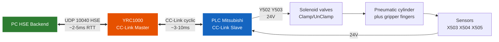

# models/ — Trọng số model + mesh

Model YOLOv8-seg được **train trên máy Linux GPU** (việc train nằm ngoài
repo này). Thư mục này chứa trọng số đã train để inference + các file mesh.

## ⭐ File trọng số cần có (cho `--mode real`)

| File | Mô tả | Nguồn |
|---|---|---|
| `yolov8s-seg_best.pt` | Trọng số production (variant `s`) | Copy từ máy train |

`config/experiment.yaml :: model_path` trỏ tới `models/yolov8s-seg_best.pt`.
Đổi giá trị này nếu dùng tên/đường dẫn khác.

> **Sim mode (`--headless` hoặc default `--mode sim`)** dùng `MockDetector` →
> KHÔNG cần file `.pt`. Chỉ cần khi `--mode real` (D455 + GP7 thật).

## ⭐ Đưa trọng số từ máy train về

Sau khi train xong trên máy Linux, copy file trọng số tốt nhất về máy chạy
và đặt đúng tên mà `experiment.yaml` trỏ tới:

```bash
copy best.pt  models\yolov8s-seg_best.pt
```

## ⭐ Định dạng hỗ trợ

`ObjectDetector` nạp được cả `.pt` và `.onnx`. Nếu muốn chạy inference không
cần PyTorch GPU, có thể export ONNX trên máy train (`yolo export model=best.pt
format=onnx`) rồi trỏ `model_path` tới file `.onnx`.

## ⭐ Mesh STL

| Thư mục | Nội dung |
|---|---|
| `models/` | `worktable.stl`, `pedestal.stl`, `gripper.stl`, `floor.stl` |
| `models/objects/` | `tray.stl` (Galaxy S23 use case), `bottle.stl`, `cup.stl`, `bolt.stl` |

`config/cell_layout.yaml` tham chiếu các đường dẫn mesh này; `O3DGuiSimRobot`
load chúng vào Open3D Filament viewport khi mở (sim non-headless hoặc real
mode mirror). Cùng mesh dùng cho:
- Sim mode (`--mode sim`) — SimRobot animate qua URDF, `tray` là target gắp chính
- Real mode (`--mode real --backend hse`) — Open3D viewport mirror robot thật
  từ HSE joints @2Hz; mesh tĩnh (bàn/pedestal) cộng arm động + gripper rendered

## ⭐ Sinh STL primitive nếu thiếu

Repo có sẵn các STL được commit. Nếu thiếu / muốn sinh lại:

```bash
pip install trimesh
python scripts/gen_primitive_meshes.py                  # tất cả primitives
python scripts/gen_primitive_meshes.py --only gripper   # chỉ 1 file
```

## ⭐ Gripper subsystem — Path A: PC ↔ YRC1000 ↔ PLC qua CC-Link

Gripper khí nén **double-acting** điều khiển bằng PLC Mitsubishi. PC giao tiếp
với PLC **qua YRC1000 làm CC-Link bridge** — PC chỉ biết HSE protocol, PLC
chỉ biết CC-Link, YRC handle conversion.



### ✨ Memory mapping (5 bits qua CC-Link bridge)

⚠ Bảng giả định — verify trên YRC TP + PLC ladder. Override qua
`config["gripper_cc_link"]` nếu khác.

| PLC pin | Direction | PLC ladder bridge | CC-Link | YRC bit | PC HSE call |
|---|---|---|---|---|---|
| Y502 Clamp solenoid | OUT to HW | RY0 → Y502 | RY0 | 30010 | `set_io(30010, 1)` |
| Y503 UnClamp solenoid | OUT to HW | RY1 → Y503 | RY1 | 30011 | `set_io(30011, 1)` |
| X504 Clamp sensor | IN from HW | X504 → RX0 | RX0 | 30050 | `read_io(30050)` |
| X503 UnClamp sensor | IN from HW | X503 → RX1 | RX1 | 30051 | `read_io(30051)` |
| X505 Carrier Detect | IN from HW | X505 → RX2 | RX2 | 30052 | `read_io(30052)` |

### ✨ Setup 3 components

**1. YRC1000 — CC-Link Master** (qua teach pendant):
`MAIN MENU → SETUP → I/O MODULE → CC-LINK` — config station number, baud rate,
RX/RY count. Confirm cyclic data exchange ON.

**2. PLC Mitsubishi — CC-Link Slave + ladder bridge** (GX Works2):

```
// Input bridge: sensor → CC-Link RY (PC đọc)
│  X504                    RY0
|───┤├─────────────────────( )──|                               
│  X503                    RY1  
|───┤├─────────────────────( )──|
│  X505                    RY2
|───┤├─────────────────────( )──|

// Output bridge: CC-Link RY (PC ghi) → solenoid
│  RY0_from_PC            Y502 
|──────┤├──────────────────( )──|   (clamp)
│  RY1_from_PC            Y503
|──────┤├──────────────────( )──|   (unclamp)
```

**3. Wiring**: Solenoid + sensor → PLC X/Y terminals. CC-Link cable
(shielded twisted pair) PLC ↔ YRC. **KHÔNG cần dây 24V trực tiếp PC ↔ PLC**.

### ✨ Orchestrator behavior

Khi `config["gripper_cc_link"]` set, orchestrator dùng `_gripper_cc_link()`:

1. Mutually exclusive: tắt solenoid kia trước (tránh drive 2 chiều cùng lúc)
2. Bật target solenoid (Clamp hoặc UnClamp)
3. Wait position sensor confirm (X504 cho close, X503 cho open) — KHÔNG blind delay
4. (Close only) verify detect sensor X505 ON → vật trong gripper
   → raise `grasp_failed` nếu OFF

### ✨ Verify chain end-to-end

```powershell
python -c "
from src.orchestrator.backends.motoman_hse import MotomanHSEBackend
b = MotomanHSEBackend(ip='192.168.1.100'); b.connect()

# Test: PC → YRC → CC-Link → PLC → solenoid
b.set_io(30010, 1)
input('Clamp solenoid kích? Cylinder đóng? Enter...')
print('Clamp sensor X504 (30050):', b.read_io(30050))   # expect 1
print('Detect X505 (30052):', b.read_io(30052))         # expect 1 nếu có vật

b.set_io(30010, 0); b.set_io(30011, 1)
input('UnClamp solenoid kích? Cylinder mở? Enter...')
print('UnClamp sensor X503 (30051):', b.read_io(30051)) # expect 1

b.set_io(30011, 0); b.disconnect()
"
```

Trả `-1` → HSE lỗi. Trả `0` sau khi sensor đã trigger → ladder bridge sai
hoặc CC-Link mapping nhầm. Debug bottom-up: hardware → PLC pin → ladder →
CC-Link bit → YRC address.

### ✨ Latency budget

| Layer | Time |
|---|---|
| HSE UDP (PC ↔ YRC) | 2-5 ms RTT |
| CC-Link cyclic | 3-10 ms one-way |
| PLC ladder scan | 1-10 ms one-way |
| Solenoid energize | 20-50 ms |
| Pneumatic stroke | 100-300 ms |
| **Total close command** | **~150-400 ms** |
| **Total sensor read** | **~15-50 ms** |

Pneumatic stroke dominate — optimize network không cải thiện đáng kể.

### ✨ Tài liệu chi tiết

`docs/phat_bieu_bai_toan_v3_2_HD.md` §7.9 "Gripper subsystem" — sequence
diagrams + layered architecture + failure modes.
`docs/HUONG_DAN_CAI_DAT.md` §2.9 Bước 4 — setup procedure cho production.

## ⭐ Ghi chú policy commit

- `.stl` (cell asset, ~5MB tổng) **được commit** vào repo để clone là dùng được ngay.
- `.pt` / `.onnx` (YOLO weights, vài chục–vài trăm MB) **KHÔNG commit** — copy về từ máy train.
- `T_base_camera.npy` (calibration sim) **được commit** — sinh tự động từ `calibration_from_layout.py`.
- `.rdk` (RoboDK station save) **KHÔNG commit** — repo không còn dùng RoboDK
  cho viewport/motion. RoboDK chỉ cần khi chạy `scripts/13_verify_vs_robodk.py`.
